# 管理层次协调

## 🎯 管理层次协调概述

### 基本定义
**管理层次协调**是指组织内部不同管理层次之间通过信息传递、决策协调、资源调配等方式，实现各层次目标一致、行动协调、资源优化配置的管理活动。

### 核心特征
- **层次性**：涉及多个管理层次
- **协调性**：协调各层次关系
- **系统性**：系统整体协调
- **动态性**：动态平衡协调

## 🔄 管理层次协调机制

### 1. 信息协调机制

#### 信息传递
- **上行传递**：下级向上级传递信息
- **下行传递**：上级向下级传递信息
- **横向传递**：同级之间传递信息
- **交叉传递**：跨层次传递信息

#### 信息共享
- **信息平台**：建立信息共享平台
- **信息标准**：制定信息共享标准
- **信息流程**：规范信息共享流程
- **信息安全**：保障信息共享安全

#### 信息反馈
- **反馈机制**：建立反馈机制
- **反馈渠道**：建立反馈渠道
- **反馈处理**：处理反馈信息
- **反馈改进**：改进反馈机制

### 2. 决策协调机制

#### 决策层次
- **战略决策**：高层战略决策
- **战术决策**：中层战术决策
- **作业决策**：基层作业决策
- **决策协调**：各层次决策协调

#### 决策流程

```mermaid
graph TB
    A[决策协调流程] --> B[决策需求]
    A --> C[决策分析]
    A --> D[决策制定]
    A --> E[决策协调]
    A --> F[决策执行]
    A --> G[决策监控]
    A --> H[决策评估]
    A --> I[决策改进]
    
    B --> B1[需求识别]
    B --> B2[需求分析]
    B --> B3[需求确认]
    B --> B4[需求传递]
    
    C --> C1[信息收集]
    C --> C2[信息分析]
    C --> C3[方案设计]
    C --> C4[方案评估]
    
    D --> D1[方案选择]
    D --> D2[方案优化]
    D --> D3[方案确认]
    D --> D4[方案批准]
    
    E --> E1[层次协调]
    E --> E2[资源协调]
    E --> E3[时间协调]
    E --> E4[责任协调]
    
    F --> F1[执行计划]
    F --> F2[执行监控]
    F --> F3[执行调整]
    F --> F4[执行完成]
    
    G --> G1[进度监控]
    G --> G2[质量监控]
    G --> G3[成本监控]
    G --> G4[风险监控]
    
    H --> H1[效果评估]
    H --> H2[问题分析]
    H --> H3[经验总结]
    H --> H4[改进建议]
    
    I --> I1[流程优化]
    I --> I2[机制改进]
    I --> I3[能力提升]
    I --> I4[持续改进]
```

#### 决策支持
- **决策支持系统**：建立决策支持系统
- **决策支持工具**：提供决策支持工具
- **决策支持方法**：运用决策支持方法
- **决策支持数据**：提供决策支持数据

### 3. 资源协调机制

#### 资源调配
- **人力资源**：调配人力资源
- **财务资源**：调配财务资源
- **物质资源**：调配物质资源
- **信息资源**：调配信息资源

#### 资源配置
- **资源识别**：识别可用资源
- **资源评估**：评估资源价值
- **资源分配**：分配资源使用
- **资源优化**：优化资源配置

#### 资源监控
- **资源使用监控**：监控资源使用
- **资源效果监控**：监控资源效果
- **资源浪费监控**：监控资源浪费
- **资源改进监控**：监控资源改进

## 🏢 管理层次协调结构

### 1. 协调组织

#### 协调委员会
- **组成**：各层次代表
- **职责**：协调各层次关系
- **权力**：协调决策权
- **作用**：协调组织核心

#### 协调小组
- **组成**：相关层次代表
- **职责**：协调特定问题
- **权力**：协调执行权
- **作用**：协调执行主体

#### 协调专员
- **组成**：专职协调人员
- **职责**：日常协调工作
- **权力**：协调建议权
- **作用**：协调工作支撑

### 2. 协调制度

#### 协调制度
- **协调原则**：制定协调原则
- **协调程序**：制定协调程序
- **协调标准**：制定协调标准
- **协调责任**：明确协调责任

#### 协调流程
- **协调启动**：启动协调流程
- **协调执行**：执行协调流程
- **协调监控**：监控协调流程
- **协调评估**：评估协调效果

#### 协调保障
- **制度保障**：制度保障协调
- **资源保障**：资源保障协调
- **技术保障**：技术保障协调
- **文化保障**：文化保障协调

## 📊 管理层次协调技能

### 1. 核心技能

#### 协调能力
- **层次协调**：协调各层次关系
- **资源协调**：协调资源配置
- **时间协调**：协调时间安排
- **责任协调**：协调责任分工

#### 沟通能力
- **向上沟通**：与上级沟通
- **向下沟通**：与下级沟通
- **横向沟通**：与同级沟通
- **跨层次沟通**：跨层次沟通

#### 决策能力
- **决策分析**：分析决策问题
- **决策制定**：制定决策方案
- **决策执行**：执行决策方案
- **决策评估**：评估决策效果

#### 问题解决能力
- **问题识别**：识别协调问题
- **问题分析**：分析协调问题
- **问题解决**：解决协调问题
- **问题预防**：预防协调问题

### 2. 技能发展

#### 协调技能
- **协调知识**：掌握协调知识
- **协调技能**：掌握协调技能
- **协调经验**：积累协调经验
- **协调创新**：推动协调创新

#### 管理技能
- **管理知识**：掌握管理知识
- **管理技能**：掌握管理技能
- **管理经验**：积累管理经验
- **管理创新**：推动管理创新

## 🎯 管理层次协调挑战

### 1. 协调挑战

#### 层次冲突
- **目标冲突**：各层次目标冲突
- **资源冲突**：资源分配冲突
- **责任冲突**：责任划分冲突
- **利益冲突**：利益分配冲突

#### 沟通障碍
- **信息不对称**：信息掌握不对称
- **沟通不畅**：沟通渠道不畅
- **理解偏差**：理解存在偏差
- **反馈滞后**：反馈信息滞后

#### 决策冲突
- **决策权冲突**：决策权划分冲突
- **决策标准冲突**：决策标准冲突
- **决策时间冲突**：决策时间冲突
- **决策结果冲突**：决策结果冲突

### 2. 系统挑战

#### 系统复杂性
- **层次复杂**：管理层次复杂
- **关系复杂**：层次关系复杂
- **流程复杂**：协调流程复杂
- **环境复杂**：外部环境复杂

#### 系统动态性
- **环境变化**：外部环境变化
- **需求变化**：内部需求变化
- **资源变化**：资源配置变化
- **目标变化**：组织目标变化

#### 系统不确定性
- **信息不确定**：信息掌握不确定
- **结果不确定**：协调结果不确定
- **影响不确定**：协调影响不确定
- **风险不确定**：协调风险不确定

## 📈 管理层次协调发展

### 1. 协调发展

#### 协调机制
- **机制完善**：完善协调机制
- **机制创新**：创新协调机制
- **机制优化**：优化协调机制
- **机制升级**：升级协调机制

#### 协调工具
- **工具开发**：开发协调工具
- **工具应用**：应用协调工具
- **工具优化**：优化协调工具
- **工具升级**：升级协调工具

#### 协调方法
- **方法创新**：创新协调方法
- **方法应用**：应用协调方法
- **方法优化**：优化协调方法
- **方法升级**：升级协调方法

### 2. 系统发展

#### 系统优化
- **结构优化**：优化系统结构
- **流程优化**：优化系统流程
- **功能优化**：优化系统功能
- **性能优化**：优化系统性能

#### 系统创新
- **技术创新**：推动技术创新
- **管理创新**：推动管理创新
- **制度创新**：推动制度创新
- **文化创新**：推动文化创新

## 🔍 管理层次协调评估

### 1. 评估维度

#### 协调效果
- **目标协调**：目标协调效果
- **资源协调**：资源协调效果
- **时间协调**：时间协调效果
- **责任协调**：责任协调效果

#### 协调效率
- **协调速度**：协调执行速度
- **协调成本**：协调执行成本
- **协调质量**：协调执行质量
- **协调满意度**：协调满意度

#### 协调创新
- **机制创新**：协调机制创新
- **方法创新**：协调方法创新
- **工具创新**：协调工具创新
- **文化创新**：协调文化创新

### 2. 评估方法

#### 定量评估
- **协调效率**：协调效率指标
- **协调成本**：协调成本指标
- **协调质量**：协调质量指标
- **协调满意度**：协调满意度指标

#### 定性评估
- **上级评估**：上级评估意见
- **下级评估**：下级评估意见
- **同级评估**：同级评估意见
- **外部评估**：外部评估意见

## 🎯 学习要点总结

### 核心概念
1. **管理层次协调**：协调各管理层次关系
2. **协调机制**：信息协调、决策协调、资源协调
3. **协调结构**：协调组织、协调制度
4. **协调技能**：协调能力、沟通能力、决策能力
5. **协调挑战**：协调挑战、系统挑战
6. **协调发展**：协调发展、系统发展

### 关键理解
- 管理层次协调是组织管理的关键
- 管理层次协调需要建立机制
- 管理层次协调需要具备技能
- 管理层次协调面临各种挑战

### 实践应用
- 运用协调机制协调各层次
- 运用协调技能解决协调问题
- 运用协调工具提高协调效率
- 运用协调方法优化协调效果

## 🔗 相关链接

- [[战略管理层]] - 战略管理层
- [[战术管理层]] - 战术管理层
- [[作业管理层]] - 作业管理层
- [[记忆口诀-管理层次理论]] - 记忆口诀

## 📚 延伸阅读

- [[组织协调]] - 组织协调理论
- [[管理协调]] - 管理协调理论
- [[决策协调]] - 决策协调理论
- [[资源协调]] - 资源协调理论

---
*更新时间：2024年*
*内容将根据学习反馈持续优化*
