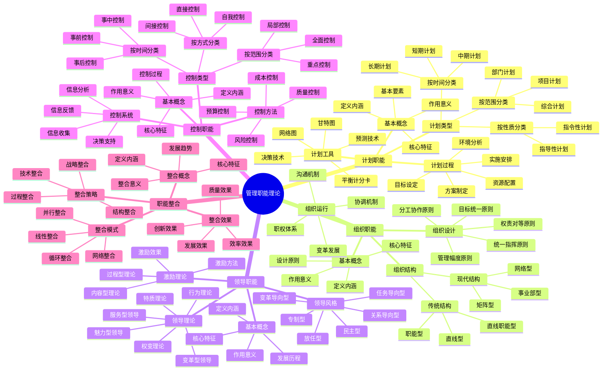
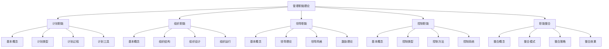
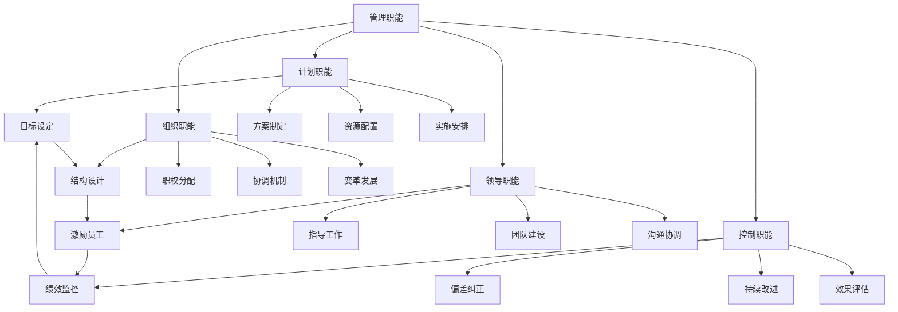
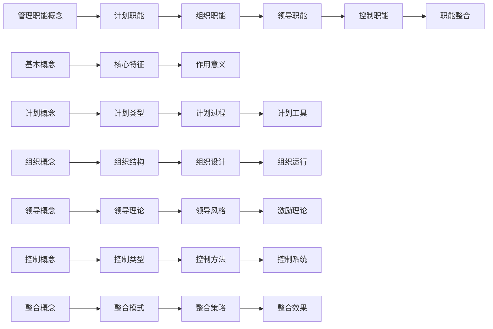
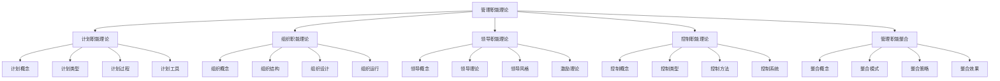
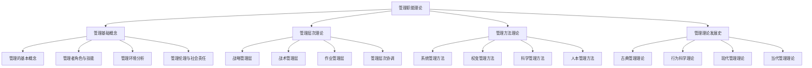

# 思维导图-管理职能理论

## 🧠 管理职能理论思维导图

### 核心概念图

## 📊 知识结构分析

### 1. 概念层次结构

### 2. 职能关系网络

## 🔍 关键概念解析

### 1. 管理职能定义
- **计划职能**：确定目标、制定方案、安排实施
- **组织职能**：设计结构、分配职权、建立协调
- **领导职能**：影响激励、引导方向、协调关系
- **控制职能**：监控活动、纠正偏差、保障目标

### 2. 管理职能特征
- **计划职能**：前瞻性、目标性、系统性、可行性
- **组织职能**：结构性、协调性、效率性、适应性
- **领导职能**：影响力、激励性、导向性、协调性
- **控制职能**：监控性、反馈性、纠正性、保障性

### 3. 管理职能关系
- **循环关系**：计划→组织→领导→控制→计划
- **层次关系**：战略层、管理层、执行层
- **相互作用**：相互影响、相互促进、相互支撑
- **协调统一**：协调配合、统一目标、整体优化

## 📈 学习路径规划

### 1. 概念学习路径

### 2. 理解层次递进
- **第一层**：基本概念理解
- **第二层**：职能特征理解
- **第三层**：职能关系理解
- **第四层**：整合模式理解
- **第五层**：综合应用理解

## 🎯 记忆要点

### 1. 核心概念记忆
- **四大职能**：计划、组织、领导、控制
- **职能特征**：前瞻性、结构性、影响力、监控性
- **职能关系**：循环关系、层次关系、相互作用
- **整合模式**：线性、循环、并行、网络

### 2. 关系网络记忆
- **计划指导**：计划指导组织、领导、控制
- **组织支撑**：组织支撑计划、领导、控制
- **领导优化**：领导优化计划、组织、控制
- **控制保障**：控制保障计划、组织、领导

### 3. 特征理解记忆
- **计划职能**：前瞻性、目标性、系统性、可行性
- **组织职能**：结构性、协调性、效率性、适应性
- **领导职能**：影响力、激励性、导向性、协调性
- **控制职能**：监控性、反馈性、纠正性、保障性

## 📊 知识关联图

### 1. 内部关联

### 2. 外部关联

## 🔗 相关链接

### 内部链接
- [[计划职能理论]] - 详细计划职能理论
- [[组织职能理论]] - 详细组织职能理论
- [[领导职能理论]] - 详细领导职能理论
- [[控制职能理论]] - 详细控制职能理论
- [[管理职能整合]] - 详细职能整合理论

### 外部链接
- [[管理的基本概念]] - 管理基础概念
- [[管理者角色与技能]] - 管理者要求
- [[管理环境分析]] - 管理环境
- [[管理伦理与社会责任]] - 管理伦理

## 📚 学习建议

### 1. 学习顺序
1. **概念理解**：先理解基本概念
2. **特征分析**：分析各职能特征
3. **关系梳理**：梳理职能关系
4. **整合理解**：理解职能整合
5. **综合应用**：综合应用知识

### 2. 学习方法
- **思维导图**：使用思维导图整理知识
- **概念图**：使用概念图理解关系
- **案例分析**：通过案例分析理解应用
- **实践练习**：通过实践练习巩固知识

### 3. 记忆技巧
- **关键词记忆**：记忆关键词
- **关联记忆**：通过关联记忆
- **重复记忆**：通过重复记忆
- **应用记忆**：通过应用记忆

## 🎯 实践应用指导

### 1. 理论应用
- **计划制定**：运用计划理论制定计划
- **组织设计**：运用组织理论设计组织
- **领导实践**：运用领导理论指导实践
- **控制管理**：运用控制理论进行管理

### 2. 技能提升
- **计划技能**：提升计划制定技能
- **组织技能**：提升组织设计技能
- **领导技能**：提升领导管理技能
- **控制技能**：提升控制管理技能

### 3. 能力发展
- **分析能力**：发展分析问题能力
- **决策能力**：发展决策判断能力
- **协调能力**：发展协调配合能力
- **创新能力**：发展创新思维能力

---
*更新时间：2024年*
*思维导图将根据学习反馈持续优化*
