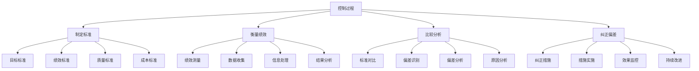
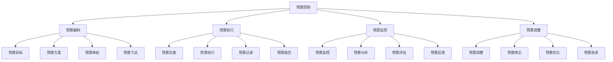

# 控制职能理论

## 🎛️ 控制职能概述

### 基本定义
**控制职能**是管理四大职能之一，是指监控组织活动，确保实际绩效与计划目标一致，并采取纠正措施的管理活动。

### 核心特征
- **监控性**：监控组织活动
- **反馈性**：提供反馈信息
- **纠正性**：纠正偏差行为
- **保障性**：保障目标实现

## 🔄 控制过程

### 1. 控制过程模型

#### 控制过程步骤

### 2. 控制过程要素

#### 控制标准
- **目标标准**：组织目标标准
- **绩效标准**：工作绩效标准
- **质量标准**：工作质量标准
- **成本标准**：成本控制标准

#### 绩效衡量
- **定量衡量**：数量指标衡量
- **定性衡量**：质量指标衡量
- **综合衡量**：综合指标衡量
- **对比衡量**：对比分析衡量

#### 偏差分析
- **偏差识别**：识别绩效偏差
- **偏差测量**：测量偏差程度
- **偏差原因**：分析偏差原因
- **偏差影响**：评估偏差影响

#### 纠正措施
- **措施制定**：制定纠正措施
- **措施实施**：实施纠正措施
- **效果评估**：评估纠正效果
- **持续改进**：持续改进控制

## 📊 控制类型

### 1. 按时间分类

#### 事前控制（前馈控制）
- **特点**：预防性控制，事前预防
- **方法**：预测分析，风险评估
- **优点**：预防问题，减少损失
- **缺点**：预测困难，成本较高

#### 事中控制（过程控制）
- **特点**：过程性控制，实时监控
- **方法**：实时监控，过程调整
- **优点**：及时发现问题，快速响应
- **缺点**：需要持续监控，成本较高

#### 事后控制（反馈控制）
- **特点**：结果性控制，事后纠正
- **方法**：结果评估，经验总结
- **优点**：简单易行，成本较低
- **缺点**：问题已发生，损失已造成

### 2. 按范围分类

#### 全面控制
- **范围**：整个组织
- **特点**：全面性，系统性
- **方法**：综合控制，系统监控
- **适用**：大型组织，复杂系统

#### 局部控制
- **范围**：特定部门或环节
- **特点**：针对性，专业性
- **方法**：专项控制，专业监控
- **适用**：特定部门，专业领域

#### 重点控制
- **范围**：关键环节或重要活动
- **特点**：重点性，关键性
- **方法**：重点监控，关键控制
- **适用**：关键业务，重要活动

### 3. 按方式分类

#### 直接控制
- **方式**：直接干预，直接管理
- **特点**：直接性，强制性
- **方法**：直接指挥，直接监督
- **适用**：紧急情况，关键环节

#### 间接控制
- **方式**：间接影响，间接管理
- **特点**：间接性，引导性
- **方法**：制度约束，文化影响
- **适用**：常规管理，日常活动

#### 自我控制
- **方式**：自我约束，自我管理
- **特点**：自主性，自觉性
- **方法**：自我监督，自我改进
- **适用**：高素质员工，成熟团队

## 🎯 控制方法

### 1. 预算控制

#### 预算类型
- **收入预算**：收入预测和计划
- **支出预算**：支出预测和计划
- **现金预算**：现金收支计划
- **资本预算**：资本投资计划

#### 预算控制过程

### 2. 质量控制

#### 质量控制方法
- **统计质量控制**：运用统计方法控制质量
- **全面质量管理**：全员参与质量管理
- **六西格玛管理**：追求卓越质量管理
- **ISO质量管理**：国际标准质量管理

#### 质量控制工具
- **控制图**：监控过程稳定性
- **因果图**：分析问题原因
- **帕累托图**：识别主要问题
- **流程图**：描述工作流程

### 3. 成本控制

#### 成本控制方法
- **标准成本法**：制定标准成本
- **目标成本法**：设定目标成本
- **作业成本法**：按作业分配成本
- **生命周期成本法**：全生命周期成本

#### 成本控制措施
- **成本预算**：制定成本预算
- **成本监控**：监控成本执行
- **成本分析**：分析成本构成
- **成本优化**：优化成本结构

### 4. 风险控制

#### 风险识别
- **风险识别**：识别潜在风险
- **风险分类**：风险分类管理
- **风险评估**：评估风险程度
- **风险排序**：风险优先级排序

#### 风险控制措施
- **风险规避**：避免风险发生
- **风险减轻**：减轻风险影响
- **风险转移**：转移风险责任
- **风险接受**：接受风险后果

## 📈 控制信息系统

### 1. 信息系统构成

#### 信息收集系统
- **数据收集**：收集各种数据
- **信息处理**：处理收集信息
- **信息存储**：存储处理信息
- **信息检索**：检索所需信息

#### 信息分析系统
- **数据分析**：分析各种数据
- **趋势分析**：分析发展趋势
- **对比分析**：进行对比分析
- **预测分析**：进行预测分析

#### 信息反馈系统
- **信息反馈**：反馈分析结果
- **信息传递**：传递反馈信息
- **信息共享**：共享相关信息
- **信息更新**：更新信息内容

### 2. 信息系统功能

#### 监控功能
- **实时监控**：实时监控活动
- **异常报警**：异常情况报警
- **状态显示**：显示当前状态
- **趋势显示**：显示发展趋势

#### 分析功能
- **绩效分析**：分析绩效表现
- **偏差分析**：分析偏差原因
- **趋势分析**：分析发展趋势
- **预测分析**：预测未来趋势

#### 决策支持
- **信息支持**：提供决策信息
- **分析支持**：提供分析结果
- **建议支持**：提供决策建议
- **评估支持**：提供评估结果

## 🔍 控制效果评估

### 1. 评估指标

#### 效率指标
- **控制效率**：控制工作效率
- **响应速度**：问题响应速度
- **处理时间**：问题处理时间
- **成本控制**：控制成本水平

#### 效果指标
- **目标达成**：目标达成程度
- **偏差纠正**：偏差纠正效果
- **问题解决**：问题解决程度
- **改进提升**：改进提升程度

#### 质量指标
- **控制质量**：控制工作质量
- **信息质量**：信息质量水平
- **决策质量**：决策质量水平
- **执行质量**：执行质量水平

### 2. 评估方法

#### 定量评估
- **数据对比**：数据对比分析
- **指标评估**：指标完成评估
- **趋势分析**：趋势变化分析
- **效果测量**：效果量化测量

#### 定性评估
- **专家评估**：专家评估意见
- **用户反馈**：用户反馈意见
- **案例分析**：案例分析评估
- **综合评价**：综合评价结果

## 🎯 控制问题与对策

### 1. 常见问题

#### 控制过度
- **问题表现**：控制过于严格
- **问题影响**：影响员工积极性
- **解决对策**：适度控制，灵活管理

#### 控制不足
- **问题表现**：控制力度不够
- **问题影响**：问题不能及时发现
- **解决对策**：加强控制，完善机制

#### 控制滞后
- **问题表现**：控制反应滞后
- **问题影响**：问题不能及时解决
- **解决对策**：提高效率，快速响应

#### 控制成本高
- **问题表现**：控制成本过高
- **问题影响**：影响经济效益
- **解决对策**：优化控制，降低成本

### 2. 解决对策

#### 控制优化
- **控制适度**：控制力度适度
- **控制及时**：控制反应及时
- **控制有效**：控制效果有效
- **控制经济**：控制成本经济

#### 机制完善
- **制度完善**：完善控制制度
- **流程优化**：优化控制流程
- **技术改进**：改进控制技术
- **人员培训**：培训控制人员

## 📚 学习要点总结

### 核心概念
1. **控制职能**：监控组织活动，确保目标实现的管理活动
2. **控制过程**：制定标准、衡量绩效、比较分析、纠正偏差
3. **控制类型**：事前控制、事中控制、事后控制
4. **控制方法**：预算控制、质量控制、成本控制、风险控制
5. **控制系统**：信息收集、分析、反馈系统
6. **控制评估**：效率、效果、质量评估

### 关键理解
- 控制职能是管理的重要职能
- 控制过程需要科学的方法
- 控制类型需要合理选择
- 控制系统需要有效运行

### 实践应用
- 运用控制理论指导控制实践
- 建立有效的控制系统
- 选择合适的控制方法
- 评估控制效果持续改进

## 🔗 相关链接

- [[计划职能理论]] - 计划职能理论
- [[组织职能理论]] - 组织职能理论
- [[领导职能理论]] - 领导职能理论
- [[管理职能整合]] - 管理职能整合

## 📚 延伸阅读

- [[预算管理]] - 预算管理理论
- [[质量管理]] - 质量管理理论
- [[成本管理]] - 成本管理理论
- [[风险管理]] - 风险管理理论

---
*更新时间：2024年*
*内容将根据学习反馈持续优化*
