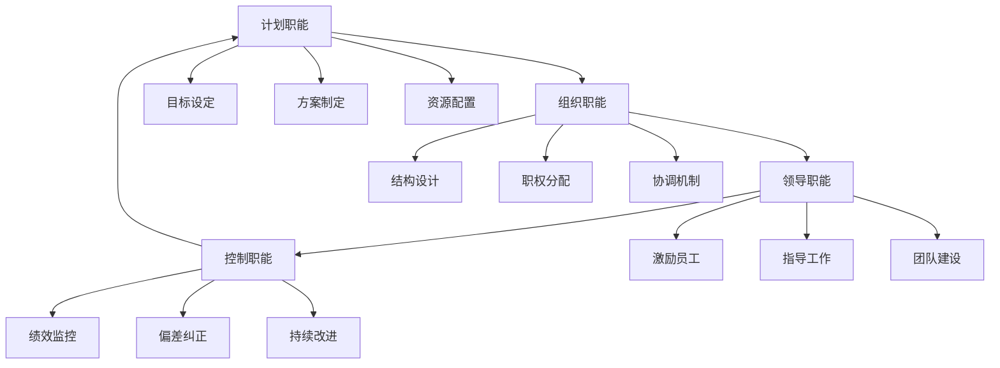
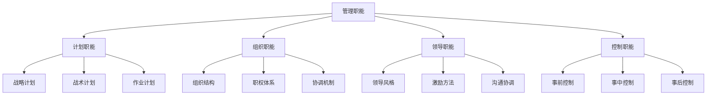
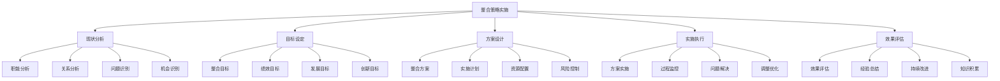

# 管理职能整合

## 🔗 管理职能整合概述

### 基本定义
**管理职能整合**是指将计划、组织、领导、控制四大管理职能有机结合，形成统一的管理体系，实现管理效果最大化的管理活动。

### 核心特征
- **系统性**：系统整合各职能
- **协调性**：协调各职能关系
- **动态性**：动态调整各职能
- **整体性**：整体优化管理效果

## 🔄 管理职能关系

### 1. 职能关系模型

#### 循环关系模型

#### 层次关系模型

### 2. 职能相互作用

#### 计划与组织
- **计划指导组织**：计划为组织提供方向
- **组织支撑计划**：组织为计划提供支撑
- **相互影响**：计划影响组织设计，组织影响计划执行
- **协调统一**：计划与组织需要协调统一

#### 组织与领导
- **组织为领导提供基础**：组织结构影响领导方式
- **领导优化组织**：领导可以优化组织结构
- **相互促进**：组织与领导相互促进
- **协调配合**：组织与领导需要协调配合

#### 领导与控制
- **领导指导控制**：领导为控制提供指导
- **控制支撑领导**：控制为领导提供支撑
- **相互支撑**：领导与控制相互支撑
- **协调一致**：领导与控制需要协调一致

#### 控制与计划
- **控制保障计划**：控制保障计划执行
- **计划指导控制**：计划为控制提供标准
- **相互保障**：控制与计划相互保障
- **协调循环**：控制与计划形成协调循环

## 📊 管理职能整合模式

### 1. 整合模式类型

#### 线性整合模式
- **特点**：按顺序依次进行
- **流程**：计划→组织→领导→控制
- **优点**：逻辑清晰，易于理解
- **缺点**：缺乏灵活性，效率较低
- **适用**：简单任务，稳定环境

#### 循环整合模式
- **特点**：循环往复进行
- **流程**：计划→组织→领导→控制→计划
- **优点**：持续改进，适应性强
- **缺点**：过程复杂，需要协调
- **适用**：复杂任务，动态环境

#### 并行整合模式
- **特点**：同时进行多个职能
- **流程**：计划、组织、领导、控制并行
- **优点**：效率高，响应快
- **缺点**：协调困难，管理复杂
- **适用**：紧急任务，快速响应

#### 网络整合模式
- **特点**：网络化整合各职能
- **流程**：各职能网络化连接
- **优点**：灵活性强，适应性强
- **缺点**：结构复杂，管理困难
- **适用**：复杂组织，创新环境

### 2. 整合模式对比

| 整合模式 | 特点 | 优点 | 缺点 | 适用条件 |
|----------|------|------|------|----------|
| 线性整合 | 顺序进行 | 逻辑清晰 | 缺乏灵活性 | 简单任务 |
| 循环整合 | 循环往复 | 持续改进 | 过程复杂 | 复杂任务 |
| 并行整合 | 同时进行 | 效率高 | 协调困难 | 紧急任务 |
| 网络整合 | 网络化 | 灵活性强 | 结构复杂 | 复杂组织 |

## 🎯 管理职能整合策略

### 1. 整合策略类型

#### 战略整合策略
- **目标整合**：统一各职能目标
- **资源整合**：整合各职能资源
- **能力整合**：整合各职能能力
- **文化整合**：整合各职能文化

#### 结构整合策略
- **组织整合**：整合组织结构
- **流程整合**：整合管理流程
- **制度整合**：整合管理制度
- **系统整合**：整合管理系统

#### 过程整合策略
- **计划整合**：整合计划过程
- **执行整合**：整合执行过程
- **监控整合**：整合监控过程
- **改进整合**：整合改进过程

#### 技术整合策略
- **信息技术**：运用信息技术整合
- **管理技术**：运用管理技术整合
- **分析技术**：运用分析技术整合
- **决策技术**：运用决策技术整合

### 2. 整合策略实施

#### 实施步骤

#### 实施保障
- **领导支持**：获得领导支持
- **资源保障**：确保资源保障
- **制度保障**：建立制度保障
- **文化保障**：营造文化氛围

## 📈 管理职能整合效果

### 1. 整合效果评估

#### 效率效果
- **管理效率**：管理效率提升
- **决策效率**：决策效率提升
- **执行效率**：执行效率提升
- **协调效率**：协调效率提升

#### 质量效果
- **管理质量**：管理质量提升
- **决策质量**：决策质量提升
- **执行质量**：执行质量提升
- **服务质量**：服务质量提升

#### 创新效果
- **管理创新**：管理创新提升
- **技术创新**：技术创新提升
- **产品创新**：产品创新提升
- **服务创新**：服务创新提升

#### 发展效果
- **组织发展**：组织发展提升
- **员工发展**：员工发展提升
- **市场发展**：市场发展提升
- **社会贡献**：社会贡献提升

### 2. 效果评估方法

#### 定量评估
- **指标对比**：指标对比分析
- **趋势分析**：趋势变化分析
- **效益分析**：效益量化分析
- **成本分析**：成本效益分析

#### 定性评估
- **专家评估**：专家评估意见
- **用户反馈**：用户反馈意见
- **案例分析**：案例分析评估
- **综合评价**：综合评价结果

## 🔍 管理职能整合挑战

### 1. 主要挑战

#### 理论挑战
- **理论复杂**：理论体系复杂
- **关系复杂**：职能关系复杂
- **方法复杂**：整合方法复杂
- **评估复杂**：效果评估复杂

#### 实践挑战
- **实施困难**：实施过程困难
- **协调困难**：协调配合困难
- **资源不足**：资源保障不足
- **能力不足**：管理能力不足

#### 环境挑战
- **环境变化**：环境快速变化
- **竞争加剧**：竞争日益加剧
- **技术发展**：技术快速发展
- **需求变化**：需求不断变化

### 2. 应对策略

#### 理论应对
- **理论简化**：简化理论体系
- **关系梳理**：梳理职能关系
- **方法优化**：优化整合方法
- **评估改进**：改进评估方法

#### 实践应对
- **实施优化**：优化实施过程
- **协调加强**：加强协调配合
- **资源保障**：保障资源供给
- **能力提升**：提升管理能力

#### 环境应对
- **环境适应**：适应环境变化
- **竞争应对**：应对竞争挑战
- **技术应用**：应用新技术
- **需求满足**：满足需求变化

## 🎯 管理职能整合趋势

### 1. 发展趋势

#### 数字化趋势
- **数字化管理**：管理数字化发展
- **智能化管理**：管理智能化发展
- **网络化管理**：管理网络化发展
- **平台化管理**：管理平台化发展

#### 一体化趋势
- **职能一体化**：管理职能一体化
- **流程一体化**：管理流程一体化
- **系统一体化**：管理系统一体化
- **服务一体化**：管理服务一体化

#### 柔性化趋势
- **结构柔性化**：组织结构柔性化
- **流程柔性化**：管理流程柔性化
- **制度柔性化**：管理制度柔性化
- **文化柔性化**：管理文化柔性化

#### 创新化趋势
- **管理创新**：管理理念创新
- **方法创新**：管理方法创新
- **工具创新**：管理工具创新
- **模式创新**：管理模式创新

### 2. 发展策略

#### 战略策略
- **战略规划**：制定整合战略
- **战略实施**：实施整合战略
- **战略监控**：监控战略执行
- **战略调整**：调整战略方向

#### 技术策略
- **技术应用**：应用新技术
- **技术集成**：集成各种技术
- **技术创新**：推动技术创新
- **技术标准**：建立技术标准

#### 人才策略
- **人才培养**：培养整合人才
- **人才引进**：引进优秀人才
- **人才激励**：激励人才发展
- **人才保留**：保留核心人才

## 📚 学习要点总结

### 核心概念
1. **管理职能整合**：将四大管理职能有机结合的管理活动
2. **职能关系**：计划、组织、领导、控制相互影响的关系
3. **整合模式**：线性、循环、并行、网络整合模式
4. **整合策略**：战略、结构、过程、技术整合策略
5. **整合效果**：效率、质量、创新、发展效果
6. **整合趋势**：数字化、一体化、柔性化、创新化趋势

### 关键理解
- 管理职能整合是管理发展的重要趋势
- 四大管理职能相互影响、相互促进
- 整合模式需要根据具体情况选择
- 整合效果需要科学评估

### 实践应用
- 运用整合理论指导管理实践
- 选择合适的整合模式
- 制定有效的整合策略
- 评估整合效果持续改进

## 🔗 相关链接

- [[计划职能理论]] - 计划职能理论
- [[组织职能理论]] - 组织职能理论
- [[领导职能理论]] - 领导职能理论
- [[控制职能理论]] - 控制职能理论

## 📚 延伸阅读

- [[思维导图-管理职能理论]] - 管理职能理论思维导图
- [[管理层次理论]] - 管理层次理论
- [[管理方法理论]] - 管理方法理论
- [[管理理论发展史]] - 管理理论发展史

---
*更新时间：2024年*
*内容将根据学习反馈持续优化*
