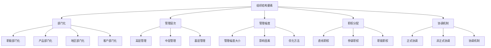
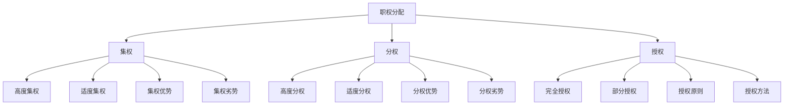
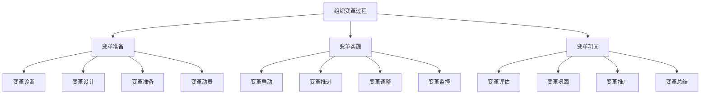

# 组织职能理论

## 🏗️ 组织职能概述

### 基本定义
**组织职能**是管理四大职能之一，是指设计组织结构、分配职权职责、建立协调机制，使组织成员能够有效协作实现组织目标的管理活动。

### 核心特征
- **结构性**：建立组织结构
- **协调性**：协调各种关系
- **效率性**：提高组织效率
- **适应性**：适应环境变化

## 📊 组织设计原理

### 1. 组织设计原则

#### 目标统一原则
- **基本要求**：组织目标与个人目标统一
- **实现方式**：目标分解、目标协调
- **作用**：确保组织方向一致
- **要求**：目标明确、可衡量、可达成

#### 分工协作原则
- **基本要求**：合理分工，有效协作
- **实现方式**：专业化分工、协调机制
- **作用**：提高工作效率
- **要求**：分工明确、协作顺畅

#### 统一指挥原则
- **基本要求**：一个下级只接受一个上级指挥
- **实现方式**：明确指挥链、避免多头领导
- **作用**：避免指挥混乱
- **要求**：指挥链清晰、责任明确

#### 权责对等原则
- **基本要求**：权力与责任对等
- **实现方式**：明确权责、建立制衡
- **作用**：确保责任落实
- **要求**：权责明确、对等匹配

#### 管理幅度原则
- **基本要求**：合理的管理幅度
- **实现方式**：控制管理层次、优化管理幅度
- **作用**：提高管理效率
- **要求**：幅度适中、层次合理

### 2. 组织设计要素

#### 组织结构要素

## 🏢 组织结构类型

### 1. 传统组织结构

#### 直线型结构
- **特点**：垂直管理，简单直接
- **优点**：指挥统一，责任明确
- **缺点**：管理幅度大，缺乏专业化
- **适用**：小型组织，简单业务

#### 职能型结构
- **特点**：按职能分工，专业化管理
- **优点**：专业化程度高，效率高
- **缺点**：多头领导，协调困难
- **适用**：中型组织，复杂业务

#### 直线职能型结构
- **特点**：直线指挥与职能参谋结合
- **优点**：指挥统一，专业化强
- **缺点**：部门协调困难，反应慢
- **适用**：大中型组织，稳定环境

### 2. 现代组织结构

#### 事业部型结构
- **特点**：按产品、地区、客户划分事业部
- **优点**：适应性强，责任明确
- **缺点**：资源重复，协调困难
- **适用**：大型组织，多元化经营

#### 矩阵型结构
- **特点**：职能部门与项目组交叉
- **优点**：灵活性强，资源共享
- **缺点**：双重领导，管理复杂
- **适用**：项目型组织，创新业务

#### 网络型结构
- **特点**：核心组织与外部组织网络化
- **优点**：灵活高效，成本低
- **缺点**：控制困难，依赖性强
- **适用**：虚拟组织，全球化经营

### 3. 组织结构对比

| 结构类型 | 优点 | 缺点 | 适用条件 |
|----------|------|------|----------|
| 直线型 | 简单直接，责任明确 | 管理幅度大，缺乏专业化 | 小型组织 |
| 职能型 | 专业化强，效率高 | 多头领导，协调困难 | 中型组织 |
| 直线职能型 | 指挥统一，专业化强 | 部门协调困难，反应慢 | 大中型组织 |
| 事业部型 | 适应性强，责任明确 | 资源重复，协调困难 | 大型组织 |
| 矩阵型 | 灵活性强，资源共享 | 双重领导，管理复杂 | 项目型组织 |
| 网络型 | 灵活高效，成本低 | 控制困难，依赖性强 | 虚拟组织 |

## 🔄 组织运行机制

### 1. 职权体系

#### 职权类型
- **直线职权**：指挥命令权
- **参谋职权**：建议咨询权
- **职能职权**：专业指导权
- **委员会职权**：集体决策权

#### 职权分配

### 2. 协调机制

#### 正式协调
- **制度协调**：通过制度协调
- **会议协调**：通过会议协调
- **文件协调**：通过文件协调
- **程序协调**：通过程序协调

#### 非正式协调
- **人际协调**：通过人际关系协调
- **文化协调**：通过组织文化协调
- **沟通协调**：通过沟通协调
- **信任协调**：通过信任协调

### 3. 沟通机制

#### 沟通类型
- **正式沟通**：正式渠道沟通
- **非正式沟通**：非正式渠道沟通
- **上行沟通**：自下而上沟通
- **下行沟通**：自上而下沟通
- **平行沟通**：同级之间沟通

#### 沟通网络
- **链式网络**：直线型沟通
- **轮式网络**：中心型沟通
- **环式网络**：环形沟通
- **全通道网络**：全方位沟通
- **Y式网络**：Y型沟通

## 📈 组织变革与发展

### 1. 组织变革

#### 变革动因
- **外部动因**：环境变化、技术进步、竞争加剧
- **内部动因**：战略调整、效率提升、文化变革
- **直接动因**：危机事件、领导更换、业绩下滑
- **间接动因**：市场变化、政策调整、社会变革

#### 变革类型
- **渐进式变革**：逐步推进，风险较小
- **激进式变革**：快速推进，风险较大
- **计划式变革**：有计划推进，可控性强
- **应急式变革**：应急推进，紧迫性强

#### 变革过程

### 2. 组织发展

#### 发展目标
- **提高效率**：提高组织效率
- **增强适应性**：增强环境适应性
- **提升竞争力**：提升市场竞争力
- **实现可持续发展**：实现可持续发展

#### 发展策略
- **结构优化**：优化组织结构
- **流程再造**：再造业务流程
- **文化变革**：变革组织文化
- **能力提升**：提升组织能力

## 🎯 组织效能评估

### 1. 效能指标

#### 效率指标
- **劳动生产率**：单位时间产出
- **资源利用率**：资源利用效率
- **成本控制率**：成本控制水平
- **质量合格率**：质量达标水平

#### 效果指标
- **目标达成率**：目标达成程度
- **客户满意度**：客户满意程度
- **市场份额**：市场占有程度
- **盈利能力**：盈利水平高低

#### 适应性指标
- **环境适应性**：环境适应能力
- **变革能力**：变革适应能力
- **创新能力**：创新发展能力
- **学习能力**：学习提升能力

### 2. 评估方法

#### 定量评估
- **财务指标**：财务绩效评估
- **运营指标**：运营效率评估
- **市场指标**：市场表现评估
- **客户指标**：客户满意度评估

#### 定性评估
- **文化评估**：组织文化评估
- **能力评估**：组织能力评估
- **适应性评估**：环境适应性评估
- **创新性评估**：创新能力评估

## 🔍 组织管理问题与对策

### 1. 常见问题

#### 结构问题
- **结构僵化**：组织结构僵化
- **层次过多**：管理层次过多
- **幅度过大**：管理幅度过大
- **协调困难**：部门协调困难

#### 运行问题
- **职权不清**：职权职责不清
- **沟通不畅**：沟通渠道不畅
- **决策缓慢**：决策过程缓慢
- **执行不力**：执行不到位

### 2. 解决对策

#### 结构优化
- **扁平化**：减少管理层次
- **柔性化**：增强结构柔性
- **网络化**：建立网络结构
- **虚拟化**：发展虚拟组织

#### 运行优化
- **明确权责**：明确职权职责
- **畅通沟通**：畅通沟通渠道
- **提高效率**：提高决策效率
- **强化执行**：强化执行力度

## 📚 学习要点总结

### 核心概念
1. **组织职能**：设计结构、分配职权、建立协调的管理活动
2. **组织设计**：目标统一、分工协作、统一指挥等原则
3. **组织结构**：直线型、职能型、事业部型、矩阵型等
4. **职权体系**：直线职权、参谋职权、职能职权
5. **协调机制**：正式协调、非正式协调
6. **组织变革**：变革动因、类型、过程

### 关键理解
- 组织职能是管理的重要职能
- 组织设计需要遵循科学原则
- 组织结构需要适应环境变化
- 组织运行需要有效协调机制

### 实践应用
- 运用组织理论设计组织结构
- 建立有效的职权体系
- 完善协调沟通机制
- 推进组织变革发展

## 🔗 相关链接

- [[计划职能理论]] - 计划职能理论
- [[领导职能理论]] - 领导职能理论
- [[控制职能理论]] - 控制职能理论
- [[管理职能整合]] - 管理职能整合

## 📚 延伸阅读

- [[组织结构设计]] - 组织结构设计
- [[组织变革管理]] - 组织变革管理
- [[组织行为分析]] - 组织行为分析
- [[组织发展]] - 组织发展理论

---
*更新时间：2024年*
*内容将根据学习反馈持续优化*
