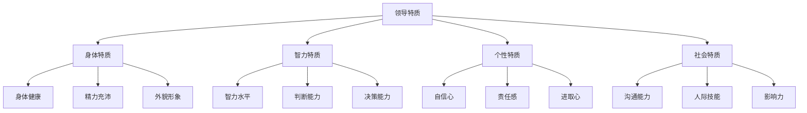
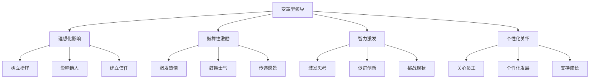
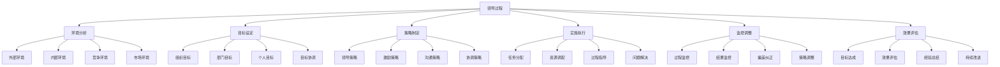

# 领导职能理论

## 👑 领导职能概述

### 基本定义
**领导职能**是管理四大职能之一，是指通过影响和激励组织成员，引导他们朝着组织目标努力工作的管理活动。

### 核心特征
- **影响力**：对他人产生影响
- **激励性**：激发成员积极性
- **导向性**：引导组织方向
- **协调性**：协调各种关系

## 🎯 领导理论发展

### 1. 特质理论

#### 基本观点
- **核心假设**：领导者具有某些特质
- **研究重点**：识别领导特质
- **主要贡献**：揭示领导特质
- **局限性**：忽视情境因素

#### 领导特质

### 2. 行为理论

#### 基本观点
- **核心假设**：领导行为决定领导效果
- **研究重点**：分析领导行为
- **主要贡献**：揭示领导行为模式
- **局限性**：忽视情境因素

#### 领导行为维度
- **任务导向**：关注任务完成
- **关系导向**：关注人际关系
- **变革导向**：关注组织变革
- **服务导向**：关注服务他人

### 3. 权变理论

#### 基本观点
- **核心假设**：领导效果取决于情境
- **研究重点**：分析情境因素
- **主要贡献**：揭示情境影响
- **局限性**：理论复杂

#### 权变因素
- **领导者特质**：领导者个人特质
- **下属特征**：下属能力和动机
- **任务特征**：任务性质和结构
- **环境因素**：组织环境和文化

## 🎭 领导风格类型

### 1. 按决策方式分类

#### 专制型领导
- **特点**：独断专行，决策集中
- **优点**：决策迅速，效率高
- **缺点**：缺乏民主，员工参与少
- **适用**：紧急情况，简单任务

#### 民主型领导
- **特点**：民主决策，员工参与
- **优点**：员工参与，满意度高
- **缺点**：决策缓慢，效率低
- **适用**：复杂任务，创新工作

#### 放任型领导
- **特点**：放任自流，员工自主
- **优点**：员工自主，创新性强
- **缺点**：缺乏控制，效率低
- **适用**：创新工作，专家团队

### 2. 按关注重点分类

#### 任务导向型
- **关注重点**：任务完成，目标达成
- **行为特点**：严格要求，注重效率
- **适用情境**：任务明确，时间紧迫
- **优点**：效率高，目标明确

#### 关系导向型
- **关注重点**：人际关系，员工满意
- **行为特点**：关心员工，注重沟通
- **适用情境**：团队合作，长期发展
- **优点**：员工满意，团队和谐

#### 变革导向型
- **关注重点**：组织变革，创新发展
- **行为特点**：勇于变革，追求创新
- **适用情境**：环境变化，创新发展
- **优点**：适应性强，创新力强

### 3. 领导风格对比

| 领导风格 | 特点 | 优点 | 缺点 | 适用情境 |
|----------|------|------|------|----------|
| 专制型 | 独断专行 | 决策迅速 | 缺乏民主 | 紧急情况 |
| 民主型 | 民主决策 | 员工参与 | 决策缓慢 | 复杂任务 |
| 放任型 | 放任自流 | 员工自主 | 缺乏控制 | 创新工作 |
| 任务导向型 | 关注任务 | 效率高 | 忽视关系 | 任务明确 |
| 关系导向型 | 关注关系 | 员工满意 | 效率较低 | 团队合作 |
| 变革导向型 | 关注变革 | 适应性强 | 风险较大 | 环境变化 |

## 💪 领导力理论

### 1. 变革型领导

#### 基本特征
- **理想化影响**：树立榜样，影响他人
- **鼓舞性激励**：激发热情，鼓舞士气
- **智力激发**：激发思考，促进创新
- **个性化关怀**：关心员工，个性化发展

#### 作用机制

### 2. 服务型领导

#### 基本特征
- **服务他人**：以服务他人为宗旨
- **倾听能力**：善于倾听他人意见
- **同理心**：理解他人感受
- **治愈能力**：帮助他人成长

#### 服务行为
- **倾听服务**：倾听员工需求
- **理解服务**：理解员工困难
- **支持服务**：支持员工发展
- **治愈服务**：帮助员工成长

### 3. 魅力型领导

#### 基本特征
- **个人魅力**：具有个人魅力
- **愿景能力**：描绘美好愿景
- **表达能力**：善于表达沟通
- **影响力**：对他人产生强烈影响

#### 魅力表现
- **愿景描绘**：描绘美好愿景
- **情感感染**：情感感染他人
- **行为示范**：行为示范作用
- **影响力**：对他人产生影响

## 🎯 激励理论

### 1. 内容型激励理论

#### 马斯洛需求层次理论
- **生理需求**：基本生存需求
- **安全需求**：安全稳定需求
- **社交需求**：社交归属需求
- **尊重需求**：尊重认可需求
- **自我实现需求**：自我实现需求

#### 赫茨伯格双因素理论
- **保健因素**：工作环境、薪酬福利
- **激励因素**：工作本身、成就感
- **理论要点**：保健因素防止不满，激励因素产生满意

#### 麦克利兰成就需要理论
- **成就需要**：追求成功和卓越
- **权力需要**：影响和控制他人
- **亲和需要**：建立良好人际关系

### 2. 过程型激励理论

#### 期望理论
- **期望值**：努力与绩效的关系
- **工具性**：绩效与结果的关系
- **效价**：结果的价值大小
- **激励力**：期望值×工具性×效价

#### 公平理论
- **投入**：个人投入程度
- **产出**：个人获得结果
- **比较**：与他人比较
- **公平感**：公平与否的感受

#### 目标设置理论
- **目标明确性**：目标明确具体
- **目标难度**：目标难度适中
- **目标接受性**：目标被接受
- **目标反馈**：目标完成反馈

### 3. 激励方法

#### 物质激励
- **薪酬激励**：基本薪酬、绩效薪酬
- **福利激励**：各种福利待遇
- **股权激励**：股票期权、股权激励
- **奖金激励**：各种奖金激励

#### 精神激励
- **认可激励**：工作认可、成就认可
- **荣誉激励**：荣誉称号、表彰奖励
- **发展激励**：职业发展、培训机会
- **参与激励**：参与决策、参与管理

## 🔄 领导过程

### 1. 领导过程模型

#### 领导过程步骤

### 2. 领导技能

#### 核心技能
- **沟通技能**：有效沟通能力
- **决策技能**：科学决策能力
- **激励技能**：激励他人能力
- **协调技能**：协调各种关系

#### 发展技能
- **学习技能**：持续学习能力
- **适应技能**：适应变化能力
- **创新技能**：创新发展能力
- **变革技能**：推动变革能力

## 📊 领导效能评估

### 1. 评估维度

#### 任务绩效
- **目标达成**：目标达成程度
- **任务完成**：任务完成质量
- **效率提升**：工作效率提升
- **质量改善**：工作质量改善

#### 关系绩效
- **员工满意**：员工满意程度
- **团队和谐**：团队和谐程度
- **沟通效果**：沟通效果好坏
- **合作程度**：合作配合程度

#### 发展绩效
- **员工发展**：员工发展程度
- **组织发展**：组织发展程度
- **创新能力**：创新能力提升
- **适应能力**：适应能力提升

### 2. 评估方法

#### 360度评估
- **上级评估**：上级领导评估
- **下级评估**：下级员工评估
- **同级评估**：同级同事评估
- **自我评估**：自我评估

#### 绩效评估
- **目标评估**：目标达成评估
- **行为评估**：行为表现评估
- **结果评估**：工作结果评估
- **发展评估**：发展潜力评估

## 🔍 领导问题与对策

### 1. 常见问题

#### 领导风格问题
- **风格单一**：领导风格单一
- **风格不当**：风格与情境不符
- **风格僵化**：风格缺乏灵活性
- **风格冲突**：不同风格冲突

#### 激励问题
- **激励不足**：激励力度不够
- **激励不当**：激励方法不当
- **激励不公平**：激励不公平
- **激励效果差**：激励效果不佳

### 2. 解决对策

#### 风格优化
- **风格多样化**：发展多种领导风格
- **情境适应**：根据情境选择风格
- **风格灵活**：保持风格灵活性
- **风格协调**：协调不同风格

#### 激励优化
- **激励强化**：加强激励力度
- **激励改进**：改进激励方法
- **激励公平**：确保激励公平
- **激励效果**：提高激励效果

## 🎯 学习要点总结

### 核心概念
1. **领导职能**：影响和激励组织成员的管理活动
2. **领导理论**：特质理论、行为理论、权变理论
3. **领导风格**：专制型、民主型、放任型
4. **领导力**：变革型、服务型、魅力型领导
5. **激励理论**：内容型、过程型激励理论
6. **领导过程**：环境分析、目标设定、策略制定、实施执行

### 关键理解
- 领导职能是管理的重要职能
- 领导理论不断发展完善
- 领导风格需要适应情境
- 激励是领导的重要手段

### 实践应用
- 运用领导理论指导领导实践
- 根据情境选择合适领导风格
- 运用激励理论激发员工积极性
- 完善领导过程提高领导效能

## 🔗 相关链接

- [[计划职能理论]] - 计划职能理论
- [[组织职能理论]] - 组织职能理论
- [[控制职能理论]] - 控制职能理论
- [[管理职能整合]] - 管理职能整合

## 📚 延伸阅读

- [[激励理论]] - 激励理论
- [[团队建设]] - 团队建设理论
- [[沟通管理]] - 沟通管理理论
- [[变革管理]] - 变革管理理论

---
*更新时间：2024年*
*内容将根据学习反馈持续优化*
