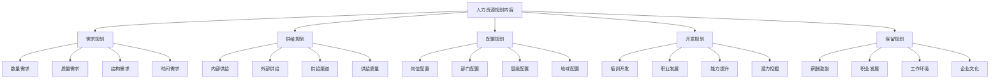
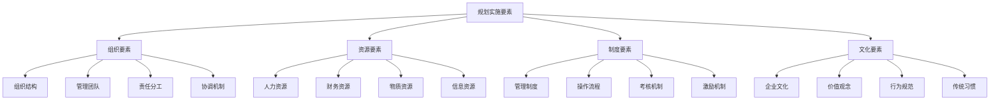

# 人力资源规划制定

## 👥 人力资源规划概述

### 基本定义
**人力资源规划**是指根据组织战略目标，预测未来人力资源需求，制定人力资源获取、开发、使用、保留策略的过程。

### 核心特征
- **战略性**：与组织战略相结合
- **前瞻性**：预测未来需求
- **系统性**：系统规划人力资源
- **动态性**：动态调整规划

## 📊 人力资源规划框架

### 1. 规划层次

#### 战略层规划
- **长期规划**：5-10年规划
- **战略目标**：人力资源战略目标
- **战略重点**：人力资源战略重点
- **战略措施**：人力资源战略措施

#### 战术层规划
- **中期规划**：3-5年规划
- **战术目标**：人力资源战术目标
- **战术重点**：人力资源战术重点
- **战术措施**：人力资源战术措施

#### 作业层规划
- **短期规划**：1-3年规划
- **作业目标**：人力资源作业目标
- **作业重点**：人力资源作业重点
- **作业措施**：人力资源作业措施

### 2. 规划内容

#### 规划内容

## 🔄 人力资源规划过程

### 1. 规划步骤

#### 第一步：环境分析
- **外部环境分析**：宏观环境、行业环境、竞争环境
- **内部环境分析**：组织环境、文化环境、技术环境
- **环境评估**：机会威胁评估、优势劣势评估
- **环境预测**：环境变化预测、趋势分析

#### 第二步：需求分析
- **业务需求分析**：业务发展需求
- **岗位需求分析**：岗位设置需求
- **技能需求分析**：技能要求需求
- **数量需求分析**：人员数量需求

#### 第三步：供给分析
- **内部供给分析**：内部人员供给
- **外部供给分析**：外部人员供给
- **供给渠道分析**：供给渠道分析
- **供给质量分析**：供给质量分析

#### 第四步：供需平衡
- **供需对比**：需求与供给对比
- **缺口分析**：供需缺口分析
- **过剩分析**：供需过剩分析
- **平衡策略**：供需平衡策略

#### 第五步：规划制定
- **规划目标**：制定规划目标
- **规划方案**：制定规划方案
- **实施计划**：制定实施计划
- **保障措施**：制定保障措施

### 2. 分析方法

#### 需求分析方法
- **趋势分析法**：基于历史趋势分析
- **比率分析法**：基于比率关系分析
- **回归分析法**：基于回归关系分析
- **德尔菲法**：专家预测法

#### 供给分析方法
- **技能清单法**：技能清单分析
- **人员替代法**：人员替代分析
- **马尔可夫链法**：马尔可夫链分析
- **外部供给法**：外部供给分析

## 📈 人力资源需求分析

### 1. 需求分析维度

#### 数量需求
- **总需求量**：人力资源总需求量
- **分类需求量**：各类人员需求量
- **时间需求量**：不同时间需求量
- **地域需求量**：不同地域需求量

#### 质量需求
- **学历要求**：学历水平要求
- **技能要求**：技能水平要求
- **经验要求**：工作经验要求
- **能力要求**：综合能力要求

#### 结构需求
- **年龄结构**：年龄结构要求
- **性别结构**：性别结构要求
- **专业结构**：专业结构要求
- **层级结构**：管理层级要求

### 2. 需求分析方法

#### 定性方法
- **专家判断法**：专家经验判断
- **德尔菲法**：专家预测法
- **头脑风暴法**：集体讨论法
- **情景分析法**：情景分析预测

#### 定量方法
- **趋势分析法**：历史趋势分析
- **比率分析法**：比率关系分析
- **回归分析法**：回归关系分析
- **时间序列法**：时间序列分析

## 📊 人力资源供给分析

### 1. 供给分析维度

#### 内部供给
- **现有人力资源**：现有人力资源状况
- **人员流动**：人员流动情况
- **人员发展**：人员发展潜力
- **人员替代**：人员替代可能性

#### 外部供给
- **劳动力市场**：劳动力市场状况
- **教育系统**：教育系统供给
- **竞争对手**：竞争对手人员
- **政策环境**：政策环境影响

### 2. 供给分析方法

#### 内部供给分析
- **技能清单法**：技能清单分析
- **人员替代法**：人员替代分析
- **马尔可夫链法**：马尔可夫链分析
- **人员发展法**：人员发展分析

#### 外部供给分析
- **市场调研法**：市场调研分析
- **政策分析法**：政策影响分析
- **竞争分析法**：竞争状况分析
- **趋势预测法**：趋势预测分析

## ⚖️ 人力资源供需平衡

### 1. 供需平衡分析

#### 供需对比
- **需求总量**：人力资源需求总量
- **供给总量**：人力资源供给总量
- **供需差额**：供需差额分析
- **供需比率**：供需比率分析

#### 平衡状况
- **供需平衡**：供需基本平衡
- **供大于求**：供给大于需求
- **供小于求**：供给小于需求
- **结构性失衡**：结构性供需失衡

### 2. 平衡策略

#### 供小于求策略
- **外部招聘**：增加外部招聘
- **内部培养**：加强内部培养
- **人才引进**：引进高端人才
- **合作共享**：人才合作共享

#### 供大于求策略
- **人员分流**：合理人员分流
- **转岗培训**：转岗技能培训
- **提前退休**：提前退休政策
- **外部输出**：人才外部输出

#### 结构性失衡策略
- **结构调整**：人员结构调整
- **技能培训**：技能提升培训
- **岗位调整**：岗位职责调整
- **激励机制**：激励保留机制

## 🎯 人力资源规划实施

### 1. 实施要素

#### 实施要素

#### 实施保障
- **领导保障**：领导支持推动
- **组织保障**：组织协调配合
- **资源保障**：资源充分保障
- **制度保障**：制度完善保障

### 2. 实施过程

#### 实施阶段
- **启动阶段**：规划启动部署
- **推进阶段**：规划推进实施
- **深化阶段**：规划深化完善
- **总结阶段**：规划总结评估

#### 实施监控
- **过程监控**：实施过程监控
- **结果监控**：实施结果监控
- **偏差监控**：偏差识别纠正
- **效果监控**：效果评估改进

## 📊 人力资源规划评估

### 1. 评估维度

#### 规划评估
- **规划适宜性**：规划与环境匹配度
- **规划可行性**：规划实施可行性
- **规划可接受性**：规划接受程度
- **规划有效性**：规划实施效果

#### 绩效评估
- **数量绩效**：人员数量达成
- **质量绩效**：人员质量提升
- **结构绩效**：人员结构优化
- **效率绩效**：人力资源效率

### 2. 评估方法

#### 定量评估
- **指标对比**：指标对比分析
- **趋势分析**：趋势变化分析
- **回归分析**：回归关系分析
- **预测分析**：预测效果分析

#### 定性评估
- **专家评估**：专家评估意见
- **用户反馈**：用户反馈意见
- **案例分析**：案例分析评估
- **综合评价**：综合评价结果

## 🔍 人力资源规划问题与对策

### 1. 常见问题

#### 规划问题
- **规划不科学**：规划方法不科学
- **规划不全面**：规划内容不全面
- **规划不具体**：规划目标不具体
- **规划不协调**：规划内容不协调

#### 实施问题
- **实施不力**：实施执行不力
- **资源不足**：资源保障不足
- **协调困难**：协调配合困难
- **监控不力**：监控机制不力

### 2. 解决对策

#### 规划对策
- **科学规划**：运用科学方法规划
- **全面规划**：全面考虑各种因素
- **具体规划**：制定具体可操作目标
- **协调规划**：协调各种规划内容

#### 实施对策
- **强化实施**：强化实施执行
- **保障资源**：保障资源供给
- **加强协调**：加强协调配合
- **完善监控**：完善监控机制

## 🎯 学习要点总结

### 核心概念
1. **人力资源规划**：预测需求、制定策略的过程
2. **规划框架**：战略层、战术层、作业层规划
3. **规划过程**：环境分析、需求分析、供给分析、供需平衡、规划制定
4. **需求分析**：数量、质量、结构需求分析
5. **供给分析**：内部供给、外部供给分析
6. **供需平衡**：供需对比、平衡策略

### 关键理解
- 人力资源规划是组织发展的重要工具
- 规划需要科学的方法和分析
- 供需平衡是规划的核心
- 实施需要有效的保障机制

### 实践应用
- 运用规划理论指导实践
- 使用分析方法提高规划质量
- 建立实施保障机制确保执行
- 运用评估方法持续改进

## 🔗 相关链接

- [[人力资源需求分析]] - 人力资源需求分析
- [[人力资源供给分析]] - 人力资源供给分析
- [[人力资源供需平衡]] - 人力资源供需平衡
- [[实践练习-人力资源规划]] - 人力资源规划实践

## 📚 延伸阅读

- [[招聘与选拔]] - 招聘与选拔
- [[培训与开发]] - 培训与开发
- [[绩效管理]] - 绩效管理
- [[薪酬管理]] - 薪酬管理

---
*更新时间：2024年*
*内容将根据学习反馈持续优化*
