# 战略目标设定

## 🎯 战略目标设定概述

### 基本定义
**战略目标设定**是组织在分析内外部环境的基础上，确定长期发展方向和预期成果，为战略制定和实施提供明确指引的管理活动。

### 核心特征
- **长期性**：面向长期发展
- **全局性**：统筹全局目标
- **导向性**：指引发展方向
- **可衡量性**：目标可量化

## 🔄 战略目标设定框架

### 1. 目标体系构建

#### 目标层次结构
- **愿景目标**：组织愿景目标
- **使命目标**：组织使命目标
- **战略目标**：组织战略目标
- **战术目标**：组织战术目标
- **作业目标**：组织作业目标

#### 目标时间结构
- **长期目标**：5-10年目标
- **中期目标**：3-5年目标
- **短期目标**：1-3年目标
- **年度目标**：年度目标
- **季度目标**：季度目标

#### 目标内容结构
- **财务目标**：财务相关目标
- **市场目标**：市场相关目标
- **客户目标**：客户相关目标
- **内部目标**：内部运营目标
- **学习目标**：学习发展目标

### 2. 目标设定原则

#### SMART原则
- **具体性(Specific)**：目标具体明确
- **可衡量性(Measurable)**：目标可量化
- **可达成性(Achievable)**：目标可实现
- **相关性(Relevant)**：目标与战略相关
- **时限性(Time-bound)**：目标有时限

#### 平衡性原则
- **财务平衡**：财务目标平衡
- **市场平衡**：市场目标平衡
- **客户平衡**：客户目标平衡
- **内部平衡**：内部目标平衡
- **学习平衡**：学习目标平衡

#### 挑战性原则
- **适度挑战**：目标具有挑战性
- **激励作用**：目标具有激励作用
- **发展导向**：目标促进发展
- **创新导向**：目标促进创新

### 3. 目标设定方法

#### 目标分解方法
- **自上而下**：从高层目标分解到基层
- **自下而上**：从基层目标汇总到高层
- **双向结合**：上下结合设定目标
- **协商设定**：协商设定目标

#### 目标设定工具
- **目标设定表**：目标设定表格
- **目标分解图**：目标分解图表
- **目标评估表**：目标评估表格
- **目标跟踪表**：目标跟踪表格

## 🏢 战略目标设定过程

### 1. 目标设定准备

#### 环境分析
- **内部环境分析**：分析内部环境
- **外部环境分析**：分析外部环境
- **竞争环境分析**：分析竞争环境
- **市场环境分析**：分析市场环境

#### 资源评估
- **人力资源评估**：评估人力资源
- **财务资源评估**：评估财务资源
- **物质资源评估**：评估物质资源
- **技术资源评估**：评估技术资源

#### 能力评估
- **核心能力评估**：评估核心能力
- **竞争能力评估**：评估竞争能力
- **动态能力评估**：评估动态能力
- **创新能力评估**：评估创新能力

### 2. 目标设定实施

#### 目标设定流程

```mermaid
graph TB
    A[目标设定流程] --> B[环境分析]
    A --> C[资源评估]
    A --> D[能力评估]
    A --> E[目标设定]
    A --> F[目标分解]
    A --> G[目标评估]
    A --> H[目标确认]
    A --> I[目标实施]
    
    B --> B1[内部环境分析]
    B --> B2[外部环境分析]
    B --> B3[竞争环境分析]
    B --> B4[市场环境分析]
    
    C --> C1[人力资源评估]
    C --> C2[财务资源评估]
    C --> C3[物质资源评估]
    C --> C4[技术资源评估]
    
    D --> D1[核心能力评估]
    D --> D2[竞争能力评估]
    D --> D3[动态能力评估]
    D --> D4[创新能力评估]
    
    E --> E1[愿景目标设定]
    E --> E2[使命目标设定]
    E --> E3[战略目标设定]
    E --> E4[战术目标设定]
    
    F --> F1[目标分解]
    F --> F2[目标细化]
    F --> F3[目标排序]
    F --> F4[目标确认]
    
    G --> G1[目标可行性评估]
    G --> G2[目标风险评估]
    G --> G3[目标收益评估]
    G --> G4[目标效果评估]
    
    H --> H1[目标确认]
    H --> H2[目标批准]
    H --> H3[目标发布]
    H --> H4[目标沟通]
    
    I --> I1[目标实施]
    I --> I2[目标监控]
    I --> I3[目标调整]
    I --> I4[目标评估]
```

#### 目标设定步骤
- **步骤1**：环境分析和资源评估
- **步骤2**：目标设定和分解
- **步骤3**：目标评估和确认
- **步骤4**：目标实施和监控

### 3. 目标设定评估

#### 目标质量评估
- **目标清晰性**：评估目标清晰性
- **目标可衡量性**：评估目标可衡量性
- **目标可实现性**：评估目标可实现性
- **目标相关性**：评估目标相关性

#### 目标风险评估
- **目标风险识别**：识别目标风险
- **目标风险分析**：分析目标风险
- **目标风险评估**：评估目标风险
- **目标风险应对**：应对目标风险

#### 目标效果评估
- **目标效果预测**：预测目标效果
- **目标效果分析**：分析目标效果
- **目标效果评估**：评估目标效果
- **目标效果改进**：改进目标效果

## 📊 战略目标设定工具

### 1. 目标设定工具

#### 目标设定表
- **目标设定表**：目标设定表格
- **目标分解表**：目标分解表格
- **目标评估表**：目标评估表格
- **目标跟踪表**：目标跟踪表格

#### 目标设定图
- **目标分解图**：目标分解图表
- **目标关系图**：目标关系图表
- **目标时间图**：目标时间图表
- **目标进度图**：目标进度图表

### 2. 目标评估工具

#### 目标评估模型
- **目标评估模型**：目标评估模型
- **目标风险评估模型**：目标风险评估模型
- **目标效果评估模型**：目标效果评估模型
- **目标综合评估模型**：目标综合评估模型

#### 目标评估工具
- **目标评估工具**：目标评估工具
- **目标风险评估工具**：目标风险评估工具
- **目标效果评估工具**：目标效果评估工具
- **目标综合评估工具**：目标综合评估工具

## 🎯 战略目标设定应用

### 1. 战略制定应用

#### 战略目标制定
- **战略目标制定**：制定战略目标
- **战略目标分解**：分解战略目标
- **战略目标评估**：评估战略目标
- **战略目标确认**：确认战略目标

#### 战略目标选择
- **战略目标选择**：选择战略目标
- **战略目标组合**：组合战略目标
- **战略目标优化**：优化战略目标
- **战略目标实施**：实施战略目标

### 2. 战略实施应用

#### 战略目标实施
- **战略目标实施**：实施战略目标
- **战略目标监控**：监控战略目标
- **战略目标调整**：调整战略目标
- **战略目标优化**：优化战略目标

#### 战略目标评估
- **战略目标评估**：评估战略目标
- **战略目标分析**：分析战略目标
- **战略目标改进**：改进战略目标
- **战略目标提升**：提升战略目标

### 3. 战略控制应用

#### 战略目标控制
- **战略目标控制**：控制战略目标
- **战略目标监控**：监控战略目标
- **战略目标调整**：调整战略目标
- **战略目标优化**：优化战略目标

#### 战略目标风险控制
- **战略目标风险识别**：识别战略目标风险
- **战略目标风险评估**：评估战略目标风险
- **战略目标风险应对**：应对战略目标风险
- **战略目标风险监控**：监控战略目标风险

## 🔍 战略目标设定挑战

### 1. 设定挑战

#### 目标设定挑战
- **目标设定困难**：目标设定困难
- **目标分解困难**：目标分解困难
- **目标评估困难**：目标评估困难
- **目标确认困难**：目标确认困难

#### 目标实施挑战
- **目标实施困难**：目标实施困难
- **目标监控困难**：目标监控困难
- **目标调整困难**：目标调整困难
- **目标优化困难**：目标优化困难

### 2. 效果挑战

#### 目标效果挑战
- **目标效果评估困难**：目标效果评估困难
- **目标效果持续困难**：目标效果持续困难
- **目标效果扩散困难**：目标效果扩散困难
- **目标效果创新困难**：目标效果创新困难

#### 目标管理挑战
- **目标管理困难**：目标管理困难
- **目标协调困难**：目标协调困难
- **目标冲突困难**：目标冲突困难
- **目标平衡困难**：目标平衡困难

## 📈 战略目标设定发展

### 1. 理论发展

#### 理论创新
- **目标设定理论**：目标设定理论创新
- **目标管理理论**：目标管理理论创新
- **目标评估理论**：目标评估理论创新
- **目标优化理论**：目标优化理论创新

#### 理论整合
- **理论融合**：理论相互融合
- **理论系统**：理论系统化
- **理论应用**：理论应用化
- **理论发展**：理论发展化

### 2. 实践发展

#### 实践创新
- **方法创新**：目标设定方法创新
- **工具创新**：目标设定工具创新
- **技术创新**：目标设定技术创新
- **模式创新**：目标设定模式创新

#### 实践推广
- **经验总结**：总结实践经验
- **模式推广**：推广成功模式
- **标准制定**：制定目标设定标准
- **培训推广**：培训推广方法

## 🎯 学习要点总结

### 核心概念
1. **战略目标设定**：设定战略目标
2. **目标体系构建**：构建目标体系
3. **目标设定原则**：SMART原则、平衡性原则、挑战性原则
4. **目标设定方法**：目标分解方法、目标设定工具
5. **目标设定过程**：目标设定准备、实施、评估
6. **目标设定工具**：目标设定工具、目标评估工具

### 关键理解
- 战略目标设定是战略制定的基础
- 战略目标设定需要系统全面
- 战略目标设定需要科学合理
- 战略目标设定面临各种挑战

### 实践应用
- 运用目标设定方法设定战略目标
- 运用目标设定工具管理战略目标
- 运用目标设定过程实施战略目标
- 运用目标设定评估改进战略目标

## 🔗 相关链接

- [[战略规划]] - 战略规划
- [[战略选择]] - 战略选择
- [[战略评估]] - 战略评估
- [[实践练习-战略制定]] - 实践练习

## 📚 延伸阅读

- [[战略制定]] - 战略制定理论
- [[目标管理]] - 目标管理理论
- [[目标设定]] - 目标设定理论
- [[目标评估]] - 目标评估理论

---
*更新时间：2024年*
*内容将根据学习反馈持续优化*
