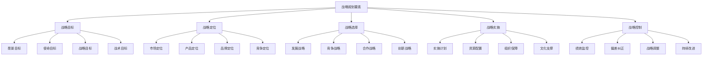
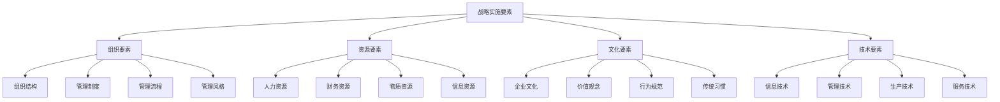

# 战略规划

## 🎯 战略规划概述

### 基本定义
**战略规划**是指组织为了实现长期目标，在分析内外部环境的基础上，制定战略目标、选择战略方案、配置战略资源的过程。

### 核心特征
- **长期性**：面向长期发展
- **全局性**：统筹全局发展
- **前瞻性**：预测未来趋势
- **系统性**：系统规划发展

## 📊 战略规划框架

### 1. 规划层次

#### 企业战略
- **公司战略**：公司整体战略
- **业务战略**：业务单元战略
- **职能战略**：职能部门战略
- **运营战略**：运营层面战略

#### 规划时间
- **长期规划**：5-10年规划
- **中期规划**：3-5年规划
- **短期规划**：1-3年规划
- **年度规划**：年度战略规划

### 2. 规划要素

#### 战略要素

## 🔄 战略规划过程

### 1. 规划步骤

#### 第一步：环境分析
- **外部环境分析**：宏观环境、行业环境、竞争环境
- **内部环境分析**：资源分析、能力分析、文化分析
- **环境评估**：机会威胁评估、优势劣势评估
- **环境预测**：环境变化预测、趋势分析

#### 第二步：战略定位
- **市场定位**：目标市场选择、市场细分
- **产品定位**：产品组合、产品差异化
- **品牌定位**：品牌形象、品牌价值
- **竞争定位**：竞争地位、竞争策略

#### 第三步：目标设定
- **愿景设定**：组织愿景、发展愿景
- **使命设定**：组织使命、社会责任
- **目标设定**：战略目标、战术目标
- **指标设定**：关键指标、绩效指标

#### 第四步：战略选择
- **战略方案**：多种战略方案
- **方案评估**：可行性评估、效果评估
- **方案选择**：最优方案选择
- **方案优化**：方案优化完善

#### 第五步：实施规划
- **实施计划**：详细实施计划
- **资源配置**：人力资源、财务资源、物质资源
- **组织保障**：组织结构、管理制度、流程优化
- **文化支撑**：企业文化、价值观、行为规范

### 2. 规划方法

#### 规划方法
- **自上而下法**：高层制定，逐级分解
- **自下而上法**：基层制定，逐级汇总
- **上下结合法**：上下结合，双向沟通
- **参与式规划**：全员参与，民主决策

#### 规划工具
- **SWOT分析**：优势劣势机会威胁分析
- **波特五力模型**：行业竞争分析
- **价值链分析**：价值创造分析
- **平衡计分卡**：战略绩效管理

## 📈 战略规划类型

### 1. 按战略性质分类

#### 发展战略
- **增长战略**：市场增长、业务增长
- **扩张战略**：市场扩张、业务扩张
- **多元化战略**：产品多元化、市场多元化
- **国际化战略**：国际市场、全球战略

#### 竞争战略
- **成本领先战略**：低成本竞争
- **差异化战略**：产品差异化
- **集中化战略**：市场集中化
- **蓝海战略**：创新竞争

#### 合作战略
- **战略联盟**：企业间合作
- **并购战略**：企业并购
- **合资战略**：合资合作
- **供应链合作**：供应链协同

#### 创新战略
- **技术创新**：技术研发创新
- **产品创新**：产品开发创新
- **服务创新**：服务模式创新
- **商业模式创新**：商业模式创新

### 2. 按战略层次分类

#### 公司层战略
- **投资组合战略**：业务组合管理
- **资源配置战略**：资源优化配置
- **协同战略**：业务协同发展
- **风险控制战略**：风险管控

#### 业务层战略
- **市场战略**：市场开发战略
- **产品战略**：产品开发战略
- **品牌战略**：品牌建设战略
- **渠道战略**：渠道建设战略

#### 职能层战略
- **人力资源战略**：人才发展战略
- **财务战略**：财务管理战略
- **营销战略**：市场营销战略
- **运营战略**：运营管理战略

## 🎯 战略规划实施

### 1. 实施要素

#### 实施要素

#### 实施保障
- **领导保障**：领导支持、领导推动
- **组织保障**：组织支持、组织协调
- **资源保障**：资源支持、资源配置
- **制度保障**：制度支持、制度约束

### 2. 实施过程

#### 实施阶段
- **启动阶段**：战略启动、动员部署
- **推进阶段**：战略推进、重点突破
- **深化阶段**：战略深化、全面实施
- **完善阶段**：战略完善、持续改进

#### 实施监控
- **过程监控**：实施过程监控
- **结果监控**：实施结果监控
- **偏差监控**：偏差识别监控
- **调整监控**：调整效果监控

## 📊 战略规划评估

### 1. 评估维度

#### 战略评估
- **战略适宜性**：战略与环境匹配度
- **战略可行性**：战略实施可行性
- **战略可接受性**：战略接受程度
- **战略有效性**：战略实施效果

#### 绩效评估
- **财务绩效**：财务指标达成
- **市场绩效**：市场指标达成
- **运营绩效**：运营指标达成
- **创新绩效**：创新指标达成

### 2. 评估方法

#### 定量评估
- **指标对比**：指标对比分析
- **趋势分析**：趋势变化分析
- **回归分析**：回归分析
- **预测分析**：预测分析

#### 定性评估
- **专家评估**：专家评估意见
- **用户反馈**：用户反馈意见
- **案例分析**：案例分析评估
- **综合评价**：综合评价结果

## 🔍 战略规划问题与对策

### 1. 常见问题

#### 规划问题
- **规划不科学**：规划方法不科学
- **规划不全面**：规划内容不全面
- **规划不具体**：规划目标不具体
- **规划不协调**：规划内容不协调

#### 实施问题
- **实施不力**：实施执行不力
- **资源不足**：资源保障不足
- **协调困难**：协调配合困难
- **监控不力**：监控机制不力

### 2. 解决对策

#### 规划对策
- **科学规划**：运用科学方法规划
- **全面规划**：全面考虑各种因素
- **具体规划**：制定具体可操作目标
- **协调规划**：协调各种规划内容

#### 实施对策
- **强化实施**：强化实施执行
- **保障资源**：保障资源供给
- **加强协调**：加强协调配合
- **完善监控**：完善监控机制

## 🎯 学习要点总结

### 核心概念
1. **战略规划**：制定战略目标、选择战略方案的过程
2. **规划框架**：企业战略、业务战略、职能战略层次
3. **规划过程**：环境分析、战略定位、目标设定、战略选择、实施规划
4. **规划类型**：发展战略、竞争战略、合作战略、创新战略
5. **规划实施**：组织要素、资源要素、文化要素、技术要素
6. **规划评估**：战略评估、绩效评估

### 关键理解
- 战略规划是组织发展的重要工具
- 规划需要科学的方法和工具
- 实施需要有效的保障机制
- 评估需要科学的评估方法

### 实践应用
- 运用战略规划理论指导实践
- 使用规划工具提高规划质量
- 建立实施保障机制确保执行
- 运用评估方法持续改进

## 🔗 相关链接

- [[战略目标设定]] - 战略目标设定
- [[战略选择]] - 战略选择理论
- [[战略评估]] - 战略评估方法
- [[实践练习-战略制定]] - 战略制定实践

## 📚 延伸阅读

- [[SWOT分析]] - SWOT分析方法
- [[波特五力模型]] - 波特五力模型
- [[价值链分析]] - 价值链分析
- [[平衡计分卡]] - 平衡计分卡

---
*更新时间：2024年*
*内容将根据学习反馈持续优化*
