# 战略评估

## 🎯 战略评估概述

### 基本定义
**战略评估**是对已制定或实施的战略进行系统评价，分析战略的可行性、有效性、风险性和收益性，为战略选择、调整和优化提供依据的管理活动。

### 核心特征
- **系统性**：系统评估战略
- **客观性**：客观评价战略
- **全面性**：全面分析战略
- **动态性**：动态评估战略

## 🔄 战略评估框架

### 1. 评估维度

#### 可行性评估
- **资源可行性**：评估资源可行性
- **能力可行性**：评估能力可行性
- **技术可行性**：评估技术可行性
- **市场可行性**：评估市场可行性

#### 有效性评估
- **目标有效性**：评估目标有效性
- **策略有效性**：评估策略有效性
- **实施有效性**：评估实施有效性
- **效果有效性**：评估效果有效性

#### 风险评估
- **战略风险**：评估战略风险
- **实施风险**：评估实施风险
- **市场风险**：评估市场风险
- **财务风险**：评估财务风险

#### 收益评估
- **财务收益**：评估财务收益
- **市场收益**：评估市场收益
- **客户收益**：评估客户收益
- **社会收益**：评估社会收益

### 2. 评估标准

#### 定量标准
- **财务指标**：财务相关指标
- **市场指标**：市场相关指标
- **运营指标**：运营相关指标
- **客户指标**：客户相关指标

#### 定性标准
- **战略匹配度**：战略匹配程度
- **竞争优势**：竞争优势程度
- **创新能力**：创新能力程度
- **可持续发展**：可持续发展程度

#### 综合标准
- **综合评分**：综合评分标准
- **综合排名**：综合排名标准
- **综合等级**：综合等级标准
- **综合建议**：综合建议标准

### 3. 评估方法

#### 定量评估方法
- **财务分析法**：财务分析方法
- **市场分析法**：市场分析方法
- **运营分析法**：运营分析方法
- **客户分析法**：客户分析方法

#### 定性评估方法
- **专家评估法**：专家评估方法
- **德尔菲法**：德尔菲方法
- **层次分析法**：层次分析方法
- **模糊评估法**：模糊评估方法

#### 综合评估方法
- **综合评分法**：综合评分方法
- **综合排名法**：综合排名方法
- **综合等级法**：综合等级方法
- **综合建议法**：综合建议方法

## 🏢 战略评估过程

### 1. 评估准备

#### 评估计划
- **评估目标**：确定评估目标
- **评估范围**：确定评估范围
- **评估时间**：确定评估时间
- **评估资源**：确定评估资源

#### 评估团队
- **评估人员**：组建评估团队
- **评估分工**：明确评估分工
- **评估培训**：进行评估培训
- **评估协调**：协调评估工作

#### 评估工具
- **评估工具**：准备评估工具
- **评估标准**：制定评估标准
- **评估方法**：选择评估方法
- **评估流程**：设计评估流程

### 2. 评估实施

#### 评估流程

```mermaid
graph TB
    A[战略评估流程] --> B[评估准备]
    A --> C[数据收集]
    A --> D[数据分析]
    A --> E[评估实施]
    A --> F[结果分析]
    A --> G[报告撰写]
    A --> H[结果确认]
    A --> I[结果应用]
    
    B --> B1[评估计划]
    B --> B2[评估团队]
    B --> B3[评估工具]
    B --> B4[评估标准]
    
    C --> C1[内部数据收集]
    C --> C2[外部数据收集]
    C --> C3[历史数据收集]
    C --> C4[预测数据收集]
    
    D --> D1[数据整理]
    D --> D2[数据分析]
    D --> D3[数据验证]
    D --> D4[数据解释]
    
    E --> E1[可行性评估]
    E --> E2[有效性评估]
    E --> E3[风险评估]
    E --> E4[收益评估]
    
    F --> F1[结果分析]
    F --> F2[结果比较]
    F --> F3[结果解释]
    F --> F4[结果总结]
    
    G --> G1[评估报告]
    G --> G2[结果展示]
    G --> G3[建议提出]
    G --> G4[实施计划]
    
    H --> H1[结果确认]
    H --> H2[结果验证]
    H --> H3[结果批准]
    H --> H4[结果发布]
    
    I --> I1[结果应用]
    I --> I2[结果实施]
    I --> I3[结果监控]
    I --> I4[结果改进]
```

#### 评估步骤
- **步骤1**：评估准备和数据收集
- **步骤2**：数据分析和评估实施
- **步骤3**：结果分析和报告撰写
- **步骤4**：结果确认和结果应用

### 3. 评估结果

#### 评估结果分析
- **结果分析**：分析评估结果
- **结果比较**：比较评估结果
- **结果解释**：解释评估结果
- **结果总结**：总结评估结果

#### 评估结果应用
- **结果应用**：应用评估结果
- **结果实施**：实施评估结果
- **结果监控**：监控评估结果
- **结果改进**：改进评估结果

## 📊 战略评估工具

### 1. 评估工具

#### 定量评估工具
- **财务分析工具**：财务分析工具
- **市场分析工具**：市场分析工具
- **运营分析工具**：运营分析工具
- **客户分析工具**：客户分析工具

#### 定性评估工具
- **专家评估工具**：专家评估工具
- **德尔菲工具**：德尔菲工具
- **层次分析工具**：层次分析工具
- **模糊评估工具**：模糊评估工具

#### 综合评估工具
- **综合评分工具**：综合评分工具
- **综合排名工具**：综合排名工具
- **综合等级工具**：综合等级工具
- **综合建议工具**：综合建议工具

### 2. 评估模型

#### 评估模型
- **可行性评估模型**：可行性评估模型
- **有效性评估模型**：有效性评估模型
- **风险评估模型**：风险评估模型
- **收益评估模型**：收益评估模型

#### 综合评估模型
- **综合评估模型**：综合评估模型
- **多维度评估模型**：多维度评估模型
- **动态评估模型**：动态评估模型
- **智能评估模型**：智能评估模型

## 🎯 战略评估应用

### 1. 战略制定应用

#### 战略方案评估
- **方案可行性评估**：评估方案可行性
- **方案有效性评估**：评估方案有效性
- **方案风险评估**：评估方案风险
- **方案收益评估**：评估方案收益

#### 战略选择评估
- **选择标准评估**：评估选择标准
- **选择过程评估**：评估选择过程
- **选择结果评估**：评估选择结果
- **选择效果评估**：评估选择效果

### 2. 战略实施应用

#### 战略实施评估
- **实施进度评估**：评估实施进度
- **实施质量评估**：评估实施质量
- **实施效果评估**：评估实施效果
- **实施风险评估**：评估实施风险

#### 战略调整评估
- **调整必要性评估**：评估调整必要性
- **调整方案评估**：评估调整方案
- **调整效果评估**：评估调整效果
- **调整风险评估**：评估调整风险

### 3. 战略控制应用

#### 战略控制评估
- **控制效果评估**：评估控制效果
- **控制效率评估**：评估控制效率
- **控制成本评估**：评估控制成本
- **控制风险评估**：评估控制风险

#### 战略优化评估
- **优化效果评估**：评估优化效果
- **优化效率评估**：评估优化效率
- **优化成本评估**：评估优化成本
- **优化风险评估**：评估优化风险

## 🔍 战略评估挑战

### 1. 评估挑战

#### 评估方法挑战
- **方法选择困难**：方法选择困难
- **方法应用困难**：方法应用困难
- **方法效果不确定**：方法效果不确定
- **方法创新困难**：方法创新困难

#### 评估数据挑战
- **数据不足**：数据掌握不足
- **数据不准确**：数据准确性差
- **数据滞后**：数据更新滞后
- **数据不对称**：数据掌握不对称

### 2. 实施挑战

#### 评估实施挑战
- **实施困难**：评估实施困难
- **实施成本高**：实施成本高昂
- **实施时间长**：实施时间较长
- **实施风险大**：实施风险较大

#### 评估结果挑战
- **结果评估困难**：结果评估困难
- **结果应用困难**：结果应用困难
- **结果持续困难**：结果持续困难
- **结果改进困难**：结果改进困难

## 📈 战略评估发展

### 1. 理论发展

#### 理论创新
- **评估理论**：评估理论创新
- **方法理论**：方法理论创新
- **工具理论**：工具理论创新
- **模型理论**：模型理论创新

#### 理论整合
- **理论融合**：理论相互融合
- **理论系统**：理论系统化
- **理论应用**：理论应用化
- **理论发展**：理论发展化

### 2. 实践发展

#### 实践创新
- **方法创新**：评估方法创新
- **工具创新**：评估工具创新
- **技术创新**：评估技术创新
- **模式创新**：评估模式创新

#### 实践推广
- **经验总结**：总结实践经验
- **模式推广**：推广成功模式
- **标准制定**：制定评估标准
- **培训推广**：培训推广方法

## 🎯 学习要点总结

### 核心概念
1. **战略评估**：评估战略
2. **评估维度**：可行性、有效性、风险、收益
3. **评估标准**：定量标准、定性标准、综合标准
4. **评估方法**：定量评估、定性评估、综合评估
5. **评估过程**：评估准备、实施、结果
6. **评估工具**：评估工具、评估模型

### 关键理解
- 战略评估是战略管理的关键环节
- 战略评估需要系统全面
- 战略评估需要客观准确
- 战略评估面临各种挑战

### 实践应用
- 运用评估方法评估战略
- 运用评估工具分析战略
- 运用评估结果改进战略
- 运用评估过程优化战略

## 🔗 相关链接

- [[战略目标设定]] - 战略目标设定
- [[战略规划]] - 战略规划
- [[战略选择]] - 战略选择
- [[实践练习-战略制定]] - 实践练习

## 📚 延伸阅读

- [[战略制定]] - 战略制定理论
- [[战略评估]] - 战略评估理论
- [[评估方法]] - 评估方法理论
- [[评估工具]] - 评估工具理论

---
*更新时间：2024年*
*内容将根据学习反馈持续优化*
