# 战略选择

## 🎯 战略选择概述

### 基本定义
**战略选择**是在战略分析的基础上，从多个备选战略方案中选择最优战略方案，并制定相应实施计划的管理活动。

### 核心特征
- **选择性**：从多个方案中选择
- **优化性**：选择最优方案
- **决策性**：做出战略决策
- **实施性**：制定实施计划

## 🔄 战略选择框架

### 1. 战略选择类型

#### 按战略层次分类
- **公司层战略**：公司层战略选择
- **业务层战略**：业务层战略选择
- **职能层战略**：职能层战略选择
- **项目层战略**：项目层战略选择

#### 按战略方向分类
- **增长战略**：增长战略选择
- **稳定战略**：稳定战略选择
- **收缩战略**：收缩战略选择
- **组合战略**：组合战略选择

#### 按竞争策略分类
- **成本领先战略**：成本领先战略选择
- **差异化战略**：差异化战略选择
- **集中化战略**：集中化战略选择
- **混合战略**：混合战略选择

### 2. 战略选择标准

#### 可行性标准
- **资源可行性**：资源是否充足
- **能力可行性**：能力是否具备
- **技术可行性**：技术是否可行
- **市场可行性**：市场是否接受

#### 有效性标准
- **目标有效性**：是否达成目标
- **策略有效性**：策略是否有效
- **实施有效性**：实施是否有效
- **效果有效性**：效果是否显著

#### 风险标准
- **战略风险**：战略风险大小
- **实施风险**：实施风险大小
- **市场风险**：市场风险大小
- **财务风险**：财务风险大小

#### 收益标准
- **财务收益**：财务收益大小
- **市场收益**：市场收益大小
- **客户收益**：客户收益大小
- **社会收益**：社会收益大小

### 3. 战略选择方法

#### 定量选择方法
- **财务分析法**：财务分析方法
- **市场分析法**：市场分析方法
- **运营分析法**：运营分析方法
- **客户分析法**：客户分析方法

#### 定性选择方法
- **专家评估法**：专家评估方法
- **德尔菲法**：德尔菲方法
- **层次分析法**：层次分析方法
- **模糊评估法**：模糊评估方法

#### 综合选择方法
- **综合评分法**：综合评分方法
- **综合排名法**：综合排名方法
- **综合等级法**：综合等级方法
- **综合建议法**：综合建议方法

## 🏢 战略选择过程

### 1. 选择准备

#### 方案准备
- **方案设计**：设计备选方案
- **方案完善**：完善备选方案
- **方案评估**：评估备选方案
- **方案筛选**：筛选备选方案

#### 标准准备
- **标准制定**：制定选择标准
- **标准权重**：确定标准权重
- **标准验证**：验证选择标准
- **标准确认**：确认选择标准

#### 方法准备
- **方法选择**：选择选择方法
- **方法设计**：设计选择方法
- **方法验证**：验证选择方法
- **方法确认**：确认选择方法

### 2. 选择实施

#### 选择流程

```mermaid
graph TB
    A[战略选择流程] --> B[选择准备]
    A --> C[方案评估]
    A --> D[标准应用]
    A --> E[方法运用]
    A --> F[结果分析]
    A --> G[方案选择]
    A --> H[结果确认]
    A --> I[实施计划]
    
    B --> B1[方案准备]
    B --> B2[标准准备]
    B --> B3[方法准备]
    B --> B4[团队准备]
    
    C --> C1[方案评估]
    C --> C2[方案比较]
    C --> C3[方案分析]
    C --> C4[方案排序]
    
    D --> D1[标准应用]
    D --> D2[标准权重]
    D --> D3[标准评分]
    D --> D4[标准结果]
    
    E --> E1[方法运用]
    E --> E2[方法计算]
    E --> E3[方法结果]
    E --> E4[方法验证]
    
    F --> F1[结果分析]
    F --> F2[结果比较]
    F --> F3[结果解释]
    F --> F4[结果总结]
    
    G --> G1[方案选择]
    G --> G2[选择理由]
    G --> G3[选择确认]
    G --> G4[选择批准]
    
    H --> H1[结果确认]
    H --> H2[结果验证]
    H --> H3[结果批准]
    H --> H4[结果发布]
    
    I --> I1[实施计划]
    I --> I2[实施准备]
    I --> I3[实施监控]
    I --> I4[实施调整]
```

#### 选择步骤
- **步骤1**：选择准备和方案评估
- **步骤2**：标准应用和方法运用
- **步骤3**：结果分析和方案选择
- **步骤4**：结果确认和实施计划

### 3. 选择结果

#### 选择结果分析
- **结果分析**：分析选择结果
- **结果比较**：比较选择结果
- **结果解释**：解释选择结果
- **结果总结**：总结选择结果

#### 选择结果应用
- **结果应用**：应用选择结果
- **结果实施**：实施选择结果
- **结果监控**：监控选择结果
- **结果改进**：改进选择结果

## 📊 战略选择工具

### 1. 选择工具

#### 定量选择工具
- **财务分析工具**：财务分析工具
- **市场分析工具**：市场分析工具
- **运营分析工具**：运营分析工具
- **客户分析工具**：客户分析工具

#### 定性选择工具
- **专家评估工具**：专家评估工具
- **德尔菲工具**：德尔菲工具
- **层次分析工具**：层次分析工具
- **模糊评估工具**：模糊评估工具

#### 综合选择工具
- **综合评分工具**：综合评分工具
- **综合排名工具**：综合排名工具
- **综合等级工具**：综合等级工具
- **综合建议工具**：综合建议工具

### 2. 选择模型

#### 选择模型
- **可行性选择模型**：可行性选择模型
- **有效性选择模型**：有效性选择模型
- **风险选择模型**：风险选择模型
- **收益选择模型**：收益选择模型

#### 综合选择模型
- **综合选择模型**：综合选择模型
- **多维度选择模型**：多维度选择模型
- **动态选择模型**：动态选择模型
- **智能选择模型**：智能选择模型

## 🎯 战略选择应用

### 1. 战略制定应用

#### 战略方案选择
- **方案可行性选择**：选择可行方案
- **方案有效性选择**：选择有效方案
- **方案风险选择**：选择低风险方案
- **方案收益选择**：选择高收益方案

#### 战略方向选择
- **增长方向选择**：选择增长方向
- **稳定方向选择**：选择稳定方向
- **收缩方向选择**：选择收缩方向
- **组合方向选择**：选择组合方向

### 2. 战略实施应用

#### 战略实施选择
- **实施方式选择**：选择实施方式
- **实施时间选择**：选择实施时间
- **实施资源选择**：选择实施资源
- **实施团队选择**：选择实施团队

#### 战略调整选择
- **调整方式选择**：选择调整方式
- **调整时间选择**：选择调整时间
- **调整资源选择**：选择调整资源
- **调整团队选择**：选择调整团队

### 3. 战略控制应用

#### 战略控制选择
- **控制方式选择**：选择控制方式
- **控制时间选择**：选择控制时间
- **控制资源选择**：选择控制资源
- **控制团队选择**：选择控制团队

#### 战略优化选择
- **优化方式选择**：选择优化方式
- **优化时间选择**：选择优化时间
- **优化资源选择**：选择优化资源
- **优化团队选择**：选择优化团队

## 🔍 战略选择挑战

### 1. 选择挑战

#### 选择方法挑战
- **方法选择困难**：方法选择困难
- **方法应用困难**：方法应用困难
- **方法效果不确定**：方法效果不确定
- **方法创新困难**：方法创新困难

#### 选择标准挑战
- **标准制定困难**：标准制定困难
- **标准权重困难**：标准权重困难
- **标准应用困难**：标准应用困难
- **标准验证困难**：标准验证困难

### 2. 实施挑战

#### 选择实施挑战
- **实施困难**：选择实施困难
- **实施成本高**：实施成本高昂
- **实施时间长**：实施时间较长
- **实施风险大**：实施风险较大

#### 选择结果挑战
- **结果评估困难**：结果评估困难
- **结果应用困难**：结果应用困难
- **结果持续困难**：结果持续困难
- **结果改进困难**：结果改进困难

## 📈 战略选择发展

### 1. 理论发展

#### 理论创新
- **选择理论**：选择理论创新
- **方法理论**：方法理论创新
- **工具理论**：工具理论创新
- **模型理论**：模型理论创新

#### 理论整合
- **理论融合**：理论相互融合
- **理论系统**：理论系统化
- **理论应用**：理论应用化
- **理论发展**：理论发展化

### 2. 实践发展

#### 实践创新
- **方法创新**：选择方法创新
- **工具创新**：选择工具创新
- **技术创新**：选择技术创新
- **模式创新**：选择模式创新

#### 实践推广
- **经验总结**：总结实践经验
- **模式推广**：推广成功模式
- **标准制定**：制定选择标准
- **培训推广**：培训推广方法

## 🎯 学习要点总结

### 核心概念
1. **战略选择**：选择战略方案
2. **选择类型**：按层次、方向、策略分类
3. **选择标准**：可行性、有效性、风险、收益
4. **选择方法**：定量选择、定性选择、综合选择
5. **选择过程**：选择准备、实施、结果
6. **选择工具**：选择工具、选择模型

### 关键理解
- 战略选择是战略制定的关键环节
- 战略选择需要科学合理
- 战略选择需要系统全面
- 战略选择面临各种挑战

### 实践应用
- 运用选择方法选择战略
- 运用选择工具分析战略
- 运用选择结果实施战略
- 运用选择过程优化战略

## 🔗 相关链接

- [[战略目标设定]] - 战略目标设定
- [[战略规划]] - 战略规划
- [[战略评估]] - 战略评估
- [[实践练习-战略制定]] - 实践练习

## 📚 延伸阅读

- [[战略制定]] - 战略制定理论
- [[战略选择]] - 战略选择理论
- [[选择方法]] - 选择方法理论
- [[选择工具]] - 选择工具理论

---
*更新时间：2024年*
*内容将根据学习反馈持续优化*
