# 战略执行

## 🎯 战略执行概述

### 基本定义
**战略执行**是将已制定的战略转化为具体行动，通过资源配置、组织协调、过程控制等方式，实现战略目标的管理活动。

### 核心特征
- **行动性**：将战略转化为行动
- **系统性**：系统执行战略
- **协调性**：协调各种资源
- **控制性**：控制执行过程

## 🔄 战略执行框架

### 1. 执行要素

#### 执行目标
- **战略目标**：战略总体目标
- **战术目标**：战术具体目标
- **作业目标**：作业操作目标
- **个人目标**：个人工作目标

#### 执行计划
- **执行计划**：执行总体计划
- **实施计划**：实施具体计划
- **时间计划**：时间安排计划
- **资源计划**：资源配置计划

#### 执行资源
- **人力资源**：执行人力资源
- **财务资源**：执行财务资源
- **物质资源**：执行物质资源
- **技术资源**：执行技术资源

#### 执行团队
- **执行团队**：执行核心团队
- **支持团队**：执行支持团队
- **协调团队**：执行协调团队
- **监控团队**：执行监控团队

### 2. 执行过程

#### 执行准备
- **目标确认**：确认执行目标
- **计划制定**：制定执行计划
- **资源准备**：准备执行资源
- **团队组建**：组建执行团队

#### 执行实施
- **计划执行**：执行实施计划
- **过程监控**：监控执行过程
- **问题解决**：解决执行问题
- **效果评估**：评估执行效果

#### 执行控制
- **进度控制**：控制执行进度
- **质量控制**：控制执行质量
- **成本控制**：控制执行成本
- **风险控制**：控制执行风险

#### 执行优化
- **过程优化**：优化执行过程
- **方法优化**：优化执行方法
- **工具优化**：优化执行工具
- **效果优化**：优化执行效果

### 3. 执行机制

#### 执行机制
- **执行机制**：执行运行机制
- **协调机制**：执行协调机制
- **监控机制**：执行监控机制
- **激励机制**：执行激励机制

#### 执行制度
- **执行制度**：执行管理制度
- **协调制度**：执行协调制度
- **监控制度**：执行监控制度
- **激励制度**：执行激励制度

#### 执行文化
- **执行文化**：执行文化氛围
- **协调文化**：执行协调文化
- **监控文化**：执行监控文化
- **激励文化**：执行激励文化

## 🏢 战略执行过程

### 1. 执行准备

#### 执行准备流程

```mermaid
graph TB
    A[战略执行准备] --> B[目标确认]
    A --> C[计划制定]
    A --> D[资源准备]
    A --> E[团队组建]
    A --> F[制度建立]
    A --> G[文化营造]
    A --> H[准备确认]
    
    B --> B1[战略目标确认]
    B --> B2[战术目标确认]
    B --> B3[作业目标确认]
    B --> B4[个人目标确认]
    
    C --> C1[执行计划制定]
    C --> C2[实施计划制定]
    C --> C3[时间计划制定]
    C --> C4[资源计划制定]
    
    D --> D1[人力资源准备]
    D --> D2[财务资源准备]
    D --> D3[物质资源准备]
    D --> D4[技术资源准备]
    
    E --> E1[执行团队组建]
    E --> E2[支持团队组建]
    E --> E3[协调团队组建]
    E --> E4[监控团队组建]
    
    F --> F1[执行制度建立]
    F --> F2[协调制度建立]
    F --> F3[监控制度建立]
    F --> F4[激励制度建立]
    
    G --> G1[执行文化营造]
    G --> G2[协调文化营造]
    G --> G3[监控文化营造]
    G --> G4[激励文化营造]
    
    H --> H1[准备确认]
    H --> H2[准备验证]
    H --> H3[准备批准]
    H --> H4[准备发布]
```

#### 执行准备步骤
- **步骤1**：目标确认和计划制定
- **步骤2**：资源准备和团队组建
- **步骤3**：制度建立和文化营造
- **步骤4**：准备确认和准备发布

### 2. 执行实施

#### 执行实施流程

```mermaid
graph TB
    A[战略执行实施] --> B[计划执行]
    A --> C[过程监控]
    A --> D[问题解决]
    A --> E[效果评估]
    A --> F[执行调整]
    A --> G[执行优化]
    A --> H[执行完成]
    
    B --> B1[执行计划]
    B --> B2[执行监控]
    B --> B3[执行调整]
    B --> B4[执行完成]
    
    C --> C1[进度监控]
    C --> C2[质量监控]
    C --> C3[成本监控]
    C --> C4[风险监控]
    
    D --> D1[问题识别]
    D --> D2[问题分析]
    D --> D3[问题解决]
    D --> D4[问题预防]
    
    E --> E1[效果评估]
    E --> E2[效果分析]
    E --> E3[效果改进]
    E --> E4[效果提升]
    
    F --> F1[执行调整]
    F --> F2[调整实施]
    F --> F3[调整监控]
    F --> F4[调整效果]
    
    G --> G1[过程优化]
    G --> G2[方法优化]
    G --> G3[工具优化]
    G --> G4[效果优化]
    
    H --> H1[执行完成]
    H --> H2[完成确认]
    H --> H3[完成评估]
    H --> H4[完成总结]
```

#### 执行实施步骤
- **步骤1**：计划执行和过程监控
- **步骤2**：问题解决和效果评估
- **步骤3**：执行调整和执行优化
- **步骤4**：执行完成和执行总结

### 3. 执行控制

#### 执行控制流程

```mermaid
graph TB
    A[战略执行控制] --> B[控制目标]
    A --> C[控制标准]
    A --> D[控制方法]
    A --> E[控制工具]
    A --> F[控制实施]
    A --> G[控制监控]
    A --> H[控制调整]
    A --> I[控制优化]
    
    B --> B1[进度控制目标]
    B --> B2[质量控制目标]
    B --> B3[成本控制目标]
    B --> B4[风险控制目标]
    
    C --> C1[进度控制标准]
    C --> C2[质量控制标准]
    C --> C3[成本控制标准]
    C --> C4[风险控制标准]
    
    D --> D1[进度控制方法]
    D --> D2[质量控制方法]
    D --> D3[成本控制方法]
    D --> D4[风险控制方法]
    
    E --> E1[进度控制工具]
    E --> E2[质量控制工具]
    E --> E3[成本控制工具]
    E --> E4[风险控制工具]
    
    F --> F1[控制实施]
    F --> F2[控制执行]
    F --> F3[控制监控]
    F --> F4[控制调整]
    
    G --> G1[控制监控]
    G --> G2[监控实施]
    G --> G3[监控执行]
    G --> G4[监控调整]
    
    H --> H1[控制调整]
    H --> H2[调整实施]
    H --> H3[调整执行]
    H --> H4[调整效果]
    
    I --> I1[控制优化]
    I --> I2[优化实施]
    I --> I3[优化执行]
    I --> I4[优化效果]
```

#### 执行控制步骤
- **步骤1**：控制目标和控制标准
- **步骤2**：控制方法和控制工具
- **步骤3**：控制实施和控制监控
- **步骤4**：控制调整和控制优化

## 📊 战略执行工具

### 1. 执行工具

#### 计划工具
- **执行计划表**：执行计划表格
- **实施计划表**：实施计划表格
- **时间计划表**：时间计划表格
- **资源计划表**：资源计划表格

#### 监控工具
- **进度监控表**：进度监控表格
- **质量监控表**：质量监控表格
- **成本监控表**：成本监控表格
- **风险监控表**：风险监控表格

#### 控制工具
- **进度控制表**：进度控制表格
- **质量控制表**：质量控制表格
- **成本控制表**：成本控制表格
- **风险控制表**：风险控制表格

#### 评估工具
- **执行评估表**：执行评估表格
- **效果评估表**：效果评估表格
- **绩效评估表**：绩效评估表格
- **综合评估表**：综合评估表格

### 2. 执行模型

#### 执行模型
- **执行准备模型**：执行准备模型
- **执行实施模型**：执行实施模型
- **执行控制模型**：执行控制模型
- **执行优化模型**：执行优化模型

#### 综合执行模型
- **综合执行模型**：综合执行模型
- **多维度执行模型**：多维度执行模型
- **动态执行模型**：动态执行模型
- **智能执行模型**：智能执行模型

## 🎯 战略执行应用

### 1. 战略制定应用

#### 战略执行计划
- **执行计划制定**：制定执行计划
- **执行计划评估**：评估执行计划
- **执行计划优化**：优化执行计划
- **执行计划实施**：实施执行计划

#### 战略执行选择
- **执行方式选择**：选择执行方式
- **执行时间选择**：选择执行时间
- **执行资源选择**：选择执行资源
- **执行团队选择**：选择执行团队

### 2. 战略实施应用

#### 战略执行实施
- **执行计划实施**：实施执行计划
- **执行过程监控**：监控执行过程
- **执行问题解决**：解决执行问题
- **执行效果评估**：评估执行效果

#### 战略执行调整
- **执行计划调整**：调整执行计划
- **执行过程调整**：调整执行过程
- **执行方法调整**：调整执行方法
- **执行工具调整**：调整执行工具

### 3. 战略控制应用

#### 战略执行控制
- **执行进度控制**：控制执行进度
- **执行质量控制**：控制执行质量
- **执行成本控制**：控制执行成本
- **执行风险控制**：控制执行风险

#### 战略执行优化
- **执行过程优化**：优化执行过程
- **执行方法优化**：优化执行方法
- **执行工具优化**：优化执行工具
- **执行效果优化**：优化执行效果

## 🔍 战略执行挑战

### 1. 执行挑战

#### 执行准备挑战
- **目标确认困难**：目标确认困难
- **计划制定困难**：计划制定困难
- **资源准备困难**：资源准备困难
- **团队组建困难**：团队组建困难

#### 执行实施挑战
- **计划执行困难**：计划执行困难
- **过程监控困难**：过程监控困难
- **问题解决困难**：问题解决困难
- **效果评估困难**：效果评估困难

### 2. 控制挑战

#### 执行控制挑战
- **进度控制困难**：进度控制困难
- **质量控制困难**：质量控制困难
- **成本控制困难**：成本控制困难
- **风险控制困难**：风险控制困难

#### 执行优化挑战
- **过程优化困难**：过程优化困难
- **方法优化困难**：方法优化困难
- **工具优化困难**：工具优化困难
- **效果优化困难**：效果优化困难

## 📈 战略执行发展

### 1. 理论发展

#### 理论创新
- **执行理论**：执行理论创新
- **方法理论**：方法理论创新
- **工具理论**：工具理论创新
- **模型理论**：模型理论创新

#### 理论整合
- **理论融合**：理论相互融合
- **理论系统**：理论系统化
- **理论应用**：理论应用化
- **理论发展**：理论发展化

### 2. 实践发展

#### 实践创新
- **方法创新**：执行方法创新
- **工具创新**：执行工具创新
- **技术创新**：执行技术创新
- **模式创新**：执行模式创新

#### 实践推广
- **经验总结**：总结实践经验
- **模式推广**：推广成功模式
- **标准制定**：制定执行标准
- **培训推广**：培训推广方法

## 🎯 学习要点总结

### 核心概念
1. **战略执行**：执行战略
2. **执行要素**：目标、计划、资源、团队
3. **执行过程**：准备、实施、控制、优化
4. **执行机制**：执行机制、制度、文化
5. **执行工具**：计划工具、监控工具、控制工具
6. **执行模型**：执行模型、综合执行模型

### 关键理解
- 战略执行是战略实施的关键
- 战略执行需要系统全面
- 战略执行需要协调控制
- 战略执行面临各种挑战

### 实践应用
- 运用执行方法执行战略
- 运用执行工具控制执行
- 运用执行模型优化执行
- 运用执行机制保障执行

## 🔗 相关链接

- [[战略控制]] - 战略控制
- [[战略绩效评估]] - 战略绩效评估
- [[战略调整]] - 战略调整
- [[实践练习-战略实施]] - 实践练习

## 📚 延伸阅读

- [[战略实施]] - 战略实施理论
- [[战略执行]] - 战略执行理论
- [[执行方法]] - 执行方法理论
- [[执行工具]] - 执行工具理论

---
*更新时间：2024年*
*内容将根据学习反馈持续优化*
