# 战略控制

## 🎯 战略控制概述

### 基本定义
**战略控制**是对战略执行过程进行监控、评估和调整，确保战略目标实现的管理活动。通过建立控制系统，及时发现偏差，采取纠正措施，保证战略有效实施。

### 核心特征
- **监控性**：监控执行过程
- **评估性**：评估执行效果
- **调整性**：调整执行偏差
- **保障性**：保障目标实现

## 🔄 战略控制框架

### 1. 控制要素

#### 控制目标
- **战略目标**：战略总体目标
- **战术目标**：战术具体目标
- **作业目标**：作业操作目标
- **个人目标**：个人工作目标

#### 控制标准
- **绩效标准**：绩效评估标准
- **质量标准**：质量评估标准
- **成本标准**：成本评估标准
- **时间标准**：时间评估标准

#### 控制方法
- **事前控制**：事前控制方法
- **事中控制**：事中控制方法
- **事后控制**：事后控制方法
- **综合控制**：综合控制方法

#### 控制工具
- **监控工具**：监控执行工具
- **评估工具**：评估效果工具
- **调整工具**：调整偏差工具
- **报告工具**：报告结果工具

### 2. 控制过程

#### 控制准备
- **控制目标确定**：确定控制目标
- **控制标准制定**：制定控制标准
- **控制方法选择**：选择控制方法
- **控制工具准备**：准备控制工具

#### 控制实施
- **执行监控**：监控执行过程
- **效果评估**：评估执行效果
- **偏差识别**：识别执行偏差
- **原因分析**：分析偏差原因

#### 控制调整
- **调整方案制定**：制定调整方案
- **调整措施实施**：实施调整措施
- **调整效果评估**：评估调整效果
- **调整方案优化**：优化调整方案

#### 控制优化
- **控制过程优化**：优化控制过程
- **控制方法优化**：优化控制方法
- **控制工具优化**：优化控制工具
- **控制效果优化**：优化控制效果

### 3. 控制机制

#### 控制机制
- **控制机制**：控制运行机制
- **监控机制**：监控运行机制
- **评估机制**：评估运行机制
- **调整机制**：调整运行机制

#### 控制制度
- **控制制度**：控制管理制度
- **监控制度**：监控管理制度
- **评估制度**：评估管理制度
- **调整制度**：调整管理制度

#### 控制文化
- **控制文化**：控制文化氛围
- **监控文化**：监控文化氛围
- **评估文化**：评估文化氛围
- **调整文化**：调整文化氛围

## 🏢 战略控制过程

### 1. 控制准备

#### 控制准备流程

```mermaid
graph TB
    A[战略控制准备] --> B[控制目标确定]
    A --> C[控制标准制定]
    A --> D[控制方法选择]
    A --> E[控制工具准备]
    A --> F[控制团队组建]
    A --> G[控制制度建立]
    A --> H[控制文化营造]
    A --> I[准备确认]
    
    B --> B1[战略目标确定]
    B --> B2[战术目标确定]
    B --> B3[作业目标确定]
    B --> B4[个人目标确定]
    
    C --> C1[绩效标准制定]
    C --> C2[质量标准制定]
    C --> C3[成本标准制定]
    C --> C4[时间标准制定]
    
    D --> D1[事前控制方法]
    D --> D2[事中控制方法]
    D --> D3[事后控制方法]
    D --> D4[综合控制方法]
    
    E --> E1[监控工具准备]
    E --> E2[评估工具准备]
    E --> E3[调整工具准备]
    E --> E4[报告工具准备]
    
    F --> F1[控制团队组建]
    F --> F2[监控团队组建]
    F --> F3[评估团队组建]
    F --> F4[调整团队组建]
    
    G --> G1[控制制度建立]
    G --> G2[监控制度建立]
    G --> G3[评估制度建立]
    G --> G4[调整制度建立]
    
    H --> H1[控制文化营造]
    H --> H2[监控文化营造]
    H --> H3[评估文化营造]
    H --> H4[调整文化营造]
    
    I --> I1[准备确认]
    I --> I2[准备验证]
    I --> I3[准备批准]
    I --> I4[准备发布]
```

#### 控制准备步骤
- **步骤1**：控制目标确定和控制标准制定
- **步骤2**：控制方法选择和控制工具准备
- **步骤3**：控制团队组建和控制制度建立
- **步骤4**：控制文化营造和准备确认

### 2. 控制实施

#### 控制实施流程

```mermaid
graph TB
    A[战略控制实施] --> B[执行监控]
    A --> C[效果评估]
    A --> D[偏差识别]
    A --> E[原因分析]
    A --> F[调整方案制定]
    A --> G[调整措施实施]
    A --> H[调整效果评估]
    A --> I[控制优化]
    
    B --> B1[进度监控]
    B --> B2[质量监控]
    B --> B3[成本监控]
    B --> B4[风险监控]
    
    C --> C1[绩效评估]
    C --> C2[质量评估]
    C --> C3[成本评估]
    C --> C4[时间评估]
    
    D --> D1[偏差识别]
    D --> D2[偏差分析]
    D --> D3[偏差分类]
    D --> D4[偏差优先级]
    
    E --> E1[原因分析]
    E --> E2[原因识别]
    E --> E3[原因分类]
    E --> E4[原因优先级]
    
    F --> F1[调整方案制定]
    F --> F2[调整方案评估]
    F --> F3[调整方案选择]
    F --> F4[调整方案确认]
    
    G --> G1[调整措施实施]
    G --> G2[调整措施监控]
    G --> G3[调整措施评估]
    G --> G4[调整措施优化]
    
    H --> H1[调整效果评估]
    H --> H2[调整效果分析]
    H --> H3[调整效果改进]
    H --> H4[调整效果提升]
    
    I --> I1[控制过程优化]
    I --> I2[控制方法优化]
    I --> I3[控制工具优化]
    I --> I4[控制效果优化]
```

#### 控制实施步骤
- **步骤1**：执行监控和效果评估
- **步骤2**：偏差识别和原因分析
- **步骤3**：调整方案制定和调整措施实施
- **步骤4**：调整效果评估和控制优化

### 3. 控制优化

#### 控制优化流程

```mermaid
graph TB
    A[战略控制优化] --> B[控制过程优化]
    A --> C[控制方法优化]
    A --> D[控制工具优化]
    A --> E[控制效果优化]
    A --> F[控制机制优化]
    A --> G[控制制度优化]
    A --> H[控制文化优化]
    A --> I[优化效果评估]
    
    B --> B1[过程优化]
    B --> B2[流程优化]
    B --> B3[效率优化]
    B --> B4[效果优化]
    
    C --> C1[方法优化]
    C --> C2[技术优化]
    C --> C3[工具优化]
    C --> C4[效果优化]
    
    D --> D1[工具优化]
    D --> D2[技术优化]
    D --> D3[功能优化]
    D --> D4[效果优化]
    
    E --> E1[效果优化]
    E --> E2[效率优化]
    E --> E3[质量优化]
    E --> E4[成本优化]
    
    F --> F1[机制优化]
    F --> F2[流程优化]
    F --> F3[效率优化]
    F --> F4[效果优化]
    
    G --> G1[制度优化]
    G --> G2[流程优化]
    G --> G3[效率优化]
    G --> G4[效果优化]
    
    H --> H1[文化优化]
    H --> H2[氛围优化]
    H --> H3[效率优化]
    H --> H4[效果优化]
    
    I --> I1[优化效果评估]
    I --> I2[优化效果分析]
    I --> I3[优化效果改进]
    I --> I4[优化效果提升]
```

#### 控制优化步骤
- **步骤1**：控制过程优化和控制方法优化
- **步骤2**：控制工具优化和控制效果优化
- **步骤3**：控制机制优化和控制制度优化
- **步骤4**：控制文化优化和优化效果评估

## 📊 战略控制工具

### 1. 控制工具

#### 监控工具
- **进度监控表**：进度监控表格
- **质量监控表**：质量监控表格
- **成本监控表**：成本监控表格
- **风险监控表**：风险监控表格

#### 评估工具
- **绩效评估表**：绩效评估表格
- **质量评估表**：质量评估表格
- **成本评估表**：成本评估表格
- **时间评估表**：时间评估表格

#### 调整工具
- **调整方案表**：调整方案表格
- **调整措施表**：调整措施表格
- **调整效果表**：调整效果表格
- **调整总结表**：调整总结表格

#### 报告工具
- **控制报告表**：控制报告表格
- **监控报告表**：监控报告表格
- **评估报告表**：评估报告表格
- **调整报告表**：调整报告表格

### 2. 控制模型

#### 控制模型
- **控制准备模型**：控制准备模型
- **控制实施模型**：控制实施模型
- **控制优化模型**：控制优化模型
- **控制效果模型**：控制效果模型

#### 综合控制模型
- **综合控制模型**：综合控制模型
- **多维度控制模型**：多维度控制模型
- **动态控制模型**：动态控制模型
- **智能控制模型**：智能控制模型

## 🎯 战略控制应用

### 1. 战略制定应用

#### 战略控制计划
- **控制计划制定**：制定控制计划
- **控制计划评估**：评估控制计划
- **控制计划优化**：优化控制计划
- **控制计划实施**：实施控制计划

#### 战略控制选择
- **控制方式选择**：选择控制方式
- **控制时间选择**：选择控制时间
- **控制资源选择**：选择控制资源
- **控制团队选择**：选择控制团队

### 2. 战略实施应用

#### 战略控制实施
- **控制计划实施**：实施控制计划
- **控制过程监控**：监控控制过程
- **控制问题解决**：解决控制问题
- **控制效果评估**：评估控制效果

#### 战略控制调整
- **控制计划调整**：调整控制计划
- **控制过程调整**：调整控制过程
- **控制方法调整**：调整控制方法
- **控制工具调整**：调整控制工具

### 3. 战略优化应用

#### 战略控制优化
- **控制过程优化**：优化控制过程
- **控制方法优化**：优化控制方法
- **控制工具优化**：优化控制工具
- **控制效果优化**：优化控制效果

#### 战略控制创新
- **控制方法创新**：创新控制方法
- **控制工具创新**：创新控制工具
- **控制技术创新**：创新控制技术
- **控制模式创新**：创新控制模式

## 🔍 战略控制挑战

### 1. 控制挑战

#### 控制准备挑战
- **目标确定困难**：目标确定困难
- **标准制定困难**：标准制定困难
- **方法选择困难**：方法选择困难
- **工具准备困难**：工具准备困难

#### 控制实施挑战
- **执行监控困难**：执行监控困难
- **效果评估困难**：效果评估困难
- **偏差识别困难**：偏差识别困难
- **原因分析困难**：原因分析困难

### 2. 调整挑战

#### 控制调整挑战
- **调整方案制定困难**：调整方案制定困难
- **调整措施实施困难**：调整措施实施困难
- **调整效果评估困难**：调整效果评估困难
- **调整方案优化困难**：调整方案优化困难

#### 控制优化挑战
- **过程优化困难**：过程优化困难
- **方法优化困难**：方法优化困难
- **工具优化困难**：工具优化困难
- **效果优化困难**：效果优化困难

## 📈 战略控制发展

### 1. 理论发展

#### 理论创新
- **控制理论**：控制理论创新
- **方法理论**：方法理论创新
- **工具理论**：工具理论创新
- **模型理论**：模型理论创新

#### 理论整合
- **理论融合**：理论相互融合
- **理论系统**：理论系统化
- **理论应用**：理论应用化
- **理论发展**：理论发展化

### 2. 实践发展

#### 实践创新
- **方法创新**：控制方法创新
- **工具创新**：控制工具创新
- **技术创新**：控制技术创新
- **模式创新**：控制模式创新

#### 实践推广
- **经验总结**：总结实践经验
- **模式推广**：推广成功模式
- **标准制定**：制定控制标准
- **培训推广**：培训推广方法

## 🎯 学习要点总结

### 核心概念
1. **战略控制**：控制战略执行
2. **控制要素**：目标、标准、方法、工具
3. **控制过程**：准备、实施、调整、优化
4. **控制机制**：控制机制、制度、文化
5. **控制工具**：监控工具、评估工具、调整工具
6. **控制模型**：控制模型、综合控制模型

### 关键理解
- 战略控制是战略实施的关键
- 战略控制需要系统全面
- 战略控制需要及时有效
- 战略控制面临各种挑战

### 实践应用
- 运用控制方法控制战略
- 运用控制工具监控执行
- 运用控制模型优化控制
- 运用控制机制保障控制

## 🔗 相关链接

- [[战略执行]] - 战略执行
- [[战略绩效评估]] - 战略绩效评估
- [[战略调整]] - 战略调整
- [[实践练习-战略实施]] - 实践练习

## 📚 延伸阅读

- [[战略实施]] - 战略实施理论
- [[战略控制]] - 战略控制理论
- [[控制方法]] - 控制方法理论
- [[控制工具]] - 控制工具理论

---
*更新时间：2024年*
*内容将根据学习反馈持续优化*
