# 战略调整

## 🎯 战略调整概述

### 基本定义
**战略调整**是根据内外部环境变化和战略执行情况，对已制定的战略进行修改、优化和完善，确保战略适应性和有效性的管理活动。

### 核心特征
- **适应性**：适应环境变化
- **动态性**：动态调整战略
- **优化性**：优化战略内容
- **完善性**：完善战略体系

## 🔄 战略调整框架

### 1. 调整要素

#### 调整原因
- **环境变化**：外部环境变化
- **内部变化**：内部环境变化
- **执行偏差**：战略执行偏差
- **效果不佳**：战略效果不佳

#### 调整内容
- **战略目标**：调整战略目标
- **战略方案**：调整战略方案
- **战略资源**：调整战略资源
- **战略时间**：调整战略时间

#### 调整方法
- **渐进调整**：渐进式调整
- **激进调整**：激进式调整
- **局部调整**：局部调整
- **全面调整**：全面调整

#### 调整工具
- **调整工具**：战略调整工具
- **分析工具**：调整分析工具
- **评估工具**：调整评估工具
- **实施工具**：调整实施工具

### 2. 调整过程

#### 调整准备
- **调整需求分析**：分析调整需求
- **调整方案设计**：设计调整方案
- **调整资源准备**：准备调整资源
- **调整团队组建**：组建调整团队

#### 调整实施
- **调整方案实施**：实施调整方案
- **调整过程监控**：监控调整过程
- **调整问题解决**：解决调整问题
- **调整效果评估**：评估调整效果

#### 调整优化
- **调整过程优化**：优化调整过程
- **调整方法优化**：优化调整方法
- **调整工具优化**：优化调整工具
- **调整效果优化**：优化调整效果

#### 调整完善
- **调整体系完善**：完善调整体系
- **调整制度完善**：完善调整制度
- **调整流程完善**：完善调整流程
- **调整工具完善**：完善调整工具

### 3. 调整机制

#### 调整机制
- **调整机制**：调整运行机制
- **监控机制**：调整监控机制
- **评估机制**：调整评估机制
- **优化机制**：调整优化机制

#### 调整制度
- **调整制度**：调整管理制度
- **监控制度**：调整监控制度
- **评估制度**：调整评估制度
- **优化制度**：调整优化制度

#### 调整文化
- **调整文化**：调整文化氛围
- **监控文化**：调整监控文化
- **评估文化**：调整评估文化
- **优化文化**：调整优化文化

## 🏢 战略调整过程

### 1. 调整准备

#### 调整准备流程

```mermaid
graph TB
    A[战略调整准备] --> B[调整需求分析]
    A --> C[调整方案设计]
    A --> D[调整资源准备]
    A --> E[调整团队组建]
    A --> F[调整制度建立]
    A --> G[调整文化营造]
    A --> H[准备确认]
    
    B --> B1[环境变化分析]
    B --> B2[内部变化分析]
    B --> B3[执行偏差分析]
    B --> B4[效果不佳分析]
    
    C --> C1[调整目标设计]
    C --> C2[调整方案设计]
    C --> C3[调整资源设计]
    C --> C4[调整时间设计]
    
    D --> D1[人力资源准备]
    D --> D2[财务资源准备]
    D --> D3[物质资源准备]
    D --> D4[技术资源准备]
    
    E --> E1[调整团队组建]
    E --> E2[监控团队组建]
    E --> E3[评估团队组建]
    E --> E4[优化团队组建]
    
    F --> F1[调整制度建立]
    F --> F2[监控制度建立]
    F --> F3[评估制度建立]
    F --> F4[优化制度建立]
    
    G --> G1[调整文化营造]
    G --> G2[监控文化营造]
    G --> G3[评估文化营造]
    G --> G4[优化文化营造]
    
    H --> H1[准备确认]
    H --> H2[准备验证]
    H --> H3[准备批准]
    H --> H4[准备发布]
```

#### 调整准备步骤
- **步骤1**：调整需求分析和调整方案设计
- **步骤2**：调整资源准备和调整团队组建
- **步骤3**：调整制度建立和调整文化营造
- **步骤4**：准备确认和准备发布

### 2. 调整实施

#### 调整实施流程

```mermaid
graph TB
    A[战略调整实施] --> B[调整方案实施]
    A --> C[调整过程监控]
    A --> D[调整问题解决]
    A --> E[调整效果评估]
    A --> F[调整方案优化]
    A --> G[调整效果提升]
    A --> H[调整完成]
    
    B --> B1[调整目标实施]
    B --> B2[调整方案实施]
    B --> B3[调整资源实施]
    B --> B4[调整时间实施]
    
    C --> C1[进度监控]
    C --> C2[质量监控]
    C --> C3[成本监控]
    C --> C4[风险监控]
    
    D --> D1[问题识别]
    D --> D2[问题分析]
    D --> D3[问题解决]
    D --> D4[问题预防]
    
    E --> E1[调整效果评估]
    E --> E2[调整效果分析]
    E --> E3[调整效果改进]
    E --> E4[调整效果提升]
    
    F --> F1[调整方案优化]
    F --> F2[优化实施]
    F --> F3[优化监控]
    F --> F4[优化效果]
    
    G --> G1[调整效果提升]
    G --> G2[提升实施]
    G --> G3[提升监控]
    G --> G4[提升效果]
    
    H --> H1[调整完成]
    H --> H2[完成确认]
    H --> H3[完成评估]
    H --> H4[完成总结]
```

#### 调整实施步骤
- **步骤1**：调整方案实施和调整过程监控
- **步骤2**：调整问题解决和调整效果评估
- **步骤3**：调整方案优化和调整效果提升
- **步骤4**：调整完成和调整总结

### 3. 调整优化

#### 调整优化流程

```mermaid
graph TB
    A[战略调整优化] --> B[调整过程优化]
    A --> C[调整方法优化]
    A --> D[调整工具优化]
    A --> E[调整效果优化]
    A --> F[调整机制优化]
    A --> G[调整制度优化]
    A --> H[调整文化优化]
    A --> I[优化效果评估]
    
    B --> B1[过程优化]
    B --> B2[流程优化]
    B --> B3[效率优化]
    B --> B4[效果优化]
    
    C --> C1[方法优化]
    C --> C2[技术优化]
    C --> C3[工具优化]
    C --> C4[效果优化]
    
    D --> D1[工具优化]
    D --> D2[技术优化]
    D --> D3[功能优化]
    D --> D4[效果优化]
    
    E --> E1[效果优化]
    E --> E2[效率优化]
    E --> E3[质量优化]
    E --> E4[成本优化]
    
    F --> F1[机制优化]
    F --> F2[流程优化]
    F --> F3[效率优化]
    F --> F4[效果优化]
    
    G --> G1[制度优化]
    G --> G2[流程优化]
    G --> G3[效率优化]
    G --> G4[效果优化]
    
    H --> H1[文化优化]
    H --> H2[氛围优化]
    H --> H3[效率优化]
    H --> H4[效果优化]
    
    I --> I1[优化效果评估]
    I --> I2[优化效果分析]
    I --> I3[优化效果改进]
    I --> I4[优化效果提升]
```

#### 调整优化步骤
- **步骤1**：调整过程优化和调整方法优化
- **步骤2**：调整工具优化和调整效果优化
- **步骤3**：调整机制优化和调整制度优化
- **步骤4**：调整文化优化和优化效果评估

## 📊 战略调整工具

### 1. 调整工具

#### 分析工具
- **调整需求分析表**：调整需求分析表格
- **调整方案分析表**：调整方案分析表格
- **调整资源分析表**：调整资源分析表格
- **调整时间分析表**：调整时间分析表格

#### 评估工具
- **调整效果评估表**：调整效果评估表格
- **调整成本评估表**：调整成本评估表格
- **调整风险评估表**：调整风险评估表格
- **调整收益评估表**：调整收益评估表格

#### 实施工具
- **调整方案实施表**：调整方案实施表格
- **调整过程监控表**：调整过程监控表格
- **调整问题解决表**：调整问题解决表格
- **调整效果提升表**：调整效果提升表格

#### 优化工具
- **调整过程优化表**：调整过程优化表格
- **调整方法优化表**：调整方法优化表格
- **调整工具优化表**：调整工具优化表格
- **调整效果优化表**：调整效果优化表格

### 2. 调整模型

#### 调整模型
- **调整准备模型**：调整准备模型
- **调整实施模型**：调整实施模型
- **调整优化模型**：调整优化模型
- **调整效果模型**：调整效果模型

#### 综合调整模型
- **综合调整模型**：综合调整模型
- **多维度调整模型**：多维度调整模型
- **动态调整模型**：动态调整模型
- **智能调整模型**：智能调整模型

## 🎯 战略调整应用

### 1. 战略制定应用

#### 战略调整计划
- **调整计划制定**：制定调整计划
- **调整计划评估**：评估调整计划
- **调整计划优化**：优化调整计划
- **调整计划实施**：实施调整计划

#### 战略调整选择
- **调整方式选择**：选择调整方式
- **调整时间选择**：选择调整时间
- **调整资源选择**：选择调整资源
- **调整团队选择**：选择调整团队

### 2. 战略实施应用

#### 战略调整实施
- **调整计划实施**：实施调整计划
- **调整过程监控**：监控调整过程
- **调整问题解决**：解决调整问题
- **调整效果评估**：评估调整效果

#### 战略调整优化
- **调整计划优化**：优化调整计划
- **调整过程优化**：优化调整过程
- **调整方法优化**：优化调整方法
- **调整工具优化**：优化调整工具

### 3. 战略控制应用

#### 战略调整控制
- **调整过程控制**：控制调整过程
- **调整方法控制**：控制调整方法
- **调整工具控制**：控制调整工具
- **调整效果控制**：控制调整效果

#### 战略调整创新
- **调整方法创新**：创新调整方法
- **调整工具创新**：创新调整工具
- **调整技术创新**：创新调整技术
- **调整模式创新**：创新调整模式

## 🔍 战略调整挑战

### 1. 调整挑战

#### 调整准备挑战
- **需求分析困难**：需求分析困难
- **方案设计困难**：方案设计困难
- **资源准备困难**：资源准备困难
- **团队组建困难**：团队组建困难

#### 调整实施挑战
- **方案实施困难**：方案实施困难
- **过程监控困难**：过程监控困难
- **问题解决困难**：问题解决困难
- **效果评估困难**：效果评估困难

### 2. 优化挑战

#### 调整优化挑战
- **过程优化困难**：过程优化困难
- **方法优化困难**：方法优化困难
- **工具优化困难**：工具优化困难
- **效果优化困难**：效果优化困难

#### 调整完善挑战
- **体系完善困难**：体系完善困难
- **制度完善困难**：制度完善困难
- **流程完善困难**：流程完善困难
- **工具完善困难**：工具完善困难

## 📈 战略调整发展

### 1. 理论发展

#### 理论创新
- **调整理论**：调整理论创新
- **方法理论**：方法理论创新
- **工具理论**：工具理论创新
- **模型理论**：模型理论创新

#### 理论整合
- **理论融合**：理论相互融合
- **理论系统**：理论系统化
- **理论应用**：理论应用化
- **理论发展**：理论发展化

### 2. 实践发展

#### 实践创新
- **方法创新**：调整方法创新
- **工具创新**：调整工具创新
- **技术创新**：调整技术创新
- **模式创新**：调整模式创新

#### 实践推广
- **经验总结**：总结实践经验
- **模式推广**：推广成功模式
- **标准制定**：制定调整标准
- **培训推广**：培训推广方法

## 🎯 学习要点总结

### 核心概念
1. **战略调整**：调整战略
2. **调整要素**：原因、内容、方法、工具
3. **调整过程**：准备、实施、优化、完善
4. **调整机制**：调整机制、制度、文化
5. **调整工具**：分析工具、评估工具、实施工具
6. **调整模型**：调整模型、综合调整模型

### 关键理解
- 战略调整是战略管理的关键环节
- 战略调整需要系统全面
- 战略调整需要及时有效
- 战略调整面临各种挑战

### 实践应用
- 运用调整方法调整战略
- 运用调整工具分析调整
- 运用调整模型优化调整
- 运用调整机制保障调整

## 🔗 相关链接

- [[战略执行]] - 战略执行
- [[战略控制]] - 战略控制
- [[战略绩效评估]] - 战略绩效评估
- [[实践练习-战略实施]] - 实践练习

## 📚 延伸阅读

- [[战略实施]] - 战略实施理论
- [[战略调整]] - 战略调整理论
- [[调整方法]] - 调整方法理论
- [[调整工具]] - 调整工具理论

---
*更新时间：2024年*
*内容将根据学习反馈持续优化*
