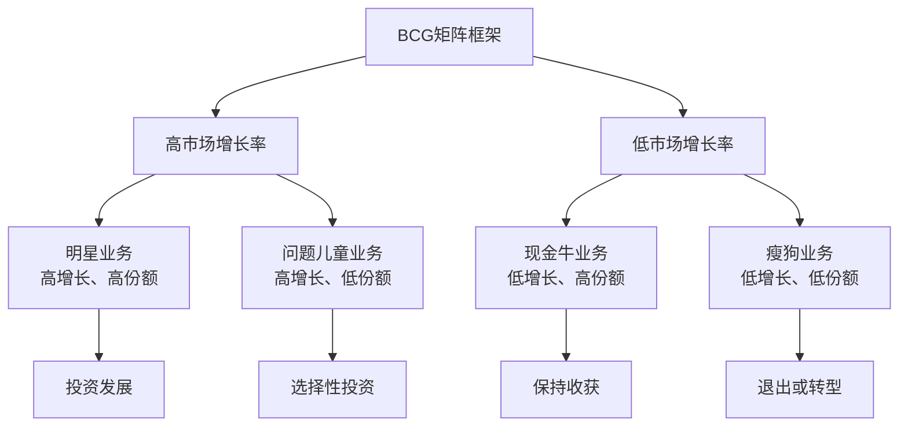

# BCG矩阵

## 🎯 BCG矩阵概述

### 基本定义
**BCG矩阵**（Boston Consulting Group Matrix）是由波士顿咨询公司开发的一种业务组合分析工具，通过分析市场增长率和相对市场份额，将组织的业务分为明星、现金牛、问题儿童和瘦狗四类，为业务组合决策和资源配置提供依据。

### 核心特征
- **二维分析**：基于市场增长率和相对市场份额
- **业务分类**：将业务分为四个象限
- **战略指导**：为每类业务提供战略建议
- **资源配置**：指导资源配置决策
- **动态分析**：考虑业务的发展变化
- **竞争导向**：以市场竞争为基础

## 🎯 BCG矩阵框架

### 1. 矩阵结构

#### BCG矩阵框架

#### 矩阵要素
- **市场增长率**：业务所在市场的年增长率
- **相对市场份额**：业务相对于最大竞争对手的市场份额
- **业务分类**：明星、现金牛、问题儿童、瘦狗
- **战略建议**：投资发展、保持收获、选择性投资、退出或转型
- **资源配置**：根据业务类型配置资源

### 2. 分析维度

#### 分析维度框架
- **市场增长率**：衡量市场发展潜力
- **相对市场份额**：衡量市场竞争地位
- **业务分类**：基于两个维度的业务分类
- **战略建议**：针对每类业务的战略建议
- **资源配置**：基于业务类型的资源配置
- **发展路径**：业务发展的可能路径

## 📊 业务分类分析

### 1. 明星业务（Stars）

#### 业务特征
- **高市场增长率**：市场增长率超过10%
- **高相对市场份额**：相对市场份额大于1.0
- **快速增长**：业务快速增长
- **市场领先**：在市场中处于领先地位

#### 业务特点
- **投资需求大**：需要大量投资维持增长
- **现金需求高**：现金需求量大
- **竞争激烈**：市场竞争激烈
- **利润潜力大**：未来利润潜力大

#### 战略建议
- **投资发展**：加大投资力度
- **市场扩张**：扩大市场份额
- **产品创新**：持续产品创新
- **竞争优势**：建立竞争优势

#### 管理要点
- **投资管理**：合理管理投资
- **增长管理**：管理业务增长
- **竞争管理**：应对市场竞争
- **利润管理**：关注未来利润

### 2. 现金牛业务（Cash Cows）

#### 业务特征
- **低市场增长率**：市场增长率低于10%
- **高相对市场份额**：相对市场份额大于1.0
- **成熟稳定**：业务成熟稳定
- **市场主导**：在市场中处于主导地位

#### 业务特点
- **投资需求小**：投资需求相对较小
- **现金产出高**：现金产出量大
- **利润稳定**：利润相对稳定
- **竞争缓和**：市场竞争相对缓和

#### 战略建议
- **保持收获**：保持现有地位
- **现金管理**：优化现金管理
- **成本控制**：控制运营成本
- **利润最大化**：最大化利润

#### 管理要点
- **现金管理**：优化现金管理
- **成本管理**：控制运营成本
- **市场管理**：维护市场地位
- **利润管理**：最大化利润

### 3. 问题儿童业务（Question Marks）

#### 业务特征
- **高市场增长率**：市场增长率超过10%
- **低相对市场份额**：相对市场份额小于1.0
- **增长潜力大**：增长潜力大
- **市场地位弱**：市场地位相对较弱

#### 业务特点
- **投资需求大**：需要大量投资
- **现金需求高**：现金需求量大
- **不确定性高**：未来发展不确定
- **风险较高**：投资风险较高

#### 战略建议
- **选择性投资**：选择性投资
- **市场分析**：深入市场分析
- **竞争分析**：分析竞争环境
- **投资决策**：谨慎投资决策

#### 管理要点
- **投资管理**：谨慎投资管理
- **风险控制**：控制投资风险
- **市场分析**：深入市场分析
- **决策管理**：谨慎决策管理

### 4. 瘦狗业务（Dogs）

#### 业务特征
- **低市场增长率**：市场增长率低于10%
- **低相对市场份额**：相对市场份额小于1.0
- **增长缓慢**：增长缓慢
- **市场地位弱**：市场地位相对较弱

#### 业务特点
- **投资需求小**：投资需求相对较小
- **现金产出低**：现金产出量小
- **利润微薄**：利润微薄
- **竞争激烈**：市场竞争激烈

#### 战略建议
- **退出或转型**：考虑退出或转型
- **成本控制**：严格控制成本
- **市场退出**：考虑市场退出
- **业务转型**：考虑业务转型

#### 管理要点
- **成本控制**：严格控制成本
- **退出管理**：管理退出过程
- **转型管理**：管理转型过程
- **资源回收**：回收投入资源

## 📈 BCG矩阵分析方法

### 1. 数据收集

#### 收集内容
- **市场数据**：收集市场增长率数据
- **份额数据**：收集市场份额数据
- **财务数据**：收集财务数据
- **竞争数据**：收集竞争对手数据

#### 收集方法
- **市场调研**：进行市场调研
- **数据分析**：分析历史数据
- **竞争分析**：分析竞争对手
- **财务分析**：分析财务数据

### 2. 指标计算

#### 计算方法
- **市场增长率**：计算市场年增长率
- **相对市场份额**：计算相对市场份额
- **业务规模**：计算业务规模
- **市场份额**：计算市场份额

#### 计算工具
- **Excel工具**：使用Excel进行计算
- **专业软件**：使用专业分析软件
- **在线工具**：使用在线分析工具
- **定制工具**：开发定制分析工具

### 3. 矩阵绘制

#### 绘制方法
- **坐标设定**：设定坐标轴
- **数据标点**：标出各业务点
- **象限划分**：划分四个象限
- **业务标注**：标注各业务

#### 绘制工具
- **Excel图表**：使用Excel绘制图表
- **专业软件**：使用专业绘图软件
- **在线工具**：使用在线绘图工具
- **手工绘制**：手工绘制矩阵图

### 4. 结果分析

#### 分析方法
- **业务分析**：分析各业务特征
- **战略分析**：分析战略建议
- **资源配置**：分析资源配置
- **发展路径**：分析发展路径

#### 分析工具
- **分析框架**：使用分析框架
- **分析模型**：使用分析模型
- **分析软件**：使用分析软件
- **分析报告**：生成分析报告

## 🎯 BCG矩阵应用策略

### 1. 投资策略

#### 投资原则
- **明星业务**：加大投资力度
- **现金牛业务**：适度投资维持
- **问题儿童业务**：选择性投资
- **瘦狗业务**：减少或停止投资

#### 投资方法
- **投资评估**：评估投资价值
- **投资决策**：制定投资决策
- **投资执行**：执行投资计划
- **投资监控**：监控投资效果

### 2. 资源配置策略

#### 配置原则
- **资源集中**：集中资源于重点业务
- **资源平衡**：平衡资源配置
- **资源优化**：优化资源配置
- **资源监控**：监控资源使用

#### 配置方法
- **资源分析**：分析资源需求
- **资源配置**：配置资源
- **资源优化**：优化资源配置
- **资源监控**：监控资源使用

### 3. 发展战略

#### 发展原则
- **明星业务**：快速发展
- **现金牛业务**：稳定发展
- **问题儿童业务**：谨慎发展
- **瘦狗业务**：转型或退出

#### 发展方法
- **发展分析**：分析发展机会
- **发展战略**：制定发展战略
- **发展执行**：执行发展计划
- **发展监控**：监控发展效果

### 4. 竞争策略

#### 竞争原则
- **明星业务**：积极竞争
- **现金牛业务**：维护地位
- **问题儿童业务**：谨慎竞争
- **瘦狗业务**：退出竞争

#### 竞争方法
- **竞争分析**：分析竞争环境
- **竞争策略**：制定竞争策略
- **竞争执行**：执行竞争策略
- **竞争监控**：监控竞争效果

## 🔄 BCG矩阵分析流程

### 1. 分析准备

#### 准备内容
- **目标确定**：确定分析目标
- **范围确定**：确定分析范围
- **团队组建**：组建分析团队
- **资源准备**：准备分析资源

#### 准备方法
- **需求分析**：分析分析需求
- **团队配置**：配置分析团队
- **资源分配**：分配分析资源
- **计划制定**：制定分析计划

### 2. 数据收集

#### 收集内容
- **市场数据**：收集市场相关数据
- **财务数据**：收集财务相关数据
- **竞争数据**：收集竞争相关数据
- **业务数据**：收集业务相关数据

#### 收集方法
- **数据来源**：确定数据来源
- **数据收集**：收集相关数据
- **数据整理**：整理收集的数据
- **数据验证**：验证数据的准确性

### 3. 矩阵分析

#### 分析内容
- **指标计算**：计算相关指标
- **矩阵绘制**：绘制BCG矩阵
- **业务分类**：进行业务分类
- **战略分析**：进行战略分析

#### 分析方法
- **定量分析**：进行定量分析
- **定性分析**：进行定性分析
- **比较分析**：进行比较分析
- **趋势分析**：进行趋势分析

### 4. 结果应用

#### 应用内容
- **战略制定**：制定业务战略
- **资源配置**：优化资源配置
- **投资决策**：制定投资决策
- **绩效改进**：改进业务绩效

#### 应用方法
- **战略实施**：实施业务战略
- **资源优化**：优化资源配置
- **投资执行**：执行投资计划
- **绩效提升**：提升业务绩效

## 📊 BCG矩阵案例

### 1. 多元化企业案例

#### 案例背景
某多元化企业拥有多个业务单元，通过BCG矩阵分析，识别出各业务单元的市场地位和发展潜力，制定了差异化的业务发展战略。

#### 分析过程
- **数据收集**：收集各业务单元的市场和财务数据
- **指标计算**：计算市场增长率和相对市场份额
- **矩阵绘制**：绘制BCG矩阵
- **业务分类**：对各业务单元进行分类

#### 分析结果
- **明星业务**：2个业务单元，加大投资
- **现金牛业务**：3个业务单元，保持收获
- **问题儿童业务**：2个业务单元，选择性投资
- **瘦狗业务**：1个业务单元，考虑退出

#### 战略实施
- **投资策略**：差异化投资策略
- **资源配置**：优化资源配置
- **发展策略**：差异化发展战略
- **绩效提升**：整体绩效显著提升

### 2. 单一业务企业案例

#### 案例背景
某单一业务企业通过BCG矩阵分析，识别出自身业务的市场地位，制定了相应的竞争策略和发展计划。

#### 分析过程
- **市场分析**：分析市场增长率和竞争环境
- **份额分析**：分析相对市场份额
- **矩阵分析**：进行BCG矩阵分析
- **策略制定**：制定相应策略

#### 分析结果
- **业务分类**：识别业务类型
- **战略建议**：制定战略建议
- **资源配置**：优化资源配置
- **发展计划**：制定发展计划

#### 战略实施
- **策略执行**：执行相应策略
- **资源优化**：优化资源配置
- **绩效改进**：改进业务绩效
- **目标达成**：达成战略目标

## 🎯 BCG矩阵最佳实践

### 1. 分析原则

#### 基本原则
- **客观性原则**：客观分析业务
- **系统性原则**：系统分析业务组合
- **动态性原则**：考虑业务发展变化
- **比较性原则**：与竞争对手比较

#### 应用原则
- **目标导向**：以战略目标为导向
- **价值导向**：以价值创造为导向
- **效率导向**：以效率提升为导向
- **竞争导向**：以竞争优势为导向

### 2. 分析方法

#### 分析方法
- **定量分析**：进行定量数据分析
- **定性分析**：进行定性分析
- **比较分析**：进行比较分析
- **趋势分析**：进行趋势分析

#### 分析工具
- **分析框架**：使用分析框架
- **分析模型**：使用分析模型
- **分析软件**：使用分析软件
- **分析报告**：生成分析报告

### 3. 实施要点

#### 实施要点
- **数据质量**：确保数据质量
- **分析深度**：确保分析深度
- **结果应用**：重视结果应用
- **持续改进**：持续改进完善

#### 注意事项
- **避免简单化**：避免分析过于简单
- **避免静态化**：避免分析静态化
- **避免孤立化**：避免分析孤立化
- **避免主观化**：避免分析主观化

## 📚 学习要点总结

### 核心概念
1. **BCG矩阵**：业务组合分析工具
2. **市场增长率**：衡量市场发展潜力
3. **相对市场份额**：衡量市场竞争地位
4. **明星业务**：高增长、高份额业务
5. **现金牛业务**：低增长、高份额业务
6. **问题儿童业务**：高增长、低份额业务
7. **瘦狗业务**：低增长、低份额业务
8. **战略建议**：针对每类业务的战略建议

### 关键理解
- BCG矩阵是业务组合分析的重要工具
- 市场增长率和相对市场份额是分析基础
- 四类业务有不同的特征和战略建议
- BCG矩阵需要动态分析和持续更新
- BCG矩阵需要结合其他分析工具使用
- BCG矩阵需要客观分析和科学决策
- BCG矩阵需要实用性和可操作性
- BCG矩阵需要持续性和改进性

### 实践应用
- 运用BCG矩阵分析业务组合
- 运用BCG矩阵制定投资策略
- 运用BCG矩阵优化资源配置
- 运用BCG矩阵制定发展战略
- 运用BCG矩阵制定竞争策略
- 运用BCG矩阵进行业务决策
- 运用BCG矩阵提升业务绩效
- 运用BCG矩阵实现战略目标

## 🔗 相关链接

- [[SWOT分析]] - SWOT分析
- [[波特五力模型]] - 波特五力模型
- [[价值链分析]] - 价值链分析
- [[平衡计分卡]] - 平衡计分卡
- [[工具实操指南-战略管理]] - 工具实操指南-战略管理

## 📚 延伸阅读

- [[战略管理]] - 战略管理理论
- [[战略分析]] - 战略分析理论
- [[业务组合管理]] - 业务组合管理理论
- [[投资决策]] - 投资决策理论

---
*更新时间：2024年*
*内容将根据学习反馈持续优化*
