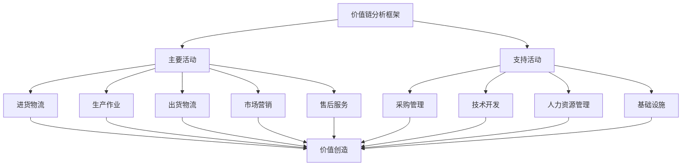

# 价值链分析

## 🎯 价值链分析概述

### 基本定义
**价值链分析**是由迈克尔·波特提出的战略分析工具，通过识别和分析组织内部价值创造过程中的各项活动，找出价值创造的关键环节和优化机会，为组织制定竞争策略提供基础。

### 核心特征
- **系统性**：系统分析价值创造过程
- **层次性**：区分主要活动和支持活动
- **价值导向**：以价值创造为核心
- **竞争导向**：以竞争优势为目标
- **优化导向**：以流程优化为重点
- **成本导向**：以成本控制为基础

## 🎯 价值链分析框架

### 1. 价值链结构

#### 价值链分析框架

#### 价值链要素
- **主要活动**：进货物流、生产作业、出货物流、市场营销、售后服务
- **支持活动**：采购管理、技术开发、人力资源管理、基础设施
- **价值创造**：通过各项活动创造价值
- **成本控制**：通过各项活动控制成本
- **竞争优势**：通过各项活动获得竞争优势

### 2. 分析维度

#### 分析维度框架
- **成本分析**：分析各活动的成本构成
- **价值分析**：分析各活动的价值贡献
- **效率分析**：分析各活动的效率水平
- **质量分析**：分析各活动的质量水平
- **创新分析**：分析各活动的创新能力
- **竞争分析**：分析各活动的竞争优势

## 🔍 主要活动分析

### 1. 进货物流

#### 活动内容
- **供应商管理**：供应商选择、评估、管理
- **采购管理**：采购计划、采购执行、采购控制
- **库存管理**：库存计划、库存控制、库存优化
- **物流管理**：运输管理、仓储管理、配送管理

#### 分析要点
- **成本分析**：进货物流成本构成和优化
- **效率分析**：进货物流效率水平和改进
- **质量分析**：进货物流质量水平和提升
- **服务分析**：进货物流服务水平和完善

#### 优化策略
- **供应商优化**：优化供应商结构和关系
- **采购优化**：优化采购流程和方式
- **库存优化**：优化库存结构和水平
- **物流优化**：优化物流网络和效率

### 2. 生产作业

#### 活动内容
- **生产计划**：生产计划制定和执行
- **生产控制**：生产过程控制和优化
- **质量管理**：产品质量管理和改进
- **设备管理**：生产设备管理和维护

#### 分析要点
- **成本分析**：生产作业成本构成和优化
- **效率分析**：生产作业效率水平和改进
- **质量分析**：生产作业质量水平和提升
- **创新分析**：生产作业创新能力和发展

#### 优化策略
- **生产优化**：优化生产流程和方式
- **质量优化**：优化质量管理体系
- **设备优化**：优化设备配置和维护
- **技术优化**：优化生产技术和工艺

### 3. 出货物流

#### 活动内容
- **订单管理**：订单接收、处理、跟踪
- **仓储管理**：成品仓储管理和优化
- **配送管理**：配送计划、执行、监控
- **客户服务**：客户服务和支持

#### 分析要点
- **成本分析**：出货物流成本构成和优化
- **效率分析**：出货物流效率水平和改进
- **质量分析**：出货物流质量水平和提升
- **服务分析**：出货物流服务水平和完善

#### 优化策略
- **订单优化**：优化订单处理流程
- **仓储优化**：优化仓储布局和管理
- **配送优化**：优化配送网络和方式
- **服务优化**：优化客户服务体系

### 4. 市场营销

#### 活动内容
- **市场研究**：市场调研和分析
- **产品开发**：产品设计和开发
- **品牌管理**：品牌建设和维护
- **销售管理**：销售计划、执行、控制

#### 分析要点
- **成本分析**：市场营销成本构成和优化
- **效果分析**：市场营销效果评估和改进
- **创新分析**：市场营销创新能力和发展
- **竞争分析**：市场营销竞争优势和提升

#### 优化策略
- **市场优化**：优化市场定位和策略
- **产品优化**：优化产品组合和开发
- **品牌优化**：优化品牌建设和推广
- **销售优化**：优化销售渠道和方式

### 5. 售后服务

#### 活动内容
- **客户支持**：客户咨询和支持服务
- **维修服务**：产品维修和保养服务
- **培训服务**：客户培训和教育服务
- **反馈管理**：客户反馈收集和处理

#### 分析要点
- **成本分析**：售后服务成本构成和优化
- **质量分析**：售后服务质量水平和提升
- **满意度分析**：客户满意度评估和改进
- **价值分析**：售后服务价值创造和提升

#### 优化策略
- **服务优化**：优化服务流程和质量
- **技术优化**：优化服务技术和工具
- **人员优化**：优化服务人员配置和培训
- **系统优化**：优化服务管理系统

## 🛠️ 支持活动分析

### 1. 采购管理

#### 活动内容
- **采购策略**：采购策略制定和执行
- **供应商管理**：供应商选择、评估、管理
- **合同管理**：采购合同管理和执行
- **成本控制**：采购成本控制和优化

#### 分析要点
- **成本分析**：采购管理成本构成和优化
- **效率分析**：采购管理效率水平和改进
- **质量分析**：采购管理质量水平和提升
- **风险分析**：采购管理风险识别和控制

#### 优化策略
- **策略优化**：优化采购策略和方式
- **供应商优化**：优化供应商结构和关系
- **合同优化**：优化合同管理和执行
- **成本优化**：优化采购成本控制

### 2. 技术开发

#### 活动内容
- **研发管理**：研发计划、执行、控制
- **技术创新**：技术创新和突破
- **技术转移**：技术转移和转化
- **知识产权**：知识产权管理和保护

#### 分析要点
- **成本分析**：技术开发成本构成和优化
- **效果分析**：技术开发效果评估和改进
- **创新分析**：技术开发创新能力和发展
- **竞争分析**：技术开发竞争优势和提升

#### 优化策略
- **研发优化**：优化研发流程和管理
- **创新优化**：优化创新机制和环境
- **技术优化**：优化技术转移和转化
- **保护优化**：优化知识产权保护

### 3. 人力资源管理

#### 活动内容
- **人才招聘**：人才招聘和选拔
- **人才培养**：人才培养和发展
- **绩效管理**：绩效管理和激励
- **组织发展**：组织发展和变革

#### 分析要点
- **成本分析**：人力资源管理成本构成和优化
- **效果分析**：人力资源管理效果评估和改进
- **能力分析**：人力资源能力水平和提升
- **文化分析**：组织文化建设和发展

#### 优化策略
- **招聘优化**：优化人才招聘和选拔
- **培养优化**：优化人才培养和发展
- **绩效优化**：优化绩效管理和激励
- **组织优化**：优化组织发展和变革

### 4. 基础设施

#### 活动内容
- **财务管理**：财务规划、控制、分析
- **信息系统**：信息系统建设和管理
- **法律事务**：法律事务处理和管理
- **行政管理**：行政事务处理和管理

#### 分析要点
- **成本分析**：基础设施成本构成和优化
- **效率分析**：基础设施效率水平和改进
- **质量分析**：基础设施质量水平和提升
- **风险分析**：基础设施风险识别和控制

#### 优化策略
- **财务优化**：优化财务管理和控制
- **信息优化**：优化信息系统建设
- **法律优化**：优化法律事务管理
- **行政优化**：优化行政事务管理

## 📊 价值链分析方法

### 1. 成本分析

#### 分析方法
- **成本分解**：将总成本分解到各项活动
- **成本比较**：与竞争对手进行成本比较
- **成本趋势**：分析成本变化趋势
- **成本优化**：识别成本优化机会

#### 分析工具
- **成本核算**：活动成本核算方法
- **成本控制**：成本控制工具和技术
- **成本优化**：成本优化工具和技术
- **成本监控**：成本监控工具和技术

### 2. 价值分析

#### 分析方法
- **价值识别**：识别各活动的价值贡献
- **价值测量**：测量各活动的价值大小
- **价值比较**：比较各活动的价值贡献
- **价值优化**：优化各活动的价值创造

#### 分析工具
- **价值评估**：价值评估工具和方法
- **价值测量**：价值测量工具和技术
- **价值优化**：价值优化工具和技术
- **价值监控**：价值监控工具和技术

### 3. 效率分析

#### 分析方法
- **效率测量**：测量各活动的效率水平
- **效率比较**：与竞争对手进行效率比较
- **效率趋势**：分析效率变化趋势
- **效率优化**：识别效率优化机会

#### 分析工具
- **效率指标**：效率指标体系和工具
- **效率分析**：效率分析工具和技术
- **效率优化**：效率优化工具和技术
- **效率监控**：效率监控工具和技术

### 4. 竞争分析

#### 分析方法
- **竞争识别**：识别各活动的竞争优势
- **竞争比较**：与竞争对手进行比较
- **竞争趋势**：分析竞争变化趋势
- **竞争优化**：优化各活动的竞争优势

#### 分析工具
- **竞争分析**：竞争分析工具和方法
- **基准分析**：基准分析工具和技术
- **竞争优化**：竞争优化工具和技术
- **竞争监控**：竞争监控工具和技术

## 🎯 价值链优化策略

### 1. 成本优化

#### 优化策略
- **成本控制**：建立成本控制体系
- **成本削减**：识别和实施成本削减措施
- **成本效率**：提高成本使用效率
- **成本创新**：通过创新降低成本

#### 实施方法
- **成本分析**：深入分析成本构成
- **成本目标**：设定成本控制目标
- **成本措施**：制定成本控制措施
- **成本监控**：建立成本监控机制

### 2. 价值优化

#### 优化策略
- **价值提升**：提升各活动的价值贡献
- **价值创新**：通过创新创造新价值
- **价值整合**：整合各活动的价值创造
- **价值传递**：优化价值传递给客户

#### 实施方法
- **价值分析**：分析各活动的价值贡献
- **价值目标**：设定价值提升目标
- **价值措施**：制定价值提升措施
- **价值监控**：建立价值监控机制

### 3. 效率优化

#### 优化策略
- **流程优化**：优化各活动的流程
- **技术优化**：通过技术提升效率
- **管理优化**：优化管理方式和方法
- **创新优化**：通过创新提升效率

#### 实施方法
- **效率分析**：分析各活动的效率水平
- **效率目标**：设定效率提升目标
- **效率措施**：制定效率提升措施
- **效率监控**：建立效率监控机制

### 4. 竞争优化

#### 优化策略
- **差异化**：通过差异化获得竞争优势
- **成本领先**：通过成本领先获得竞争优势
- **集中化**：通过集中化获得竞争优势
- **创新化**：通过创新获得竞争优势

#### 实施方法
- **竞争分析**：分析各活动的竞争优势
- **竞争目标**：设定竞争优化目标
- **竞争措施**：制定竞争优化措施
- **竞争监控**：建立竞争监控机制

## 🔄 价值链分析流程

### 1. 分析准备

#### 准备内容
- **目标确定**：确定分析目标和范围
- **团队组建**：组建分析团队
- **资源准备**：准备分析资源
- **计划制定**：制定分析计划

#### 准备方法
- **需求分析**：分析分析需求
- **团队配置**：配置分析团队
- **资源分配**：分配分析资源
- **计划执行**：执行分析计划

### 2. 数据收集

#### 收集内容
- **内部数据**：收集内部运营数据
- **外部数据**：收集外部市场数据
- **竞争数据**：收集竞争对手数据
- **行业数据**：收集行业基准数据

#### 收集方法
- **数据来源**：确定数据来源
- **数据收集**：收集相关数据
- **数据整理**：整理收集的数据
- **数据验证**：验证数据的准确性

### 3. 活动分析

#### 分析内容
- **活动识别**：识别各项活动
- **活动分析**：分析各项活动
- **活动评估**：评估各项活动
- **活动优化**：优化各项活动

#### 分析方法
- **定性分析**：进行定性分析
- **定量分析**：进行定量分析
- **比较分析**：进行比较分析
- **趋势分析**：进行趋势分析

### 4. 结果应用

#### 应用内容
- **策略制定**：制定竞争策略
- **流程优化**：优化业务流程
- **资源配置**：优化资源配置
- **绩效改进**：改进组织绩效

#### 应用方法
- **策略实施**：实施竞争策略
- **流程改进**：改进业务流程
- **资源优化**：优化资源配置
- **绩效提升**：提升组织绩效

## 📈 价值链分析案例

### 1. 制造业价值链分析

#### 案例背景
某制造企业通过价值链分析，识别出生产作业环节存在效率低下问题，通过优化生产流程和引入先进技术，显著提升了生产效率和产品质量。

#### 分析过程
- **活动识别**：识别制造企业的主要活动和支持活动
- **成本分析**：分析各活动的成本构成
- **效率分析**：分析各活动的效率水平
- **优化识别**：识别生产作业的优化机会

#### 优化结果
- **效率提升**：生产效率提升30%
- **质量改善**：产品质量显著改善
- **成本降低**：生产成本降低15%
- **竞争优势**：获得成本领先优势

### 2. 服务业价值链分析

#### 案例背景
某服务企业通过价值链分析，发现客户服务环节存在服务质量不稳定问题，通过优化服务流程和提升服务人员能力，显著提升了客户满意度。

#### 分析过程
- **活动识别**：识别服务企业的主要活动和支持活动
- **价值分析**：分析各活动的价值贡献
- **质量分析**：分析各活动的质量水平
- **优化识别**：识别客户服务的优化机会

#### 优化结果
- **质量提升**：服务质量显著提升
- **满意度提升**：客户满意度提升25%
- **价值创造**：客户价值创造能力增强
- **竞争优势**：获得差异化优势

## 🎯 价值链分析最佳实践

### 1. 分析原则

#### 基本原则
- **系统性原则**：系统分析价值链
- **客观性原则**：客观分析各项活动
- **动态性原则**：考虑价值链的动态变化
- **比较性原则**：与竞争对手进行比较

#### 应用原则
- **目标导向**：以战略目标为导向
- **价值导向**：以价值创造为导向
- **效率导向**：以效率提升为导向
- **竞争导向**：以竞争优势为导向

### 2. 分析方法

#### 分析方法
- **定量分析**：进行定量数据分析
- **定性分析**：进行定性分析
- **比较分析**：进行比较分析
- **趋势分析**：进行趋势分析

#### 分析工具
- **成本分析工具**：成本分析工具和技术
- **价值分析工具**：价值分析工具和技术
- **效率分析工具**：效率分析工具和技术
- **竞争分析工具**：竞争分析工具和技术

### 3. 实施要点

#### 实施要点
- **团队协作**：加强团队协作
- **数据质量**：确保数据质量
- **分析深度**：确保分析深度
- **结果应用**：重视结果应用

#### 注意事项
- **避免表面化**：避免分析表面化
- **避免静态化**：避免分析静态化
- **避免孤立化**：避免分析孤立化
- **避免主观化**：避免分析主观化

## 📚 学习要点总结

### 核心概念
1. **价值链分析**：分析组织价值创造过程的工具
2. **主要活动**：进货物流、生产作业、出货物流、市场营销、售后服务
3. **支持活动**：采购管理、技术开发、人力资源管理、基础设施
4. **价值创造**：通过各项活动创造价值
5. **竞争优势**：通过价值链优化获得竞争优势
6. **成本控制**：通过价值链分析控制成本
7. **效率提升**：通过价值链分析提升效率
8. **质量改善**：通过价值链分析改善质量

### 关键理解
- 价值链分析是战略分析的重要工具
- 主要活动是价值创造的核心环节
- 支持活动是价值创造的重要支撑
- 价值链分析需要系统性和全面性
- 价值链分析需要动态性和比较性
- 价值链分析需要客观性和科学性
- 价值链分析需要实用性和可操作性
- 价值链分析需要持续性和改进性

### 实践应用
- 运用价值链分析识别价值创造环节
- 运用价值链分析优化业务流程
- 运用价值链分析控制运营成本
- 运用价值链分析提升运营效率
- 运用价值链分析改善产品质量
- 运用价值链分析增强竞争优势
- 运用价值链分析制定竞争策略
- 运用价值链分析实现战略目标

## 🔗 相关链接

- [[SWOT分析]] - SWOT分析
- [[波特五力模型]] - 波特五力模型
- [[BCG矩阵]] - BCG矩阵
- [[平衡计分卡]] - 平衡计分卡
- [[工具实操指南-战略管理]] - 工具实操指南-战略管理

## 📚 延伸阅读

- [[战略管理]] - 战略管理理论
- [[战略分析]] - 战略分析理论
- [[竞争战略]] - 竞争战略理论
- [[运营管理]] - 运营管理理论

---
*更新时间：2024年*
*内容将根据学习反馈持续优化*
