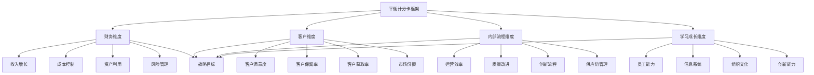

# 平衡计分卡

## 🎯 平衡计分卡概述

### 基本定义
**平衡计分卡**（Balanced Scorecard，BSC）是由罗伯特·卡普兰和大卫·诺顿提出的一种战略管理和绩效评估工具，通过财务、客户、内部流程、学习成长四个维度，全面评估组织绩效和战略执行情况，实现战略目标的有效管理。

### 核心特征
- **平衡性**：平衡财务与非财务指标
- **战略性**：与组织战略紧密结合
- **全面性**：涵盖四个关键维度
- **因果性**：体现指标间的因果关系
- **可操作性**：具有可操作性和可测量性
- **动态性**：支持动态调整和持续改进

## 🎯 平衡计分卡框架

### 1. 四维框架

#### 平衡计分卡框架

#### 框架要素
- **财务维度**：收入增长、成本控制、资产利用、风险管理
- **客户维度**：客户满意度、客户保留率、客户获取率、市场份额
- **内部流程维度**：运营效率、质量改进、创新流程、供应链管理
- **学习成长维度**：员工能力、信息系统、组织文化、创新能力
- **战略目标**：通过四个维度实现战略目标

### 2. 因果关系

#### 因果关系链
- **学习成长** → **内部流程** → **客户** → **财务**
- **员工能力提升** → **流程改进** → **客户满意** → **财务增长**
- **信息系统完善** → **运营效率提升** → **客户价值** → **收入增长**
- **组织文化优化** → **创新流程** → **客户体验** → **市场份额**

## 📊 财务维度

### 1. 财务目标

#### 目标类型
- **收入增长目标**：销售收入增长、市场份额扩大
- **成本控制目标**：成本降低、效率提升
- **资产利用目标**：资产回报率、投资回报率
- **风险管理目标**：风险控制、财务稳定

#### 目标设定
- **目标分析**：分析财务目标需求
- **目标制定**：制定具体财务目标
- **目标分解**：分解到各部门和个人
- **目标监控**：监控目标达成情况

### 2. 财务指标

#### 指标类型
- **收入指标**：销售收入、收入增长率、市场份额
- **成本指标**：总成本、成本降低率、成本结构
- **利润指标**：净利润、利润率、投资回报率
- **资产指标**：资产回报率、资产周转率、资产利用率

#### 指标管理
- **指标选择**：选择关键财务指标
- **指标设定**：设定指标目标值
- **指标监控**：监控指标变化
- **指标分析**：分析指标趋势

### 3. 财务策略

#### 策略类型
- **增长策略**：市场扩张、产品创新
- **成本策略**：成本控制、效率提升
- **投资策略**：投资优化、资产配置
- **风险策略**：风险控制、财务稳定

#### 策略实施
- **策略制定**：制定财务策略
- **策略执行**：执行财务策略
- **策略监控**：监控策略效果
- **策略调整**：调整财务策略

## 👥 客户维度

### 1. 客户目标

#### 目标类型
- **客户满意度目标**：提升客户满意度
- **客户保留目标**：提高客户保留率
- **客户获取目标**：增加新客户数量
- **市场份额目标**：扩大市场份额

#### 目标设定
- **客户分析**：分析客户需求
- **目标制定**：制定客户目标
- **目标分解**：分解到各部门
- **目标监控**：监控目标达成

### 2. 客户指标

#### 指标类型
- **满意度指标**：客户满意度、净推荐值
- **保留指标**：客户保留率、客户流失率
- **获取指标**：新客户数量、客户获取成本
- **价值指标**：客户生命周期价值、客户贡献

#### 指标管理
- **指标选择**：选择关键客户指标
- **指标设定**：设定指标目标值
- **指标监控**：监控指标变化
- **指标分析**：分析指标趋势

### 3. 客户策略

#### 策略类型
- **客户细分策略**：客户细分、精准营销
- **客户服务策略**：服务提升、体验优化
- **客户关系策略**：关系维护、价值创造
- **客户创新策略**：产品创新、服务创新

#### 策略实施
- **策略制定**：制定客户策略
- **策略执行**：执行客户策略
- **策略监控**：监控策略效果
- **策略调整**：调整客户策略

## ⚙️ 内部流程维度

### 1. 流程目标

#### 目标类型
- **运营效率目标**：提升运营效率
- **质量改进目标**：改善产品质量
- **创新流程目标**：优化创新流程
- **供应链目标**：优化供应链管理

#### 目标设定
- **流程分析**：分析内部流程
- **目标制定**：制定流程目标
- **目标分解**：分解到各部门
- **目标监控**：监控目标达成

### 2. 流程指标

#### 指标类型
- **效率指标**：流程效率、处理时间
- **质量指标**：产品质量、服务质量
- **创新指标**：创新数量、创新成功率
- **供应链指标**：供应链效率、库存周转

#### 指标管理
- **指标选择**：选择关键流程指标
- **指标设定**：设定指标目标值
- **指标监控**：监控指标变化
- **指标分析**：分析指标趋势

### 3. 流程策略

#### 策略类型
- **流程优化策略**：流程改进、效率提升
- **质量管理策略**：质量提升、标准建立
- **创新管理策略**：创新激励、创新流程
- **供应链策略**：供应链优化、合作伙伴

#### 策略实施
- **策略制定**：制定流程策略
- **策略执行**：执行流程策略
- **策略监控**：监控策略效果
- **策略调整**：调整流程策略

## 📚 学习成长维度

### 1. 学习目标

#### 目标类型
- **员工能力目标**：提升员工能力
- **信息系统目标**：完善信息系统
- **组织文化目标**：优化组织文化
- **创新能力目标**：增强创新能力

#### 目标设定
- **能力分析**：分析员工能力需求
- **目标制定**：制定学习目标
- **目标分解**：分解到各部门
- **目标监控**：监控目标达成

### 2. 学习指标

#### 指标类型
- **能力指标**：员工技能、培训完成率
- **系统指标**：系统使用率、系统满意度
- **文化指标**：员工满意度、文化认同度
- **创新指标**：创新项目、专利申请

#### 指标管理
- **指标选择**：选择关键学习指标
- **指标设定**：设定指标目标值
- **指标监控**：监控指标变化
- **指标分析**：分析指标趋势

### 3. 学习策略

#### 策略类型
- **人才培养策略**：培训体系、能力建设
- **信息系统策略**：系统建设、技术升级
- **文化建设策略**：文化塑造、价值观
- **创新激励策略**：创新环境、激励机制

#### 策略实施
- **策略制定**：制定学习策略
- **策略执行**：执行学习策略
- **策略监控**：监控策略效果
- **策略调整**：调整学习策略

## 🎯 平衡计分卡实施

### 1. 实施准备

#### 准备内容
- **战略梳理**：梳理组织战略
- **团队组建**：组建实施团队
- **资源准备**：准备实施资源
- **计划制定**：制定实施计划

#### 准备方法
- **战略分析**：分析组织战略
- **团队配置**：配置实施团队
- **资源分配**：分配实施资源
- **计划执行**：执行实施计划

### 2. 指标设计

#### 设计内容
- **指标选择**：选择关键指标
- **目标设定**：设定指标目标
- **权重分配**：分配指标权重
- **标准制定**：制定评价标准

#### 设计方法
- **需求分析**：分析指标需求
- **指标筛选**：筛选关键指标
- **目标确定**：确定指标目标
- **标准建立**：建立评价标准

### 3. 系统建设

#### 建设内容
- **系统设计**：设计计分卡系统
- **系统开发**：开发计分卡系统
- **系统测试**：测试系统功能
- **系统部署**：部署计分卡系统

#### 建设方法
- **需求分析**：分析系统需求
- **系统设计**：设计系统架构
- **系统开发**：开发系统功能
- **系统测试**：测试系统性能

### 4. 运行管理

#### 管理内容
- **数据收集**：收集指标数据
- **数据分析**：分析指标数据
- **报告生成**：生成分析报告
- **决策支持**：支持管理决策

#### 管理方法
- **数据管理**：管理指标数据
- **分析管理**：管理数据分析
- **报告管理**：管理分析报告
- **决策管理**：管理决策支持

## 📈 平衡计分卡应用

### 1. 战略管理

#### 应用内容
- **战略制定**：制定组织战略
- **战略执行**：执行组织战略
- **战略监控**：监控战略执行
- **战略调整**：调整组织战略

#### 应用方法
- **战略分析**：分析战略环境
- **战略规划**：规划战略实施
- **战略监控**：监控战略进展
- **战略评估**：评估战略效果

### 2. 绩效管理

#### 应用内容
- **绩效目标**：设定绩效目标
- **绩效评估**：评估绩效表现
- **绩效改进**：改进绩效水平
- **绩效激励**：激励绩效提升

#### 应用方法
- **目标设定**：设定绩效目标
- **评估实施**：实施绩效评估
- **改进措施**：制定改进措施
- **激励机制**：建立激励机制

### 3. 组织管理

#### 应用内容
- **组织设计**：设计组织结构
- **流程优化**：优化组织流程
- **文化建设**：建设组织文化
- **能力建设**：建设组织能力

#### 应用方法
- **设计分析**：分析组织设计
- **流程分析**：分析组织流程
- **文化分析**：分析组织文化
- **能力分析**：分析组织能力

### 4. 决策支持

#### 应用内容
- **决策分析**：分析决策需求
- **信息支持**：提供决策信息
- **方案评估**：评估决策方案
- **效果监控**：监控决策效果

#### 应用方法
- **需求分析**：分析决策需求
- **信息收集**：收集决策信息
- **方案制定**：制定决策方案
- **效果评估**：评估决策效果

## 🔄 平衡计分卡流程

### 1. 设计阶段

#### 设计内容
- **战略分析**：分析组织战略
- **维度设计**：设计四个维度
- **指标设计**：设计关键指标
- **目标设定**：设定指标目标

#### 设计方法
- **战略梳理**：梳理组织战略
- **维度确定**：确定四个维度
- **指标筛选**：筛选关键指标
- **目标确定**：确定指标目标

### 2. 实施阶段

#### 实施内容
- **系统建设**：建设计分卡系统
- **数据收集**：收集指标数据
- **分析报告**：生成分析报告
- **决策支持**：支持管理决策

#### 实施方法
- **系统开发**：开发计分卡系统
- **数据管理**：管理指标数据
- **报告生成**：生成分析报告
- **决策支持**：支持管理决策

### 3. 监控阶段

#### 监控内容
- **指标监控**：监控指标变化
- **目标监控**：监控目标达成
- **效果监控**：监控实施效果
- **问题监控**：监控实施问题

#### 监控方法
- **数据监控**：监控指标数据
- **目标跟踪**：跟踪目标达成
- **效果评估**：评估实施效果
- **问题识别**：识别实施问题

### 4. 改进阶段

#### 改进内容
- **指标改进**：改进指标设计
- **目标改进**：改进目标设定
- **流程改进**：改进实施流程
- **系统改进**：改进计分卡系统

#### 改进方法
- **问题分析**：分析实施问题
- **改进方案**：制定改进方案
- **改进实施**：实施改进措施
- **效果评估**：评估改进效果

## 📊 平衡计分卡案例

### 1. 制造业企业案例

#### 案例背景
某制造企业通过平衡计分卡，建立了全面的绩效管理体系，实现了战略目标的有效管理和组织绩效的显著提升。

#### 实施过程
- **战略分析**：分析企业战略和目标
- **维度设计**：设计四个维度指标
- **目标设定**：设定各维度目标
- **系统建设**：建设计分卡系统

#### 实施结果
- **财务维度**：收入增长20%，成本降低15%
- **客户维度**：客户满意度提升25%
- **内部流程**：运营效率提升30%
- **学习成长**：员工能力显著提升

#### 成功因素
- **高层支持**：获得高层管理支持
- **全员参与**：全员参与实施过程
- **系统完善**：建立完善的系统
- **持续改进**：持续改进完善

### 2. 服务业企业案例

#### 案例背景
某服务企业通过平衡计分卡，优化了服务流程，提升了客户满意度，实现了业务增长和利润提升。

#### 实施过程
- **客户分析**：分析客户需求和期望
- **流程分析**：分析内部服务流程
- **指标设计**：设计服务相关指标
- **目标设定**：设定服务目标

#### 实施结果
- **客户满意度**：客户满意度提升30%
- **服务效率**：服务效率提升25%
- **员工满意度**：员工满意度提升20%
- **业务增长**：业务收入增长15%

#### 成功因素
- **客户导向**：以客户为中心
- **流程优化**：优化服务流程
- **员工培训**：加强员工培训
- **系统支持**：完善系统支持

## 🎯 平衡计分卡最佳实践

### 1. 设计原则

#### 基本原则
- **战略导向**：以战略目标为导向
- **平衡性**：平衡四个维度
- **可操作性**：具有可操作性
- **可测量性**：具有可测量性

#### 应用原则
- **目标导向**：以目标实现为导向
- **价值导向**：以价值创造为导向
- **效率导向**：以效率提升为导向
- **创新导向**：以创新发展为导向

### 2. 实施要点

#### 实施要点
- **高层支持**：获得高层管理支持
- **全员参与**：全员参与实施过程
- **系统完善**：建立完善的系统
- **持续改进**：持续改进完善

#### 注意事项
- **避免复杂化**：避免指标过于复杂
- **避免静态化**：避免指标静态化
- **避免孤立化**：避免指标孤立化
- **避免主观化**：避免指标主观化

### 3. 管理要点

#### 管理要点
- **数据质量**：确保数据质量
- **分析深度**：确保分析深度
- **结果应用**：重视结果应用
- **持续改进**：持续改进完善

#### 管理方法
- **数据管理**：建立数据管理体系
- **分析管理**：建立分析管理体系
- **应用管理**：建立应用管理体系
- **改进管理**：建立改进管理体系

## 📚 学习要点总结

### 核心概念
1. **平衡计分卡**：战略管理和绩效评估工具
2. **财务维度**：收入增长、成本控制、资产利用、风险管理
3. **客户维度**：客户满意度、客户保留率、客户获取率、市场份额
4. **内部流程维度**：运营效率、质量改进、创新流程、供应链管理
5. **学习成长维度**：员工能力、信息系统、组织文化、创新能力
6. **因果关系**：四个维度间的因果关系
7. **战略管理**：通过计分卡管理战略
8. **绩效评估**：通过计分卡评估绩效

### 关键理解
- 平衡计分卡是战略管理的重要工具
- 四个维度相互关联，形成因果关系
- 财务维度是最终目标，其他维度是驱动因素
- 平衡计分卡需要与组织战略紧密结合
- 平衡计分卡需要全员参与和持续改进
- 平衡计分卡需要完善的数据和系统支持
- 平衡计分卡需要动态调整和优化
- 平衡计分卡需要有效的实施和管理

### 实践应用
- 运用平衡计分卡制定战略目标
- 运用平衡计分卡设计绩效指标
- 运用平衡计分卡评估组织绩效
- 运用平衡计分卡管理战略执行
- 运用平衡计分卡优化业务流程
- 运用平衡计分卡提升组织能力
- 运用平衡计分卡支持管理决策
- 运用平衡计分卡实现战略目标

## 🔗 相关链接

- [[SWOT分析]] - SWOT分析
- [[波特五力模型]] - 波特五力模型
- [[价值链分析]] - 价值链分析
- [[BCG矩阵]] - BCG矩阵
- [[工具实操指南-战略管理]] - 工具实操指南-战略管理

## 📚 延伸阅读

- [[战略管理]] - 战略管理理论
- [[绩效管理]] - 绩效管理理论
- [[组织管理]] - 组织管理理论
- [[决策支持系统]] - 决策支持系统理论

---
*更新时间：2024年*
*内容将根据学习反馈持续优化*
