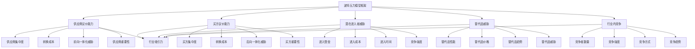

# 波特五力模型

## 🎯 波特五力模型概述

### 基本定义
**波特五力模型**（Porter's Five Forces Model）是由迈克尔·波特提出的行业竞争分析工具，通过分析供应商议价能力、买方议价能力、潜在进入者威胁、替代品威胁和行业内竞争五个力量，评估行业吸引力和竞争强度，为战略制定提供基础。

### 核心特征
- **系统性**：系统分析行业竞争环境
- **结构性**：基于行业结构分析
- **动态性**：考虑竞争力量的变化
- **战略性**：为战略制定提供依据
- **比较性**：支持行业间比较分析
- **预测性**：预测行业发展趋势

## 🎯 波特五力模型框架

### 1. 五力框架

#### 波特五力模型框架

#### 五力要素
- **供应商议价能力**：供应商对行业的影响能力
- **买方议价能力**：买方对行业的影响能力
- **潜在进入者威胁**：新进入者对行业的威胁
- **替代品威胁**：替代品对行业的威胁
- **行业内竞争**：行业内现有竞争者间的竞争
- **行业吸引力**：综合五力评估的行业吸引力

### 2. 分析维度

#### 分析维度框架
- **力量强度**：各竞争力量的强度分析
- **影响因素**：影响各力量的因素分析
- **变化趋势**：各力量的变化趋势分析
- **战略影响**：各力量对战略的影响分析
- **应对策略**：针对各力量的应对策略
- **行业评估**：基于五力的行业评估

## 🏭 供应商议价能力

### 1. 能力分析

#### 能力要素
- **供应商集中度**：供应商市场集中程度
- **转换成本**：更换供应商的成本
- **前向一体化威胁**：供应商前向一体化威胁
- **供应商重要性**：供应商对行业的重要性

#### 能力评估
- **集中度评估**：评估供应商市场集中度
- **成本评估**：评估转换供应商成本
- **威胁评估**：评估前向一体化威胁
- **重要性评估**：评估供应商重要性

### 2. 影响因素

#### 影响要素
- **市场结构**：供应商市场结构
- **产品特性**：供应商产品特性
- **技术壁垒**：供应商技术壁垒
- **资源稀缺性**：供应商资源稀缺性

#### 影响分析
- **结构分析**：分析供应商市场结构
- **特性分析**：分析供应商产品特性
- **壁垒分析**：分析供应商技术壁垒
- **稀缺性分析**：分析供应商资源稀缺性

### 3. 应对策略

#### 策略类型
- **供应商多元化**：多元化供应商选择
- **供应商关系**：建立良好供应商关系
- **垂直整合**：考虑垂直整合
- **替代方案**：寻找替代方案

#### 策略实施
- **多元化实施**：实施供应商多元化
- **关系建设**：建设供应商关系
- **整合考虑**：考虑垂直整合
- **替代开发**：开发替代方案

## 🛒 买方议价能力

### 1. 能力分析

#### 能力要素
- **买方集中度**：买方市场集中程度
- **转换成本**：更换供应商的成本
- **后向一体化威胁**：买方后向一体化威胁
- **买方重要性**：买方对行业的重要性

#### 能力评估
- **集中度评估**：评估买方市场集中度
- **成本评估**：评估转换供应商成本
- **威胁评估**：评估后向一体化威胁
- **重要性评估**：评估买方重要性

### 2. 影响因素

#### 影响要素
- **市场结构**：买方市场结构
- **产品特性**：买方产品特性
- **技术能力**：买方技术能力
- **财务实力**：买方财务实力

#### 影响分析
- **结构分析**：分析买方市场结构
- **特性分析**：分析买方产品特性
- **能力分析**：分析买方技术能力
- **实力分析**：分析买方财务实力

### 3. 应对策略

#### 策略类型
- **客户多元化**：多元化客户选择
- **客户关系**：建立良好客户关系
- **产品差异化**：实现产品差异化
- **价值创造**：为客户创造价值

#### 策略实施
- **多元化实施**：实施客户多元化
- **关系建设**：建设客户关系
- **差异化实施**：实施产品差异化
- **价值创造**：为客户创造价值

## 🚪 潜在进入者威胁

### 1. 威胁分析

#### 威胁要素
- **进入壁垒**：行业进入壁垒高度
- **进入成本**：进入行业的成本
- **进入时间**：进入行业的时间
- **竞争强度**：进入后的竞争强度

#### 威胁评估
- **壁垒评估**：评估进入壁垒高度
- **成本评估**：评估进入成本
- **时间评估**：评估进入时间
- **强度评估**：评估竞争强度

### 2. 影响因素

#### 影响要素
- **资本要求**：进入的资本要求
- **技术壁垒**：技术壁垒高度
- **政策壁垒**：政策壁垒高度
- **品牌壁垒**：品牌壁垒高度

#### 影响分析
- **资本分析**：分析资本要求
- **技术分析**：分析技术壁垒
- **政策分析**：分析政策壁垒
- **品牌分析**：分析品牌壁垒

### 3. 应对策略

#### 策略类型
- **壁垒建设**：建设进入壁垒
- **成本优势**：建立成本优势
- **技术领先**：保持技术领先
- **品牌建设**：加强品牌建设

#### 策略实施
- **壁垒建设**：建设进入壁垒
- **成本控制**：控制成本优势
- **技术发展**：发展技术领先
- **品牌推广**：推广品牌建设

## 🔄 替代品威胁

### 1. 威胁分析

#### 威胁要素
- **替代品性能**：替代品性能水平
- **替代品价格**：替代品价格水平
- **替代品趋势**：替代品发展趋势
- **替代品威胁**：替代品威胁程度

#### 威胁评估
- **性能评估**：评估替代品性能
- **价格评估**：评估替代品价格
- **趋势评估**：评估替代品趋势
- **威胁评估**：评估替代品威胁

### 2. 影响因素

#### 影响要素
- **技术发展**：相关技术发展
- **消费者偏好**：消费者偏好变化
- **成本变化**：替代品成本变化
- **政策支持**：政策支持程度

#### 影响分析
- **技术分析**：分析技术发展
- **偏好分析**：分析消费者偏好
- **成本分析**：分析成本变化
- **政策分析**：分析政策支持

### 3. 应对策略

#### 策略类型
- **产品创新**：持续产品创新
- **成本控制**：控制产品成本
- **差异化**：实现产品差异化
- **价值提升**：提升产品价值

#### 策略实施
- **创新实施**：实施产品创新
- **成本控制**：控制产品成本
- **差异化实施**：实施产品差异化
- **价值提升**：提升产品价值

## ⚔️ 行业内竞争

### 1. 竞争分析

#### 竞争要素
- **竞争者数量**：行业内竞争者数量
- **竞争强度**：行业竞争强度
- **竞争方式**：行业竞争方式
- **竞争趋势**：行业竞争趋势

#### 竞争评估
- **数量评估**：评估竞争者数量
- **强度评估**：评估竞争强度
- **方式评估**：评估竞争方式
- **趋势评估**：评估竞争趋势

### 2. 影响因素

#### 影响要素
- **市场增长**：市场增长速度
- **产品差异化**：产品差异化程度
- **退出壁垒**：退出壁垒高度
- **战略重要性**：战略重要性

#### 影响分析
- **增长分析**：分析市场增长
- **差异化分析**：分析产品差异化
- **壁垒分析**：分析退出壁垒
- **重要性分析**：分析战略重要性

### 3. 应对策略

#### 策略类型
- **差异化竞争**：实现差异化竞争
- **成本领先**：建立成本领先
- **集中化**：实施集中化战略
- **合作竞争**：实施合作竞争

#### 策略实施
- **差异化实施**：实施差异化竞争
- **成本控制**：控制成本领先
- **集中化实施**：实施集中化战略
- **合作实施**：实施合作竞争

## 📊 波特五力模型分析方法

### 1. 数据收集

#### 收集内容
- **行业数据**：收集行业相关数据
- **竞争数据**：收集竞争对手数据
- **市场数据**：收集市场相关数据
- **政策数据**：收集政策相关数据

#### 收集方法
- **市场调研**：进行市场调研
- **数据分析**：分析历史数据
- **竞争分析**：分析竞争对手
- **政策分析**：分析政策环境

### 2. 力量评估

#### 评估方法
- **定量评估**：进行定量评估
- **定性评估**：进行定性评估
- **比较评估**：进行比较评估
- **趋势评估**：进行趋势评估

#### 评估工具
- **评估框架**：使用评估框架
- **评估模型**：使用评估模型
- **评估软件**：使用评估软件
- **评估报告**：生成评估报告

### 3. 综合分析

#### 分析方法
- **力量分析**：分析各竞争力量
- **影响分析**：分析各力量影响
- **趋势分析**：分析各力量趋势
- **策略分析**：分析应对策略

#### 分析工具
- **分析框架**：使用分析框架
- **分析模型**：使用分析模型
- **分析软件**：使用分析软件
- **分析报告**：生成分析报告

### 4. 结果应用

#### 应用内容
- **战略制定**：制定竞争战略
- **投资决策**：制定投资决策
- **市场进入**：制定市场进入策略
- **竞争应对**：制定竞争应对策略

#### 应用方法
- **战略实施**：实施竞争战略
- **投资执行**：执行投资决策
- **市场进入**：执行市场进入策略
- **竞争应对**：执行竞争应对策略

## 🎯 波特五力模型应用策略

### 1. 行业分析

#### 分析策略
- **行业评估**：评估行业吸引力
- **竞争分析**：分析行业竞争
- **趋势分析**：分析行业趋势
- **机会分析**：分析行业机会

#### 分析方法
- **五力分析**：进行五力分析
- **竞争分析**：进行竞争分析
- **趋势分析**：进行趋势分析
- **机会分析**：进行机会分析

### 2. 战略制定

#### 制定策略
- **竞争战略**：制定竞争战略
- **差异化战略**：制定差异化战略
- **成本领先战略**：制定成本领先战略
- **集中化战略**：制定集中化战略

#### 制定方法
- **战略分析**：进行战略分析
- **战略选择**：选择战略类型
- **战略规划**：规划战略实施
- **战略监控**：监控战略执行

### 3. 投资决策

#### 决策策略
- **投资评估**：评估投资价值
- **风险分析**：分析投资风险
- **收益分析**：分析投资收益
- **时机分析**：分析投资时机

#### 决策方法
- **价值评估**：评估投资价值
- **风险评估**：评估投资风险
- **收益评估**：评估投资收益
- **时机评估**：评估投资时机

### 4. 竞争应对

#### 应对策略
- **竞争分析**：分析竞争环境
- **应对策略**：制定应对策略
- **策略实施**：实施应对策略
- **效果监控**：监控应对效果

#### 应对方法
- **环境分析**：分析竞争环境
- **策略制定**：制定应对策略
- **策略执行**：执行应对策略
- **效果评估**：评估应对效果

## 🔄 波特五力模型分析流程

### 1. 分析准备

#### 准备内容
- **目标确定**：确定分析目标
- **范围确定**：确定分析范围
- **团队组建**：组建分析团队
- **资源准备**：准备分析资源

#### 准备方法
- **需求分析**：分析分析需求
- **团队配置**：配置分析团队
- **资源分配**：分配分析资源
- **计划制定**：制定分析计划

### 2. 数据收集

#### 收集内容
- **行业数据**：收集行业相关数据
- **竞争数据**：收集竞争相关数据
- **市场数据**：收集市场相关数据
- **政策数据**：收集政策相关数据

#### 收集方法
- **数据来源**：确定数据来源
- **数据收集**：收集相关数据
- **数据整理**：整理收集的数据
- **数据验证**：验证数据的准确性

### 3. 力量分析

#### 分析内容
- **供应商分析**：分析供应商议价能力
- **买方分析**：分析买方议价能力
- **进入者分析**：分析潜在进入者威胁
- **替代品分析**：分析替代品威胁
- **竞争分析**：分析行业内竞争

#### 分析方法
- **定量分析**：进行定量分析
- **定性分析**：进行定性分析
- **比较分析**：进行比较分析
- **趋势分析**：进行趋势分析

### 4. 结果应用

#### 应用内容
- **战略制定**：制定竞争战略
- **投资决策**：制定投资决策
- **市场进入**：制定市场进入策略
- **竞争应对**：制定竞争应对策略

#### 应用方法
- **战略实施**：实施竞争战略
- **投资执行**：执行投资决策
- **市场进入**：执行市场进入策略
- **竞争应对**：执行竞争应对策略

## 📊 波特五力模型案例

### 1. 智能手机行业案例

#### 案例背景
智能手机行业竞争激烈，通过波特五力模型分析，识别出各竞争力量的影响，为行业参与者制定竞争策略提供依据。

#### 分析过程
- **供应商分析**：分析芯片、屏幕等供应商议价能力
- **买方分析**：分析消费者议价能力
- **进入者分析**：分析新进入者威胁
- **替代品分析**：分析替代品威胁
- **竞争分析**：分析行业内竞争

#### 分析结果
- **供应商议价能力**：中等，部分关键供应商议价能力强
- **买方议价能力**：较强，消费者选择多样化
- **潜在进入者威胁**：较低，技术壁垒和资本要求高
- **替代品威胁**：中等，平板电脑等替代品存在
- **行业内竞争**：激烈，品牌竞争和技术竞争

#### 战略建议
- **差异化战略**：通过技术创新实现差异化
- **成本控制**：控制成本提升竞争力
- **品牌建设**：加强品牌建设
- **生态建设**：建设生态系统

### 2. 零售行业案例

#### 案例背景
零售行业面临电商冲击，通过波特五力模型分析，识别出行业竞争环境的变化，为传统零售商制定转型策略。

#### 分析过程
- **供应商分析**：分析供应商议价能力
- **买方分析**：分析消费者议价能力
- **进入者分析**：分析电商等新进入者威胁
- **替代品分析**：分析电商等替代品威胁
- **竞争分析**：分析行业内竞争

#### 分析结果
- **供应商议价能力**：中等，部分品牌供应商议价能力强
- **买方议价能力**：较强，消费者选择多样化
- **潜在进入者威胁**：较高，电商等新进入者威胁大
- **替代品威胁**：较高，电商等替代品威胁大
- **行业内竞争**：激烈，线上线下竞争激烈

#### 战略建议
- **数字化转型**：进行数字化转型
- **全渠道战略**：实施全渠道战略
- **体验优化**：优化客户体验
- **供应链优化**：优化供应链管理

## 🎯 波特五力模型最佳实践

### 1. 分析原则

#### 基本原则
- **客观性原则**：客观分析竞争环境
- **系统性原则**：系统分析五力关系
- **动态性原则**：考虑竞争力量变化
- **比较性原则**：与竞争对手比较

#### 应用原则
- **目标导向**：以战略目标为导向
- **竞争导向**：以竞争优势为导向
- **价值导向**：以价值创造为导向
- **创新导向**：以创新发展为导向

### 2. 分析方法

#### 分析方法
- **定量分析**：进行定量数据分析
- **定性分析**：进行定性分析
- **比较分析**：进行比较分析
- **趋势分析**：进行趋势分析

#### 分析工具
- **分析框架**：使用分析框架
- **分析模型**：使用分析模型
- **分析软件**：使用分析软件
- **分析报告**：生成分析报告

### 3. 实施要点

#### 实施要点
- **数据质量**：确保数据质量
- **分析深度**：确保分析深度
- **结果应用**：重视结果应用
- **持续更新**：持续更新分析

#### 注意事项
- **避免静态化**：避免分析静态化
- **避免孤立化**：避免分析孤立化
- **避免表面化**：避免分析表面化
- **避免主观化**：避免分析主观化

## 📚 学习要点总结

### 核心概念
1. **波特五力模型**：行业竞争分析工具
2. **供应商议价能力**：供应商对行业的影响能力
3. **买方议价能力**：买方对行业的影响能力
4. **潜在进入者威胁**：新进入者对行业的威胁
5. **替代品威胁**：替代品对行业的威胁
6. **行业内竞争**：行业内现有竞争者间的竞争
7. **行业吸引力**：综合五力评估的行业吸引力
8. **竞争战略**：基于五力分析的竞争战略

### 关键理解
- 波特五力模型是行业分析的重要工具
- 五个竞争力量相互影响，共同决定行业吸引力
- 供应商和买方议价能力影响行业利润
- 潜在进入者和替代品威胁影响行业竞争
- 行业内竞争决定行业竞争强度
- 五力分析需要动态性和系统性
- 五力分析需要客观性和科学性
- 五力分析需要实用性和可操作性

### 实践应用
- 运用五力模型分析行业竞争环境
- 运用五力模型制定竞争战略
- 运用五力模型进行投资决策
- 运用五力模型制定市场进入策略
- 运用五力模型应对竞争威胁
- 运用五力模型优化竞争策略
- 运用五力模型提升竞争优势
- 运用五力模型实现战略目标

## 🔗 相关链接

- [[SWOT分析]] - SWOT分析
- [[价值链分析]] - 价值链分析
- [[BCG矩阵]] - BCG矩阵
- [[平衡计分卡]] - 平衡计分卡
- [[工具实操指南-战略管理]] - 工具实操指南-战略管理

## 📚 延伸阅读

- [[战略管理]] - 战略管理理论
- [[竞争战略]] - 竞争战略理论
- [[行业分析]] - 行业分析理论
- [[市场分析]] - 市场分析理论

---
*更新时间：2024年*
*内容将根据学习反馈持续优化*
