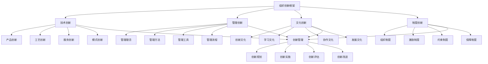

# 组织创新

## 🎯 组织创新概述

### 基本定义
**组织创新**是指组织通过系统性的创新活动，包括技术创新、管理创新、文化创新、制度创新等，提升组织能力、增强竞争优势、实现组织发展的管理活动。

### 核心特征
- **系统性**：系统性的创新活动
- **持续性**：持续性的创新过程
- **多样性**：多样性的创新类型
- **协同性**：协同性的创新机制
- **适应性**：适应性的创新能力
- **发展性**：发展性的创新目标

## 🎯 组织创新框架

### 1. 创新类型

#### 组织创新框架

#### 创新要素
- **技术创新**：产品创新、工艺创新、服务创新、模式创新
- **管理创新**：管理理念、方法、工具、流程
- **文化创新**：创新文化、学习文化、协作文化、发展文化
- **制度创新**：组织制度、激励制度、约束制度、保障制度
- **创新管理**：创新规划、实施、评估、改进

### 2. 创新层次

#### 创新层次框架
- **渐进式创新**：改进性创新
- **突破式创新**：颠覆性创新
- **系统性创新**：全面性创新
- **生态性创新**：生态性创新

## 🔧 技术创新管理

### 1. 产品创新管理

#### 创新要素
- **需求分析**：市场需求分析
- **技术研发**：技术研发实施
- **产品设计**：产品设计优化
- **市场推广**：产品市场推广

#### 管理方法
- **需求管理**：管理市场需求
- **研发管理**：管理技术研发
- **设计管理**：管理产品设计
- **推广管理**：管理市场推广

### 2. 工艺创新管理

#### 创新要素
- **工艺分析**：现有工艺分析
- **工艺改进**：工艺改进实施
- **工艺优化**：工艺优化管理
- **工艺应用**：工艺应用推广

#### 管理方法
- **分析管理**：管理工艺分析
- **改进管理**：管理工艺改进
- **优化管理**：管理工艺优化
- **应用管理**：管理工艺应用

### 3. 服务创新管理

#### 创新要素
- **服务设计**：服务设计创新
- **服务流程**：服务流程优化
- **服务体验**：服务体验提升
- **服务模式**：服务模式创新

#### 管理方法
- **设计管理**：管理服务设计
- **流程管理**：管理服务流程
- **体验管理**：管理服务体验
- **模式管理**：管理服务模式

### 4. 模式创新管理

#### 创新要素
- **商业模式**：商业模式创新
- **运营模式**：运营模式创新
- **盈利模式**：盈利模式创新
- **发展模式**：发展模式创新

#### 管理方法
- **商业管理**：管理商业模式
- **运营管理**：管理运营模式
- **盈利管理**：管理盈利模式
- **发展管理**：管理发展模式

## 📊 管理创新管理

### 1. 管理理念创新

#### 创新要素
- **理念更新**：管理理念更新
- **理念传播**：管理理念传播
- **理念实践**：管理理念实践
- **理念发展**：管理理念发展

#### 管理方法
- **更新管理**：管理理念更新
- **传播管理**：管理理念传播
- **实践管理**：管理理念实践
- **发展管理**：管理理念发展

### 2. 管理方法创新

#### 创新要素
- **方法研究**：管理方法研究
- **方法开发**：管理方法开发
- **方法应用**：管理方法应用
- **方法优化**：管理方法优化

#### 管理方法
- **研究管理**：管理方法研究
- **开发管理**：管理方法开发
- **应用管理**：管理方法应用
- **优化管理**：管理方法优化

### 3. 管理工具创新

#### 创新要素
- **工具设计**：管理工具设计
- **工具开发**：管理工具开发
- **工具应用**：管理工具应用
- **工具改进**：管理工具改进

#### 管理方法
- **设计管理**：管理工具设计
- **开发管理**：管理工具开发
- **应用管理**：管理工具应用
- **改进管理**：管理工具改进

### 4. 管理流程创新

#### 创新要素
- **流程分析**：管理流程分析
- **流程优化**：管理流程优化
- **流程再造**：管理流程再造
- **流程创新**：管理流程创新

#### 管理方法
- **分析管理**：管理流程分析
- **优化管理**：管理流程优化
- **再造管理**：管理流程再造
- **创新管理**：管理流程创新

## 🎨 文化创新管理

### 1. 创新文化管理

#### 文化要素
- **创新理念**：创新文化理念
- **创新氛围**：创新文化氛围
- **创新行为**：创新文化行为
- **创新成果**：创新文化成果

#### 管理方法
- **理念管理**：管理创新理念
- **氛围管理**：管理创新氛围
- **行为管理**：管理创新行为
- **成果管理**：管理创新成果

### 2. 学习文化管理

#### 文化要素
- **学习理念**：学习文化理念
- **学习氛围**：学习文化氛围
- **学习行为**：学习文化行为
- **学习成果**：学习文化成果

#### 管理方法
- **理念管理**：管理学习理念
- **氛围管理**：管理学习氛围
- **行为管理**：管理学习行为
- **成果管理**：管理学习成果

### 3. 协作文化管理

#### 文化要素
- **协作理念**：协作文化理念
- **协作氛围**：协作文化氛围
- **协作行为**：协作文化行为
- **协作成果**：协作文化成果

#### 管理方法
- **理念管理**：管理协作理念
- **氛围管理**：管理协作氛围
- **行为管理**：管理协作行为
- **成果管理**：管理协作成果

### 4. 发展文化管理

#### 文化要素
- **发展理念**：发展文化理念
- **发展氛围**：发展文化氛围
- **发展行为**：发展文化行为
- **发展成果**：发展文化成果

#### 管理方法
- **理念管理**：管理发展理念
- **氛围管理**：管理发展氛围
- **行为管理**：管理发展行为
- **成果管理**：管理发展成果

## ⚖️ 制度创新管理

### 1. 组织制度创新

#### 制度要素
- **组织架构**：组织架构制度
- **组织流程**：组织流程制度
- **组织规范**：组织规范制度
- **组织机制**：组织机制制度

#### 管理方法
- **架构管理**：管理组织架构
- **流程管理**：管理组织流程
- **规范管理**：管理组织规范
- **机制管理**：管理组织机制

### 2. 激励制度创新

#### 制度要素
- **激励理念**：激励制度理念
- **激励方式**：激励制度方式
- **激励标准**：激励制度标准
- **激励效果**：激励制度效果

#### 管理方法
- **理念管理**：管理激励理念
- **方式管理**：管理激励方式
- **标准管理**：管理激励标准
- **效果管理**：管理激励效果

### 3. 约束制度创新

#### 制度要素
- **约束理念**：约束制度理念
- **约束方式**：约束制度方式
- **约束标准**：约束制度标准
- **约束效果**：约束制度效果

#### 管理方法
- **理念管理**：管理约束理念
- **方式管理**：管理约束方式
- **标准管理**：管理约束标准
- **效果管理**：管理约束效果

### 4. 保障制度创新

#### 制度要素
- **保障理念**：保障制度理念
- **保障方式**：保障制度方式
- **保障标准**：保障制度标准
- **保障效果**：保障制度效果

#### 管理方法
- **理念管理**：管理保障理念
- **方式管理**：管理保障方式
- **标准管理**：管理保障标准
- **效果管理**：管理保障效果

## 🔄 创新层次管理

### 1. 渐进式创新管理

#### 创新要素
- **改进创新**：改进性创新
- **优化创新**：优化性创新
- **完善创新**：完善性创新
- **提升创新**：提升性创新

#### 管理方法
- **改进管理**：管理改进创新
- **优化管理**：管理优化创新
- **完善管理**：管理完善创新
- **提升管理**：管理提升创新

### 2. 突破式创新管理

#### 创新要素
- **颠覆创新**：颠覆性创新
- **革命创新**：革命性创新
- **跨越创新**：跨越性创新
- **突破创新**：突破性创新

#### 管理方法
- **颠覆管理**：管理颠覆创新
- **革命管理**：管理革命创新
- **跨越管理**：管理跨越创新
- **突破管理**：管理突破创新

### 3. 系统性创新管理

#### 创新要素
- **系统创新**：系统性创新
- **全面创新**：全面性创新
- **整体创新**：整体性创新
- **综合创新**：综合性创新

#### 管理方法
- **系统管理**：管理系统创新
- **全面管理**：管理全面创新
- **整体管理**：管理整体创新
- **综合管理**：管理综合创新

### 4. 生态性创新管理

#### 创新要素
- **生态创新**：生态性创新
- **网络创新**：网络性创新
- **协同创新**：协同性创新
- **开放创新**：开放性创新

#### 管理方法
- **生态管理**：管理生态创新
- **网络管理**：管理网络创新
- **协同管理**：管理协同创新
- **开放管理**：管理开放创新

## 🎯 创新管理流程

### 1. 创新规划管理

#### 规划要素
- **创新目标**：创新目标设定
- **创新计划**：创新计划制定
- **创新资源**：创新资源配置
- **创新时间**：创新时间安排

#### 管理方法
- **目标管理**：管理创新目标
- **计划管理**：管理创新计划
- **资源管理**：管理创新资源
- **时间管理**：管理创新时间

### 2. 创新实施管理

#### 实施要素
- **创新过程**：创新过程管理
- **创新支持**：创新支持体系
- **创新监控**：创新过程监控
- **创新调整**：创新过程调整

#### 管理方法
- **过程管理**：管理创新过程
- **支持管理**：管理创新支持
- **监控管理**：管理创新监控
- **调整管理**：管理创新调整

### 3. 创新评估管理

#### 评估要素
- **创新效果**：创新效果评估
- **创新质量**：创新质量评估
- **创新成果**：创新成果评估
- **创新改进**：创新改进评估

#### 管理方法
- **效果管理**：管理创新效果
- **质量管理**：管理创新质量
- **成果管理**：管理创新成果
- **改进管理**：管理创新改进

### 4. 创新改进管理

#### 改进要素
- **改进识别**：改进机会识别
- **改进方案**：改进方案制定
- **改进实施**：改进实施管理
- **改进效果**：改进效果评估

#### 管理方法
- **识别管理**：管理改进识别
- **方案管理**：管理改进方案
- **实施管理**：管理改进实施
- **效果管理**：管理改进效果

## 🔍 组织创新方法

### 1. 创新方法

#### 方法类型
- **头脑风暴**：头脑风暴方法
- **设计思维**：设计思维方法
- **精益创新**：精益创新方法
- **敏捷创新**：敏捷创新方法

#### 方法应用
- **风暴应用**：应用头脑风暴
- **思维应用**：应用设计思维
- **精益应用**：应用精益创新
- **敏捷应用**：应用敏捷创新

### 2. 创新工具

#### 工具类型
- **创新平台**：创新平台工具
- **创新软件**：创新软件工具
- **创新设备**：创新设备工具
- **创新资源**：创新资源工具

#### 工具应用
- **平台应用**：应用创新平台
- **软件应用**：应用创新软件
- **设备应用**：应用创新设备
- **资源应用**：应用创新资源

### 3. 创新技术

#### 技术类型
- **信息技术**：信息技术应用
- **人工智能**：人工智能技术
- **大数据**：大数据技术
- **云计算**：云计算技术

#### 技术应用
- **信息应用**：应用信息技术
- **智能应用**：应用人工智能
- **数据应用**：应用大数据技术
- **云应用**：应用云计算技术

### 4. 创新环境

#### 环境要素
- **物理环境**：创新物理环境
- **虚拟环境**：创新虚拟环境
- **文化环境**：创新文化环境
- **技术环境**：创新技术环境

#### 环境管理
- **物理管理**：管理物理环境
- **虚拟管理**：管理虚拟环境
- **文化管理**：管理文化环境
- **技术管理**：管理技术环境

## 📊 组织创新案例

### 案例1：科技企业技术创新

#### 案例背景
某科技企业致力于技术创新，提升产品竞争力和市场地位。

#### 创新过程
- **产品创新**：开发新产品
- **工艺创新**：改进生产工艺
- **服务创新**：创新服务模式
- **模式创新**：创新商业模式

#### 创新结果
- **产品提升**：产品竞争力提升
- **效率改善**：生产效率改善
- **服务优化**：服务质量优化
- **模式创新**：商业模式创新

#### 成功因素
- **技术投入**：加大技术投入
- **人才引进**：引进创新人才
- **合作创新**：开展合作创新
- **持续创新**：持续创新发展

### 案例2：制造企业管理创新

#### 案例背景
某制造企业实施管理创新，提升管理效率和经营绩效。

#### 创新过程
- **理念创新**：更新管理理念
- **方法创新**：创新管理方法
- **工具创新**：开发管理工具
- **流程创新**：优化管理流程

#### 创新结果
- **效率提升**：管理效率提升
- **质量改善**：管理质量改善
- **成本降低**：管理成本降低
- **绩效提升**：经营绩效提升

#### 成功因素
- **理念更新**：更新管理理念
- **方法创新**：创新管理方法
- **工具应用**：应用管理工具
- **流程优化**：优化管理流程

## 🎯 组织创新最佳实践

### 1. 创新原则

#### 基本原则
- **系统性原则**：系统管理组织创新
- **持续性原则**：持续进行组织创新
- **协同性原则**：协同进行组织创新
- **创新性原则**：创新进行组织创新

#### 应用原则
- **目标导向**：以目标为导向
- **能力导向**：以能力为导向
- **创新导向**：以创新为导向
- **发展导向**：以发展为导向

### 2. 创新方法

#### 创新方法
- **系统创新**：系统进行组织创新
- **持续创新**：持续进行组织创新
- **协同创新**：协同进行组织创新
- **开放创新**：开放进行组织创新

#### 方法应用
- **系统应用**：应用系统创新方法
- **持续应用**：应用持续创新方法
- **协同应用**：应用协同创新方法
- **开放应用**：应用开放创新方法

### 3. 实施要点

#### 实施要点
- **文化建设**：建设创新文化
- **体系建立**：建立创新体系
- **机制完善**：完善创新机制
- **持续改进**：持续改进创新

#### 注意事项
- **避免盲目**：避免盲目创新
- **避免孤立**：避免孤立创新
- **避免表面**：避免表面创新
- **避免停滞**：避免创新停滞

## 📚 学习要点总结

### 核心概念
1. **组织创新**：组织创新的管理活动
2. **技术创新**：产品、工艺、服务、模式创新
3. **管理创新**：理念、方法、工具、流程创新
4. **文化创新**：创新、学习、协作、发展文化
5. **制度创新**：组织、激励、约束、保障制度
6. **创新层次**：渐进、突破、系统、生态创新
7. **创新管理**：创新规划、实施、评估、改进
8. **创新方法**：头脑风暴、设计思维、精益、敏捷

### 关键理解
- 组织创新是组织发展的重要动力
- 组织创新具有多样性和系统性特征
- 组织创新需要持续性和协同性
- 组织创新需要文化性和制度性
- 组织创新需要技术性和方法性
- 组织创新需要环境性和支持性
- 组织创新需要评估性和改进性
- 组织创新需要开放性和生态性

### 实践应用
- 运用组织创新提升组织能力
- 运用组织创新增强竞争优势
- 运用组织创新推动组织发展
- 运用组织创新优化组织管理
- 运用组织创新提升组织效能
- 运用组织创新增强组织适应
- 运用组织创新实现组织目标
- 运用组织创新促进组织转型

## 🔗 相关链接

- [[组织学习]] - 组织学习
- [[组织变革]] - 组织变革
- [[组织效能评估]] - 组织效能评估
- [[工具实操指南-组织管理]] - 工具实操指南-组织管理

## 📚 延伸阅读

- [[组织管理学]] - 组织管理学理论
- [[组织发展学]] - 组织发展学理论
- [[创新管理学]] - 创新管理学理论
- [[技术管理学]] - 技术管理学理论

---
*更新时间：2024年*
*内容将根据学习反馈持续优化*
