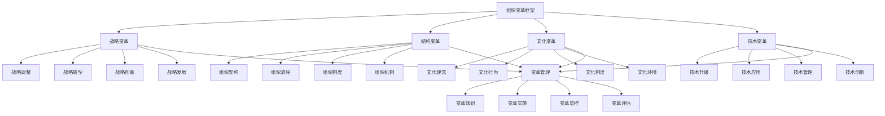

# 组织变革

## 🎯 组织变革概述

### 基本定义
**组织变革**是指组织为了适应内外部环境变化，通过系统性的变革活动，包括战略变革、结构变革、文化变革、技术变革等，实现组织转型和发展的管理活动。

### 核心特征
- **系统性**：系统性的变革活动
- **战略性**：战略性的变革目标
- **适应性**：适应性的变革需求
- **创新性**：创新性的变革方式
- **持续性**：持续性的变革过程
- **发展性**：发展性的变革目标

## 🎯 组织变革框架

### 1. 变革类型

#### 组织变革框架

#### 变革要素
- **战略变革**：战略调整、转型、创新、发展
- **结构变革**：组织架构、流程、制度、机制
- **文化变革**：文化理念、行为、制度、环境
- **技术变革**：技术升级、应用、管理、创新
- **变革管理**：变革规划、实施、监控、评估

### 2. 变革层次

#### 变革层次框架
- **渐进式变革**：改进性变革
- **激进式变革**：颠覆性变革
- **系统性变革**：全面性变革
- **转型性变革**：转型性变革

## 🎯 战略变革管理

### 1. 战略调整管理

#### 调整要素
- **环境分析**：内外部环境分析
- **战略评估**：现有战略评估
- **调整方案**：战略调整方案
- **实施管理**：调整实施管理

#### 管理方法
- **分析管理**：管理环境分析
- **评估管理**：管理战略评估
- **方案管理**：管理调整方案
- **实施管理**：管理调整实施

### 2. 战略转型管理

#### 转型要素
- **转型目标**：战略转型目标
- **转型路径**：战略转型路径
- **转型资源**：战略转型资源
- **转型实施**：战略转型实施

#### 管理方法
- **目标管理**：管理转型目标
- **路径管理**：管理转型路径
- **资源管理**：管理转型资源
- **实施管理**：管理转型实施

### 3. 战略创新管理

#### 创新要素
- **创新理念**：战略创新理念
- **创新方法**：战略创新方法
- **创新实践**：战略创新实践
- **创新成果**：战略创新成果

#### 管理方法
- **理念管理**：管理创新理念
- **方法管理**：管理创新方法
- **实践管理**：管理创新实践
- **成果管理**：管理创新成果

### 4. 战略发展管理

#### 发展要素
- **发展目标**：战略发展目标
- **发展规划**：战略发展规划
- **发展资源**：战略发展资源
- **发展实施**：战略发展实施

#### 管理方法
- **目标管理**：管理发展目标
- **规划管理**：管理发展规划
- **资源管理**：管理发展资源
- **实施管理**：管理发展实施

## 🏗️ 结构变革管理

### 1. 组织架构变革

#### 架构要素
- **架构设计**：组织架构设计
- **架构调整**：组织架构调整
- **架构优化**：组织架构优化
- **架构创新**：组织架构创新

#### 管理方法
- **设计管理**：管理架构设计
- **调整管理**：管理架构调整
- **优化管理**：管理架构优化
- **创新管理**：管理架构创新

### 2. 组织流程变革

#### 流程要素
- **流程分析**：组织流程分析
- **流程优化**：组织流程优化
- **流程再造**：组织流程再造
- **流程创新**：组织流程创新

#### 管理方法
- **分析管理**：管理流程分析
- **优化管理**：管理流程优化
- **再造管理**：管理流程再造
- **创新管理**：管理流程创新

### 3. 组织制度变革

#### 制度要素
- **制度设计**：组织制度设计
- **制度调整**：组织制度调整
- **制度完善**：组织制度完善
- **制度创新**：组织制度创新

#### 管理方法
- **设计管理**：管理制度设计
- **调整管理**：管理制度调整
- **完善管理**：管理制度完善
- **创新管理**：管理制度创新

### 4. 组织机制变革

#### 机制要素
- **机制设计**：组织机制设计
- **机制调整**：组织机制调整
- **机制完善**：组织机制完善
- **机制创新**：组织机制创新

#### 管理方法
- **设计管理**：管理机制设计
- **调整管理**：管理机制调整
- **完善管理**：管理机制完善
- **创新管理**：管理机制创新

## 🎨 文化变革管理

### 1. 文化理念变革

#### 理念要素
- **理念更新**：文化理念更新
- **理念传播**：文化理念传播
- **理念实践**：文化理念实践
- **理念发展**：文化理念发展

#### 管理方法
- **更新管理**：管理理念更新
- **传播管理**：管理理念传播
- **实践管理**：管理理念实践
- **发展管理**：管理理念发展

### 2. 文化行为变革

#### 行为要素
- **行为规范**：文化行为规范
- **行为引导**：文化行为引导
- **行为激励**：文化行为激励
- **行为发展**：文化行为发展

#### 管理方法
- **规范管理**：管理行为规范
- **引导管理**：管理行为引导
- **激励管理**：管理行为激励
- **发展管理**：管理行为发展

### 3. 文化制度变革

#### 制度要素
- **制度设计**：文化制度设计
- **制度实施**：文化制度实施
- **制度完善**：文化制度完善
- **制度创新**：文化制度创新

#### 管理方法
- **设计管理**：管理制度设计
- **实施管理**：管理制度实施
- **完善管理**：管理制度完善
- **创新管理**：管理制度创新

### 4. 文化环境变革

#### 环境要素
- **环境营造**：文化环境营造
- **环境优化**：文化环境优化
- **环境创新**：文化环境创新
- **环境发展**：文化环境发展

#### 管理方法
- **营造管理**：管理环境营造
- **优化管理**：管理环境优化
- **创新管理**：管理环境创新
- **发展管理**：管理环境发展

## 🔧 技术变革管理

### 1. 技术升级管理

#### 升级要素
- **技术评估**：现有技术评估
- **技术选择**：新技术选择
- **技术引进**：新技术引进
- **技术应用**：新技术应用

#### 管理方法
- **评估管理**：管理技术评估
- **选择管理**：管理技术选择
- **引进管理**：管理技术引进
- **应用管理**：管理技术应用

### 2. 技术应用管理

#### 应用要素
- **应用规划**：技术应用规划
- **应用实施**：技术应用实施
- **应用监控**：技术应用监控
- **应用优化**：技术应用优化

#### 管理方法
- **规划管理**：管理应用规划
- **实施管理**：管理应用实施
- **监控管理**：管理应用监控
- **优化管理**：管理应用优化

### 3. 技术管理变革

#### 管理要素
- **管理理念**：技术管理理念
- **管理方法**：技术管理方法
- **管理工具**：技术管理工具
- **管理流程**：技术管理流程

#### 管理方法
- **理念管理**：管理技术理念
- **方法管理**：管理技术方法
- **工具管理**：管理技术工具
- **流程管理**：管理技术流程

### 4. 技术创新管理

#### 创新要素
- **创新理念**：技术创新理念
- **创新方法**：技术创新方法
- **创新实践**：技术创新实践
- **创新成果**：技术创新成果

#### 管理方法
- **理念管理**：管理创新理念
- **方法管理**：管理创新方法
- **实践管理**：管理创新实践
- **成果管理**：管理创新成果

## 🔄 变革层次管理

### 1. 渐进式变革管理

#### 变革要素
- **改进变革**：改进性变革
- **优化变革**：优化性变革
- **完善变革**：完善性变革
- **提升变革**：提升性变革

#### 管理方法
- **改进管理**：管理改进变革
- **优化管理**：管理优化变革
- **完善管理**：管理完善变革
- **提升管理**：管理提升变革

### 2. 激进式变革管理

#### 变革要素
- **颠覆变革**：颠覆性变革
- **革命变革**：革命性变革
- **跨越变革**：跨越性变革
- **突破变革**：突破性变革

#### 管理方法
- **颠覆管理**：管理颠覆变革
- **革命管理**：管理革命变革
- **跨越管理**：管理跨越变革
- **突破管理**：管理突破变革

### 3. 系统性变革管理

#### 变革要素
- **系统变革**：系统性变革
- **全面变革**：全面性变革
- **整体变革**：整体性变革
- **综合变革**：综合性变革

#### 管理方法
- **系统管理**：管理系统变革
- **全面管理**：管理全面变革
- **整体管理**：管理整体变革
- **综合管理**：管理综合变革

### 4. 转型性变革管理

#### 变革要素
- **转型变革**：转型性变革
- **重塑变革**：重塑性变革
- **重构变革**：重构性变革
- **再生变革**：再生性变革

#### 管理方法
- **转型管理**：管理转型变革
- **重塑管理**：管理重塑变革
- **重构管理**：管理重构变革
- **再生管理**：管理再生变革

## 🎯 变革管理流程

### 1. 变革规划管理

#### 规划要素
- **变革目标**：变革目标设定
- **变革计划**：变革计划制定
- **变革资源**：变革资源配置
- **变革时间**：变革时间安排

#### 管理方法
- **目标管理**：管理变革目标
- **计划管理**：管理变革计划
- **资源管理**：管理变革资源
- **时间管理**：管理变革时间

### 2. 变革实施管理

#### 实施要素
- **变革过程**：变革过程管理
- **变革支持**：变革支持体系
- **变革监控**：变革过程监控
- **变革调整**：变革过程调整

#### 管理方法
- **过程管理**：管理变革过程
- **支持管理**：管理变革支持
- **监控管理**：管理变革监控
- **调整管理**：管理变革调整

### 3. 变革监控管理

#### 监控要素
- **监控指标**：变革监控指标
- **监控方法**：变革监控方法
- **监控工具**：变革监控工具
- **监控效果**：变革监控效果

#### 管理方法
- **指标管理**：管理监控指标
- **方法管理**：管理监控方法
- **工具管理**：管理监控工具
- **效果管理**：管理监控效果

### 4. 变革评估管理

#### 评估要素
- **评估标准**：变革评估标准
- **评估方法**：变革评估方法
- **评估工具**：变革评估工具
- **评估结果**：变革评估结果

#### 管理方法
- **标准管理**：管理评估标准
- **方法管理**：管理评估方法
- **工具管理**：管理评估工具
- **结果管理**：管理评估结果

## 🔍 组织变革方法

### 1. 变革方法

#### 方法类型
- **变革模型**：变革管理模型
- **变革工具**：变革管理工具
- **变革技术**：变革管理技术
- **变革流程**：变革管理流程

#### 方法应用
- **模型应用**：应用变革模型
- **工具应用**：应用变革工具
- **技术应用**：应用变革技术
- **流程应用**：应用变革流程

### 2. 变革工具

#### 工具类型
- **分析工具**：变革分析工具
- **规划工具**：变革规划工具
- **实施工具**：变革实施工具
- **评估工具**：变革评估工具

#### 工具应用
- **分析应用**：应用分析工具
- **规划应用**：应用规划工具
- **实施应用**：应用实施工具
- **评估应用**：应用评估工具

### 3. 变革技术

#### 技术类型
- **信息技术**：信息技术应用
- **人工智能**：人工智能技术
- **大数据**：大数据技术
- **云计算**：云计算技术

#### 技术应用
- **信息应用**：应用信息技术
- **智能应用**：应用人工智能
- **数据应用**：应用大数据技术
- **云应用**：应用云计算技术

### 4. 变革环境

#### 环境要素
- **内部环境**：组织内部环境
- **外部环境**：组织外部环境
- **文化环境**：组织文化环境
- **技术环境**：组织技术环境

#### 环境管理
- **内部管理**：管理内部环境
- **外部管理**：管理外部环境
- **文化管理**：管理文化环境
- **技术管理**：管理技术环境

## 📊 组织变革案例

### 案例1：制造企业数字化转型

#### 案例背景
某制造企业实施数字化转型，提升生产效率和市场竞争力。

#### 变革过程
- **战略变革**：制定数字化战略
- **结构变革**：调整组织架构
- **文化变革**：建设数字化文化
- **技术变革**：引入数字技术

#### 变革结果
- **效率提升**：生产效率提升
- **质量改善**：产品质量改善
- **成本降低**：运营成本降低
- **竞争力增强**：市场竞争力增强

#### 成功因素
- **战略清晰**：清晰的变革战略
- **领导支持**：领导层支持
- **员工参与**：员工积极参与
- **持续改进**：持续改进变革

### 案例2：服务企业组织重构

#### 案例背景
某服务企业实施组织重构，提升服务质量和客户满意度。

#### 变革过程
- **架构变革**：重构组织架构
- **流程变革**：优化服务流程
- **制度变革**：完善管理制度
- **文化变革**：建设服务文化

#### 变革结果
- **质量提升**：服务质量提升
- **效率改善**：服务效率改善
- **满意度提高**：客户满意度提高
- **绩效提升**：经营绩效提升

#### 成功因素
- **目标明确**：明确的变革目标
- **计划详细**：详细的变革计划
- **执行有力**：有力的变革执行
- **监控有效**：有效的变革监控

## 🎯 组织变革最佳实践

### 1. 变革原则

#### 基本原则
- **系统性原则**：系统管理组织变革
- **战略性原则**：战略导向组织变革
- **适应性原则**：适应环境组织变革
- **创新性原则**：创新进行组织变革

#### 应用原则
- **目标导向**：以目标为导向
- **能力导向**：以能力为导向
- **创新导向**：以创新为导向
- **发展导向**：以发展为导向

### 2. 变革方法

#### 变革方法
- **系统变革**：系统进行组织变革
- **战略变革**：战略进行组织变革
- **适应变革**：适应进行组织变革
- **创新变革**：创新进行组织变革

#### 方法应用
- **系统应用**：应用系统变革方法
- **战略应用**：应用战略变革方法
- **适应应用**：应用适应变革方法
- **创新应用**：应用创新变革方法

### 3. 实施要点

#### 实施要点
- **文化建设**：建设变革文化
- **体系建立**：建立变革体系
- **机制完善**：完善变革机制
- **持续改进**：持续改进变革

#### 注意事项
- **避免盲目**：避免盲目变革
- **避免激进**：避免激进变革
- **避免表面**：避免表面变革
- **避免停滞**：避免变革停滞

## 📚 学习要点总结

### 核心概念
1. **组织变革**：组织变革的管理活动
2. **战略变革**：战略调整、转型、创新、发展
3. **结构变革**：组织架构、流程、制度、机制
4. **文化变革**：文化理念、行为、制度、环境
5. **技术变革**：技术升级、应用、管理、创新
6. **变革层次**：渐进、激进、系统、转型变革
7. **变革管理**：变革规划、实施、监控、评估
8. **变革方法**：变革模型、工具、技术、流程

### 关键理解
- 组织变革是组织发展的重要动力
- 组织变革具有系统性和战略性特征
- 组织变革需要适应性和创新性
- 组织变革需要持续性和发展性
- 组织变革需要文化性和技术性
- 组织变革需要规划性和实施性
- 组织变革需要监控性和评估性
- 组织变革需要改进性和优化性

### 实践应用
- 运用组织变革适应环境变化
- 运用组织变革提升组织能力
- 运用组织变革增强竞争优势
- 运用组织变革推动组织发展
- 运用组织变革优化组织管理
- 运用组织变革提升组织效能
- 运用组织变革实现组织目标
- 运用组织变革促进组织转型

## 🔗 相关链接

- [[组织学习]] - 组织学习
- [[组织创新]] - 组织创新
- [[组织效能评估]] - 组织效能评估
- [[工具实操指南-组织管理]] - 工具实操指南-组织管理

## 📚 延伸阅读

- [[组织管理学]] - 组织管理学理论
- [[组织发展学]] - 组织发展学理论
- [[变革管理学]] - 变革管理学理论
- [[战略管理学]] - 战略管理学理论

---
*更新时间：2024年*
*内容将根据学习反馈持续优化*
