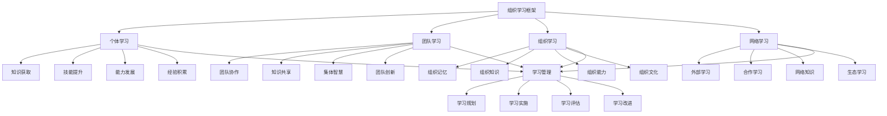

# 组织学习

## 🎯 组织学习概述

### 基本定义
**组织学习**是指组织通过系统性的知识获取、共享、应用和创新过程，不断提升组织能力、适应环境变化、实现组织发展的管理活动。

### 核心特征
- **系统性**：系统性的学习过程
- **持续性**：持续性的学习活动
- **共享性**：知识共享的学习机制
- **创新性**：创新性的学习成果
- **适应性**：适应性的学习能力
- **发展性**：发展性的学习目标

## 🎯 组织学习框架

### 1. 学习层次

#### 组织学习框架

#### 学习要素
- **个体学习**：知识获取、技能提升、能力发展、经验积累
- **团队学习**：团队协作、知识共享、集体智慧、团队创新
- **组织学习**：组织记忆、组织知识、组织能力、组织文化
- **网络学习**：外部学习、合作学习、网络知识、生态学习
- **学习管理**：学习规划、实施、评估、改进

### 2. 学习类型

#### 学习类型框架
- **单环学习**：适应性学习
- **双环学习**：反思性学习
- **三环学习**：创新性学习
- **持续学习**：持续性学习

## 👤 个体学习管理

### 1. 知识获取管理

#### 获取要素
- **知识来源**：知识来源识别
- **知识类型**：知识类型分类
- **获取方法**：知识获取方法
- **获取效果**：知识获取效果

#### 管理方法
- **来源管理**：管理知识来源
- **类型管理**：管理知识类型
- **方法管理**：管理获取方法
- **效果管理**：管理获取效果

### 2. 技能提升管理

#### 提升要素
- **技能识别**：技能需求识别
- **技能评估**：技能水平评估
- **技能培训**：技能培训实施
- **技能应用**：技能应用实践

#### 管理方法
- **识别管理**：管理技能识别
- **评估管理**：管理技能评估
- **培训管理**：管理技能培训
- **应用管理**：管理技能应用

### 3. 能力发展管理

#### 发展要素
- **能力识别**：能力需求识别
- **能力评估**：能力水平评估
- **能力发展**：能力发展计划
- **能力提升**：能力提升实施

#### 管理方法
- **识别管理**：管理能力识别
- **评估管理**：管理能力评估
- **发展管理**：管理能力发展
- **提升管理**：管理能力提升

### 4. 经验积累管理

#### 积累要素
- **经验识别**：经验价值识别
- **经验记录**：经验记录管理
- **经验分享**：经验分享机制
- **经验应用**：经验应用实践

#### 管理方法
- **识别管理**：管理经验识别
- **记录管理**：管理经验记录
- **分享管理**：管理经验分享
- **应用管理**：管理经验应用

## 👥 团队学习管理

### 1. 团队协作学习

#### 协作要素
- **协作机制**：团队协作机制
- **协作方式**：团队协作方式
- **协作效果**：团队协作效果
- **协作改进**：团队协作改进

#### 管理方法
- **机制管理**：管理协作机制
- **方式管理**：管理协作方式
- **效果管理**：管理协作效果
- **改进管理**：管理协作改进

### 2. 知识共享学习

#### 共享要素
- **共享内容**：知识共享内容
- **共享方式**：知识共享方式
- **共享平台**：知识共享平台
- **共享效果**：知识共享效果

#### 管理方法
- **内容管理**：管理共享内容
- **方式管理**：管理共享方式
- **平台管理**：管理共享平台
- **效果管理**：管理共享效果

### 3. 集体智慧学习

#### 智慧要素
- **智慧汇聚**：集体智慧汇聚
- **智慧应用**：集体智慧应用
- **智慧创新**：集体智慧创新
- **智慧发展**：集体智慧发展

#### 管理方法
- **汇聚管理**：管理智慧汇聚
- **应用管理**：管理智慧应用
- **创新管理**：管理智慧创新
- **发展管理**：管理智慧发展

### 4. 团队创新学习

#### 创新要素
- **创新思维**：团队创新思维
- **创新方法**：团队创新方法
- **创新实践**：团队创新实践
- **创新成果**：团队创新成果

#### 管理方法
- **思维管理**：管理创新思维
- **方法管理**：管理创新方法
- **实践管理**：管理创新实践
- **成果管理**：管理创新成果

## 🏢 组织学习管理

### 1. 组织记忆管理

#### 记忆要素
- **记忆内容**：组织记忆内容
- **记忆存储**：组织记忆存储
- **记忆检索**：组织记忆检索
- **记忆应用**：组织记忆应用

#### 管理方法
- **内容管理**：管理记忆内容
- **存储管理**：管理记忆存储
- **检索管理**：管理记忆检索
- **应用管理**：管理记忆应用

### 2. 组织知识管理

#### 知识要素
- **知识体系**：组织知识体系
- **知识结构**：组织知识结构
- **知识更新**：组织知识更新
- **知识创新**：组织知识创新

#### 管理方法
- **体系管理**：管理知识体系
- **结构管理**：管理知识结构
- **更新管理**：管理知识更新
- **创新管理**：管理知识创新

### 3. 组织能力管理

#### 能力要素
- **能力识别**：组织能力识别
- **能力评估**：组织能力评估
- **能力发展**：组织能力发展
- **能力提升**：组织能力提升

#### 管理方法
- **识别管理**：管理能力识别
- **评估管理**：管理能力评估
- **发展管理**：管理能力发展
- **提升管理**：管理能力提升

### 4. 组织文化管理

#### 文化要素
- **学习文化**：组织学习文化
- **创新文化**：组织创新文化
- **共享文化**：组织共享文化
- **发展文化**：组织发展文化

#### 管理方法
- **文化营造**：营造学习文化
- **文化传播**：传播学习文化
- **文化实践**：实践学习文化
- **文化发展**：发展学习文化

## 🌐 网络学习管理

### 1. 外部学习管理

#### 学习要素
- **外部知识**：外部知识获取
- **外部经验**：外部经验学习
- **外部技能**：外部技能学习
- **外部创新**：外部创新学习

#### 管理方法
- **知识管理**：管理外部知识
- **经验管理**：管理外部经验
- **技能管理**：管理外部技能
- **创新管理**：管理外部创新

### 2. 合作学习管理

#### 合作要素
- **合作伙伴**：学习合作伙伴
- **合作方式**：学习合作方式
- **合作内容**：学习合作内容
- **合作效果**：学习合作效果

#### 管理方法
- **伙伴管理**：管理学习伙伴
- **方式管理**：管理合作方式
- **内容管理**：管理合作内容
- **效果管理**：管理合作效果

### 3. 网络知识管理

#### 知识要素
- **网络资源**：网络知识资源
- **网络平台**：网络学习平台
- **网络工具**：网络学习工具
- **网络社区**：网络学习社区

#### 管理方法
- **资源管理**：管理网络资源
- **平台管理**：管理网络平台
- **工具管理**：管理网络工具
- **社区管理**：管理网络社区

### 4. 生态学习管理

#### 生态要素
- **学习生态**：学习生态系统
- **生态平衡**：学习生态平衡
- **生态发展**：学习生态发展
- **生态创新**：学习生态创新

#### 管理方法
- **生态管理**：管理学习生态
- **平衡管理**：管理生态平衡
- **发展管理**：管理生态发展
- **创新管理**：管理生态创新

## 🔄 学习类型管理

### 1. 单环学习管理

#### 学习要素
- **问题识别**：问题识别学习
- **解决方案**：解决方案学习
- **实施效果**：实施效果学习
- **经验总结**：经验总结学习

#### 管理方法
- **识别管理**：管理问题识别
- **方案管理**：管理解决方案
- **效果管理**：管理实施效果
- **总结管理**：管理经验总结

### 2. 双环学习管理

#### 学习要素
- **反思学习**：反思性学习
- **假设检验**：假设检验学习
- **思维模式**：思维模式学习
- **行为改变**：行为改变学习

#### 管理方法
- **反思管理**：管理反思学习
- **检验管理**：管理假设检验
- **模式管理**：管理思维模式
- **改变管理**：管理行为改变

### 3. 三环学习管理

#### 学习要素
- **创新学习**：创新性学习
- **范式转换**：范式转换学习
- **系统变革**：系统变革学习
- **组织转型**：组织转型学习

#### 管理方法
- **创新管理**：管理创新学习
- **转换管理**：管理范式转换
- **变革管理**：管理系统变革
- **转型管理**：管理组织转型

### 4. 持续学习管理

#### 学习要素
- **持续改进**：持续改进学习
- **持续创新**：持续创新学习
- **持续发展**：持续发展学习
- **持续适应**：持续适应学习

#### 管理方法
- **改进管理**：管理持续改进
- **创新管理**：管理持续创新
- **发展管理**：管理持续发展
- **适应管理**：管理持续适应

## 🎯 学习管理流程

### 1. 学习规划管理

#### 规划要素
- **学习目标**：学习目标设定
- **学习计划**：学习计划制定
- **学习资源**：学习资源配置
- **学习时间**：学习时间安排

#### 管理方法
- **目标管理**：管理学习目标
- **计划管理**：管理学习计划
- **资源管理**：管理学习资源
- **时间管理**：管理学习时间

### 2. 学习实施管理

#### 实施要素
- **学习过程**：学习过程管理
- **学习支持**：学习支持体系
- **学习监控**：学习过程监控
- **学习调整**：学习过程调整

#### 管理方法
- **过程管理**：管理学习过程
- **支持管理**：管理学习支持
- **监控管理**：管理学习监控
- **调整管理**：管理学习调整

### 3. 学习评估管理

#### 评估要素
- **学习效果**：学习效果评估
- **学习质量**：学习质量评估
- **学习成果**：学习成果评估
- **学习改进**：学习改进评估

#### 管理方法
- **效果管理**：管理学习效果
- **质量管理**：管理学习质量
- **成果管理**：管理学习成果
- **改进管理**：管理学习改进

### 4. 学习改进管理

#### 改进要素
- **改进识别**：改进机会识别
- **改进方案**：改进方案制定
- **改进实施**：改进实施管理
- **改进效果**：改进效果评估

#### 管理方法
- **识别管理**：管理改进识别
- **方案管理**：管理改进方案
- **实施管理**：管理改进实施
- **效果管理**：管理改进效果

## 🔍 组织学习方法

### 1. 学习方法

#### 方法类型
- **正式学习**：正式学习方法
- **非正式学习**：非正式学习方法
- **混合学习**：混合学习方法
- **自主学习**：自主学习方法

#### 方法应用
- **正式应用**：应用正式学习方法
- **非正式应用**：应用非正式学习方法
- **混合应用**：应用混合学习方法
- **自主应用**：应用自主学习方法

### 2. 学习工具

#### 工具类型
- **学习平台**：学习平台工具
- **学习软件**：学习软件工具
- **学习设备**：学习设备工具
- **学习资源**：学习资源工具

#### 工具应用
- **平台应用**：应用学习平台
- **软件应用**：应用学习软件
- **设备应用**：应用学习设备
- **资源应用**：应用学习资源

### 3. 学习技术

#### 技术类型
- **信息技术**：信息技术应用
- **人工智能**：人工智能技术
- **大数据**：大数据技术
- **虚拟现实**：虚拟现实技术

#### 技术应用
- **信息应用**：应用信息技术
- **智能应用**：应用人工智能
- **数据应用**：应用大数据技术
- **虚拟应用**：应用虚拟现实

### 4. 学习环境

#### 环境要素
- **物理环境**：学习物理环境
- **虚拟环境**：学习虚拟环境
- **文化环境**：学习文化环境
- **技术环境**：学习技术环境

#### 环境管理
- **物理管理**：管理物理环境
- **虚拟管理**：管理虚拟环境
- **文化管理**：管理文化环境
- **技术管理**：管理技术环境

## 📊 组织学习案例

### 案例1：制造企业学习型组织

#### 案例背景
某制造企业致力于建设学习型组织，提升组织学习能力和创新能力。

#### 学习过程
- **个体学习**：提升员工学习能力
- **团队学习**：促进团队知识共享
- **组织学习**：建立组织学习体系
- **网络学习**：拓展外部学习网络

#### 学习结果
- **能力提升**：组织学习能力提升
- **创新增强**：组织创新能力增强
- **适应改善**：环境适应能力改善
- **发展促进**：组织发展能力促进

#### 成功因素
- **文化营造**：营造学习文化
- **体系建立**：建立学习体系
- **机制完善**：完善学习机制
- **持续改进**：持续改进学习

### 案例2：科技企业知识管理

#### 案例背景
某科技企业实施知识管理，提升知识创新和应用能力。

#### 学习过程
- **知识获取**：获取外部知识
- **知识共享**：内部知识共享
- **知识应用**：知识应用实践
- **知识创新**：知识创新发展

#### 学习结果
- **知识积累**：组织知识积累
- **创新提升**：创新能力提升
- **效率改善**：工作效率改善
- **竞争优势**：竞争优势增强

#### 成功因素
- **系统管理**：系统管理知识
- **技术支撑**：技术支撑学习
- **文化支持**：文化支持学习
- **持续创新**：持续创新发展

## 🎯 组织学习最佳实践

### 1. 学习原则

#### 基本原则
- **系统性原则**：系统管理组织学习
- **持续性原则**：持续进行组织学习
- **共享性原则**：共享组织学习成果
- **创新性原则**：创新组织学习方式

#### 应用原则
- **目标导向**：以目标为导向
- **能力导向**：以能力为导向
- **创新导向**：以创新为导向
- **发展导向**：以发展为导向

### 2. 学习方法

#### 学习方法
- **系统学习**：系统进行组织学习
- **持续学习**：持续进行组织学习
- **共享学习**：共享进行组织学习
- **创新学习**：创新进行组织学习

#### 方法应用
- **系统应用**：应用系统学习方法
- **持续应用**：应用持续学习方法
- **共享应用**：应用共享学习方法
- **创新应用**：应用创新学习方法

### 3. 实施要点

#### 实施要点
- **文化建设**：建设学习文化
- **体系建立**：建立学习体系
- **机制完善**：完善学习机制
- **持续改进**：持续改进学习

#### 注意事项
- **避免形式**：避免形式化学习
- **避免孤立**：避免孤立化学习
- **避免表面**：避免表面化学习
- **避免停滞**：避免学习停滞

## 📚 学习要点总结

### 核心概念
1. **组织学习**：组织学习的管理活动
2. **个体学习**：知识获取、技能提升、能力发展、经验积累
3. **团队学习**：团队协作、知识共享、集体智慧、团队创新
4. **组织学习**：组织记忆、组织知识、组织能力、组织文化
5. **网络学习**：外部学习、合作学习、网络知识、生态学习
6. **学习类型**：单环、双环、三环、持续学习
7. **学习管理**：学习规划、实施、评估、改进
8. **学习方法**：正式、非正式、混合、自主学习

### 关键理解
- 组织学习是组织发展的重要动力
- 组织学习具有层次性和系统性特征
- 组织学习需要持续性和创新性
- 组织学习需要共享性和协作性
- 组织学习需要适应性和发展性
- 组织学习需要文化性和机制性
- 组织学习需要技术性和工具性
- 组织学习需要评估性和改进性

### 实践应用
- 运用组织学习提升组织能力
- 运用组织学习促进组织创新
- 运用组织学习增强组织适应
- 运用组织学习推动组织发展
- 运用组织学习优化组织管理
- 运用组织学习提升组织效能
- 运用组织学习增强组织竞争力
- 运用组织学习实现组织目标

## 🔗 相关链接

- [[组织效能评估]] - 组织效能评估
- [[组织变革]] - 组织变革
- [[组织创新]] - 组织创新
- [[工具实操指南-组织管理]] - 工具实操指南-组织管理

## 📚 延伸阅读

- [[组织管理学]] - 组织管理学理论
- [[组织发展学]] - 组织发展学理论
- [[学习型组织]] - 学习型组织理论
- [[知识管理]] - 知识管理理论

---
*更新时间：2024年*
*内容将根据学习反馈持续优化*
