# 组织效能评估

## 🎯 组织效能评估概述

### 基本定义
**组织效能评估**是指通过系统性的方法和工具，对组织的整体效能进行测量、分析和评价，以识别组织优势、发现改进机会、提升组织绩效的管理活动。

### 核心特征
- **系统性**：系统性的效能评估
- **客观性**：客观的评估标准
- **全面性**：全面的效能维度
- **动态性**：动态的评估过程
- **可比性**：可比的评估结果
- **实用性**：实用的评估应用

## 🎯 组织效能评估框架

### 1. 评估维度

#### 组织效能评估框架

```mermaid
graph TB
    A[组织效能评估框架] --> B[战略效能]
    A --> C[运营效能]
    A --> D[财务效能]
    A --> E[人力资源效能]
    A --> F[创新效能]
    A --> G[客户效能]
    A --> H[学习效能]
    A --> I[社会效能]
    
    B --> B1[战略目标达成]
    B --> B2[战略执行效果]
    B --> B3[战略适应性]
    B --> B4[战略创新性]
    
    C --> C1[运营效率]
    C --> C2[运营质量]
    C --> C3[运营成本]
    C --> C4[运营创新]
    
    D --> D1[盈利能力]
    D --> D2[资产效率]
    D --> D3[财务健康]
    D --> D4[投资回报]
    
    E --> E1[人才质量]
    E --> E2[人才发展]
    E --> E3[人才激励]
    E --> E4[人才保留]
    
    F --> F1[创新能力]
    F --> F2[创新成果]
    F --> F3[创新文化]
    F --> F4[创新投入]
    
    G --> G1[客户满意度]
    G --> G2[客户忠诚度]
    G --> G3[客户价值]
    G --> G4[客户增长]
    
    H --> H1[学习能力]
    H --> H2[知识管理]
    H --> H3[学习文化]
    H --> H4[学习成果]
    
    I --> I1[社会责任]
    I --> I2[环境影响]
    I --> I3[社会声誉]
    I --> I4[可持续发展]
    
    B --> J[效能管理]
    C --> J
    D --> J
    E --> J
    F --> J
    G --> J
    H --> J
    I --> J
    
    J --> K[效能测量]
    J --> L[效能分析]
    J --> M[效能改进]
    J --> N[效能监控]
```

#### 评估要素
- **战略效能**：战略目标达成、执行效果、适应性、创新性
- **运营效能**：运营效率、质量、成本、创新
- **财务效能**：盈利能力、资产效率、财务健康、投资回报
- **人力资源效能**：人才质量、发展、激励、保留
- **创新效能**：创新能力、成果、文化、投入
- **客户效能**：客户满意度、忠诚度、价值、增长
- **学习效能**：学习能力、知识管理、学习文化、学习成果
- **社会效能**：社会责任、环境影响、社会声誉、可持续发展

### 2. 评估方法

#### 方法框架
- **定量评估**：量化的效能评估
- **定性评估**：定性的效能评估
- **对比评估**：对比的效能评估
- **综合评估**：综合的效能评估

## 🎯 战略效能评估

### 1. 战略目标达成评估

#### 评估要素
- **目标完成率**：战略目标完成情况
- **目标质量**：战略目标质量水平
- **目标时效性**：战略目标时效性
- **目标一致性**：战略目标一致性

#### 评估方法
- **完成率计算**：计算目标完成率
- **质量评估**：评估目标质量
- **时效性分析**：分析目标时效性
- **一致性检查**：检查目标一致性

### 2. 战略执行效果评估

#### 评估要素
- **执行效率**：战略执行效率
- **执行质量**：战略执行质量
- **执行成本**：战略执行成本
- **执行风险**：战略执行风险

#### 评估方法
- **效率分析**：分析执行效率
- **质量评估**：评估执行质量
- **成本分析**：分析执行成本
- **风险评估**：评估执行风险

### 3. 战略适应性评估

#### 评估要素
- **环境适应**：环境变化适应能力
- **市场适应**：市场变化适应能力
- **技术适应**：技术变化适应能力
- **竞争适应**：竞争变化适应能力

#### 评估方法
- **适应能力分析**：分析适应能力
- **适应效果评估**：评估适应效果
- **适应机制检查**：检查适应机制
- **适应改进建议**：提出适应改进建议

### 4. 战略创新性评估

#### 评估要素
- **创新思维**：战略创新思维
- **创新方法**：战略创新方法
- **创新成果**：战略创新成果
- **创新影响**：战略创新影响

#### 评估方法
- **创新思维评估**：评估创新思维
- **创新方法分析**：分析创新方法
- **创新成果评估**：评估创新成果
- **创新影响分析**：分析创新影响

## ⚙️ 运营效能评估

### 1. 运营效率评估

#### 评估要素
- **生产效率**：生产效率水平
- **服务效率**：服务效率水平
- **管理效率**：管理效率水平
- **决策效率**：决策效率水平

#### 评估方法
- **效率指标**：建立效率指标
- **效率测量**：测量效率水平
- **效率分析**：分析效率变化
- **效率改进**：提出效率改进建议

### 2. 运营质量评估

#### 评估要素
- **产品质量**：产品质量水平
- **服务质量**：服务质量水平
- **管理质量**：管理质量水平
- **工作质量**：工作质量水平

#### 评估方法
- **质量标准**：建立质量标准
- **质量测量**：测量质量水平
- **质量分析**：分析质量变化
- **质量改进**：提出质量改进建议

### 3. 运营成本评估

#### 评估要素
- **生产成本**：生产成本水平
- **服务成本**：服务成本水平
- **管理成本**：管理成本水平
- **运营成本**：运营成本水平

#### 评估方法
- **成本分析**：分析成本构成
- **成本控制**：评估成本控制
- **成本优化**：提出成本优化建议
- **成本效益**：分析成本效益

### 4. 运营创新评估

#### 评估要素
- **流程创新**：流程创新水平
- **方法创新**：方法创新水平
- **技术创新**：技术创新水平
- **管理创新**：管理创新水平

#### 评估方法
- **创新识别**：识别运营创新
- **创新评估**：评估创新水平
- **创新效果**：分析创新效果
- **创新推广**：提出创新推广建议

## 💰 财务效能评估

### 1. 盈利能力评估

#### 评估要素
- **收入增长**：收入增长情况
- **利润水平**：利润水平情况
- **利润率**：利润率水平
- **盈利稳定性**：盈利稳定性

#### 评估方法
- **财务分析**：进行财务分析
- **盈利能力评估**：评估盈利能力
- **盈利趋势分析**：分析盈利趋势
- **盈利改进建议**：提出盈利改进建议

### 2. 资产效率评估

#### 评估要素
- **资产利用率**：资产利用率水平
- **资产周转率**：资产周转率水平
- **资产回报率**：资产回报率水平
- **资产管理效率**：资产管理效率

#### 评估方法
- **资产分析**：分析资产状况
- **效率评估**：评估资产效率
- **效率改进**：提出效率改进建议
- **资产管理优化**：提出资产管理优化建议

### 3. 财务健康评估

#### 评估要素
- **财务结构**：财务结构健康度
- **偿债能力**：偿债能力水平
- **流动性**：流动性水平
- **财务风险**：财务风险水平

#### 评估方法
- **健康度评估**：评估财务健康度
- **风险分析**：分析财务风险
- **健康改进**：提出健康改进建议
- **风险控制**：提出风险控制建议

### 4. 投资回报评估

#### 评估要素
- **投资回报率**：投资回报率水平
- **投资回收期**：投资回收期
- **投资风险**：投资风险水平
- **投资价值**：投资价值水平

#### 评估方法
- **回报分析**：分析投资回报
- **风险评估**：评估投资风险
- **价值评估**：评估投资价值
- **投资优化**：提出投资优化建议

## 👥 人力资源效能评估

### 1. 人才质量评估

#### 评估要素
- **人才结构**：人才结构合理性
- **人才能力**：人才能力水平
- **人才素质**：人才素质水平
- **人才匹配**：人才匹配度

#### 评估方法
- **质量评估**：评估人才质量
- **结构分析**：分析人才结构
- **能力评估**：评估人才能力
- **质量改进**：提出质量改进建议

### 2. 人才发展评估

#### 评估要素
- **发展体系**：人才发展体系
- **发展效果**：人才发展效果
- **发展投入**：人才发展投入
- **发展成果**：人才发展成果

#### 评估方法
- **发展评估**：评估人才发展
- **体系分析**：分析发展体系
- **效果评估**：评估发展效果
- **发展优化**：提出发展优化建议

### 3. 人才激励评估

#### 评估要素
- **激励机制**：激励机制有效性
- **激励效果**：激励效果水平
- **激励公平性**：激励公平性
- **激励满意度**：激励满意度

#### 评估方法
- **激励评估**：评估激励机制
- **效果分析**：分析激励效果
- **公平性评估**：评估激励公平性
- **激励改进**：提出激励改进建议

### 4. 人才保留评估

#### 评估要素
- **保留率**：人才保留率
- **流失率**：人才流失率
- **保留成本**：人才保留成本
- **保留效果**：人才保留效果

#### 评估方法
- **保留分析**：分析人才保留
- **流失分析**：分析人才流失
- **成本分析**：分析保留成本
- **保留改进**：提出保留改进建议

## 💡 创新效能评估

### 1. 创新能力评估

#### 评估要素
- **创新思维**：创新思维水平
- **创新方法**：创新方法应用
- **创新资源**：创新资源配置
- **创新环境**：创新环境营造

#### 评估方法
- **能力评估**：评估创新能力
- **思维分析**：分析创新思维
- **方法评估**：评估创新方法
- **能力提升**：提出能力提升建议

### 2. 创新成果评估

#### 评估要素
- **成果数量**：创新成果数量
- **成果质量**：创新成果质量
- **成果转化**：创新成果转化
- **成果价值**：创新成果价值

#### 评估方法
- **成果评估**：评估创新成果
- **数量分析**：分析成果数量
- **质量评估**：评估成果质量
- **成果优化**：提出成果优化建议

### 3. 创新文化评估

#### 评估要素
- **文化氛围**：创新文化氛围
- **文化认同**：创新文化认同
- **文化实践**：创新文化实践
- **文化影响**：创新文化影响

#### 评估方法
- **文化评估**：评估创新文化
- **氛围分析**：分析文化氛围
- **认同度评估**：评估文化认同
- **文化建设**：提出文化建设建议

### 4. 创新投入评估

#### 评估要素
- **投入水平**：创新投入水平
- **投入结构**：创新投入结构
- **投入效果**：创新投入效果
- **投入回报**：创新投入回报

#### 评估方法
- **投入分析**：分析创新投入
- **结构评估**：评估投入结构
- **效果评估**：评估投入效果
- **投入优化**：提出投入优化建议

## 👤 客户效能评估

### 1. 客户满意度评估

#### 评估要素
- **满意度水平**：客户满意度水平
- **满意度变化**：客户满意度变化
- **满意度驱动因素**：满意度驱动因素
- **满意度改进**：满意度改进机会

#### 评估方法
- **满意度调查**：进行满意度调查
- **满意度分析**：分析满意度数据
- **驱动因素分析**：分析驱动因素
- **满意度提升**：提出满意度提升建议

### 2. 客户忠诚度评估

#### 评估要素
- **忠诚度水平**：客户忠诚度水平
- **忠诚度类型**：客户忠诚度类型
- **忠诚度驱动因素**：忠诚度驱动因素
- **忠诚度价值**：忠诚度价值

#### 评估方法
- **忠诚度测量**：测量客户忠诚度
- **类型分析**：分析忠诚度类型
- **驱动因素分析**：分析驱动因素
- **忠诚度提升**：提出忠诚度提升建议

### 3. 客户价值评估

#### 评估要素
- **客户价值**：客户价值水平
- **价值构成**：客户价值构成
- **价值变化**：客户价值变化
- **价值提升**：客户价值提升

#### 评估方法
- **价值分析**：分析客户价值
- **构成分析**：分析价值构成
- **变化分析**：分析价值变化
- **价值优化**：提出价值优化建议

### 4. 客户增长评估

#### 评估要素
- **客户增长**：客户增长情况
- **增长质量**：客户增长质量
- **增长驱动因素**：增长驱动因素
- **增长潜力**：客户增长潜力

#### 评估方法
- **增长分析**：分析客户增长
- **质量评估**：评估增长质量
- **驱动因素分析**：分析驱动因素
- **增长优化**：提出增长优化建议

## 📚 学习效能评估

### 1. 学习能力评估

#### 评估要素
- **学习意愿**：学习意愿水平
- **学习能力**：学习能力水平
- **学习方法**：学习方法应用
- **学习效果**：学习效果水平

#### 评估方法
- **能力评估**：评估学习能力
- **意愿分析**：分析学习意愿
- **方法评估**：评估学习方法
- **能力提升**：提出能力提升建议

### 2. 知识管理评估

#### 评估要素
- **知识获取**：知识获取能力
- **知识存储**：知识存储体系
- **知识共享**：知识共享机制
- **知识应用**：知识应用效果

#### 评估方法
- **管理评估**：评估知识管理
- **获取分析**：分析知识获取
- **存储评估**：评估知识存储
- **管理优化**：提出管理优化建议

### 3. 学习文化评估

#### 评估要素
- **学习氛围**：学习文化氛围
- **学习支持**：学习支持体系
- **学习激励**：学习激励机制
- **学习成果**：学习成果应用

#### 评估方法
- **文化评估**：评估学习文化
- **氛围分析**：分析学习氛围
- **支持评估**：评估学习支持
- **文化建设**：提出文化建设建议

### 4. 学习成果评估

#### 评估要素
- **成果数量**：学习成果数量
- **成果质量**：学习成果质量
- **成果应用**：学习成果应用
- **成果价值**：学习成果价值

#### 评估方法
- **成果评估**：评估学习成果
- **数量分析**：分析成果数量
- **质量评估**：评估成果质量
- **成果优化**：提出成果优化建议

## 🌍 社会效能评估

### 1. 社会责任评估

#### 评估要素
- **责任意识**：社会责任意识
- **责任实践**：社会责任实践
- **责任影响**：社会责任影响
- **责任改进**：社会责任改进

#### 评估方法
- **责任评估**：评估社会责任
- **意识分析**：分析责任意识
- **实践评估**：评估责任实践
- **责任提升**：提出责任提升建议

### 2. 环境影响评估

#### 评估要素
- **环境影响**：环境影响程度
- **环保措施**：环保措施实施
- **环保效果**：环保措施效果
- **环保改进**：环保改进机会

#### 评估方法
- **影响评估**：评估环境影响
- **措施分析**：分析环保措施
- **效果评估**：评估环保效果
- **环保优化**：提出环保优化建议

### 3. 社会声誉评估

#### 评估要素
- **声誉水平**：社会声誉水平
- **声誉构成**：社会声誉构成
- **声誉变化**：社会声誉变化
- **声誉管理**：社会声誉管理

#### 评估方法
- **声誉评估**：评估社会声誉
- **构成分析**：分析声誉构成
- **变化分析**：分析声誉变化
- **声誉提升**：提出声誉提升建议

### 4. 可持续发展评估

#### 评估要素
- **可持续发展**：可持续发展水平
- **可持续发展能力**：可持续发展能力
- **可持续发展实践**：可持续发展实践
- **可持续发展影响**：可持续发展影响

#### 评估方法
- **发展评估**：评估可持续发展
- **能力分析**：分析发展能力
- **实践评估**：评估发展实践
- **发展优化**：提出发展优化建议

## 🔍 组织效能评估方法

### 1. 评估工具

#### 工具类型
- **测量工具**：效能测量工具
- **分析工具**：效能分析工具
- **对比工具**：效能对比工具
- **报告工具**：效能报告工具

#### 工具应用
- **测量应用**：应用测量工具
- **分析应用**：应用分析工具
- **对比应用**：应用对比工具
- **报告应用**：应用报告工具

### 2. 评估流程

#### 流程要素
- **评估计划**：评估计划制定
- **数据收集**：数据收集实施
- **数据分析**：数据分析处理
- **结果报告**：结果报告编制

#### 流程管理
- **计划管理**：管理评估计划
- **数据管理**：管理数据收集
- **分析管理**：管理数据分析
- **报告管理**：管理结果报告

### 3. 评估标准

#### 标准要素
- **评估指标**：评估指标体系
- **评估标准**：评估标准体系
- **评估方法**：评估方法体系
- **评估流程**：评估流程体系

#### 标准管理
- **指标管理**：管理评估指标
- **标准管理**：管理评估标准
- **方法管理**：管理评估方法
- **流程管理**：管理评估流程

### 4. 评估改进

#### 改进要素
- **改进识别**：改进机会识别
- **改进方案**：改进方案制定
- **改进实施**：改进实施管理
- **改进效果**：改进效果评估

#### 改进方法
- **识别方法**：识别改进机会
- **方案制定**：制定改进方案
- **实施管理**：管理改进实施
- **效果评估**：评估改进效果

## 📊 组织效能评估案例

### 案例1：制造企业效能评估

#### 案例背景
某制造企业需要进行全面的组织效能评估，识别改进机会，提升组织绩效。

#### 评估过程
- **战略效能评估**：评估战略目标达成情况
- **运营效能评估**：评估运营效率和质量
- **财务效能评估**：评估财务绩效和健康度
- **人力资源效能评估**：评估人才质量和激励

#### 评估结果
- **效能识别**：识别组织效能优势
- **问题发现**：发现效能改进机会
- **改进建议**：提出效能改进建议
- **效果预期**：预期改进效果

#### 成功因素
- **系统评估**：系统评估组织效能
- **多维分析**：多维分析效能要素
- **客观标准**：客观的评估标准
- **持续改进**：持续改进效能

### 案例2：服务企业效能评估

#### 案例背景
某服务企业需要进行组织效能评估，提升服务质量和客户满意度。

#### 评估过程
- **客户效能评估**：评估客户满意度和忠诚度
- **运营效能评估**：评估服务效率和质量
- **创新效能评估**：评估服务创新能力
- **学习效能评估**：评估学习和发展能力

#### 评估结果
- **效能提升**：组织效能显著提升
- **质量改善**：服务质量明显改善
- **客户满意**：客户满意度提升
- **竞争优势**：竞争优势增强

#### 成功因素
- **客户导向**：以客户为导向的评估
- **质量优先**：以质量优先的改进
- **持续学习**：持续学习和改进
- **创新驱动**：创新驱动发展

## 🎯 组织效能评估最佳实践

### 1. 评估原则

#### 基本原则
- **客观性原则**：客观评估组织效能
- **系统性原则**：系统评估组织效能
- **全面性原则**：全面评估组织效能
- **动态性原则**：动态评估组织效能

#### 应用原则
- **目标导向**：以目标为导向
- **数据驱动**：以数据为驱动
- **持续改进**：持续改进效能
- **价值创造**：以价值创造为核心

### 2. 评估方法

#### 评估方法
- **定量评估**：定量评估组织效能
- **定性评估**：定性评估组织效能
- **对比评估**：对比评估组织效能
- **综合评估**：综合评估组织效能

#### 方法应用
- **定量应用**：应用定量评估方法
- **定性应用**：应用定性评估方法
- **对比应用**：应用对比评估方法
- **综合应用**：应用综合评估方法

### 3. 实施要点

#### 实施要点
- **标准制定**：制定评估标准
- **数据收集**：收集评估数据
- **分析处理**：处理分析数据
- **结果应用**：应用评估结果

#### 注意事项
- **避免偏见**：避免评估偏见
- **避免表面**：避免表面化评估
- **避免孤立**：避免孤立化评估
- **避免静态**：避免静态化评估

## 📚 学习要点总结

### 核心概念
1. **组织效能评估**：评估组织效能的管理活动
2. **战略效能**：战略目标达成、执行效果、适应性、创新性
3. **运营效能**：运营效率、质量、成本、创新
4. **财务效能**：盈利能力、资产效率、财务健康、投资回报
5. **人力资源效能**：人才质量、发展、激励、保留
6. **创新效能**：创新能力、成果、文化、投入
7. **客户效能**：客户满意度、忠诚度、价值、增长
8. **学习效能**：学习能力、知识管理、学习文化、学习成果

### 关键理解
- 组织效能评估是组织管理的重要工具
- 组织效能具有多维性和系统性特征
- 组织效能评估需要客观性和科学性
- 组织效能评估需要全面性和动态性
- 组织效能评估需要可比性和实用性
- 组织效能评估需要持续性和改进性
- 组织效能评估需要系统性和综合性
- 组织效能评估需要创新性和发展性

### 实践应用
- 运用组织效能评估识别组织优势
- 运用组织效能评估发现改进机会
- 运用组织效能评估提升组织绩效
- 运用组织效能评估优化资源配置
- 运用组织效能评估增强竞争优势
- 运用组织效能评估促进组织发展
- 运用组织效能评估实现组织目标
- 运用组织效能评估创造组织价值

## 🔗 相关链接

- [[组织学习]] - 组织学习
- [[组织变革]] - 组织变革
- [[组织创新]] - 组织创新
- [[工具实操指南-组织管理]] - 工具实操指南-组织管理

## 📚 延伸阅读

- [[组织管理学]] - 组织管理学理论
- [[组织发展学]] - 组织发展学理论
- [[绩效管理]] - 绩效管理理论
- [[评估学]] - 评估学理论

---
*更新时间：2024年*
*内容将根据学习反馈持续优化*
