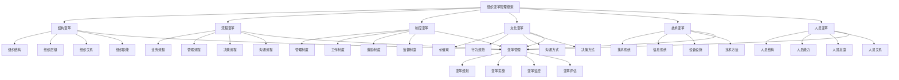

# 组织变革管理

## 🎯 组织变革管理概述

### 基本定义
**组织变革管理**是指对组织内部结构、流程、制度、文化等进行有计划、有系统的改变，以适应环境变化、提升组织效能、实现组织目标的管理活动。

### 核心特征
- **计划性**：有计划的变革活动
- **系统性**：系统性的变革管理
- **适应性**：适应环境变化
- **发展性**：促进组织发展
- **风险性**：存在变革风险
- **持续性**：持续性的变革过程

## 🎯 组织变革管理框架

### 1. 变革类型

#### 组织变革管理框架

#### 变革要素
- **结构变革**：组织结构、层级、关系、职能变革
- **流程变革**：业务、管理、决策、沟通流程变革
- **制度变革**：管理、工作、激励、监督制度变革
- **文化变革**：价值观、规范、沟通、决策方式变革
- **技术变革**：技术系统、信息系统、设备、方法变革
- **人员变革**：人员结构、能力、态度、关系变革
- **变革管理**：规划、实施、监控、评估

### 2. 变革层次

#### 变革层次框架
- **渐进式变革**：逐步推进的变革
- **激进式变革**：快速推进的变革
- **混合式变革**：渐进与激进结合的变革
- **持续式变革**：持续进行的变革

## 🔄 变革规划管理

### 1. 变革需求分析

#### 需求要素
- **环境分析**：外部环境分析
- **内部分析**：内部环境分析
- **问题识别**：问题识别分析
- **机会识别**：机会识别分析

#### 分析方法
- **环境分析**：PEST分析、SWOT分析
- **内部分析**：内部环境分析
- **问题分析**：问题识别分析
- **机会分析**：机会识别分析

### 2. 变革目标设定

#### 目标要素
- **战略目标**：战略目标设定
- **运营目标**：运营目标设定
- **绩效目标**：绩效目标设定
- **发展目标**：发展目标设定

#### 目标设定
- **目标分析**：分析目标需求
- **目标制定**：制定变革目标
- **目标分解**：分解目标到各部门
- **目标监控**：监控目标达成

### 3. 变革策略制定

#### 策略要素
- **变革方式**：变革方式选择
- **变革节奏**：变革节奏控制
- **变革范围**：变革范围确定
- **变革深度**：变革深度控制

#### 策略制定
- **方式选择**：选择变革方式
- **节奏控制**：控制变革节奏
- **范围确定**：确定变革范围
- **深度控制**：控制变革深度

### 4. 变革计划制定

#### 计划要素
- **时间计划**：时间计划制定
- **资源计划**：资源计划制定
- **人员计划**：人员计划制定
- **风险计划**：风险计划制定

#### 计划制定
- **时间规划**：规划变革时间
- **资源规划**：规划变革资源
- **人员规划**：规划变革人员
- **风险规划**：规划变革风险

## 🚀 变革实施管理

### 1. 变革启动

#### 启动要素
- **变革宣传**：变革宣传推广
- **变革动员**：变革动员活动
- **变革培训**：变革培训教育
- **变革支持**：变革支持体系

#### 启动方法
- **宣传方法**：变革宣传方法
- **动员方法**：变革动员方法
- **培训方法**：变革培训方法
- **支持方法**：变革支持方法

### 2. 变革推进

#### 推进要素
- **推进计划**：推进计划执行
- **推进监控**：推进过程监控
- **推进调整**：推进过程调整
- **推进支持**：推进过程支持

#### 推进方法
- **计划执行**：执行推进计划
- **过程监控**：监控推进过程
- **过程调整**：调整推进过程
- **过程支持**：支持推进过程

### 3. 变革协调

#### 协调要素
- **部门协调**：部门间协调
- **人员协调**：人员间协调
- **资源协调**：资源协调
- **目标协调**：目标协调

#### 协调方法
- **部门协调**：部门协调方法
- **人员协调**：人员协调方法
- **资源协调**：资源协调方法
- **目标协调**：目标协调方法

### 4. 变革控制

#### 控制要素
- **进度控制**：进度控制管理
- **质量控制**：质量控制管理
- **成本控制**：成本控制管理
- **风险控制**：风险控制管理

#### 控制方法
- **进度控制**：进度控制方法
- **质量控制**：质量控制方法
- **成本控制**：成本控制方法
- **风险控制**：风险控制方法

## 📊 变革监控管理

### 1. 监控体系

#### 监控要素
- **监控指标**：监控指标体系
- **监控方法**：监控方法体系
- **监控工具**：监控工具体系
- **监控流程**：监控流程体系

#### 监控设计
- **指标设计**：设计监控指标
- **方法设计**：设计监控方法
- **工具设计**：设计监控工具
- **流程设计**：设计监控流程

### 2. 监控实施

#### 实施要素
- **数据收集**：数据收集实施
- **数据分析**：数据分析实施
- **问题识别**：问题识别实施
- **预警机制**：预警机制实施

#### 实施方法
- **收集方法**：数据收集方法
- **分析方法**：数据分析方法
- **识别方法**：问题识别方法
- **预警方法**：预警机制方法

### 3. 监控反馈

#### 反馈要素
- **反馈机制**：反馈机制建立
- **反馈渠道**：反馈渠道建立
- **反馈处理**：反馈处理机制
- **反馈改进**：反馈改进机制

#### 反馈方法
- **机制建立**：建立反馈机制
- **渠道建立**：建立反馈渠道
- **处理机制**：建立处理机制
- **改进机制**：建立改进机制

### 4. 监控调整

#### 调整要素
- **调整机制**：调整机制建立
- **调整标准**：调整标准制定
- **调整程序**：调整程序制定
- **调整效果**：调整效果评估

#### 调整方法
- **机制建立**：建立调整机制
- **标准制定**：制定调整标准
- **程序制定**：制定调整程序
- **效果评估**：评估调整效果

## 📈 变革评估管理

### 1. 评估体系

#### 评估要素
- **评估指标**：评估指标体系
- **评估方法**：评估方法体系
- **评估工具**：评估工具体系
- **评估标准**：评估标准体系

#### 评估设计
- **指标设计**：设计评估指标
- **方法设计**：设计评估方法
- **工具设计**：设计评估工具
- **标准设计**：设计评估标准

### 2. 评估实施

#### 实施要素
- **评估计划**：评估计划制定
- **评估执行**：评估执行实施
- **评估分析**：评估分析实施
- **评估报告**：评估报告编制

#### 实施方法
- **计划制定**：制定评估计划
- **执行实施**：实施评估执行
- **分析实施**：实施评估分析
- **报告编制**：编制评估报告

### 3. 评估结果

#### 结果要素
- **结果分析**：结果分析处理
- **结果反馈**：结果反馈处理
- **结果应用**：结果应用处理
- **结果改进**：结果改进处理

#### 结果处理
- **分析处理**：处理结果分析
- **反馈处理**：处理结果反馈
- **应用处理**：处理结果应用
- **改进处理**：处理结果改进

### 4. 评估改进

#### 改进要素
- **改进识别**：改进识别分析
- **改进方案**：改进方案制定
- **改进实施**：改进实施管理
- **改进效果**：改进效果评估

#### 改进方法
- **识别分析**：分析改进识别
- **方案制定**：制定改进方案
- **实施管理**：管理改进实施
- **效果评估**：评估改进效果

## 🚧 变革阻力管理

### 1. 阻力识别

#### 阻力类型
- **认知阻力**：认知层面的阻力
- **情感阻力**：情感层面的阻力
- **行为阻力**：行为层面的阻力
- **制度阻力**：制度层面的阻力

#### 识别方法
- **认知识别**：识别认知阻力
- **情感识别**：识别情感阻力
- **行为识别**：识别行为阻力
- **制度识别**：识别制度阻力

### 2. 阻力分析

#### 分析要素
- **阻力原因**：阻力原因分析
- **阻力影响**：阻力影响分析
- **阻力强度**：阻力强度分析
- **阻力变化**：阻力变化分析

#### 分析方法
- **原因分析**：分析阻力原因
- **影响分析**：分析阻力影响
- **强度分析**：分析阻力强度
- **变化分析**：分析阻力变化

### 3. 阻力应对

#### 应对策略
- **沟通策略**：沟通应对策略
- **参与策略**：参与应对策略
- **支持策略**：支持应对策略
- **激励策略**：激励应对策略

#### 应对方法
- **沟通方法**：沟通应对方法
- **参与方法**：参与应对方法
- **支持方法**：支持应对方法
- **激励方法**：激励应对方法

### 4. 阻力转化

#### 转化要素
- **转化策略**：转化策略制定
- **转化方法**：转化方法实施
- **转化过程**：转化过程管理
- **转化效果**：转化效果评估

#### 转化方法
- **策略制定**：制定转化策略
- **方法实施**：实施转化方法
- **过程管理**：管理转化过程
- **效果评估**：评估转化效果

## 🎯 变革管理方法

### 1. 变革模型

#### 模型类型
- **Lewin模型**：解冻-变革-再冻结模型
- **Kotter模型**：八步变革模型
- **ADKAR模型**：意识-渴望-知识-能力-强化模型
- **Bridges模型**：结束-过渡-开始模型

#### 模型应用
- **Lewin应用**：应用Lewin模型
- **Kotter应用**：应用Kotter模型
- **ADKAR应用**：应用ADKAR模型
- **Bridges应用**：应用Bridges模型

### 2. 变革工具

#### 工具类型
- **分析工具**：变革分析工具
- **规划工具**：变革规划工具
- **实施工具**：变革实施工具
- **评估工具**：变革评估工具

#### 工具应用
- **分析应用**：应用分析工具
- **规划应用**：应用规划工具
- **实施应用**：应用实施工具
- **评估应用**：应用评估工具

### 3. 变革技术

#### 技术类型
- **沟通技术**：变革沟通技术
- **培训技术**：变革培训技术
- **激励技术**：变革激励技术
- **支持技术**：变革支持技术

#### 技术应用
- **沟通应用**：应用沟通技术
- **培训应用**：应用培训技术
- **激励应用**：应用激励技术
- **支持应用**：应用支持技术

### 4. 变革流程

#### 流程要素
- **流程设计**：变革流程设计
- **流程实施**：变革流程实施
- **流程监控**：变革流程监控
- **流程优化**：变革流程优化

#### 流程管理
- **设计管理**：管理流程设计
- **实施管理**：管理流程实施
- **监控管理**：管理流程监控
- **优化管理**：管理流程优化

## 📊 变革管理案例

### 案例1：数字化转型变革

#### 案例背景
某传统制造企业需要进行数字化转型，涉及技术、流程、人员、文化等多个方面的变革。

#### 变革过程
- **需求分析**：分析数字化转型需求
- **目标设定**：设定数字化转型目标
- **策略制定**：制定数字化转型策略
- **计划制定**：制定数字化转型计划

#### 变革结果
- **技术升级**：技术系统全面升级
- **流程优化**：业务流程显著优化
- **人员提升**：人员能力显著提升
- **文化变革**：组织文化成功变革

#### 成功因素
- **高层支持**：获得高层管理支持
- **全员参与**：全员参与变革过程
- **系统推进**：系统推进变革
- **持续改进**：持续改进变革

### 案例2：组织重组变革

#### 案例背景
某大型企业需要进行组织重组，优化组织结构，提升组织效能。

#### 变革过程
- **结构分析**：分析现有组织结构
- **重组设计**：设计新的组织结构
- **重组实施**：实施组织重组
- **重组评估**：评估重组效果

#### 变革结果
- **结构优化**：组织结构显著优化
- **效率提升**：组织效率显著提升
- **成本降低**：管理成本有效降低
- **效能增强**：组织效能显著增强

#### 成功因素
- **科学设计**：科学设计重组方案
- **系统实施**：系统实施重组
- **有效沟通**：有效沟通重组信息
- **持续监控**：持续监控重组过程

## 🎯 变革管理最佳实践

### 1. 管理原则

#### 基本原则
- **系统性原则**：系统管理变革
- **计划性原则**：计划管理变革
- **参与性原则**：参与管理变革
- **持续性原则**：持续管理变革

#### 应用原则
- **目标导向**：以目标为导向
- **效率优先**：以效率为优先
- **风险控制**：控制变革风险
- **效果评估**：评估变革效果

### 2. 管理方法

#### 管理方法
- **系统管理**：系统管理变革
- **过程管理**：过程管理变革
- **风险管理**：风险管理变革
- **效果管理**：效果管理变革

#### 方法应用
- **系统应用**：应用系统管理方法
- **过程应用**：应用过程管理方法
- **风险应用**：应用风险管理方法
- **效果应用**：应用效果管理方法

### 3. 实施要点

#### 实施要点
- **高层支持**：获得高层管理支持
- **全员参与**：全员参与变革过程
- **系统推进**：系统推进变革
- **持续改进**：持续改进变革

#### 注意事项
- **避免激进**：避免过于激进的变革
- **避免孤立**：避免孤立化变革
- **避免表面**：避免表面化变革
- **避免停滞**：避免变革停滞

## 📚 学习要点总结

### 核心概念
1. **组织变革管理**：组织变革的管理活动
2. **变革类型**：结构、流程、制度、文化、技术、人员变革
3. **变革层次**：渐进式、激进式、混合式、持续式变革
4. **变革规划**：需求分析、目标设定、策略制定、计划制定
5. **变革实施**：启动、推进、协调、控制
6. **变革监控**：监控体系、实施、反馈、调整
7. **变革评估**：评估体系、实施、结果、改进
8. **变革阻力**：阻力识别、分析、应对、转化

### 关键理解
- 组织变革管理是组织发展的重要活动
- 变革需要系统性和计划性管理
- 变革涉及多个层面和要素
- 变革存在阻力和风险
- 变革需要持续监控和评估
- 变革需要全员参与和支持
- 变革需要科学的方法和工具
- 变革需要持续改进和优化

### 实践应用
- 运用变革管理促进组织发展
- 运用变革管理适应环境变化
- 运用变革管理提升组织效能
- 运用变革管理优化组织结构
- 运用变革管理改善组织文化
- 运用变革管理增强组织竞争力
- 运用变革管理实现组织目标
- 运用变革管理推动组织创新

## 🔗 相关链接

- [[组织设计原则]] - 组织设计原则
- [[组织结构类型]] - 组织结构类型
- [[组织层级设计]] - 组织层级设计
- [[实践练习-组织结构设计]] - 实践练习-组织结构设计

## 📚 延伸阅读

- [[组织管理学]] - 组织管理学理论
- [[组织设计学]] - 组织设计学理论
- [[组织行为学]] - 组织行为学理论
- [[组织发展学]] - 组织发展学理论

---
*更新时间：2024年*
*内容将根据学习反馈持续优化*
