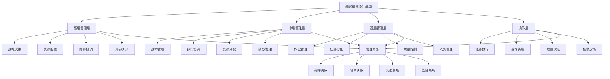

# 组织层级设计

## 🎯 组织层级设计概述

### 基本定义
**组织层级设计**是指对组织内部管理层级的数量、结构、关系、职责等进行科学设计，以建立清晰的管理层次、明确的管理关系、有效的管理机制，提升组织管理效率和效能的管理活动。

### 核心特征
- **层次性**：明确的管理层次
- **系统性**：系统性的层级设计
- **科学性**：科学合理的设计
- **效率性**：提升管理效率
- **适应性**：适应组织需求
- **发展性**：支持组织发展

## 🎯 组织层级设计框架

### 1. 层级结构

#### 组织层级设计框架

#### 层级要素
- **高层管理层**：战略决策、资源配置、组织协调、外部关系
- **中层管理层**：战术管理、部门协调、资源分配、绩效管理
- **基层管理层**：作业管理、任务分配、质量控制、人员管理
- **操作层**：任务执行、操作实施、质量保证、信息反馈
- **管理关系**：指挥、协调、沟通、监督关系

### 2. 设计维度

#### 设计维度框架
- **层级数量**：管理层级数量设计
- **层级结构**：层级结构关系设计
- **层级职责**：各层级职责划分设计
- **层级协调**：层级协调机制设计

## 🏢 高层管理层设计

### 1. 管理层特征

#### 基本特征
- **战略导向**：战略导向管理
- **全局视野**：全局视野管理
- **决策权威**：决策权威性
- **外部关系**：外部关系管理

#### 管理要素
- **战略制定**：战略制定职责
- **资源配置**：资源配置职责
- **组织协调**：组织协调职责
- **外部关系**：外部关系管理职责

### 2. 管理层职责

#### 职责要素
- **战略决策**：战略决策职责
- **资源配置**：资源配置职责
- **组织协调**：组织协调职责
- **外部关系**：外部关系管理职责

#### 职责设计
- **决策设计**：设计决策职责
- **资源配置**：设计资源配置职责
- **协调设计**：设计协调职责
- **关系设计**：设计外部关系管理职责

### 3. 管理层能力

#### 能力要素
- **战略思维**：战略思维能力
- **决策能力**：决策能力
- **协调能力**：协调能力
- **沟通能力**：沟通能力

#### 能力设计
- **思维设计**：设计战略思维能力
- **决策设计**：设计决策能力
- **协调设计**：设计协调能力
- **沟通设计**：设计沟通能力

### 4. 管理层关系

#### 关系要素
- **内部关系**：内部管理关系
- **外部关系**：外部关系
- **上下关系**：上下级关系
- **平行关系**：平行关系

#### 关系设计
- **内部设计**：设计内部管理关系
- **外部设计**：设计外部关系
- **上下设计**：设计上下级关系
- **平行设计**：设计平行关系

## 🏬 中层管理层设计

### 1. 管理层特征

#### 基本特征
- **战术导向**：战术导向管理
- **部门管理**：部门管理
- **协调功能**：协调功能
- **执行功能**：执行功能

#### 管理要素
- **战术管理**：战术管理职责
- **部门协调**：部门协调职责
- **资源分配**：资源分配职责
- **绩效管理**：绩效管理职责

### 2. 管理层职责

#### 职责要素
- **战术管理**：战术管理职责
- **部门协调**：部门协调职责
- **资源分配**：资源分配职责
- **绩效管理**：绩效管理职责

#### 职责设计
- **战术设计**：设计战术管理职责
- **协调设计**：设计部门协调职责
- **分配设计**：设计资源分配职责
- **绩效设计**：设计绩效管理职责

### 3. 管理层能力

#### 能力要素
- **战术思维**：战术思维能力
- **协调能力**：协调能力
- **执行能力**：执行能力
- **管理能力**：管理能力

#### 能力设计
- **思维设计**：设计战术思维能力
- **协调设计**：设计协调能力
- **执行设计**：设计执行能力
- **管理设计**：设计管理能力

### 4. 管理层关系

#### 关系要素
- **上下关系**：上下级关系
- **平行关系**：平行关系
- **部门关系**：部门间关系
- **协调关系**：协调关系

#### 关系设计
- **上下设计**：设计上下级关系
- **平行设计**：设计平行关系
- **部门设计**：设计部门间关系
- **协调设计**：设计协调关系

## 🏭 基层管理层设计

### 1. 管理层特征

#### 基本特征
- **作业导向**：作业导向管理
- **任务管理**：任务管理
- **质量控制**：质量控制
- **人员管理**：人员管理

#### 管理要素
- **作业管理**：作业管理职责
- **任务分配**：任务分配职责
- **质量控制**：质量控制职责
- **人员管理**：人员管理职责

### 2. 管理层职责

#### 职责要素
- **作业管理**：作业管理职责
- **任务分配**：任务分配职责
- **质量控制**：质量控制职责
- **人员管理**：人员管理职责

#### 职责设计
- **作业设计**：设计作业管理职责
- **任务设计**：设计任务分配职责
- **质量设计**：设计质量控制职责
- **人员设计**：设计人员管理职责

### 3. 管理层能力

#### 能力要素
- **作业能力**：作业管理能力
- **任务能力**：任务管理能力
- **质量能力**：质量管理能力
- **人员能力**：人员管理能力

#### 能力设计
- **作业设计**：设计作业管理能力
- **任务设计**：设计任务管理能力
- **质量设计**：设计质量管理能力
- **人员设计**：设计人员管理能力

### 4. 管理层关系

#### 关系要素
- **上下关系**：上下级关系
- **平行关系**：平行关系
- **任务关系**：任务关系
- **质量关系**：质量关系

#### 关系设计
- **上下设计**：设计上下级关系
- **平行设计**：设计平行关系
- **任务设计**：设计任务关系
- **质量设计**：设计质量关系

## 👷 操作层设计

### 1. 操作层特征

#### 基本特征
- **执行导向**：执行导向
- **任务执行**：任务执行
- **操作实施**：操作实施
- **质量保证**：质量保证

#### 操作要素
- **任务执行**：任务执行职责
- **操作实施**：操作实施职责
- **质量保证**：质量保证职责
- **信息反馈**：信息反馈职责

### 2. 操作层职责

#### 职责要素
- **任务执行**：任务执行职责
- **操作实施**：操作实施职责
- **质量保证**：质量保证职责
- **信息反馈**：信息反馈职责

#### 职责设计
- **执行设计**：设计任务执行职责
- **操作设计**：设计操作实施职责
- **质量设计**：设计质量保证职责
- **反馈设计**：设计信息反馈职责

### 3. 操作层能力

#### 能力要素
- **执行能力**：执行能力
- **操作能力**：操作能力
- **质量能力**：质量保证能力
- **反馈能力**：信息反馈能力

#### 能力设计
- **执行设计**：设计执行能力
- **操作设计**：设计操作能力
- **质量设计**：设计质量保证能力
- **反馈设计**：设计信息反馈能力

### 4. 操作层关系

#### 关系要素
- **上下关系**：上下级关系
- **平行关系**：平行关系
- **任务关系**：任务关系
- **质量关系**：质量关系

#### 关系设计
- **上下设计**：设计上下级关系
- **平行设计**：设计平行关系
- **任务设计**：设计任务关系
- **质量设计**：设计质量关系

## 🔗 层级关系设计

### 1. 指挥关系设计

#### 关系要素
- **指挥链**：指挥链设计
- **指挥权限**：指挥权限设计
- **指挥责任**：指挥责任设计
- **指挥效果**：指挥效果设计

#### 关系设计
- **链条设计**：设计指挥链
- **权限设计**：设计指挥权限
- **责任设计**：设计指挥责任
- **效果设计**：设计指挥效果

### 2. 协调关系设计

#### 关系要素
- **协调机制**：协调机制设计
- **协调方式**：协调方式设计
- **协调责任**：协调责任设计
- **协调效果**：协调效果设计

#### 关系设计
- **机制设计**：设计协调机制
- **方式设计**：设计协调方式
- **责任设计**：设计协调责任
- **效果设计**：设计协调效果

### 3. 沟通关系设计

#### 关系要素
- **沟通渠道**：沟通渠道设计
- **沟通方式**：沟通方式设计
- **沟通责任**：沟通责任设计
- **沟通效果**：沟通效果设计

#### 关系设计
- **渠道设计**：设计沟通渠道
- **方式设计**：设计沟通方式
- **责任设计**：设计沟通责任
- **效果设计**：设计沟通效果

### 4. 监督关系设计

#### 关系要素
- **监督机制**：监督机制设计
- **监督方式**：监督方式设计
- **监督责任**：监督责任设计
- **监督效果**：监督效果设计

#### 关系设计
- **机制设计**：设计监督机制
- **方式设计**：设计监督方式
- **责任设计**：设计监督责任
- **效果设计**：设计监督效果

## 📏 管理幅度设计

### 1. 幅度要素

#### 幅度要素
- **管理范围**：管理范围设计
- **管理深度**：管理深度设计
- **管理能力**：管理能力设计
- **管理效果**：管理效果设计

#### 幅度设计
- **范围设计**：设计管理范围
- **深度设计**：设计管理深度
- **能力设计**：设计管理能力
- **效果设计**：设计管理效果

### 2. 幅度因素

#### 影响因素
- **管理者能力**：管理者能力影响
- **下属能力**：下属能力影响
- **任务性质**：任务性质影响
- **环境因素**：环境因素影响

#### 因素分析
- **能力分析**：分析管理者能力影响
- **下属分析**：分析下属能力影响
- **任务分析**：分析任务性质影响
- **环境分析**：分析环境因素影响

### 3. 幅度优化

#### 优化要素
- **幅度调整**：幅度调整优化
- **能力提升**：能力提升优化
- **任务优化**：任务优化
- **环境适应**：环境适应优化

#### 优化方法
- **调整方法**：幅度调整方法
- **提升方法**：能力提升方法
- **任务方法**：任务优化方法
- **适应方法**：环境适应方法

### 4. 幅度监控

#### 监控要素
- **幅度监控**：幅度监控体系
- **效果监控**：效果监控体系
- **调整监控**：调整监控体系
- **优化监控**：优化监控体系

#### 监控方法
- **监控设计**：设计监控体系
- **效果监控**：设计效果监控
- **调整监控**：设计调整监控
- **优化监控**：设计优化监控

## 🎯 层级设计方法

### 1. 设计原则

#### 基本原则
- **目标导向原则**：以目标为导向
- **效率优先原则**：以效率为优先
- **权责对等原则**：权责对等
- **统一指挥原则**：统一指挥

#### 应用原则
- **系统性原则**：系统设计
- **动态性原则**：动态调整
- **创新性原则**：创新设计
- **人本性原则**：以人为本

### 2. 设计方法

#### 设计方法
- **层级分析**：层级分析方法
- **关系设计**：关系设计方法
- **职责设计**：职责设计方法
- **协调设计**：协调设计方法

#### 方法应用
- **分析应用**：应用层级分析方法
- **关系应用**：应用关系设计方法
- **职责应用**：应用职责设计方法
- **协调应用**：应用协调设计方法

### 3. 设计工具

#### 设计工具
- **分析工具**：层级分析工具
- **设计工具**：层级设计工具
- **评估工具**：层级评估工具
- **优化工具**：层级优化工具

#### 工具应用
- **分析应用**：应用分析工具
- **设计应用**：应用设计工具
- **评估应用**：应用评估工具
- **优化应用**：应用优化工具

### 4. 设计流程

#### 流程要素
- **需求分析**：需求分析流程
- **方案设计**：方案设计流程
- **方案评估**：方案评估流程
- **方案实施**：方案实施流程

#### 流程管理
- **需求管理**：管理需求分析流程
- **设计管理**：管理方案设计流程
- **评估管理**：管理方案评估流程
- **实施管理**：管理方案实施流程

## 📊 层级设计案例

### 案例1：扁平化层级设计

#### 案例背景
某科技公司采用扁平化层级设计，减少管理层级，扩大管理幅度。

#### 设计过程
- **层级分析**：分析现有层级结构
- **扁平设计**：设计扁平化层级
- **关系设计**：设计层级关系
- **职责设计**：设计层级职责

#### 设计结果
- **层级减少**：管理层级减少
- **效率提升**：管理效率提升
- **沟通改善**：沟通效率改善
- **决策加快**：决策速度加快

#### 成功因素
- **规模适中**：组织规模适中
- **人员素质**：人员素质较高
- **业务简单**：业务相对简单
- **环境稳定**：环境相对稳定

### 案例2：矩阵式层级设计

#### 案例背景
某项目公司采用矩阵式层级设计，双重指挥，项目导向。

#### 设计过程
- **层级分析**：分析现有层级结构
- **矩阵设计**：设计矩阵式层级
- **关系设计**：设计双重关系
- **职责设计**：设计矩阵职责

#### 设计结果
- **灵活性高**：灵活性显著提升
- **资源共享**：资源共享效率高
- **专业能力**：专业能力增强
- **项目导向**：项目导向明确

#### 成功因素
- **项目导向**：项目导向明确
- **专业要求**：专业要求高
- **资源共享**：资源共享需求大
- **灵活性**：灵活性要求高

## 🎯 层级设计最佳实践

### 1. 设计原则

#### 基本原则
- **目标导向原则**：以目标为导向
- **效率优先原则**：以效率为优先
- **权责对等原则**：权责对等
- **统一指挥原则**：统一指挥

#### 应用原则
- **系统性原则**：系统设计
- **动态性原则**：动态调整
- **创新性原则**：创新设计
- **人本性原则**：以人为本

### 2. 设计方法

#### 设计方法
- **层级分析**：层级分析方法
- **关系设计**：关系设计方法
- **职责设计**：职责设计方法
- **协调设计**：协调设计方法

#### 方法应用
- **分析应用**：应用层级分析方法
- **关系应用**：应用关系设计方法
- **职责应用**：应用职责设计方法
- **协调应用**：应用协调设计方法

### 3. 实施要点

#### 实施要点
- **层级理解**：深入理解层级特点
- **关系设计**：科学设计层级关系
- **职责划分**：明确划分层级职责
- **协调机制**：建立协调机制

#### 注意事项
- **避免复杂**：避免层级过于复杂
- **避免僵化**：避免层级僵化
- **避免冲突**：避免层级冲突
- **避免低效**：避免层级低效

## 📚 学习要点总结

### 核心概念
1. **组织层级设计**：组织管理层级的设计
2. **高层管理层**：战略决策管理层
3. **中层管理层**：战术管理层
4. **基层管理层**：作业管理层
5. **操作层**：任务执行层
6. **层级关系**：层级间的关系
7. **管理幅度**：管理范围设计
8. **设计方法**：层级设计方法

### 关键理解
- 组织层级设计是组织设计的重要组成部分
- 不同层级有不同的职责和能力要求
- 层级关系设计影响组织效率
- 管理幅度设计影响管理效果
- 层级设计需要系统性和科学性
- 层级设计需要动态性和适应性
- 层级设计需要效率性和效能性
- 层级设计需要协调性和一致性

### 实践应用
- 运用层级设计优化组织结构
- 运用层级设计提升管理效率
- 运用层级设计改善沟通效果
- 运用层级设计加快决策速度
- 运用层级设计增强协调能力
- 运用层级设计提升组织效能
- 运用层级设计促进组织发展
- 运用层级设计实现组织目标

## 🔗 相关链接

- [[组织设计原则]] - 组织设计原则
- [[组织结构类型]] - 组织结构类型
- [[组织变革管理]] - 组织变革管理
- [[实践练习-组织结构设计]] - 实践练习-组织结构设计

## 📚 延伸阅读

- [[组织管理学]] - 组织管理学理论
- [[组织设计学]] - 组织设计学理论
- [[组织行为学]] - 组织行为学理论
- [[组织发展学]] - 组织发展学理论

---
*更新时间：2024年*
*内容将根据学习反馈持续优化*
