# 组织结构类型

## 🎯 组织结构类型概述

### 基本定义
**组织结构类型**是指组织内部各部门、各层级之间相对稳定的关系模式，是组织设计的重要表现形式，反映了组织的权力分配、职责划分、沟通渠道和协调机制。

### 核心特征
- **多样性**：多种组织结构类型
- **适应性**：适应不同组织需求
- **动态性**：结构类型动态变化
- **系统性**：系统性的结构设计
- **功能性**：满足组织功能需求
- **效率性**：提升组织运营效率

## 🎯 组织结构类型框架

### 1. 基本类型

#### 组织结构类型框架

```mermaid
graph TB
    A[组织结构类型框架] --> B[直线型结构]
    A --> C[职能型结构]
    A --> D[直线职能型结构]
    A --> E[事业部型结构]
    A --> F[矩阵型结构]
    A --> G[网络型结构]
    A --> H[虚拟型结构]
    A --> I[扁平化结构]
    A --> J[团队型结构]
    
    B --> B1[简单直线]
    B --> B2[复杂直线]
    B --> B3[直线特点]
    B --> B4[直线应用]
    
    C --> C1[职能分工]
    C --> C2[职能协调]
    C --> C3[职能特点]
    C --> C4[职能应用]
    
    D --> D1[直线指挥]
    D --> D2[职能参谋]
    D --> D3[直线职能特点]
    D --> D4[直线职能应用]
    
    E --> E1[事业部制]
    E --> E2[分权管理]
    E --> E3[事业部特点]
    E --> E4[事业部应用]
    
    F --> F1[双重指挥]
    F --> F2[项目导向]
    F --> F3[矩阵特点]
    F --> F4[矩阵应用]
    
    G --> G1[网络关系]
    G --> G2[合作模式]
    G --> G3[网络特点]
    G --> G4[网络应用]
    
    H --> H1[虚拟组织]
    H --> H2[资源整合]
    H --> H3[虚拟特点]
    H --> H4[虚拟应用]
    
    I --> I1[层级减少]
    I --> I2[管理幅度]
    I --> I3[扁平化特点]
    I --> I4[扁平化应用]
    
    J --> J1[团队协作]
    J --> J2[自主管理]
    J --> J3[团队特点]
    J --> J4[团队应用]
```

#### 结构要素
- **直线型**：简单直线、复杂直线、特点、应用
- **职能型**：职能分工、协调、特点、应用
- **直线职能型**：直线指挥、职能参谋、特点、应用
- **事业部型**：事业部制、分权管理、特点、应用
- **矩阵型**：双重指挥、项目导向、特点、应用
- **网络型**：网络关系、合作模式、特点、应用
- **虚拟型**：虚拟组织、资源整合、特点、应用
- **扁平化**：层级减少、管理幅度、特点、应用
- **团队型**：团队协作、自主管理、特点、应用

### 2. 分类维度

#### 分类维度框架
- **权力集中度**：集权型、分权型、混合型
- **管理层次**：高耸型、扁平型、混合型
- **部门化方式**：职能型、产品型、地区型、客户型
- **协调机制**：正式型、非正式型、混合型

## 📏 直线型结构

### 1. 结构特征

#### 基本特征
- **简单直接**：结构简单直接
- **统一指挥**：统一指挥体系
- **层级清晰**：层级关系清晰
- **权责明确**：权责关系明确

#### 结构要素
- **指挥链**：清晰的指挥链
- **管理层级**：明确的管理层级
- **权责关系**：明确的权责关系
- **沟通渠道**：直接的沟通渠道

### 2. 结构优势

#### 优势要素
- **决策迅速**：决策速度快
- **指挥统一**：指挥体系统一
- **责任明确**：责任划分明确
- **成本较低**：管理成本较低

#### 优势分析
- **效率优势**：决策和执行效率高
- **控制优势**：控制力度强
- **协调优势**：协调成本低
- **成本优势**：管理成本低

### 3. 结构劣势

#### 劣势要素
- **管理幅度**：管理幅度有限
- **专业能力**：专业能力不足
- **适应性**：适应性较差
- **发展性**：发展性有限

#### 劣势分析
- **规模限制**：组织规模受限
- **专业限制**：专业能力受限
- **适应限制**：环境适应受限
- **发展限制**：发展潜力受限

### 4. 适用条件

#### 适用要素
- **组织规模**：小型组织
- **业务简单**：业务相对简单
- **环境稳定**：环境相对稳定
- **人员素质**：人员素质较高

#### 应用场景
- **初创企业**：初创期企业
- **小型企业**：小型企业
- **简单业务**：业务简单的组织
- **稳定环境**：环境稳定的组织

## 🏢 职能型结构

### 1. 结构特征

#### 基本特征
- **职能分工**：按职能分工
- **专业管理**：专业管理
- **资源共享**：资源共享
- **协调复杂**：协调相对复杂

#### 结构要素
- **职能部门**：专业职能部门
- **职能分工**：明确的职能分工
- **职能协调**：职能协调机制
- **职能管理**：职能管理体系

### 2. 结构优势

#### 优势要素
- **专业优势**：专业能力强
- **规模优势**：规模经济效应
- **资源利用**：资源利用效率高
- **标准化**：标准化程度高

#### 优势分析
- **专业优势**：专业能力突出
- **效率优势**：运营效率高
- **成本优势**：成本控制好
- **质量优势**：质量控制好

### 3. 结构劣势

#### 劣势要素
- **协调困难**：部门协调困难
- **反应迟钝**：市场反应迟钝
- **创新不足**：创新能力不足
- **责任不清**：责任划分不清

#### 劣势分析
- **协调劣势**：部门间协调困难
- **反应劣势**：市场反应慢
- **创新劣势**：创新能力弱
- **责任劣势**：责任划分模糊

### 4. 适用条件

#### 适用要素
- **组织规模**：中型组织
- **业务复杂**：业务相对复杂
- **专业要求**：专业要求高
- **标准化**：标准化程度高

#### 应用场景
- **制造企业**：制造企业
- **服务企业**：服务企业
- **专业组织**：专业组织
- **标准化组织**：标准化组织

## 🔗 直线职能型结构

### 1. 结构特征

#### 基本特征
- **直线指挥**：直线指挥体系
- **职能参谋**：职能参谋体系
- **双重管理**：双重管理体系
- **协调机制**：协调机制完善

#### 结构要素
- **直线部门**：直线指挥部门
- **职能部门**：职能参谋部门
- **指挥关系**：直线指挥关系
- **参谋关系**：职能参谋关系

### 2. 结构优势

#### 优势要素
- **指挥统一**：指挥体系统一
- **专业支持**：专业支持充分
- **协调平衡**：协调平衡机制
- **适应性强**：适应性强

#### 优势分析
- **指挥优势**：指挥体系清晰
- **专业优势**：专业支持充分
- **协调优势**：协调机制完善
- **适应优势**：适应性强

### 3. 结构劣势

#### 劣势要素
- **结构复杂**：结构相对复杂
- **成本较高**：管理成本较高
- **决策缓慢**：决策速度较慢
- **冲突可能**：冲突可能性大

#### 劣势分析
- **复杂劣势**：结构复杂
- **成本劣势**：管理成本高
- **决策劣势**：决策速度慢
- **冲突劣势**：冲突风险大

### 4. 适用条件

#### 适用要素
- **组织规模**：中大型组织
- **业务复杂**：业务相对复杂
- **专业要求**：专业要求高
- **协调需求**：协调需求大

#### 应用场景
- **大型企业**：大型企业
- **复杂业务**：业务复杂的组织
- **专业组织**：专业要求高的组织
- **协调组织**：协调需求大的组织

## 🏭 事业部型结构

### 1. 结构特征

#### 基本特征
- **分权管理**：分权管理体系
- **独立经营**：独立经营单位
- **责任中心**：责任中心制
- **协调机制**：协调机制完善

#### 结构要素
- **事业部**：独立事业部
- **分权管理**：分权管理机制
- **责任中心**：责任中心制
- **协调机制**：协调机制

### 2. 结构优势

#### 优势要素
- **分权优势**：分权管理优势
- **灵活性**：灵活性高
- **激励性**：激励性强
- **适应性**：适应性强

#### 优势分析
- **分权优势**：分权管理效果好
- **灵活优势**：灵活性高
- **激励优势**：激励效果强
- **适应优势**：适应性强

### 3. 结构劣势

#### 劣势要素
- **资源分散**：资源分散
- **协调困难**：协调困难
- **成本较高**：管理成本较高
- **重复建设**：重复建设可能

#### 劣势分析
- **分散劣势**：资源分散
- **协调劣势**：协调困难
- **成本劣势**：管理成本高
- **重复劣势**：重复建设

### 4. 适用条件

#### 适用要素
- **组织规模**：大型组织
- **业务多样**：业务多样化
- **市场分散**：市场分散
- **分权需求**：分权需求大

#### 应用场景
- **大型企业**：大型企业
- **多元化企业**：多元化企业
- **跨国企业**：跨国企业
- **分权企业**：分权需求大的企业

## 🔄 矩阵型结构

### 1. 结构特征

#### 基本特征
- **双重指挥**：双重指挥体系
- **项目导向**：项目导向管理
- **资源共享**：资源共享机制
- **协调复杂**：协调相对复杂

#### 结构要素
- **职能部门**：专业职能部门
- **项目部门**：项目管理部门
- **双重关系**：双重指挥关系
- **协调机制**：协调机制

### 2. 结构优势

#### 优势要素
- **灵活性**：灵活性高
- **资源共享**：资源共享效率高
- **专业能力**：专业能力强
- **项目导向**：项目导向明确

#### 优势分析
- **灵活优势**：灵活性高
- **资源优势**：资源共享好
- **专业优势**：专业能力强
- **项目优势**：项目导向明确

### 3. 结构劣势

#### 劣势要素
- **指挥冲突**：指挥冲突可能
- **协调复杂**：协调复杂
- **成本较高**：管理成本较高
- **稳定性差**：稳定性较差

#### 劣势分析
- **冲突劣势**：指挥冲突风险
- **协调劣势**：协调复杂
- **成本劣势**：管理成本高
- **稳定劣势**：稳定性差

### 4. 适用条件

#### 适用要素
- **项目导向**：项目导向组织
- **专业要求**：专业要求高
- **资源共享**：资源共享需求
- **灵活性**：灵活性要求高

#### 应用场景
- **项目企业**：项目导向企业
- **研发组织**：研发组织
- **咨询公司**：咨询公司
- **灵活组织**：灵活性要求高的组织

## 🌐 网络型结构

### 1. 结构特征

#### 基本特征
- **网络关系**：网络关系模式
- **合作模式**：合作管理模式
- **资源共享**：资源共享机制
- **协调机制**：协调机制完善

#### 结构要素
- **网络节点**：网络节点
- **合作关系**：合作关系
- **资源共享**：资源共享机制
- **协调机制**：协调机制

### 2. 结构优势

#### 优势要素
- **灵活性**：灵活性高
- **资源共享**：资源共享效率高
- **成本优势**：成本优势明显
- **适应性**：适应性强

#### 优势分析
- **灵活优势**：灵活性高
- **资源优势**：资源共享好
- **成本优势**：成本控制好
- **适应优势**：适应性强

### 3. 结构劣势

#### 劣势要素
- **控制困难**：控制困难
- **协调复杂**：协调复杂
- **依赖性强**：依赖性强
- **稳定性差**：稳定性较差

#### 劣势分析
- **控制劣势**：控制困难
- **协调劣势**：协调复杂
- **依赖劣势**：依赖性强
- **稳定劣势**：稳定性差

### 4. 适用条件

#### 适用要素
- **合作需求**：合作需求大
- **资源共享**：资源共享需求
- **灵活性**：灵活性要求高
- **网络环境**：网络环境支持

#### 应用场景
- **合作企业**：合作需求大的企业
- **网络企业**：网络型企业
- **灵活组织**：灵活性要求高的组织
- **资源共享组织**：资源共享需求大的组织

## 💻 虚拟型结构

### 1. 结构特征

#### 基本特征
- **虚拟组织**：虚拟组织形式
- **资源整合**：资源整合机制
- **网络协作**：网络协作模式
- **动态调整**：动态调整机制

#### 结构要素
- **虚拟节点**：虚拟节点
- **资源整合**：资源整合机制
- **网络协作**：网络协作模式
- **动态调整**：动态调整机制

### 2. 结构优势

#### 优势要素
- **成本优势**：成本优势明显
- **灵活性**：灵活性高
- **资源共享**：资源共享效率高
- **适应性**：适应性强

#### 优势分析
- **成本优势**：成本控制好
- **灵活优势**：灵活性高
- **资源优势**：资源共享好
- **适应优势**：适应性强

### 3. 结构劣势

#### 劣势要素
- **控制困难**：控制困难
- **协调复杂**：协调复杂
- **依赖性强**：依赖性强
- **稳定性差**：稳定性较差

#### 劣势分析
- **控制劣势**：控制困难
- **协调劣势**：协调复杂
- **依赖劣势**：依赖性强
- **稳定劣势**：稳定性差

### 4. 适用条件

#### 适用要素
- **网络环境**：网络环境支持
- **资源共享**：资源共享需求
- **灵活性**：灵活性要求高
- **成本控制**：成本控制需求

#### 应用场景
- **网络企业**：网络型企业
- **虚拟企业**：虚拟企业
- **灵活组织**：灵活性要求高的组织
- **成本控制组织**：成本控制需求大的组织

## 📊 扁平化结构

### 1. 结构特征

#### 基本特征
- **层级减少**：管理层级减少
- **管理幅度**：管理幅度扩大
- **沟通直接**：沟通更加直接
- **决策迅速**：决策速度加快

#### 结构要素
- **管理层级**：减少的管理层级
- **管理幅度**：扩大的管理幅度
- **沟通渠道**：直接的沟通渠道
- **决策机制**：快速的决策机制

### 2. 结构优势

#### 优势要素
- **效率优势**：效率优势明显
- **沟通优势**：沟通效率高
- **决策优势**：决策速度快
- **成本优势**：成本控制好

#### 优势分析
- **效率优势**：运营效率高
- **沟通优势**：沟通效率高
- **决策优势**：决策速度快
- **成本优势**：成本控制好

### 3. 结构劣势

#### 劣势要素
- **管理难度**：管理难度增加
- **控制困难**：控制困难
- **专业能力**：专业能力不足
- **协调复杂**：协调复杂

#### 劣势分析
- **管理劣势**：管理难度大
- **控制劣势**：控制困难
- **专业劣势**：专业能力不足
- **协调劣势**：协调复杂

### 4. 适用条件

#### 适用要素
- **组织规模**：中型组织
- **业务简单**：业务相对简单
- **人员素质**：人员素质较高
- **效率要求**：效率要求高

#### 应用场景
- **中型企业**：中型企业
- **简单业务**：业务简单的组织
- **高素质组织**：人员素质高的组织
- **效率组织**：效率要求高的组织

## 👥 团队型结构

### 1. 结构特征

#### 基本特征
- **团队协作**：团队协作模式
- **自主管理**：自主管理机制
- **扁平化**：扁平化管理
- **灵活性**：灵活性高

#### 结构要素
- **团队组织**：团队组织形式
- **自主管理**：自主管理机制
- **协作机制**：协作机制
- **灵活调整**：灵活调整机制

### 2. 结构优势

#### 优势要素
- **协作优势**：协作效率高
- **创新优势**：创新能力强
- **灵活性**：灵活性高
- **激励性**：激励性强

#### 优势分析
- **协作优势**：协作效率高
- **创新优势**：创新能力强
- **灵活优势**：灵活性高
- **激励优势**：激励效果强

### 3. 结构劣势

#### 劣势要素
- **控制困难**：控制困难
- **协调复杂**：协调复杂
- **稳定性差**：稳定性较差
- **成本较高**：管理成本较高

#### 劣势分析
- **控制劣势**：控制困难
- **协调劣势**：协调复杂
- **稳定劣势**：稳定性差
- **成本劣势**：管理成本高

### 4. 适用条件

#### 适用要素
- **创新需求**：创新需求大
- **协作需求**：协作需求大
- **灵活性**：灵活性要求高
- **人员素质**：人员素质较高

#### 应用场景
- **创新企业**：创新需求大的企业
- **协作组织**：协作需求大的组织
- **灵活组织**：灵活性要求高的组织
- **高素质组织**：人员素质高的组织

## 🎯 组织结构类型选择

### 1. 选择因素

#### 影响因素
- **组织规模**：组织规模大小
- **业务性质**：业务性质特点
- **环境因素**：环境因素影响
- **人员素质**：人员素质水平

#### 因素分析
- **规模分析**：分析组织规模影响
- **业务分析**：分析业务性质影响
- **环境分析**：分析环境因素影响
- **人员分析**：分析人员素质影响

### 2. 选择方法

#### 选择方法
- **对比分析**：对比分析不同结构
- **适用性分析**：分析结构适用性
- **效果预测**：预测结构效果
- **风险评估**：评估结构风险

#### 方法应用
- **对比应用**：应用对比分析方法
- **适用应用**：应用适用性分析方法
- **预测应用**：应用效果预测方法
- **评估应用**：应用风险评估方法

### 3. 选择标准

#### 选择标准
- **效率标准**：效率标准
- **适应性标准**：适应性标准
- **成本标准**：成本标准
- **风险标准**：风险标准

#### 标准应用
- **效率应用**：应用效率标准
- **适应应用**：应用适应性标准
- **成本应用**：应用成本标准
- **风险应用**：应用风险标准

### 4. 选择实施

#### 实施要素
- **实施计划**：结构选择实施计划
- **实施步骤**：实施步骤
- **实施监控**：实施监控
- **实施评估**：实施评估

#### 实施方法
- **计划制定**：制定实施计划
- **步骤执行**：执行实施步骤
- **监控管理**：管理实施监控
- **评估改进**：评估改进实施

## 📊 组织结构类型案例

### 案例1：直线型结构应用

#### 案例背景
某小型制造企业采用直线型组织结构，企业规模较小，业务相对简单。

#### 应用过程
- **结构设计**：设计直线型结构
- **权责划分**：划分权责关系
- **沟通渠道**：建立沟通渠道
- **协调机制**：建立协调机制

#### 应用结果
- **效率提升**：运营效率提升
- **成本控制**：成本控制良好
- **决策迅速**：决策速度加快
- **管理简单**：管理相对简单

#### 成功因素
- **规模适中**：企业规模适中
- **业务简单**：业务相对简单
- **人员素质**：人员素质较高
- **环境稳定**：环境相对稳定

### 案例2：矩阵型结构应用

#### 案例背景
某研发企业采用矩阵型组织结构，项目导向，专业要求高。

#### 应用过程
- **结构设计**：设计矩阵型结构
- **双重管理**：建立双重管理体系
- **协调机制**：建立协调机制
- **项目管理**：建立项目管理体系

#### 应用结果
- **灵活性高**：灵活性显著提升
- **资源共享**：资源共享效率高
- **专业能力**：专业能力增强
- **项目导向**：项目导向明确

#### 成功因素
- **项目导向**：项目导向明确
- **专业要求**：专业要求高
- **资源共享**：资源共享需求大
- **灵活性**：灵活性要求高

## 🎯 组织结构类型最佳实践

### 1. 选择原则

#### 基本原则
- **适应性原则**：适应组织需求
- **效率性原则**：提升组织效率
- **灵活性原则**：保持结构灵活性
- **稳定性原则**：保持结构稳定性

#### 应用原则
- **目标导向**：以目标为导向
- **效率优先**：以效率为优先
- **灵活适应**：灵活适应变化
- **稳定发展**：稳定发展

### 2. 选择方法

#### 选择方法
- **对比分析**：对比分析不同结构
- **适用性分析**：分析结构适用性
- **效果预测**：预测结构效果
- **风险评估**：评估结构风险

#### 方法应用
- **对比应用**：应用对比分析方法
- **适用应用**：应用适用性分析方法
- **预测应用**：应用效果预测方法
- **评估应用**：应用风险评估方法

### 3. 实施要点

#### 实施要点
- **结构理解**：深入理解结构特点
- **适用分析**：分析结构适用性
- **效果评估**：评估结构效果
- **持续优化**：持续优化结构

#### 注意事项
- **避免教条**：避免教条化选择
- **避免孤立**：避免孤立化选择
- **避免静态**：避免静态化选择
- **避免表面**：避免表面化选择

## 📚 学习要点总结

### 核心概念
1. **组织结构类型**：组织结构的各种类型
2. **直线型结构**：简单直接的结构类型
3. **职能型结构**：按职能分工的结构类型
4. **直线职能型结构**：直线指挥与职能参谋结合
5. **事业部型结构**：分权管理的结构类型
6. **矩阵型结构**：双重指挥的结构类型
7. **网络型结构**：网络关系的结构类型
8. **虚拟型结构**：虚拟组织的结构类型

### 关键理解
- 组织结构类型是组织设计的重要表现形式
- 不同结构类型有不同的特点和适用条件
- 结构类型选择需要考虑多种因素
- 结构类型需要根据组织需求进行选择
- 结构类型需要动态调整和优化
- 结构类型选择需要系统性和科学性
- 结构类型应用需要灵活性和适应性
- 结构类型管理需要持续性和改进性

### 实践应用
- 运用结构类型指导组织设计
- 运用结构类型优化组织结构
- 运用结构类型提升组织效率
- 运用结构类型适应环境变化
- 运用结构类型促进组织发展
- 运用结构类型增强组织竞争力
- 运用结构类型提升组织效能
- 运用结构类型实现组织目标

## 🔗 相关链接

- [[组织设计原则]] - 组织设计原则
- [[组织层级设计]] - 组织层级设计
- [[组织变革管理]] - 组织变革管理
- [[实践练习-组织结构设计]] - 实践练习-组织结构设计

## 📚 延伸阅读

- [[组织管理学]] - 组织管理学理论
- [[组织设计学]] - 组织设计学理论
- [[组织行为学]] - 组织行为学理论
- [[组织发展学]] - 组织发展学理论

---
*更新时间：2024年*
*内容将根据学习反馈持续优化*
