# 组织设计原则

## 🎯 组织设计原则概述

### 基本定义
**组织设计原则**是指在设计组织结构、流程、制度、文化等组织要素时应遵循的基本准则和指导思想，是确保组织设计科学合理、高效运行的重要基础。

### 核心特征
- **指导性**：指导组织设计的方向
- **系统性**：系统性的设计原则
- **科学性**：科学合理的设计原则
- **实用性**：具有实用性的设计原则
- **适应性**：适应环境变化的原則
- **发展性**：支持组织发展的原则

## 🎯 组织设计原则框架

### 1. 基本原则

#### 组织设计原则框架

```mermaid
graph TB
    A[组织设计原则框架] --> B[目标导向原则]
    A --> C[效率优先原则]
    A --> D[权责对等原则]
    A --> E[统一指挥原则]
    A --> F[管理幅度原则]
    A --> G[专业化原则]
    A --> H[协调配合原则]
    A --> I[灵活性原则]
    A --> J[稳定性原则]
    
    B --> B1[战略目标]
    B --> B2[业务目标]
    B --> B3[绩效目标]
    B --> B4[发展目标]
    
    C --> C1[运营效率]
    C --> C2[决策效率]
    C --> C3[沟通效率]
    C --> C4[执行效率]
    
    D --> D1[权力分配]
    D --> D2[责任明确]
    D --> D3[权责匹配]
    D --> D4[权责监督]
    
    E --> E1[指挥统一]
    E --> E2[命令一致]
    E --> E3[层级清晰]
    E --> E4[关系明确]
    
    F --> F1[管理范围]
    F --> F2[管理深度]
    F --> F3[管理能力]
    F --> F4[管理效果]
    
    G --> G1[职能专业]
    G --> G2[技能专业]
    G --> G3[流程专业]
    G --> G4[管理专业]
    
    H --> H1[部门协调]
    H --> H2[流程协调]
    H --> H3[资源协调]
    H --> H4[目标协调]
    
    I --> I1[结构灵活]
    I --> I2[流程灵活]
    I --> I3[制度灵活]
    I --> I4[文化灵活]
    
    J --> J1[结构稳定]
    J --> J2[流程稳定]
    J --> J3[制度稳定]
    J --> J4[文化稳定]
```

#### 原则要素
- **目标导向**：战略、业务、绩效、发展目标
- **效率优先**：运营、决策、沟通、执行效率
- **权责对等**：权力分配、责任明确、权责匹配、监督
- **统一指挥**：指挥统一、命令一致、层级清晰、关系明确
- **管理幅度**：管理范围、深度、能力、效果
- **专业化**：职能、技能、流程、管理专业
- **协调配合**：部门、流程、资源、目标协调
- **灵活性**：结构、流程、制度、文化灵活
- **稳定性**：结构、流程、制度、文化稳定

### 2. 应用原则

#### 应用原则框架
- **系统性原则**：系统设计组织要素
- **动态性原则**：动态调整组织设计
- **创新性原则**：创新组织设计理念
- **人本性原则**：以人为本的设计理念

## 🎯 目标导向原则

### 1. 战略目标导向

#### 目标要素
- **战略目标**：组织战略目标
- **目标分解**：目标分解到各部门
- **目标协调**：目标协调统一
- **目标监控**：目标监控评估

#### 设计应用
- **结构设计**：围绕战略目标设计结构
- **流程设计**：围绕战略目标设计流程
- **制度设计**：围绕战略目标设计制度
- **文化设计**：围绕战略目标设计文化

### 2. 业务目标导向

#### 目标要素
- **业务目标**：组织业务目标
- **目标实现**：目标实现路径
- **目标支撑**：目标支撑体系
- **目标优化**：目标优化改进

#### 设计应用
- **业务结构**：围绕业务目标设计结构
- **业务流程**：围绕业务目标设计流程
- **业务制度**：围绕业务目标设计制度
- **业务文化**：围绕业务目标设计文化

### 3. 绩效目标导向

#### 目标要素
- **绩效目标**：组织绩效目标
- **目标设定**：目标设定方法
- **目标考核**：目标考核体系
- **目标激励**：目标激励机制

#### 设计应用
- **绩效结构**：围绕绩效目标设计结构
- **绩效流程**：围绕绩效目标设计流程
- **绩效制度**：围绕绩效目标设计制度
- **绩效文化**：围绕绩效目标设计文化

### 4. 发展目标导向

#### 目标要素
- **发展目标**：组织发展目标
- **目标规划**：目标规划制定
- **目标实施**：目标实施管理
- **目标评估**：目标评估改进

#### 设计应用
- **发展结构**：围绕发展目标设计结构
- **发展流程**：围绕发展目标设计流程
- **发展制度**：围绕发展目标设计制度
- **发展文化**：围绕发展目标设计文化

## ⚡ 效率优先原则

### 1. 运营效率

#### 效率要素
- **运营效率**：组织运营效率
- **效率提升**：效率提升方法
- **效率监控**：效率监控体系
- **效率优化**：效率优化改进

#### 设计应用
- **运营结构**：优化运营结构设计
- **运营流程**：优化运营流程设计
- **运营制度**：优化运营制度设计
- **运营文化**：优化运营文化设计

### 2. 决策效率

#### 效率要素
- **决策效率**：组织决策效率
- **决策速度**：决策速度提升
- **决策质量**：决策质量保证
- **决策效果**：决策效果评估

#### 设计应用
- **决策结构**：优化决策结构设计
- **决策流程**：优化决策流程设计
- **决策制度**：优化决策制度设计
- **决策文化**：优化决策文化设计

### 3. 沟通效率

#### 效率要素
- **沟通效率**：组织沟通效率
- **沟通渠道**：沟通渠道优化
- **沟通方式**：沟通方式改进
- **沟通效果**：沟通效果提升

#### 设计应用
- **沟通结构**：优化沟通结构设计
- **沟通流程**：优化沟通流程设计
- **沟通制度**：优化沟通制度设计
- **沟通文化**：优化沟通文化设计

### 4. 执行效率

#### 效率要素
- **执行效率**：组织执行效率
- **执行速度**：执行速度提升
- **执行质量**：执行质量保证
- **执行效果**：执行效果评估

#### 设计应用
- **执行结构**：优化执行结构设计
- **执行流程**：优化执行流程设计
- **执行制度**：优化执行制度设计
- **执行文化**：优化执行文化设计

## ⚖️ 权责对等原则

### 1. 权力分配

#### 权力要素
- **权力结构**：组织权力结构
- **权力分配**：权力分配原则
- **权力制衡**：权力制衡机制
- **权力监督**：权力监督体系

#### 设计应用
- **权力设计**：科学设计权力结构
- **权力分配**：合理分配权力
- **权力制衡**：建立权力制衡机制
- **权力监督**：完善权力监督体系

### 2. 责任明确

#### 责任要素
- **责任体系**：组织责任体系
- **责任明确**：责任明确划分
- **责任落实**：责任落实机制
- **责任追究**：责任追究制度

#### 设计应用
- **责任设计**：科学设计责任体系
- **责任划分**：明确划分责任
- **责任落实**：建立责任落实机制
- **责任追究**：完善责任追究制度

### 3. 权责匹配

#### 匹配要素
- **权责匹配**：权力与责任匹配
- **匹配原则**：权责匹配原则
- **匹配机制**：权责匹配机制
- **匹配评估**：权责匹配评估

#### 设计应用
- **匹配设计**：科学设计权责匹配
- **匹配原则**：制定权责匹配原则
- **匹配机制**：建立权责匹配机制
- **匹配评估**：完善权责匹配评估

### 4. 权责监督

#### 监督要素
- **监督体系**：权责监督体系
- **监督机制**：权责监督机制
- **监督方法**：权责监督方法
- **监督效果**：权责监督效果

#### 设计应用
- **监督设计**：科学设计监督体系
- **监督机制**：建立监督机制
- **监督方法**：完善监督方法
- **监督效果**：提升监督效果

## 🎯 统一指挥原则

### 1. 指挥统一

#### 指挥要素
- **指挥体系**：组织指挥体系
- **指挥层级**：指挥层级结构
- **指挥关系**：指挥关系明确
- **指挥效率**：指挥效率提升

#### 设计应用
- **指挥设计**：科学设计指挥体系
- **指挥层级**：合理设置指挥层级
- **指挥关系**：明确指挥关系
- **指挥效率**：提升指挥效率

### 2. 命令一致

#### 命令要素
- **命令体系**：组织命令体系
- **命令一致**：命令一致性保证
- **命令执行**：命令执行机制
- **命令效果**：命令效果评估

#### 设计应用
- **命令设计**：科学设计命令体系
- **命令一致**：保证命令一致性
- **命令执行**：建立命令执行机制
- **命令效果**：评估命令效果

### 3. 层级清晰

#### 层级要素
- **层级结构**：组织层级结构
- **层级关系**：层级关系明确
- **层级职责**：层级职责划分
- **层级协调**：层级协调机制

#### 设计应用
- **层级设计**：科学设计层级结构
- **层级关系**：明确层级关系
- **层级职责**：划分层级职责
- **层级协调**：建立层级协调机制

### 4. 关系明确

#### 关系要素
- **关系结构**：组织关系结构
- **关系类型**：关系类型划分
- **关系管理**：关系管理机制
- **关系优化**：关系优化改进

#### 设计应用
- **关系设计**：科学设计关系结构
- **关系类型**：划分关系类型
- **关系管理**：建立关系管理机制
- **关系优化**：优化关系结构

## 📏 管理幅度原则

### 1. 管理范围

#### 范围要素
- **管理范围**：管理者管理范围
- **范围确定**：管理范围确定原则
- **范围优化**：管理范围优化
- **范围监控**：管理范围监控

#### 设计应用
- **范围设计**：科学设计管理范围
- **范围确定**：合理确定管理范围
- **范围优化**：优化管理范围
- **范围监控**：监控管理范围

### 2. 管理深度

#### 深度要素
- **管理深度**：管理者管理深度
- **深度控制**：管理深度控制
- **深度优化**：管理深度优化
- **深度评估**：管理深度评估

#### 设计应用
- **深度设计**：科学设计管理深度
- **深度控制**：合理控制管理深度
- **深度优化**：优化管理深度
- **深度评估**：评估管理深度

### 3. 管理能力

#### 能力要素
- **管理能力**：管理者管理能力
- **能力要求**：管理能力要求
- **能力提升**：管理能力提升
- **能力评估**：管理能力评估

#### 设计应用
- **能力设计**：科学设计管理能力要求
- **能力要求**：明确管理能力要求
- **能力提升**：提升管理能力
- **能力评估**：评估管理能力

### 4. 管理效果

#### 效果要素
- **管理效果**：管理效果评估
- **效果指标**：管理效果指标
- **效果提升**：管理效果提升
- **效果监控**：管理效果监控

#### 设计应用
- **效果设计**：科学设计管理效果指标
- **效果指标**：建立管理效果指标
- **效果提升**：提升管理效果
- **效果监控**：监控管理效果

## 🔧 专业化原则

### 1. 职能专业

#### 专业要素
- **职能专业**：职能部门专业化
- **专业分工**：专业分工明确
- **专业能力**：专业能力提升
- **专业效果**：专业效果评估

#### 设计应用
- **专业设计**：科学设计职能专业
- **专业分工**：明确专业分工
- **专业能力**：提升专业能力
- **专业效果**：评估专业效果

### 2. 技能专业

#### 专业要素
- **技能专业**：员工技能专业化
- **技能要求**：技能要求明确
- **技能提升**：技能提升机制
- **技能评估**：技能评估体系

#### 设计应用
- **技能设计**：科学设计技能专业
- **技能要求**：明确技能要求
- **技能提升**：建立技能提升机制
- **技能评估**：完善技能评估体系

### 3. 流程专业

#### 专业要素
- **流程专业**：业务流程专业化
- **流程优化**：流程优化改进
- **流程标准**：流程标准建立
- **流程监控**：流程监控体系

#### 设计应用
- **流程设计**：科学设计流程专业
- **流程优化**：优化流程设计
- **流程标准**：建立流程标准
- **流程监控**：完善流程监控体系

### 4. 管理专业

#### 专业要素
- **管理专业**：管理职能专业化
- **管理能力**：管理能力提升
- **管理方法**：管理方法改进
- **管理效果**：管理效果评估

#### 设计应用
- **管理设计**：科学设计管理专业
- **管理能力**：提升管理能力
- **管理方法**：改进管理方法
- **管理效果**：评估管理效果

## 🤝 协调配合原则

### 1. 部门协调

#### 协调要素
- **部门协调**：部门间协调配合
- **协调机制**：协调机制建立
- **协调方法**：协调方法完善
- **协调效果**：协调效果评估

#### 设计应用
- **协调设计**：科学设计部门协调
- **协调机制**：建立协调机制
- **协调方法**：完善协调方法
- **协调效果**：评估协调效果

### 2. 流程协调

#### 协调要素
- **流程协调**：流程间协调配合
- **协调节点**：协调节点设置
- **协调标准**：协调标准建立
- **协调监控**：协调监控体系

#### 设计应用
- **协调设计**：科学设计流程协调
- **协调节点**：设置协调节点
- **协调标准**：建立协调标准
- **协调监控**：完善协调监控体系

### 3. 资源协调

#### 协调要素
- **资源协调**：资源协调配置
- **协调原则**：协调原则制定
- **协调机制**：协调机制建立
- **协调效果**：协调效果评估

#### 设计应用
- **协调设计**：科学设计资源协调
- **协调原则**：制定协调原则
- **协调机制**：建立协调机制
- **协调效果**：评估协调效果

### 4. 目标协调

#### 协调要素
- **目标协调**：目标协调统一
- **协调方法**：协调方法完善
- **协调机制**：协调机制建立
- **协调效果**：协调效果评估

#### 设计应用
- **协调设计**：科学设计目标协调
- **协调方法**：完善协调方法
- **协调机制**：建立协调机制
- **协调效果**：评估协调效果

## 🔄 灵活性原则

### 1. 结构灵活

#### 灵活要素
- **结构灵活**：组织结构灵活性
- **灵活设计**：灵活结构设计
- **灵活调整**：灵活调整机制
- **灵活效果**：灵活效果评估

#### 设计应用
- **灵活设计**：科学设计结构灵活
- **灵活调整**：建立灵活调整机制
- **灵活效果**：评估灵活效果
- **灵活优化**：优化灵活设计

### 2. 流程灵活

#### 灵活要素
- **流程灵活**：业务流程灵活性
- **灵活设计**：灵活流程设计
- **灵活调整**：灵活调整机制
- **灵活效果**：灵活效果评估

#### 设计应用
- **灵活设计**：科学设计流程灵活
- **灵活调整**：建立灵活调整机制
- **灵活效果**：评估灵活效果
- **灵活优化**：优化灵活设计

### 3. 制度灵活

#### 灵活要素
- **制度灵活**：组织制度灵活性
- **灵活设计**：灵活制度设计
- **灵活调整**：灵活调整机制
- **灵活效果**：灵活效果评估

#### 设计应用
- **灵活设计**：科学设计制度灵活
- **灵活调整**：建立灵活调整机制
- **灵活效果**：评估灵活效果
- **灵活优化**：优化灵活设计

### 4. 文化灵活

#### 灵活要素
- **文化灵活**：组织文化灵活性
- **灵活设计**：灵活文化设计
- **灵活调整**：灵活调整机制
- **灵活效果**：灵活效果评估

#### 设计应用
- **灵活设计**：科学设计文化灵活
- **灵活调整**：建立灵活调整机制
- **灵活效果**：评估灵活效果
- **灵活优化**：优化灵活设计

## 🏗️ 稳定性原则

### 1. 结构稳定

#### 稳定要素
- **结构稳定**：组织结构稳定性
- **稳定设计**：稳定结构设计
- **稳定维护**：稳定维护机制
- **稳定效果**：稳定效果评估

#### 设计应用
- **稳定设计**：科学设计结构稳定
- **稳定维护**：建立稳定维护机制
- **稳定效果**：评估稳定效果
- **稳定优化**：优化稳定设计

### 2. 流程稳定

#### 稳定要素
- **流程稳定**：业务流程稳定性
- **稳定设计**：稳定流程设计
- **稳定维护**：稳定维护机制
- **稳定效果**：稳定效果评估

#### 设计应用
- **稳定设计**：科学设计流程稳定
- **稳定维护**：建立稳定维护机制
- **稳定效果**：评估稳定效果
- **稳定优化**：优化稳定设计

### 3. 制度稳定

#### 稳定要素
- **制度稳定**：组织制度稳定性
- **稳定设计**：稳定制度设计
- **稳定维护**：稳定维护机制
- **稳定效果**：稳定效果评估

#### 设计应用
- **稳定设计**：科学设计制度稳定
- **稳定维护**：建立稳定维护机制
- **稳定效果**：评估稳定效果
- **稳定优化**：优化稳定设计

### 4. 文化稳定

#### 稳定要素
- **文化稳定**：组织文化稳定性
- **稳定设计**：稳定文化设计
- **稳定维护**：稳定维护机制
- **稳定效果**：稳定效果评估

#### 设计应用
- **稳定设计**：科学设计文化稳定
- **稳定维护**：建立稳定维护机制
- **稳定效果**：评估稳定效果
- **稳定优化**：优化稳定设计

## 🎯 组织设计原则应用

### 1. 原则选择

#### 选择要素
- **原则适用**：原则适用性分析
- **原则组合**：原则组合应用
- **原则权重**：原则权重分配
- **原则调整**：原则调整优化

#### 选择方法
- **适用分析**：分析原则适用性
- **组合设计**：设计原则组合
- **权重分配**：分配原则权重
- **调整优化**：调整优化原则

### 2. 原则实施

#### 实施要素
- **实施计划**：原则实施计划
- **实施步骤**：原则实施步骤
- **实施监控**：原则实施监控
- **实施评估**：原则实施评估

#### 实施方法
- **计划制定**：制定实施计划
- **步骤执行**：执行实施步骤
- **监控管理**：管理实施监控
- **评估改进**：评估改进实施

### 3. 原则优化

#### 优化要素
- **优化分析**：原则优化分析
- **优化方案**：原则优化方案
- **优化实施**：原则优化实施
- **优化效果**：原则优化效果

#### 优化方法
- **分析优化**：分析优化原则
- **方案设计**：设计优化方案
- **实施优化**：实施优化措施
- **效果评估**：评估优化效果

### 4. 原则创新

#### 创新要素
- **创新思维**：原则创新思维
- **创新方法**：原则创新方法
- **创新实践**：原则创新实践
- **创新效果**：原则创新效果

#### 创新方法
- **思维创新**：创新思维方法
- **方法创新**：创新方法应用
- **实践创新**：创新实践探索
- **效果评估**：评估创新效果

## 📊 组织设计原则案例

### 案例1：目标导向原则应用

#### 案例背景
某制造企业需要重新设计组织结构以适应市场变化和战略调整。

#### 应用过程
- **目标分析**：分析企业战略目标和业务目标
- **结构设计**：围绕目标设计组织结构
- **流程设计**：围绕目标设计业务流程
- **制度设计**：围绕目标设计管理制度

#### 应用结果
- **目标明确**：组织目标更加明确
- **结构优化**：组织结构更加优化
- **效率提升**：组织效率显著提升
- **效果显著**：目标导向原则应用效果显著

#### 成功因素
- **目标清晰**：企业目标清晰明确
- **原则坚持**：坚持目标导向原则
- **系统设计**：系统设计组织要素
- **持续优化**：持续优化组织设计

### 案例2：效率优先原则应用

#### 案例背景
某服务企业面临效率低下、成本上升、客户满意度下降等问题。

#### 应用过程
- **效率分析**：分析组织效率现状
- **效率设计**：围绕效率优化组织设计
- **效率实施**：实施效率优化措施
- **效率评估**：评估效率优化效果

#### 应用结果
- **效率提升**：组织效率显著提升
- **成本降低**：运营成本有效降低
- **满意度提升**：客户满意度明显提升
- **竞争力增强**：企业竞争力显著增强

#### 成功因素
- **效率导向**：坚持效率优先原则
- **系统优化**：系统优化组织要素
- **持续改进**：持续改进效率
- **效果监控**：监控效率改进效果

## 🎯 组织设计原则最佳实践

### 1. 应用原则

#### 基本原则
- **系统性原则**：系统应用设计原则
- **动态性原则**：动态调整设计原则
- **创新性原则**：创新应用设计原则
- **人本性原则**：以人为本的设计原则

#### 应用原则
- **目标导向**：以目标为导向
- **效率优先**：以效率为优先
- **权责对等**：权责对等原则
- **统一指挥**：统一指挥原则

### 2. 应用方法

#### 应用方法
- **原则选择**：选择适用原则
- **原则组合**：组合应用原则
- **原则实施**：实施应用原则
- **原则优化**：优化应用原则

#### 应用工具
- **分析工具**：原则分析工具
- **设计工具**：原则设计工具
- **实施工具**：原则实施工具
- **评估工具**：原则评估工具

### 3. 实施要点

#### 实施要点
- **原则理解**：深入理解设计原则
- **原则应用**：正确应用设计原则
- **原则调整**：适时调整设计原则
- **原则创新**：创新应用设计原则

#### 注意事项
- **避免教条**：避免教条化应用
- **避免孤立**：避免孤立化应用
- **避免静态**：避免静态化应用
- **避免表面**：避免表面化应用

## 📚 学习要点总结

### 核心概念
1. **组织设计原则**：组织设计的基本准则
2. **目标导向原则**：以目标为导向的设计原则
3. **效率优先原则**：以效率为优先的设计原则
4. **权责对等原则**：权责对等的设计原则
5. **统一指挥原则**：统一指挥的设计原则
6. **管理幅度原则**：管理幅度的设计原则
7. **专业化原则**：专业化的设计原则
8. **协调配合原则**：协调配合的设计原则

### 关键理解
- 组织设计原则是组织设计的重要基础
- 目标导向原则确保组织目标实现
- 效率优先原则提升组织运营效率
- 权责对等原则保证权责匹配
- 统一指挥原则确保指挥统一
- 管理幅度原则优化管理范围
- 专业化原则提升专业水平
- 协调配合原则促进协调配合

### 实践应用
- 运用设计原则指导组织设计
- 运用目标导向原则确保目标实现
- 运用效率优先原则提升效率
- 运用权责对等原则保证权责匹配
- 运用统一指挥原则确保指挥统一
- 运用管理幅度原则优化管理
- 运用专业化原则提升专业水平
- 运用协调配合原则促进协调

## 🔗 相关链接

- [[组织结构类型]] - 组织结构类型
- [[组织层级设计]] - 组织层级设计
- [[组织变革管理]] - 组织变革管理
- [[实践练习-组织结构设计]] - 实践练习-组织结构设计

## 📚 延伸阅读

- [[组织管理学]] - 组织管理学理论
- [[组织设计学]] - 组织设计学理论
- [[组织行为学]] - 组织行为学理论
- [[组织发展学]] - 组织发展学理论

---
*更新时间：2024年*
*内容将根据学习反馈持续优化*
