# 个体行为分析

## 🎯 个体行为分析概述

### 基本定义
**个体行为分析**是指对组织内部个体成员的行为模式、动机机制、态度变化、决策过程等进行系统分析，以理解个体行为规律、提高个体效能、优化个体管理的管理分析方法。

### 核心特征
- **个体性**：关注个体独特特征
- **系统性**：系统分析个体行为
- **动态性**：关注个体行为变化
- **情境性**：考虑个体所处情境
- **目标性**：以个体目标为导向
- **效能性**：关注个体效能提升

## 🎯 个体行为分析框架

### 1. 分析维度

#### 个体行为分析框架

```mermaid
graph TB
    A[个体行为分析框架] --> B[个体特征]
    A --> C[个体行为]
    A --> D[个体动机]
    A --> E[个体态度]
    A --> F[个体能力]
    A --> G[个体发展]
    
    B --> B1[个性特征]
    B --> B2[能力特征]
    B --> B3[经验特征]
    B --> B4[背景特征]
    
    C --> C1[行为模式]
    C --> C2[行为动机]
    C --> C3[行为态度]
    C --> C4[行为变化]
    
    D --> D1[内在动机]
    D --> D2[外在动机]
    D --> D3[动机强度]
    D --> D4[动机变化]
    
    E --> E1[工作态度]
    E --> E2[组织态度]
    E --> E3[同事态度]
    E --> E4[领导态度]
    
    F --> F1[认知能力]
    F --> F2[技能能力]
    F --> F3[情感能力]
    F --> F4[社交能力]
    
    G --> G1[学习发展]
    G --> G2[职业发展]
    G --> G3[能力发展]
    G --> G4[个人发展]
    
    B --> H[个体效能]
    C --> H
    D --> H
    E --> H
    F --> H
    G --> H
```

#### 分析要素
- **个体特征**：个性、能力、经验、背景特征
- **个体行为**：行为模式、动机、态度、变化
- **个体动机**：内在、外在、强度、变化动机
- **个体态度**：工作、组织、同事、领导态度
- **个体能力**：认知、技能、情感、社交能力
- **个体发展**：学习、职业、能力、个人发展

### 2. 分析层次

#### 分析层次框架
- **认知层次**：个体认知过程分析
- **情感层次**：个体情感状态分析
- **行为层次**：个体行为表现分析
- **社会层次**：个体社会关系分析

## 🧠 个体特征分析

### 1. 个性特征分析

#### 个性要素
- **个性类型**：个性类型分析
- **个性特点**：个性特点分析
- **个性优势**：个性优势分析
- **个性劣势**：个性劣势分析

#### 个性影响
- **行为影响**：个性对行为的影响
- **绩效影响**：个性对绩效的影响
- **适应影响**：个性对适应的影响
- **发展影响**：个性对发展的影响

### 2. 能力特征分析

#### 能力要素
- **认知能力**：认知能力分析
- **技能能力**：技能能力分析
- **情感能力**：情感能力分析
- **社交能力**：社交能力分析

#### 能力影响
- **任务影响**：能力对任务的影响
- **创新影响**：能力对创新的影响
- **领导影响**：能力对领导的影响
- **团队影响**：能力对团队的影响

### 3. 经验特征分析

#### 经验要素
- **工作经验**：工作经验分析
- **学习经验**：学习经验分析
- **生活经验**：生活经验分析
- **成功经验**：成功经验分析

#### 经验影响
- **决策影响**：经验对决策的影响
- **学习影响**：经验对学习的影响
- **适应影响**：经验对适应的影响
- **创新影响**：经验对创新的影响

### 4. 背景特征分析

#### 背景要素
- **教育背景**：教育背景分析
- **文化背景**：文化背景分析
- **家庭背景**：家庭背景分析
- **社会背景**：社会背景分析

#### 背景影响
- **价值观影响**：背景对价值观的影响
- **行为影响**：背景对行为的影响
- **态度影响**：背景对态度的影响
- **发展影响**：背景对发展的影响

## 🎭 个体行为分析

### 1. 行为模式分析

#### 模式要素
- **行为习惯**：行为习惯分析
- **行为规律**：行为规律分析
- **行为偏好**：行为偏好分析
- **行为风格**：行为风格分析

#### 模式影响
- **效率影响**：模式对效率的影响
- **质量影响**：模式对质量的影响
- **创新影响**：模式对创新的影响
- **适应影响**：模式对适应的影响

### 2. 行为动机分析

#### 动机要素
- **内在动机**：内在动机分析
- **外在动机**：外在动机分析
- **动机强度**：动机强度分析
- **动机变化**：动机变化分析

#### 动机影响
- **行为影响**：动机对行为的影响
- **绩效影响**：动机对绩效的影响
- **坚持影响**：动机对坚持的影响
- **创新影响**：动机对创新的影响

### 3. 行为态度分析

#### 态度要素
- **工作态度**：工作态度分析
- **组织态度**：组织态度分析
- **同事态度**：同事态度分析
- **领导态度**：领导态度分析

#### 态度影响
- **行为影响**：态度对行为的影响
- **关系影响**：态度对关系的影响
- **合作影响**：态度对合作的影响
- **发展影响**：态度对发展的影响

### 4. 行为变化分析

#### 变化要素
- **变化趋势**：行为变化趋势
- **变化原因**：行为变化原因
- **变化影响**：行为变化影响
- **变化管理**：行为变化管理

#### 变化影响
- **适应影响**：变化对适应的影响
- **发展影响**：变化对发展的影响
- **创新影响**：变化对创新的影响
- **效能影响**：变化对效能的影响

## 💡 个体动机分析

### 1. 内在动机分析

#### 内在要素
- **兴趣动机**：兴趣动机分析
- **成就动机**：成就动机分析
- **自主动机**：自主动机分析
- **成长动机**：成长动机分析

#### 内在影响
- **行为影响**：内在动机对行为的影响
- **绩效影响**：内在动机对绩效的影响
- **坚持影响**：内在动机对坚持的影响
- **创新影响**：内在动机对创新的影响

### 2. 外在动机分析

#### 外在要素
- **奖励动机**：奖励动机分析
- **惩罚动机**：惩罚动机分析
- **认可动机**：认可动机分析
- **竞争动机**：竞争动机分析

#### 外在影响
- **行为影响**：外在动机对行为的影响
- **绩效影响**：外在动机对绩效的影响
- **依赖影响**：外在动机对依赖的影响
- **创新影响**：外在动机对创新的影响

### 3. 动机强度分析

#### 强度要素
- **动机水平**：动机水平分析
- **动机稳定性**：动机稳定性分析
- **动机持续性**：动机持续性分析
- **动机变化性**：动机变化性分析

#### 强度影响
- **行为影响**：动机强度对行为的影响
- **绩效影响**：动机强度对绩效的影响
- **坚持影响**：动机强度对坚持的影响
- **创新影响**：动机强度对创新的影响

### 4. 动机变化分析

#### 变化要素
- **变化趋势**：动机变化趋势
- **变化原因**：动机变化原因
- **变化影响**：动机变化影响
- **变化管理**：动机变化管理

#### 变化影响
- **行为影响**：动机变化对行为的影响
- **绩效影响**：动机变化对绩效的影响
- **适应影响**：动机变化对适应的影响
- **发展影响**：动机变化对发展的影响

## 😊 个体态度分析

### 1. 工作态度分析

#### 态度要素
- **工作满意度**：工作满意度分析
- **工作投入度**：工作投入度分析
- **工作承诺度**：工作承诺度分析
- **工作认同度**：工作认同度分析

#### 态度影响
- **行为影响**：工作态度对行为的影响
- **绩效影响**：工作态度对绩效的影响
- **离职影响**：工作态度对离职的影响
- **创新影响**：工作态度对创新的影响

### 2. 组织态度分析

#### 态度要素
- **组织认同**：组织认同分析
- **组织承诺**：组织承诺分析
- **组织信任**：组织信任分析
- **组织忠诚**：组织忠诚分析

#### 态度影响
- **行为影响**：组织态度对行为的影响
- **绩效影响**：组织态度对绩效的影响
- **合作影响**：组织态度对合作的影响
- **发展影响**：组织态度对发展的影响

### 3. 同事态度分析

#### 态度要素
- **同事关系**：同事关系分析
- **同事信任**：同事信任分析
- **同事合作**：同事合作分析
- **同事支持**：同事支持分析

#### 态度影响
- **行为影响**：同事态度对行为的影响
- **绩效影响**：同事态度对绩效的影响
- **团队影响**：同事态度对团队的影响
- **创新影响**：同事态度对创新的影响

### 4. 领导态度分析

#### 态度要素
- **领导信任**：领导信任分析
- **领导支持**：领导支持分析
- **领导认可**：领导认可分析
- **领导关系**：领导关系分析

#### 态度影响
- **行为影响**：领导态度对行为的影响
- **绩效影响**：领导态度对绩效的影响
- **发展影响**：领导态度对发展的影响
- **创新影响**：领导态度对创新的影响

## 🧩 个体能力分析

### 1. 认知能力分析

#### 能力要素
- **思维能力**：思维能力分析
- **学习能力**：学习能力分析
- **记忆能力**：记忆能力分析
- **创新能力**：创新能力分析

#### 能力影响
- **任务影响**：认知能力对任务的影响
- **学习影响**：认知能力对学习的影响
- **创新影响**：认知能力对创新的影响
- **发展影响**：认知能力对发展的影响

### 2. 技能能力分析

#### 能力要素
- **专业技能**：专业技能分析
- **通用技能**：通用技能分析
- **管理技能**：管理技能分析
- **沟通技能**：沟通技能分析

#### 能力影响
- **绩效影响**：技能能力对绩效的影响
- **效率影响**：技能能力对效率的影响
- **质量影响**：技能能力对质量的影响
- **创新影响**：技能能力对创新的影响

### 3. 情感能力分析

#### 能力要素
- **情绪管理**：情绪管理能力分析
- **压力管理**：压力管理能力分析
- **自我激励**：自我激励能力分析
- **情感表达**：情感表达能力分析

#### 能力影响
- **行为影响**：情感能力对行为的影响
- **关系影响**：情感能力对关系的影响
- **适应影响**：情感能力对适应的影响
- **发展影响**：情感能力对发展的影响

### 4. 社交能力分析

#### 能力要素
- **沟通能力**：沟通能力分析
- **合作能力**：合作能力分析
- **领导能力**：领导能力分析
- **影响力**：影响力分析

#### 能力影响
- **关系影响**：社交能力对关系的影响
- **团队影响**：社交能力对团队的影响
- **领导影响**：社交能力对领导的影响
- **发展影响**：社交能力对发展的影响

## 📈 个体发展分析

### 1. 学习发展分析

#### 发展要素
- **学习动机**：学习动机分析
- **学习能力**：学习能力分析
- **学习方法**：学习方法分析
- **学习效果**：学习效果分析

#### 发展影响
- **能力影响**：学习发展对能力的影响
- **绩效影响**：学习发展对绩效的影响
- **适应影响**：学习发展对适应的影响
- **创新影响**：学习发展对创新的影响

### 2. 职业发展分析

#### 发展要素
- **职业目标**：职业目标分析
- **职业规划**：职业规划分析
- **职业路径**：职业路径分析
- **职业发展**：职业发展分析

#### 发展影响
- **动机影响**：职业发展对动机的影响
- **行为影响**：职业发展对行为的影响
- **绩效影响**：职业发展对绩效的影响
- **满意度影响**：职业发展对满意度的影响

### 3. 能力发展分析

#### 发展要素
- **能力现状**：能力现状分析
- **能力需求**：能力需求分析
- **能力差距**：能力差距分析
- **能力提升**：能力提升分析

#### 发展影响
- **绩效影响**：能力发展对绩效的影响
- **适应影响**：能力发展对适应的影响
- **创新影响**：能力发展对创新的影响
- **发展影响**：能力发展对发展的影响

### 4. 个人发展分析

#### 发展要素
- **个人目标**：个人目标分析
- **个人规划**：个人规划分析
- **个人成长**：个人成长分析
- **个人实现**：个人实现分析

#### 发展影响
- **动机影响**：个人发展对动机的影响
- **行为影响**：个人发展对行为的影响
- **满意度影响**：个人发展对满意度的影响
- **效能影响**：个人发展对效能的影响

## 🔍 个体行为分析方法

### 1. 观察方法

#### 观察类型
- **直接观察**：直接观察个体行为
- **间接观察**：间接观察个体行为
- **参与观察**：参与式观察
- **非参与观察**：非参与式观察

#### 观察技巧
- **观察计划**：制定观察计划
- **观察记录**：记录观察结果
- **观察分析**：分析观察数据
- **观察报告**：撰写观察报告

### 2. 访谈方法

#### 访谈类型
- **结构化访谈**：结构化访谈
- **非结构化访谈**：非结构化访谈
- **半结构化访谈**：半结构化访谈
- **深度访谈**：深度访谈

#### 访谈技巧
- **访谈准备**：访谈准备工作
- **访谈实施**：访谈实施过程
- **访谈记录**：访谈记录方法
- **访谈分析**：访谈数据分析

### 3. 问卷方法

#### 问卷类型
- **态度问卷**：态度测量问卷
- **行为问卷**：行为测量问卷
- **动机问卷**：动机测量问卷
- **能力问卷**：能力测量问卷

#### 问卷技巧
- **问卷设计**：问卷设计方法
- **问卷实施**：问卷实施过程
- **问卷分析**：问卷数据分析
- **问卷报告**：问卷结果报告

### 4. 测试方法

#### 测试类型
- **能力测试**：能力测试
- **个性测试**：个性测试
- **动机测试**：动机测试
- **态度测试**：态度测试

#### 测试技巧
- **测试设计**：测试设计方法
- **测试实施**：测试实施过程
- **测试分析**：测试数据分析
- **测试报告**：测试结果报告

## 🎯 个体行为分析应用

### 1. 个体管理

#### 管理应用
- **个体激励**：个体激励管理
- **个体发展**：个体发展管理
- **个体评估**：个体效能评估
- **个体支持**：个体支持体系

#### 管理策略
- **个性化管理**：个性化管理策略
- **差异化激励**：差异化激励策略
- **定制化发展**：定制化发展策略
- **精准化支持**：精准化支持策略

### 2. 团队管理

#### 管理应用
- **团队组建**：团队组建优化
- **团队发展**：团队发展促进
- **团队激励**：团队激励管理
- **团队评估**：团队效能评估

#### 管理策略
- **互补性组建**：互补性团队组建
- **协同性发展**：协同性团队发展
- **整体性激励**：整体性团队激励
- **系统性评估**：系统性团队评估

### 3. 组织管理

#### 管理应用
- **组织设计**：组织设计优化
- **组织发展**：组织发展促进
- **组织激励**：组织激励管理
- **组织评估**：组织效能评估

#### 管理策略
- **人性化设计**：人性化组织设计
- **个性化发展**：个性化组织发展
- **多元化激励**：多元化组织激励
- **全面性评估**：全面性组织评估

### 4. 领导管理

#### 管理应用
- **领导发展**：领导发展管理
- **领导激励**：领导激励管理
- **领导评估**：领导效能评估
- **领导支持**：领导支持体系

#### 管理策略
- **个性化发展**：个性化领导发展
- **差异化激励**：差异化领导激励
- **全面性评估**：全面性领导评估
- **系统性支持**：系统性领导支持

## 📊 个体行为分析案例

### 1. 员工激励案例

#### 案例背景
某企业员工工作积极性不高，离职率上升，需要进行个体行为分析以制定激励策略。

#### 分析过程
- **个体特征分析**：分析员工个性、能力、经验、背景
- **个体行为分析**：分析员工行为模式、动机、态度
- **个体动机分析**：分析员工内在、外在动机
- **个体态度分析**：分析员工工作、组织态度

#### 分析结果
- **动机不足**：员工内在动机不足
- **态度消极**：员工工作态度消极
- **能力不匹配**：员工能力与岗位不匹配
- **发展受限**：员工发展机会受限

#### 改进措施
- **动机激发**：激发员工内在动机
- **态度改善**：改善员工工作态度
- **能力提升**：提升员工能力
- **发展支持**：支持员工发展

### 2. 团队建设案例

#### 案例背景
某团队内部冲突频繁，合作效率低，需要进行个体行为分析以优化团队建设。

#### 分析过程
- **个体分析**：分析团队成员个体特征和行为
- **关系分析**：分析成员间关系
- **冲突分析**：分析冲突原因和影响
- **合作分析**：分析合作障碍和机会

#### 分析结果
- **个性冲突**：成员个性冲突
- **能力不互补**：成员能力不互补
- **沟通不畅**：成员沟通不畅
- **目标不一致**：成员目标不一致

#### 改进措施
- **个性整合**：整合成员个性
- **能力互补**：实现能力互补
- **沟通优化**：优化成员沟通
- **目标统一**：统一团队目标

## 🎯 个体行为分析最佳实践

### 1. 分析原则

#### 基本原则
- **个体性原则**：关注个体独特性
- **系统性原则**：系统分析个体行为
- **动态性原则**：关注个体行为变化
- **情境性原则**：考虑个体所处情境

#### 应用原则
- **目标导向**：以个体目标为导向
- **效能导向**：以个体效能为导向
- **发展导向**：以个体发展为导向
- **创新导向**：以个体创新为导向

### 2. 分析方法

#### 分析方法
- **定量分析**：进行定量数据分析
- **定性分析**：进行定性分析
- **比较分析**：进行比较分析
- **趋势分析**：进行趋势分析

#### 分析工具
- **分析框架**：使用分析框架
- **分析模型**：使用分析模型
- **分析软件**：使用分析软件
- **分析报告**：生成分析报告

### 3. 实施要点

#### 实施要点
- **数据质量**：确保数据质量
- **分析深度**：确保分析深度
- **结果应用**：重视结果应用
- **持续改进**：持续改进完善

#### 注意事项
- **避免偏见**：避免分析偏见
- **避免表面化**：避免分析表面化
- **避免孤立化**：避免分析孤立化
- **避免静态化**：避免分析静态化

## 📚 学习要点总结

### 核心概念
1. **个体行为分析**：分析个体行为的管理方法
2. **个体特征**：个性、能力、经验、背景特征
3. **个体行为**：行为模式、动机、态度、变化
4. **个体动机**：内在、外在、强度、变化动机
5. **个体态度**：工作、组织、同事、领导态度
6. **个体能力**：认知、技能、情感、社交能力
7. **个体发展**：学习、职业、能力、个人发展
8. **分析方法**：观察、访谈、问卷、测试方法

### 关键理解
- 个体行为分析是组织管理的重要基础
- 个体特征影响个体行为表现
- 个体动机驱动个体行为变化
- 个体态度影响个体行为质量
- 个体能力决定个体行为效果
- 个体发展促进个体行为改进
- 个体行为分析需要系统性和动态性
- 个体行为分析需要个性化和差异化

### 实践应用
- 运用个体行为分析优化个体管理
- 运用个体行为分析促进团队建设
- 运用个体行为分析改善组织管理
- 运用个体行为分析支持领导发展
- 运用个体行为分析提升个体效能
- 运用个体行为分析改善个体关系
- 运用个体行为分析促进个体创新
- 运用个体行为分析实现个体目标

## 🔗 相关链接

- [[群体行为分析]] - 群体行为分析
- [[组织行为分析]] - 组织行为分析
- [[组织文化管理]] - 组织文化管理
- [[实践练习-组织行为分析]] - 实践练习-组织行为分析

## 📚 延伸阅读

- [[组织行为学]] - 组织行为学理论
- [[个体心理学]] - 个体心理学理论
- [[动机理论]] - 动机理论
- [[态度理论]] - 态度理论

---
*更新时间：2024年*
*内容将根据学习反馈持续优化*
