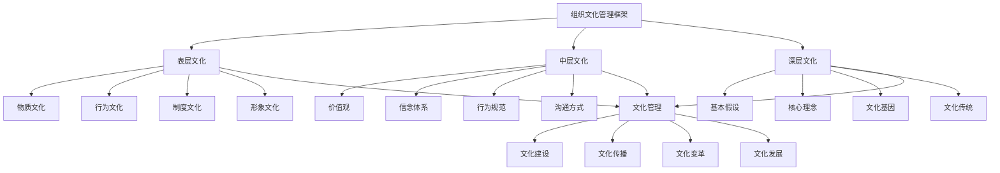

# 组织文化管理

## 🎯 组织文化管理概述

### 基本定义
**组织文化管理**是指对组织内部共享的价值观、信念、行为规范、沟通方式、决策模式等进行系统管理，以塑造积极的组织文化、提升组织效能、增强组织竞争力的管理活动。

### 核心特征
- **共享性**：组织成员共同认同的文化
- **稳定性**：相对稳定的文化特征
- **指导性**：指导组织行为的方向
- **差异性**：不同组织文化的独特性
- **发展性**：文化随组织发展而变化
- **影响力**：对组织行为产生深远影响

## 🎯 组织文化管理框架

### 1. 文化层次

#### 组织文化管理框架

#### 文化要素
- **表层文化**：物质、行为、制度、形象文化
- **中层文化**：价值观、信念、规范、沟通方式
- **深层文化**：基本假设、核心理念、文化基因、传统
- **文化管理**：建设、传播、变革、发展

### 2. 管理维度

#### 管理维度框架
- **文化诊断**：文化现状诊断分析
- **文化建设**：文化体系构建建设
- **文化传播**：文化理念传播推广
- **文化变革**：文化变革管理实施
- **文化发展**：文化持续发展优化

## 🔍 文化诊断分析

### 1. 文化现状诊断

#### 诊断要素
- **文化特征**：组织文化特征分析
- **文化强度**：组织文化强度分析
- **文化一致性**：组织文化一致性分析
- **文化适应性**：组织文化适应性分析

#### 诊断方法
- **文化审计**：文化审计方法
- **文化调研**：文化调研方法
- **文化访谈**：文化访谈方法
- **文化观察**：文化观察方法

### 2. 文化问题识别

#### 问题类型
- **文化缺失**：文化要素缺失问题
- **文化冲突**：文化要素冲突问题
- **文化滞后**：文化发展滞后问题
- **文化不适应**：文化与环境不适应问题

#### 问题分析
- **问题识别**：问题识别方法
- **原因分析**：问题原因分析
- **影响评估**：问题影响评估
- **解决方案**：问题解决方案

### 3. 文化优势分析

#### 优势要素
- **文化优势**：组织文化优势分析
- **文化特色**：组织文化特色分析
- **文化资源**：组织文化资源分析
- **文化潜力**：组织文化潜力分析

#### 优势利用
- **优势识别**：优势识别方法
- **优势发挥**：优势发挥策略
- **优势强化**：优势强化措施
- **优势转化**：优势转化方法

## 🏗️ 文化建设管理

### 1. 文化体系构建

#### 体系要素
- **核心价值观**：核心价值观体系
- **文化理念**：文化理念体系
- **行为规范**：行为规范体系
- **文化制度**：文化制度体系

#### 构建方法
- **体系设计**：文化体系设计方法
- **体系整合**：文化体系整合方法
- **体系优化**：文化体系优化方法
- **体系完善**：文化体系完善方法

### 2. 文化内容建设

#### 内容要素
- **使命愿景**：组织使命愿景
- **价值观念**：组织价值观念
- **行为准则**：组织行为准则
- **文化故事**：组织文化故事

#### 建设方法
- **内容设计**：文化内容设计方法
- **内容创作**：文化内容创作方法
- **内容整合**：文化内容整合方法
- **内容优化**：文化内容优化方法

### 3. 文化载体建设

#### 载体要素
- **物质载体**：文化物质载体
- **制度载体**：文化制度载体
- **活动载体**：文化活动载体
- **媒体载体**：文化媒体载体

#### 建设方法
- **载体设计**：文化载体设计方法
- **载体建设**：文化载体建设方法
- **载体整合**：文化载体整合方法
- **载体优化**：文化载体优化方法

### 4. 文化环境建设

#### 环境要素
- **物理环境**：文化物理环境
- **心理环境**：文化心理环境
- **社会环境**：文化社会环境
- **制度环境**：文化制度环境

#### 建设方法
- **环境设计**：文化环境设计方法
- **环境营造**：文化环境营造方法
- **环境维护**：文化环境维护方法
- **环境优化**：文化环境优化方法

## 📢 文化传播管理

### 1. 文化传播策略

#### 策略要素
- **传播目标**：文化传播目标
- **传播内容**：文化传播内容
- **传播渠道**：文化传播渠道
- **传播方式**：文化传播方式

#### 策略制定
- **目标设定**：传播目标设定方法
- **内容策划**：传播内容策划方法
- **渠道选择**：传播渠道选择方法
- **方式设计**：传播方式设计方法

### 2. 文化传播实施

#### 实施要素
- **传播计划**：文化传播计划
- **传播执行**：文化传播执行
- **传播监控**：文化传播监控
- **传播评估**：文化传播评估

#### 实施方法
- **计划制定**：传播计划制定方法
- **执行管理**：传播执行管理方法
- **监控控制**：传播监控控制方法
- **评估改进**：传播评估改进方法

### 3. 文化传播渠道

#### 渠道类型
- **正式渠道**：正式传播渠道
- **非正式渠道**：非正式传播渠道
- **内部渠道**：内部传播渠道
- **外部渠道**：外部传播渠道

#### 渠道管理
- **渠道建设**：传播渠道建设方法
- **渠道优化**：传播渠道优化方法
- **渠道整合**：传播渠道整合方法
- **渠道创新**：传播渠道创新方法

### 4. 文化传播效果

#### 效果要素
- **认知效果**：文化认知效果
- **态度效果**：文化态度效果
- **行为效果**：文化行为效果
- **关系效果**：文化关系效果

#### 效果评估
- **效果测量**：传播效果测量方法
- **效果分析**：传播效果分析方法
- **效果改进**：传播效果改进方法
- **效果优化**：传播效果优化方法

## 🔄 文化变革管理

### 1. 文化变革规划

#### 规划要素
- **变革目标**：文化变革目标
- **变革内容**：文化变革内容
- **变革策略**：文化变革策略
- **变革计划**：文化变革计划

#### 规划方法
- **目标设定**：变革目标设定方法
- **内容设计**：变革内容设计方法
- **策略制定**：变革策略制定方法
- **计划制定**：变革计划制定方法

### 2. 文化变革实施

#### 实施要素
- **变革启动**：文化变革启动
- **变革推进**：文化变革推进
- **变革监控**：文化变革监控
- **变革调整**：文化变革调整

#### 实施方法
- **启动管理**：变革启动管理方法
- **推进管理**：变革推进管理方法
- **监控管理**：变革监控管理方法
- **调整管理**：变革调整管理方法

### 3. 文化变革阻力

#### 阻力类型
- **认知阻力**：认知层面的阻力
- **情感阻力**：情感层面的阻力
- **行为阻力**：行为层面的阻力
- **制度阻力**：制度层面的阻力

#### 阻力管理
- **阻力识别**：变革阻力识别方法
- **阻力分析**：变革阻力分析方法
- **阻力应对**：变革阻力应对方法
- **阻力转化**：变革阻力转化方法

### 4. 文化变革效果

#### 效果要素
- **变革成果**：文化变革成果
- **变革影响**：文化变革影响
- **变革价值**：文化变革价值
- **变革持续**：文化变革持续性

#### 效果评估
- **成果评估**：变革成果评估方法
- **影响评估**：变革影响评估方法
- **价值评估**：变革价值评估方法
- **持续评估**：变革持续性评估方法

## 📈 文化发展管理

### 1. 文化发展策略

#### 策略要素
- **发展方向**：文化发展方向
- **发展目标**：文化发展目标
- **发展路径**：文化发展路径
- **发展重点**：文化发展重点

#### 策略制定
- **方向确定**：发展方向确定方法
- **目标设定**：发展目标设定方法
- **路径规划**：发展路径规划方法
- **重点选择**：发展重点选择方法

### 2. 文化发展实施

#### 实施要素
- **发展计划**：文化发展计划
- **发展执行**：文化发展执行
- **发展监控**：文化发展监控
- **发展评估**：文化发展评估

#### 实施方法
- **计划制定**：发展计划制定方法
- **执行管理**：发展执行管理方法
- **监控管理**：发展监控管理方法
- **评估管理**：发展评估管理方法

### 3. 文化创新发展

#### 创新要素
- **文化创新**：文化内容创新
- **传播创新**：文化传播创新
- **管理创新**：文化管理创新
- **载体创新**：文化载体创新

#### 创新方法
- **创新思维**：文化创新思维方法
- **创新方法**：文化创新方法
- **创新实践**：文化创新实践方法
- **创新评估**：文化创新评估方法

### 4. 文化发展评估

#### 评估要素
- **发展水平**：文化发展水平
- **发展质量**：文化发展质量
- **发展效果**：文化发展效果
- **发展潜力**：文化发展潜力

#### 评估方法
- **水平评估**：发展水平评估方法
- **质量评估**：发展质量评估方法
- **效果评估**：发展效果评估方法
- **潜力评估**：发展潜力评估方法

## 🔍 组织文化管理方法

### 1. 文化管理工具

#### 工具类型
- **诊断工具**：文化诊断工具
- **建设工具**：文化建设工具
- **传播工具**：文化传播工具
- **评估工具**：文化评估工具

#### 工具应用
- **工具选择**：工具选择方法
- **工具使用**：工具使用方法
- **工具优化**：工具优化方法
- **工具创新**：工具创新方法

### 2. 文化管理技术

#### 技术类型
- **分析技术**：文化分析技术
- **设计技术**：文化设计技术
- **实施技术**：文化实施技术
- **评估技术**：文化评估技术

#### 技术应用
- **技术选择**：技术选择方法
- **技术使用**：技术使用方法
- **技术优化**：技术优化方法
- **技术创新**：技术创新方法

### 3. 文化管理流程

#### 流程要素
- **管理流程**：文化管理流程
- **操作流程**：文化操作流程
- **监控流程**：文化监控流程
- **改进流程**：文化改进流程

#### 流程管理
- **流程设计**：流程设计方法
- **流程优化**：流程优化方法
- **流程控制**：流程控制方法
- **流程改进**：流程改进方法

### 4. 文化管理标准

#### 标准要素
- **管理标准**：文化管理标准
- **质量标准**：文化质量标准
- **评估标准**：文化评估标准
- **改进标准**：文化改进标准

#### 标准管理
- **标准制定**：标准制定方法
- **标准实施**：标准实施方法
- **标准监控**：标准监控方法
- **标准改进**：标准改进方法

## 🎯 组织文化管理应用

### 1. 组织管理

#### 管理应用
- **组织设计**：文化导向的组织设计
- **组织发展**：文化驱动的组织发展
- **组织变革**：文化支撑的组织变革
- **组织评估**：文化维度的组织评估

#### 管理策略
- **文化导向**：文化导向管理策略
- **文化驱动**：文化驱动管理策略
- **文化支撑**：文化支撑管理策略
- **文化评估**：文化评估管理策略

### 2. 人力资源管理

#### 管理应用
- **招聘管理**：文化匹配的招聘管理
- **培训管理**：文化导向的培训管理
- **绩效管理**：文化维度的绩效管理
- **激励管理**：文化激励的管理

#### 管理策略
- **文化匹配**：文化匹配管理策略
- **文化导向**：文化导向管理策略
- **文化维度**：文化维度管理策略
- **文化激励**：文化激励管理策略

### 3. 战略管理

#### 管理应用
- **战略制定**：文化支撑的战略制定
- **战略实施**：文化驱动的战略实施
- **战略评估**：文化维度的战略评估
- **战略调整**：文化导向的战略调整

#### 管理策略
- **文化支撑**：文化支撑管理策略
- **文化驱动**：文化驱动管理策略
- **文化维度**：文化维度管理策略
- **文化导向**：文化导向管理策略

### 4. 创新管理

#### 管理应用
- **创新环境**：文化创新的环境营造
- **创新激励**：文化创新的激励机制
- **创新支持**：文化创新的支持体系
- **创新评估**：文化创新的评估体系

#### 管理策略
- **环境营造**：创新环境营造策略
- **激励机制**：创新激励机制策略
- **支持体系**：创新支持体系策略
- **评估体系**：创新评估体系策略

## 📊 组织文化管理案例

### 1. 企业文化变革案例

#### 案例背景
某企业在数字化转型过程中面临文化不适应、员工抵触、变革阻力大等问题，需要进行文化变革管理。

#### 管理过程
- **文化诊断**：诊断现有文化特征和问题
- **变革规划**：制定文化变革规划和策略
- **变革实施**：实施文化变革措施
- **变革评估**：评估文化变革效果

#### 管理结果
- **文化适应**：文化适应数字化转型
- **员工接受**：员工接受文化变革
- **阻力化解**：化解文化变革阻力
- **效果显著**：文化变革效果显著

#### 成功因素
- **高层支持**：获得高层管理支持
- **全员参与**：全员参与文化变革
- **系统推进**：系统推进文化变革
- **持续改进**：持续改进文化管理

### 2. 组织文化建设案例

#### 案例背景
某新成立的组织需要建立积极的组织文化，提升组织凝聚力和竞争力。

#### 管理过程
- **文化设计**：设计组织文化体系
- **文化建设**：建设组织文化内容
- **文化传播**：传播组织文化理念
- **文化发展**：发展组织文化特色

#### 管理结果
- **文化建立**：建立积极的组织文化
- **凝聚力提升**：提升组织凝聚力
- **竞争力增强**：增强组织竞争力
- **特色形成**：形成组织文化特色

#### 成功因素
- **系统设计**：系统设计文化体系
- **全员参与**：全员参与文化建设
- **持续传播**：持续传播文化理念
- **特色发展**：发展组织文化特色

## 🎯 组织文化管理最佳实践

### 1. 管理原则

#### 基本原则
- **系统性原则**：系统管理组织文化
- **一致性原则**：保持文化一致性
- **适应性原则**：适应环境变化
- **发展性原则**：持续发展文化

#### 应用原则
- **目标导向**：以组织目标为导向
- **价值导向**：以核心价值观为导向
- **效能导向**：以组织效能为导向
- **创新导向**：以创新发展为导向

### 2. 管理方法

#### 管理方法
- **系统管理**：系统管理文化
- **过程管理**：过程管理文化
- **结果管理**：结果管理文化
- **持续管理**：持续管理文化

#### 管理工具
- **诊断工具**：文化诊断工具
- **建设工具**：文化建设工具
- **传播工具**：文化传播工具
- **评估工具**：文化评估工具

### 3. 实施要点

#### 实施要点
- **高层支持**：获得高层管理支持
- **全员参与**：全员参与文化管理
- **系统推进**：系统推进文化管理
- **持续改进**：持续改进文化管理

#### 注意事项
- **避免形式化**：避免文化管理形式化
- **避免表面化**：避免文化管理表面化
- **避免孤立化**：避免文化管理孤立化
- **避免静态化**：避免文化管理静态化

## 📚 学习要点总结

### 核心概念
1. **组织文化管理**：管理组织文化的管理活动
2. **文化层次**：表层、中层、深层文化
3. **文化诊断**：文化现状诊断分析
4. **文化建设**：文化体系构建建设
5. **文化传播**：文化理念传播推广
6. **文化变革**：文化变革管理实施
7. **文化发展**：文化持续发展优化
8. **管理方法**：诊断、建设、传播、变革、发展方法

### 关键理解
- 组织文化管理是组织管理的重要组成部分
- 组织文化具有层次性和系统性特征
- 文化诊断是文化管理的基础
- 文化建设是文化管理的核心
- 文化传播是文化管理的关键
- 文化变革是文化管理的重点
- 文化发展是文化管理的目标
- 文化管理需要系统性和持续性

### 实践应用
- 运用文化管理优化组织管理
- 运用文化管理促进组织发展
- 运用文化管理支撑组织变革
- 运用文化管理提升组织效能
- 运用文化管理增强组织凝聚力
- 运用文化管理提升组织竞争力
- 运用文化管理促进组织创新
- 运用文化管理实现组织目标

## 🔗 相关链接

- [[个体行为分析]] - 个体行为分析
- [[群体行为分析]] - 群体行为分析
- [[组织行为分析]] - 组织行为分析
- [[实践练习-组织行为分析]] - 实践练习-组织行为分析

## 📚 延伸阅读

- [[组织行为学]] - 组织行为学理论
- [[组织文化学]] - 组织文化学理论
- [[文化管理学]] - 文化管理学理论
- [[组织发展学]] - 组织发展学理论

---
*更新时间：2024年*
*内容将根据学习反馈持续优化*
