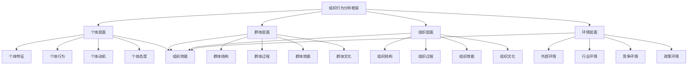

# 组织行为分析

## 🎯 组织行为分析概述

### 基本定义
**组织行为分析**是指对组织内部个体、群体和组织层面的行为模式、互动关系、决策过程、沟通方式等进行系统分析，以理解组织动态、提高组织效能、优化组织管理的管理分析方法。

### 核心特征
- **系统性**：系统分析组织行为
- **层次性**：分析个体、群体、组织层次
- **动态性**：关注组织行为变化
- **互动性**：分析各层次间互动
- **情境性**：考虑组织情境因素
- **效能性**：关注组织效能提升

## 🎯 组织行为分析框架

### 1. 分析层次

#### 组织行为分析框架

#### 分析要素
- **个体层面**：个体特征、行为、动机、态度
- **群体层面**：群体结构、过程、效能、文化
- **组织层面**：组织结构、过程、效能、文化
- **环境层面**：外部、行业、竞争、政策环境

### 2. 分析维度

#### 分析维度框架
- **行为维度**：行为模式、行为特征、行为变化
- **关系维度**：人际关系、群体关系、组织关系
- **过程维度**：决策过程、沟通过程、变革过程
- **效能维度**：个体效能、群体效能、组织效能

## 👤 个体层面分析

### 1. 个体特征分析

#### 特征要素
- **个性特征**：个性类型、个性特点
- **能力特征**：能力水平、能力结构
- **经验特征**：工作经验、学习经验
- **背景特征**：教育背景、文化背景

#### 特征影响
- **行为影响**：特征对行为的影响
- **绩效影响**：特征对绩效的影响
- **适应影响**：特征对适应的影响
- **发展影响**：特征对发展的影响

### 2. 个体行为分析

#### 行为要素
- **行为模式**：行为模式分析
- **行为动机**：行为动机分析
- **行为态度**：行为态度分析
- **行为变化**：行为变化分析

#### 行为管理
- **行为引导**：行为引导方法
- **行为激励**：行为激励方法
- **行为控制**：行为控制方法
- **行为改进**：行为改进方法

### 3. 个体动机分析

#### 动机要素
- **内在动机**：内在动机分析
- **外在动机**：外在动机分析
- **动机强度**：动机强度分析
- **动机变化**：动机变化分析

#### 动机管理
- **动机激发**：动机激发方法
- **动机维持**：动机维持方法
- **动机调节**：动机调节方法
- **动机发展**：动机发展方法

### 4. 个体态度分析

#### 态度要素
- **工作态度**：工作态度分析
- **组织态度**：组织态度分析
- **同事态度**：同事态度分析
- **领导态度**：领导态度分析

#### 态度管理
- **态度形成**：态度形成过程
- **态度改变**：态度改变方法
- **态度强化**：态度强化方法
- **态度测量**：态度测量方法

## 👥 群体层面分析

### 1. 群体结构分析

#### 结构要素
- **群体规模**：群体规模分析
- **群体构成**：群体构成分析
- **群体角色**：群体角色分析
- **群体规范**：群体规范分析

#### 结构影响
- **行为影响**：结构对行为的影响
- **效能影响**：结构对效能的影响
- **关系影响**：结构对关系的影响
- **创新影响**：结构对创新的影响

### 2. 群体过程分析

#### 过程要素
- **沟通过程**：沟通过程分析
- **决策过程**：决策过程分析
- **冲突过程**：冲突过程分析
- **领导过程**：领导过程分析

#### 过程管理
- **过程优化**：过程优化方法
- **过程控制**：过程控制方法
- **过程改进**：过程改进方法
- **过程创新**：过程创新方法

### 3. 群体效能分析

#### 效能要素
- **任务效能**：任务效能分析
- **关系效能**：关系效能分析
- **学习效能**：学习效能分析
- **创新效能**：创新效能分析

#### 效能提升
- **效能评估**：效能评估方法
- **效能改进**：效能改进方法
- **效能激励**：效能激励方法
- **效能发展**：效能发展方法

### 4. 群体文化分析

#### 文化要素
- **价值观**：群体价值观分析
- **行为规范**：行为规范分析
- **沟通方式**：沟通方式分析
- **决策方式**：决策方式分析

#### 文化管理
- **文化建设**：文化建设方法
- **文化传播**：文化传播方法
- **文化变革**：文化变革方法
- **文化发展**：文化发展方法

## 🏢 组织层面分析

### 1. 组织结构分析

#### 结构要素
- **组织设计**：组织设计分析
- **组织层级**：组织层级分析
- **组织职能**：组织职能分析
- **组织关系**：组织关系分析

#### 结构影响
- **行为影响**：结构对行为的影响
- **效能影响**：结构对效能的影响
- **沟通影响**：结构对沟通的影响
- **决策影响**：结构对决策的影响

### 2. 组织过程分析

#### 过程要素
- **决策过程**：组织决策过程分析
- **沟通过程**：组织沟通过程分析
- **变革过程**：组织变革过程分析
- **学习过程**：组织学习过程分析

#### 过程管理
- **过程设计**：过程设计方法
- **过程优化**：过程优化方法
- **过程控制**：过程控制方法
- **过程改进**：过程改进方法

### 3. 组织效能分析

#### 效能要素
- **战略效能**：战略效能分析
- **运营效能**：运营效能分析
- **创新效能**：创新效能分析
- **学习效能**：学习效能分析

#### 效能提升
- **效能评估**：效能评估方法
- **效能改进**：效能改进方法
- **效能激励**：效能激励方法
- **效能发展**：效能发展方法

### 4. 组织文化分析

#### 文化要素
- **核心价值观**：核心价值观分析
- **文化特征**：文化特征分析
- **文化氛围**：文化氛围分析
- **文化发展**：文化发展分析

#### 文化管理
- **文化建设**：文化建设方法
- **文化传播**：文化传播方法
- **文化变革**：文化变革方法
- **文化发展**：文化发展方法

## 🌍 环境层面分析

### 1. 外部环境分析

#### 环境要素
- **政治环境**：政治环境分析
- **经济环境**：经济环境分析
- **社会环境**：社会环境分析
- **技术环境**：技术环境分析

#### 环境影响
- **组织影响**：环境对组织的影响
- **行为影响**：环境对行为的影响
- **战略影响**：环境对战略的影响
- **变革影响**：环境对变革的影响

### 2. 行业环境分析

#### 环境要素
- **行业特征**：行业特征分析
- **行业趋势**：行业趋势分析
- **行业竞争**：行业竞争分析
- **行业机会**：行业机会分析

#### 环境影响
- **竞争影响**：行业对竞争的影响
- **创新影响**：行业对创新的影响
- **发展影响**：行业对发展的影响
- **变革影响**：行业对变革的影响

### 3. 竞争环境分析

#### 环境要素
- **竞争对手**：竞争对手分析
- **竞争态势**：竞争态势分析
- **竞争优势**：竞争优势分析
- **竞争策略**：竞争策略分析

#### 环境影响
- **战略影响**：竞争对战略的影响
- **行为影响**：竞争对行为的影响
- **创新影响**：竞争对创新的影响
- **发展影响**：竞争对发展的影响

### 4. 政策环境分析

#### 环境要素
- **政策法规**：政策法规分析
- **政策趋势**：政策趋势分析
- **政策影响**：政策影响分析
- **政策机会**：政策机会分析

#### 环境影响
- **合规影响**：政策对合规的影响
- **发展影响**：政策对发展的影响
- **创新影响**：政策对创新的影响
- **变革影响**：政策对变革的影响

## 🔍 组织行为分析方法

### 1. 定量分析方法

#### 分析方法
- **统计分析**：统计分析方法
- **回归分析**：回归分析方法
- **因子分析**：因子分析方法
- **聚类分析**：聚类分析方法

#### 分析工具
- **统计软件**：SPSS、R、Python
- **分析模型**：分析模型工具
- **数据挖掘**：数据挖掘工具
- **可视化工具**：可视化分析工具

### 2. 定性分析方法

#### 分析方法
- **案例研究**：案例研究方法
- **访谈分析**：访谈分析方法
- **观察分析**：观察分析方法
- **内容分析**：内容分析方法

#### 分析工具
- **访谈工具**：访谈工具和方法
- **观察工具**：观察工具和方法
- **分析框架**：分析框架工具
- **报告工具**：报告生成工具

### 3. 混合分析方法

#### 分析方法
- **混合研究**：混合研究方法
- **三角验证**：三角验证方法
- **多方法分析**：多方法分析方法
- **综合分析**：综合分析方法

#### 分析工具
- **混合工具**：混合分析工具
- **验证工具**：验证分析工具
- **综合工具**：综合分析工具
- **报告工具**：综合报告工具

### 4. 系统分析方法

#### 分析方法
- **系统思维**：系统思维方法
- **系统分析**：系统分析方法
- **系统设计**：系统设计方法
- **系统优化**：系统优化方法

#### 分析工具
- **系统工具**：系统分析工具
- **建模工具**：建模分析工具
- **仿真工具**：仿真分析工具
- **优化工具**：优化分析工具

## 🎯 组织行为分析应用

### 1. 组织诊断

#### 诊断应用
- **问题识别**：组织问题识别
- **原因分析**：问题原因分析
- **影响评估**：问题影响评估
- **解决方案**：问题解决方案

#### 诊断方法
- **诊断工具**：诊断工具和方法
- **诊断流程**：诊断流程和步骤
- **诊断报告**：诊断报告和结果
- **诊断改进**：诊断改进和完善

### 2. 组织设计

#### 设计应用
- **结构设计**：组织结构设计
- **流程设计**：组织流程设计
- **文化设计**：组织文化设计
- **系统设计**：组织系统设计

#### 设计方法
- **设计原则**：设计原则和方法
- **设计工具**：设计工具和技术
- **设计流程**：设计流程和步骤
- **设计评估**：设计评估和改进

### 3. 组织变革

#### 变革应用
- **变革规划**：变革规划制定
- **变革实施**：变革实施管理
- **变革监控**：变革监控评估
- **变革评估**：变革效果评估

#### 变革方法
- **变革模型**：变革模型和方法
- **变革工具**：变革工具和技术
- **变革流程**：变革流程和步骤
- **变革管理**：变革管理方法

### 4. 组织发展

#### 发展应用
- **发展规划**：发展规划制定
- **发展实施**：发展实施管理
- **发展监控**：发展监控评估
- **发展评估**：发展效果评估

#### 发展方法
- **发展模型**：发展模型和方法
- **发展工具**：发展工具和技术
- **发展流程**：发展流程和步骤
- **发展管理**：发展管理方法

## 📊 组织行为分析案例

### 1. 企业重组案例

#### 案例背景
某企业在重组过程中出现员工士气低落、工作效率下降、离职率上升等问题，需要进行组织行为分析。

#### 分析过程
- **个体分析**：分析员工个体特征、行为、动机、态度
- **群体分析**：分析群体结构、过程、效能、文化
- **组织分析**：分析组织结构、过程、效能、文化
- **环境分析**：分析外部环境、行业环境、竞争环境

#### 分析结果
- **个体问题**：员工动机下降、态度消极
- **群体问题**：群体凝聚力下降、沟通不畅
- **组织问题**：组织结构不合理、文化不适应
- **环境问题**：外部环境变化、竞争加剧

#### 改进措施
- **个体改进**：提升员工动机、改善员工态度
- **群体改进**：增强群体凝聚力、改善沟通
- **组织改进**：优化组织结构、建设组织文化
- **环境适应**：适应外部环境、应对竞争

### 2. 组织变革案例

#### 案例背景
某组织在数字化转型过程中面临员工适应困难、变革阻力大、效果不明显等问题。

#### 分析过程
- **变革分析**：分析变革过程、阻力、效果
- **行为分析**：分析员工行为变化、适应情况
- **文化分析**：分析组织文化、变革文化
- **效能分析**：分析变革效能、组织效能

#### 分析结果
- **变革阻力**：员工变革阻力大
- **适应困难**：员工适应新环境困难
- **文化冲突**：新旧文化冲突
- **效能下降**：组织效能暂时下降

#### 改进措施
- **阻力管理**：管理变革阻力
- **适应支持**：支持员工适应
- **文化整合**：整合新旧文化
- **效能提升**：提升组织效能

## 🎯 组织行为分析最佳实践

### 1. 分析原则

#### 基本原则
- **系统性原则**：系统分析组织行为
- **层次性原则**：分层分析组织行为
- **动态性原则**：关注组织行为变化
- **情境性原则**：考虑组织情境因素

#### 应用原则
- **目标导向**：以组织目标为导向
- **效能导向**：以组织效能为导向
- **发展导向**：以组织发展为导向
- **创新导向**：以组织创新为导向

### 2. 分析方法

#### 分析方法
- **定量分析**：进行定量数据分析
- **定性分析**：进行定性分析
- **比较分析**：进行比较分析
- **趋势分析**：进行趋势分析

#### 分析工具
- **分析框架**：使用分析框架
- **分析模型**：使用分析模型
- **分析软件**：使用分析软件
- **分析报告**：生成分析报告

### 3. 实施要点

#### 实施要点
- **数据质量**：确保数据质量
- **分析深度**：确保分析深度
- **结果应用**：重视结果应用
- **持续改进**：持续改进完善

#### 注意事项
- **避免偏见**：避免分析偏见
- **避免表面化**：避免分析表面化
- **避免孤立化**：避免分析孤立化
- **避免静态化**：避免分析静态化

## 📚 学习要点总结

### 核心概念
1. **组织行为分析**：分析组织行为的管理方法
2. **个体层面**：个体特征、行为、动机、态度
3. **群体层面**：群体结构、过程、效能、文化
4. **组织层面**：组织结构、过程、效能、文化
5. **环境层面**：外部、行业、竞争、政策环境
6. **分析方法**：定量、定性、混合、系统分析方法
7. **应用领域**：组织诊断、设计、变革、发展
8. **最佳实践**：分析原则、方法、实施要点

### 关键理解
- 组织行为分析是组织管理的重要工具
- 个体、群体、组织、环境四个层面相互影响
- 组织行为分析需要系统性和层次性
- 组织行为分析需要动态性和情境性
- 组织行为分析需要定量和定性结合
- 组织行为分析需要客观性和科学性
- 组织行为分析需要实用性和可操作性
- 组织行为分析需要持续性和改进性

### 实践应用
- 运用组织行为分析进行组织诊断
- 运用组织行为分析优化组织设计
- 运用组织行为分析管理组织变革
- 运用组织行为分析促进组织发展
- 运用组织行为分析提升组织效能
- 运用组织行为分析改善组织文化
- 运用组织行为分析增强组织适应能力
- 运用组织行为分析实现组织目标

## 🔗 相关链接

- [[个体行为分析]] - 个体行为分析
- [[群体行为分析]] - 群体行为分析
- [[组织文化管理]] - 组织文化管理
- [[实践练习-组织行为分析]] - 实践练习-组织行为分析

## 📚 延伸阅读

- [[组织行为学]] - 组织行为学理论
- [[组织心理学]] - 组织心理学理论
- [[组织社会学]] - 组织社会学理论
- [[组织管理学]] - 组织管理学理论

---
*更新时间：2024年*
*内容将根据学习反馈持续优化*
