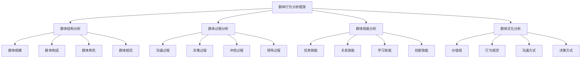

# 群体行为分析

## 🎯 群体行为分析概述

### 基本定义
**群体行为分析**是指对组织中群体成员在群体环境中的行为模式、互动关系、决策过程、沟通方式等进行系统分析，以理解群体动态、提高群体效能、优化群体管理的管理分析方法。

### 核心特征
- **系统性**：系统分析群体行为
- **动态性**：关注群体行为变化
- **互动性**：分析成员间互动
- **情境性**：考虑群体情境因素
- **目标性**：以群体目标为导向
- **效能性**：关注群体效能提升

## 🎯 群体行为分析框架

### 1. 分析维度

#### 群体行为分析框架

#### 分析要素
- **群体结构**：群体规模、构成、角色、规范
- **群体过程**：沟通、决策、冲突、领导过程
- **群体效能**：任务、关系、学习、创新效能
- **群体文化**：价值观、规范、沟通、决策方式

### 2. 分析层次

#### 分析层次框架
- **个体层面**：个体在群体中的行为
- **群体层面**：群体整体行为特征
- **组织层面**：群体与组织的关系
- **环境层面**：群体与环境的关系

## 👥 群体结构分析

### 1. 群体规模分析

#### 规模要素
- **群体大小**：群体成员数量
- **规模效应**：规模对行为的影响
- **最优规模**：群体最优规模
- **规模变化**：群体规模变化趋势

#### 规模影响
- **沟通影响**：规模对沟通的影响
- **决策影响**：规模对决策的影响
- **凝聚力影响**：规模对凝聚力的影响
- **效能影响**：规模对效能的影响

### 2. 群体构成分析

#### 构成要素
- **成员特征**：成员个人特征
- **技能构成**：成员技能构成
- **经验构成**：成员经验构成
- **背景构成**：成员背景构成

#### 构成影响
- **多样性影响**：多样性对群体的影响
- **互补性影响**：互补性对群体的影响
- **冲突影响**：构成对冲突的影响
- **创新影响**：构成对创新的影响

### 3. 群体角色分析

#### 角色类型
- **任务角色**：任务导向角色
- **关系角色**：关系维护角色
- **自我角色**：自我中心角色
- **领导角色**：领导管理角色

#### 角色分析
- **角色期望**：角色期望分析
- **角色冲突**：角色冲突分析
- **角色模糊**：角色模糊分析
- **角色发展**：角色发展分析

### 4. 群体规范分析

#### 规范类型
- **正式规范**：正式制度规范
- **非正式规范**：非正式行为规范
- **显性规范**：明确表达的规范
- **隐性规范**：隐含的规范

#### 规范影响
- **行为影响**：规范对行为的影响
- **一致性影响**：规范对一致性的影响
- **创新影响**：规范对创新的影响
- **变革影响**：规范对变革的影响

## 🔄 群体过程分析

### 1. 沟通过程分析

#### 沟通要素
- **沟通渠道**：沟通渠道分析
- **沟通方式**：沟通方式分析
- **沟通频率**：沟通频率分析
- **沟通质量**：沟通质量分析

#### 沟通影响
- **信息传递**：沟通对信息传递的影响
- **关系建立**：沟通对关系建立的影响
- **决策支持**：沟通对决策的支持
- **冲突解决**：沟通对冲突解决的影响

### 2. 决策过程分析

#### 决策要素
- **决策方式**：决策方式分析
- **决策参与**：决策参与分析
- **决策质量**：决策质量分析
- **决策效率**：决策效率分析

#### 决策影响
- **决策接受度**：决策过程对接受度的影响
- **决策质量**：决策过程对质量的影响
- **决策效率**：决策过程对效率的影响
- **决策创新**：决策过程对创新的影响

### 3. 冲突过程分析

#### 冲突类型
- **任务冲突**：任务相关冲突
- **关系冲突**：人际关系冲突
- **过程冲突**：过程相关冲突
- **价值观冲突**：价值观冲突

#### 冲突管理
- **冲突识别**：冲突识别方法
- **冲突分析**：冲突分析方法
- **冲突解决**：冲突解决方法
- **冲突预防**：冲突预防方法

### 4. 领导过程分析

#### 领导要素
- **领导风格**：领导风格分析
- **领导行为**：领导行为分析
- **领导效能**：领导效能分析
- **领导发展**：领导发展分析

#### 领导影响
- **群体效能**：领导对群体效能的影响
- **成员满意度**：领导对成员满意度的影响
- **群体凝聚力**：领导对凝聚力的影响
- **群体创新**：领导对群体创新的影响

## 📊 群体效能分析

### 1. 任务效能分析

#### 效能要素
- **任务完成**：任务完成情况
- **质量标准**：质量标准达成
- **时间效率**：时间效率分析
- **资源利用**：资源利用效率

#### 效能提升
- **目标设定**：目标设定优化
- **过程优化**：过程优化改进
- **资源配置**：资源配置优化
- **质量控制**：质量控制改进

### 2. 关系效能分析

#### 关系要素
- **成员关系**：成员间关系质量
- **信任水平**：成员间信任水平
- **合作程度**：成员间合作程度
- **支持程度**：成员间支持程度

#### 关系提升
- **关系建设**：关系建设活动
- **信任建立**：信任建立机制
- **合作促进**：合作促进措施
- **支持强化**：支持强化机制

### 3. 学习效能分析

#### 学习要素
- **学习能力**：群体学习能力
- **知识共享**：知识共享程度
- **经验积累**：经验积累情况
- **技能提升**：技能提升情况

#### 学习提升
- **学习机制**：学习机制建设
- **知识管理**：知识管理体系
- **经验总结**：经验总结机制
- **技能培训**：技能培训体系

### 4. 创新效能分析

#### 创新要素
- **创新意识**：群体创新意识
- **创新行为**：群体创新行为
- **创新成果**：群体创新成果
- **创新环境**：群体创新环境

#### 创新提升
- **创新激励**：创新激励机制
- **创新支持**：创新支持体系
- **创新文化**：创新文化建设
- **创新管理**：创新管理体系

## 🏛️ 群体文化分析

### 1. 价值观分析

#### 价值观要素
- **核心价值观**：群体核心价值观
- **价值认同**：价值认同程度
- **价值冲突**：价值冲突情况
- **价值发展**：价值发展变化

#### 价值观影响
- **行为影响**：价值观对行为的影响
- **决策影响**：价值观对决策的影响
- **关系影响**：价值观对关系的影响
- **效能影响**：价值观对效能的影响

### 2. 行为规范分析

#### 规范要素
- **行为标准**：行为标准设定
- **规范执行**：规范执行情况
- **规范调整**：规范调整机制
- **规范发展**：规范发展变化

#### 规范影响
- **行为一致性**：规范对行为一致性的影响
- **行为质量**：规范对行为质量的影响
- **行为创新**：规范对行为创新的影响
- **行为变革**：规范对行为变革的影响

### 3. 沟通方式分析

#### 沟通要素
- **沟通风格**：群体沟通风格
- **沟通习惯**：群体沟通习惯
- **沟通偏好**：群体沟通偏好
- **沟通效果**：群体沟通效果

#### 沟通影响
- **信息传递**：沟通方式对信息传递的影响
- **关系建立**：沟通方式对关系建立的影响
- **决策支持**：沟通方式对决策的支持
- **冲突解决**：沟通方式对冲突解决的影响

### 4. 决策方式分析

#### 决策要素
- **决策风格**：群体决策风格
- **决策习惯**：群体决策习惯
- **决策偏好**：群体决策偏好
- **决策效果**：群体决策效果

#### 决策影响
- **决策质量**：决策方式对质量的影响
- **决策效率**：决策方式对效率的影响
- **决策接受度**：决策方式对接受度的影响
- **决策创新**：决策方式对创新的影响

## 🔍 群体行为分析方法

### 1. 观察方法

#### 观察类型
- **参与观察**：参与式观察
- **非参与观察**：非参与式观察
- **结构化观察**：结构化观察
- **非结构化观察**：非结构化观察

#### 观察技巧
- **观察计划**：制定观察计划
- **观察记录**：记录观察结果
- **观察分析**：分析观察数据
- **观察报告**：撰写观察报告

### 2. 访谈方法

#### 访谈类型
- **个别访谈**：个别成员访谈
- **群体访谈**：群体成员访谈
- **结构化访谈**：结构化访谈
- **非结构化访谈**：非结构化访谈

#### 访谈技巧
- **访谈准备**：访谈准备工作
- **访谈实施**：访谈实施过程
- **访谈记录**：访谈记录方法
- **访谈分析**：访谈数据分析

### 3. 问卷方法

#### 问卷类型
- **态度问卷**：态度测量问卷
- **行为问卷**：行为测量问卷
- **效能问卷**：效能测量问卷
- **文化问卷**：文化测量问卷

#### 问卷技巧
- **问卷设计**：问卷设计方法
- **问卷实施**：问卷实施过程
- **问卷分析**：问卷数据分析
- **问卷报告**：问卷结果报告

### 4. 实验方法

#### 实验类型
- **实验室实验**：实验室环境实验
- **现场实验**：现场环境实验
- **准实验**：准实验设计
- **自然实验**：自然实验设计

#### 实验技巧
- **实验设计**：实验设计方法
- **实验实施**：实验实施过程
- **实验分析**：实验数据分析
- **实验报告**：实验结果报告

## 🎯 群体行为分析应用

### 1. 群体管理

#### 管理应用
- **群体组建**：群体组建优化
- **群体发展**：群体发展促进
- **群体激励**：群体激励管理
- **群体评估**：群体效能评估

#### 管理策略
- **结构优化**：群体结构优化
- **过程改进**：群体过程改进
- **效能提升**：群体效能提升
- **文化建设**：群体文化建设

### 2. 团队建设

#### 建设应用
- **团队组建**：团队组建优化
- **团队发展**：团队发展促进
- **团队激励**：团队激励管理
- **团队评估**：团队效能评估

#### 建设策略
- **目标设定**：团队目标设定
- **角色分配**：团队角色分配
- **沟通优化**：团队沟通优化
- **冲突管理**：团队冲突管理

### 3. 组织发展

#### 发展应用
- **组织诊断**：组织问题诊断
- **组织干预**：组织干预措施
- **组织变革**：组织变革管理
- **组织评估**：组织发展评估

#### 发展策略
- **文化变革**：组织文化变革
- **结构优化**：组织结构优化
- **流程改进**：组织流程改进
- **能力建设**：组织能力建设

### 4. 领导发展

#### 发展应用
- **领导评估**：领导效能评估
- **领导培训**：领导能力培训
- **领导发展**：领导发展计划
- **领导支持**：领导支持体系

#### 发展策略
- **能力提升**：领导能力提升
- **风格优化**：领导风格优化
- **行为改进**：领导行为改进
- **效能提升**：领导效能提升

## 📊 群体行为分析案例

### 1. 项目团队案例

#### 案例背景
某项目团队在项目执行过程中出现沟通不畅、决策效率低、成员冲突等问题，需要进行群体行为分析。

#### 分析过程
- **结构分析**：分析团队规模、构成、角色、规范
- **过程分析**：分析沟通、决策、冲突、领导过程
- **效能分析**：分析任务、关系、学习、创新效能
- **文化分析**：分析价值观、规范、沟通、决策方式

#### 分析结果
- **结构问题**：角色不明确、规范不清晰
- **过程问题**：沟通不畅、决策效率低
- **效能问题**：任务效能低、关系紧张
- **文化问题**：价值观不一致、沟通方式不当

#### 改进措施
- **结构优化**：明确角色、建立规范
- **过程改进**：优化沟通、改进决策
- **效能提升**：提升任务效能、改善关系
- **文化建设**：统一价值观、改进沟通方式

### 2. 部门团队案例

#### 案例背景
某部门团队在部门重组后出现凝聚力下降、工作效率降低、成员满意度下降等问题。

#### 分析过程
- **群体分析**：分析群体结构、过程、效能、文化
- **问题识别**：识别群体存在的问题
- **原因分析**：分析问题产生的原因
- **解决方案**：制定问题解决方案

#### 分析结果
- **凝聚力问题**：群体凝聚力下降
- **效率问题**：工作效率降低
- **满意度问题**：成员满意度下降
- **文化问题**：群体文化不适应

#### 改进措施
- **凝聚力建设**：加强群体凝聚力建设
- **效率提升**：提升工作效率
- **满意度改善**：改善成员满意度
- **文化适应**：适应新的群体文化

## 🎯 群体行为分析最佳实践

### 1. 分析原则

#### 基本原则
- **客观性原则**：客观分析群体行为
- **系统性原则**：系统分析群体要素
- **动态性原则**：关注群体行为变化
- **情境性原则**：考虑群体情境因素

#### 应用原则
- **目标导向**：以群体目标为导向
- **效能导向**：以群体效能为导向
- **发展导向**：以群体发展为导向
- **创新导向**：以群体创新为导向

### 2. 分析方法

#### 分析方法
- **定量分析**：进行定量数据分析
- **定性分析**：进行定性分析
- **比较分析**：进行比较分析
- **趋势分析**：进行趋势分析

#### 分析工具
- **分析框架**：使用分析框架
- **分析模型**：使用分析模型
- **分析软件**：使用分析软件
- **分析报告**：生成分析报告

### 3. 实施要点

#### 实施要点
- **数据质量**：确保数据质量
- **分析深度**：确保分析深度
- **结果应用**：重视结果应用
- **持续改进**：持续改进完善

#### 注意事项
- **避免偏见**：避免分析偏见
- **避免表面化**：避免分析表面化
- **避免孤立化**：避免分析孤立化
- **避免静态化**：避免分析静态化

## 📚 学习要点总结

### 核心概念
1. **群体行为分析**：分析群体成员行为的管理方法
2. **群体结构**：群体规模、构成、角色、规范
3. **群体过程**：沟通、决策、冲突、领导过程
4. **群体效能**：任务、关系、学习、创新效能
5. **群体文化**：价值观、规范、沟通、决策方式
6. **分析方法**：观察、访谈、问卷、实验方法
7. **应用领域**：群体管理、团队建设、组织发展、领导发展
8. **最佳实践**：分析原则、方法、实施要点

### 关键理解
- 群体行为分析是组织管理的重要工具
- 群体结构影响群体行为和效能
- 群体过程决定群体效能水平
- 群体文化塑造群体行为模式
- 群体行为分析需要系统性和动态性
- 群体行为分析需要客观性和科学性
- 群体行为分析需要实用性和可操作性
- 群体行为分析需要持续性和改进性

### 实践应用
- 运用群体行为分析优化群体管理
- 运用群体行为分析促进团队建设
- 运用群体行为分析推动组织发展
- 运用群体行为分析支持领导发展
- 运用群体行为分析提升群体效能
- 运用群体行为分析改善群体关系
- 运用群体行为分析促进群体创新
- 运用群体行为分析实现群体目标

## 🔗 相关链接

- [[个体行为分析]] - 个体行为分析
- [[组织行为分析]] - 组织行为分析
- [[组织文化管理]] - 组织文化管理
- [[实践练习-组织行为分析]] - 实践练习-组织行为分析

## 📚 延伸阅读

- [[组织行为学]] - 组织行为学理论
- [[群体动力学]] - 群体动力学理论
- [[团队管理]] - 团队管理理论
- [[领导学]] - 领导学理论

---
*更新时间：2024年*
*内容将根据学习反馈持续优化*
