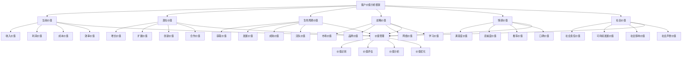

# 客户价值分析

## 🎯 客户价值分析概述

### 基本定义
**客户价值分析**是指企业通过系统性的方法和工具，对客户的价值进行识别、评估、分析和优化，以实现客户价值最大化和企业价值最大化的营销管理活动。

### 核心特征
- **系统性**：系统性的价值分析
- **量化性**：量化的价值评估
- **动态性**：动态的价值变化
- **多维性**：多维度的价值分析
- **预测性**：预测性的价值分析
- **优化性**：优化性的价值管理

## 🎯 客户价值分析框架

### 1. 价值维度

#### 客户价值分析框架

#### 价值要素
- **当前价值**：收入、利润、成本、效率价值
- **潜在价值**：增长、扩展、创新、合作价值
- **生命周期价值**：获取、发展、成熟、流失价值
- **战略价值**：市场、品牌、网络、学习价值
- **情感价值**：满意度、忠诚度、推荐、口碑价值
- **社会价值**：社会责任、可持续发展、社会影响、社会声誉价值

### 2. 分析方法

#### 分析框架
- **定量分析**：量化的价值分析
- **定性分析**：定性的价值分析
- **对比分析**：对比的价值分析
- **趋势分析**：趋势的价值分析

## 💰 当前价值分析

### 1. 收入价值分析

#### 价值要素
- **直接收入**：客户直接贡献的收入
- **间接收入**：客户间接贡献的收入
- **收入增长**：客户收入增长情况
- **收入稳定性**：客户收入稳定性

#### 分析方法
- **收入计算**：计算客户收入价值
- **收入分析**：分析客户收入构成
- **收入预测**：预测客户收入趋势
- **收入优化**：优化客户收入结构

### 2. 利润价值分析

#### 价值要素
- **毛利润**：客户贡献的毛利润
- **净利润**：客户贡献的净利润
- **利润率**：客户利润率分析
- **利润增长**：客户利润增长情况

#### 分析方法
- **利润计算**：计算客户利润价值
- **利润分析**：分析客户利润构成
- **利润预测**：预测客户利润趋势
- **利润优化**：优化客户利润结构

### 3. 成本价值分析

#### 价值要素
- **服务成本**：服务客户的成本
- **获取成本**：获取客户的成本
- **维护成本**：维护客户的成本
- **流失成本**：客户流失的成本

#### 分析方法
- **成本计算**：计算客户成本价值
- **成本分析**：分析客户成本构成
- **成本预测**：预测客户成本趋势
- **成本优化**：优化客户成本结构

### 4. 效率价值分析

#### 价值要素
- **交易效率**：客户交易效率
- **服务效率**：客户服务效率
- **沟通效率**：客户沟通效率
- **合作效率**：客户合作效率

#### 分析方法
- **效率计算**：计算客户效率价值
- **效率分析**：分析客户效率构成
- **效率预测**：预测客户效率趋势
- **效率优化**：优化客户效率结构

## 📈 潜在价值分析

### 1. 增长价值分析

#### 价值要素
- **业务增长**：客户业务增长潜力
- **需求增长**：客户需求增长潜力
- **市场增长**：客户市场增长潜力
- **价值增长**：客户价值增长潜力

#### 分析方法
- **增长识别**：识别客户增长价值
- **增长分析**：分析客户增长潜力
- **增长预测**：预测客户增长趋势
- **增长优化**：优化客户增长策略

### 2. 扩展价值分析

#### 价值要素
- **产品扩展**：客户产品扩展潜力
- **服务扩展**：客户服务扩展潜力
- **市场扩展**：客户市场扩展潜力
- **合作扩展**：客户合作扩展潜力

#### 分析方法
- **扩展识别**：识别客户扩展价值
- **扩展分析**：分析客户扩展潜力
- **扩展预测**：预测客户扩展趋势
- **扩展优化**：优化客户扩展策略

### 3. 创新价值分析

#### 价值要素
- **产品创新**：客户产品创新潜力
- **服务创新**：客户服务创新潜力
- **模式创新**：客户模式创新潜力
- **合作创新**：客户合作创新潜力

#### 分析方法
- **创新识别**：识别客户创新价值
- **创新分析**：分析客户创新潜力
- **创新预测**：预测客户创新趋势
- **创新优化**：优化客户创新策略

### 4. 合作价值分析

#### 价值要素
- **战略合作**：客户战略合作潜力
- **技术合作**：客户技术合作潜力
- **市场合作**：客户市场合作潜力
- **资源合作**：客户资源合作潜力

#### 分析方法
- **合作识别**：识别客户合作价值
- **合作分析**：分析客户合作潜力
- **合作预测**：预测客户合作趋势
- **合作优化**：优化客户合作策略

## 🔄 生命周期价值分析

### 1. 获取价值分析

#### 价值要素
- **获取成本**：客户获取成本
- **获取收益**：客户获取收益
- **获取效率**：客户获取效率
- **获取质量**：客户获取质量

#### 分析方法
- **成本分析**：分析客户获取成本
- **收益分析**：分析客户获取收益
- **效率分析**：分析客户获取效率
- **质量分析**：分析客户获取质量

### 2. 发展价值分析

#### 价值要素
- **发展速度**：客户发展速度
- **发展质量**：客户发展质量
- **发展潜力**：客户发展潜力
- **发展成本**：客户发展成本

#### 分析方法
- **速度分析**：分析客户发展速度
- **质量分析**：分析客户发展质量
- **潜力分析**：分析客户发展潜力
- **成本分析**：分析客户发展成本

### 3. 成熟价值分析

#### 价值要素
- **成熟度**：客户成熟度
- **稳定性**：客户稳定性
- **贡献度**：客户贡献度
- **满意度**：客户满意度

#### 分析方法
- **成熟度分析**：分析客户成熟度
- **稳定性分析**：分析客户稳定性
- **贡献度分析**：分析客户贡献度
- **满意度分析**：分析客户满意度

### 4. 流失价值分析

#### 价值要素
- **流失风险**：客户流失风险
- **流失成本**：客户流失成本
- **流失影响**：客户流失影响
- **挽回价值**：客户挽回价值

#### 分析方法
- **风险分析**：分析客户流失风险
- **成本分析**：分析客户流失成本
- **影响分析**：分析客户流失影响
- **挽回分析**：分析客户挽回价值

## 🎯 战略价值分析

### 1. 市场价值分析

#### 价值要素
- **市场份额**：客户市场份额价值
- **市场地位**：客户市场地位价值
- **市场影响**：客户市场影响价值
- **市场拓展**：客户市场拓展价值

#### 分析方法
- **份额分析**：分析客户市场份额价值
- **地位分析**：分析客户市场地位价值
- **影响分析**：分析客户市场影响价值
- **拓展分析**：分析客户市场拓展价值

### 2. 品牌价值分析

#### 价值要素
- **品牌认知**：客户品牌认知价值
- **品牌形象**：客户品牌形象价值
- **品牌忠诚**：客户品牌忠诚价值
- **品牌传播**：客户品牌传播价值

#### 分析方法
- **认知分析**：分析客户品牌认知价值
- **形象分析**：分析客户品牌形象价值
- **忠诚分析**：分析客户品牌忠诚价值
- **传播分析**：分析客户品牌传播价值

### 3. 网络价值分析

#### 价值要素
- **网络效应**：客户网络效应价值
- **网络影响**：客户网络影响价值
- **网络拓展**：客户网络拓展价值
- **网络协同**：客户网络协同价值

#### 分析方法
- **效应分析**：分析客户网络效应价值
- **影响分析**：分析客户网络影响价值
- **拓展分析**：分析客户网络拓展价值
- **协同分析**：分析客户网络协同价值

### 4. 学习价值分析

#### 价值要素
- **学习能力**：客户学习能力价值
- **知识贡献**：客户知识贡献价值
- **经验分享**：客户经验分享价值
- **创新启发**：客户创新启发价值

#### 分析方法
- **能力分析**：分析客户学习能力价值
- **贡献分析**：分析客户知识贡献价值
- **分享分析**：分析客户经验分享价值
- **启发分析**：分析客户创新启发价值

## ❤️ 情感价值分析

### 1. 满意度价值分析

#### 价值要素
- **产品满意度**：客户产品满意度
- **服务满意度**：客户服务满意度
- **体验满意度**：客户体验满意度
- **整体满意度**：客户整体满意度

#### 分析方法
- **产品分析**：分析客户产品满意度
- **服务分析**：分析客户服务满意度
- **体验分析**：分析客户体验满意度
- **整体分析**：分析客户整体满意度

### 2. 忠诚度价值分析

#### 价值要素
- **行为忠诚**：客户行为忠诚度
- **态度忠诚**：客户态度忠诚度
- **情感忠诚**：客户情感忠诚度
- **推荐忠诚**：客户推荐忠诚度

#### 分析方法
- **行为分析**：分析客户行为忠诚度
- **态度分析**：分析客户态度忠诚度
- **情感分析**：分析客户情感忠诚度
- **推荐分析**：分析客户推荐忠诚度

### 3. 推荐价值分析

#### 价值要素
- **推荐意愿**：客户推荐意愿
- **推荐行为**：客户推荐行为
- **推荐效果**：客户推荐效果
- **推荐价值**：客户推荐价值

#### 分析方法
- **意愿分析**：分析客户推荐意愿
- **行为分析**：分析客户推荐行为
- **效果分析**：分析客户推荐效果
- **价值分析**：分析客户推荐价值

### 4. 口碑价值分析

#### 价值要素
- **口碑传播**：客户口碑传播
- **口碑影响**：客户口碑影响
- **口碑质量**：客户口碑质量
- **口碑价值**：客户口碑价值

#### 分析方法
- **传播分析**：分析客户口碑传播
- **影响分析**：分析客户口碑影响
- **质量分析**：分析客户口碑质量
- **价值分析**：分析客户口碑价值

## 🌍 社会价值分析

### 1. 社会责任价值分析

#### 价值要素
- **社会责任**：客户社会责任价值
- **环保责任**：客户环保责任价值
- **公益责任**：客户公益责任价值
- **道德责任**：客户道德责任价值

#### 分析方法
- **责任分析**：分析客户社会责任价值
- **环保分析**：分析客户环保责任价值
- **公益分析**：分析客户公益责任价值
- **道德分析**：分析客户道德责任价值

### 2. 可持续发展价值分析

#### 价值要素
- **可持续发展**：客户可持续发展价值
- **长期合作**：客户长期合作价值
- **资源节约**：客户资源节约价值
- **环境友好**：客户环境友好价值

#### 分析方法
- **发展分析**：分析客户可持续发展价值
- **合作分析**：分析客户长期合作价值
- **节约分析**：分析客户资源节约价值
- **环境分析**：分析客户环境友好价值

### 3. 社会影响价值分析

#### 价值要素
- **社会影响**：客户社会影响价值
- **行业影响**：客户行业影响价值
- **社区影响**：客户社区影响价值
- **文化影响**：客户文化影响价值

#### 分析方法
- **影响分析**：分析客户社会影响价值
- **行业分析**：分析客户行业影响价值
- **社区分析**：分析客户社区影响价值
- **文化分析**：分析客户文化影响价值

### 4. 社会声誉价值分析

#### 价值要素
- **社会声誉**：客户社会声誉价值
- **行业声誉**：客户行业声誉价值
- **品牌声誉**：客户品牌声誉价值
- **企业声誉**：客户企业声誉价值

#### 分析方法
- **声誉分析**：分析客户社会声誉价值
- **行业分析**：分析客户行业声誉价值
- **品牌分析**：分析客户品牌声誉价值
- **企业分析**：分析客户企业声誉价值

## 🔍 客户价值分析方法

### 1. 定量分析方法

#### 分析方法
- **财务分析**：财务价值分析方法
- **统计分析**：统计价值分析方法
- **模型分析**：模型价值分析方法
- **预测分析**：预测价值分析方法

#### 分析工具
- **财务工具**：财务分析工具
- **统计工具**：统计分析工具
- **模型工具**：模型分析工具
- **预测工具**：预测分析工具

### 2. 定性分析方法

#### 分析方法
- **访谈分析**：访谈价值分析方法
- **观察分析**：观察价值分析方法
- **案例分析**：案例价值分析方法
- **专家分析**：专家价值分析方法

#### 分析工具
- **访谈工具**：访谈分析工具
- **观察工具**：观察分析工具
- **案例工具**：案例分析工具
- **专家工具**：专家分析工具

### 3. 对比分析方法

#### 分析方法
- **横向对比**：横向价值对比分析
- **纵向对比**：纵向价值对比分析
- **行业对比**：行业价值对比分析
- **竞争对比**：竞争价值对比分析

#### 分析工具
- **横向工具**：横向对比分析工具
- **纵向工具**：纵向对比分析工具
- **行业工具**：行业对比分析工具
- **竞争工具**：竞争对比分析工具

### 4. 趋势分析方法

#### 分析方法
- **时间序列**：时间序列价值分析
- **趋势预测**：趋势预测价值分析
- **周期分析**：周期价值分析
- **变化分析**：变化价值分析

#### 分析工具
- **时间工具**：时间序列分析工具
- **趋势工具**：趋势预测分析工具
- **周期工具**：周期分析工具
- **变化工具**：变化分析工具

## 📊 客户价值分析案例

### 案例1：B2B客户价值分析

#### 案例背景
某制造企业需要对大型采购商进行价值分析，优化客户关系管理策略。

#### 分析过程
- **当前价值分析**：分析客户当前价值
- **潜在价值分析**：分析客户潜在价值
- **生命周期价值分析**：分析客户生命周期价值
- **战略价值分析**：分析客户战略价值

#### 分析结果
- **价值识别**：识别高价值客户
- **价值评估**：评估客户价值水平
- **价值优化**：优化客户价值策略
- **价值实现**：实现客户价值最大化

#### 成功因素
- **系统分析**：系统分析客户价值
- **多维评估**：多维评估客户价值
- **动态管理**：动态管理客户价值
- **持续优化**：持续优化客户价值

### 案例2：B2C客户价值分析

#### 案例背景
某零售企业需要对消费者进行价值分析，提升客户忠诚度和价值。

#### 分析过程
- **当前价值分析**：分析消费者当前价值
- **潜在价值分析**：分析消费者潜在价值
- **情感价值分析**：分析消费者情感价值
- **社会价值分析**：分析消费者社会价值

#### 分析结果
- **价值识别**：识别高价值消费者
- **价值评估**：评估消费者价值水平
- **价值优化**：优化消费者价值策略
- **价值实现**：实现消费者价值最大化

#### 成功因素
- **全面分析**：全面分析消费者价值
- **精准评估**：精准评估消费者价值
- **个性化管理**：个性化管理消费者价值
- **持续改进**：持续改进消费者价值

## 🎯 客户价值分析最佳实践

### 1. 分析原则

#### 基本原则
- **客观性原则**：客观分析客户价值
- **系统性原则**：系统分析客户价值
- **动态性原则**：动态分析客户价值
- **多维性原则**：多维分析客户价值

#### 应用原则
- **价值导向**：以价值为导向
- **客户导向**：以客户为导向
- **数据导向**：以数据为导向
- **结果导向**：以结果为导向

### 2. 分析方法

#### 分析方法
- **定量分析**：定量分析客户价值
- **定性分析**：定性分析客户价值
- **对比分析**：对比分析客户价值
- **趋势分析**：趋势分析客户价值

#### 方法应用
- **定量应用**：应用定量分析方法
- **定性应用**：应用定性分析方法
- **对比应用**：应用对比分析方法
- **趋势应用**：应用趋势分析方法

### 3. 实施要点

#### 实施要点
- **数据质量**：确保数据质量
- **分析深度**：确保分析深度
- **结果应用**：重视结果应用
- **持续改进**：持续改进分析

#### 注意事项
- **避免偏见**：避免分析偏见
- **避免表面**：避免表面化分析
- **避免孤立**：避免孤立化分析
- **避免静态**：避免静态化分析

## 📚 学习要点总结

### 核心概念
1. **客户价值分析**：分析客户价值的营销管理活动
2. **当前价值**：收入、利润、成本、效率价值
3. **潜在价值**：增长、扩展、创新、合作价值
4. **生命周期价值**：获取、发展、成熟、流失价值
5. **战略价值**：市场、品牌、网络、学习价值
6. **情感价值**：满意度、忠诚度、推荐、口碑价值
7. **社会价值**：社会责任、可持续发展、社会影响、社会声誉价值
8. **分析方法**：定量、定性、对比、趋势分析方法

### 关键理解
- 客户价值分析是营销管理的重要工具
- 客户价值具有多维性和动态性特征
- 客户价值分析需要系统性和科学性
- 客户价值分析需要客观性和准确性
- 客户价值分析需要预测性和优化性
- 客户价值分析需要持续性和改进性
- 客户价值分析需要实用性和可操作性
- 客户价值分析需要创新性和发展性

### 实践应用
- 运用客户价值分析识别高价值客户
- 运用客户价值分析优化客户关系
- 运用客户价值分析提升客户满意度
- 运用客户价值分析增强客户忠诚度
- 运用客户价值分析扩大客户价值
- 运用客户价值分析促进业务增长
- 运用客户价值分析提升竞争优势
- 运用客户价值分析实现企业目标

## 🔗 相关链接

- [[客户关系建立]] - 客户关系建立
- [[客户关系管理策略]] - 客户关系管理策略
- [[客户关系维护]] - 客户关系维护
- [[工具实操指南-营销管理]] - 工具实操指南-营销管理

## 📚 延伸阅读

- [[营销管理]] - 营销管理理论
- [[客户关系管理]] - 客户关系管理理论
- [[价值营销]] - 价值营销理论
- [[数据分析]] - 数据分析理论

---
*更新时间：2024年*
*内容将根据学习反馈持续优化*
