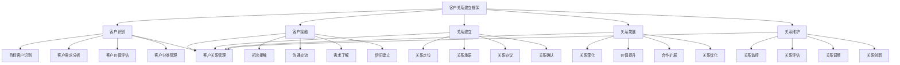

# 客户关系建立

## 🎯 客户关系建立概述

### 基本定义
**客户关系建立**是指企业通过系统性的策略和方法，与目标客户建立、发展和维护长期稳定的合作关系，以实现客户价值最大化和企业可持续发展的营销管理活动。

### 核心特征
- **主动性**：主动建立客户关系
- **系统性**：系统性的关系管理
- **长期性**：长期稳定的关系
- **互利性**：互利共赢的关系
- **个性化**：个性化的关系服务
- **价值性**：以价值为导向的关系

## 🎯 客户关系建立框架

### 1. 建立阶段

#### 客户关系建立框架

#### 建立要素
- **客户识别**：目标客户识别、需求分析、价值评估、分类管理
- **客户接触**：初次接触、沟通交流、需求了解、信任建立
- **关系建立**：关系定位、关系承诺、关系协议、关系确认
- **关系发展**：关系深化、价值提升、合作扩展、关系优化
- **关系维护**：关系监控、关系评估、关系调整、关系创新

### 2. 建立策略

#### 策略框架
- **差异化策略**：差异化客户关系建立
- **个性化策略**：个性化客户关系建立
- **价值化策略**：价值化客户关系建立
- **系统化策略**：系统化客户关系建立

## 🔍 客户识别管理

### 1. 目标客户识别

#### 识别要素
- **客户特征**：客户基本特征分析
- **客户需求**：客户需求特征分析
- **客户行为**：客户行为特征分析
- **客户价值**：客户价值特征分析

#### 识别方法
- **市场调研**：市场调研方法
- **数据分析**：数据分析方法
- **客户画像**：客户画像方法
- **需求分析**：需求分析方法

### 2. 客户需求分析

#### 需求要素
- **显性需求**：客户显性需求分析
- **隐性需求**：客户隐性需求分析
- **潜在需求**：客户潜在需求分析
- **未来需求**：客户未来需求分析

#### 分析方法
- **需求调研**：需求调研方法
- **需求分析**：需求分析方法
- **需求预测**：需求预测方法
- **需求验证**：需求验证方法

### 3. 客户价值评估

#### 评估要素
- **当前价值**：客户当前价值评估
- **潜在价值**：客户潜在价值评估
- **生命周期价值**：客户生命周期价值评估
- **战略价值**：客户战略价值评估

#### 评估方法
- **价值分析**：价值分析方法
- **价值计算**：价值计算方法
- **价值预测**：价值预测方法
- **价值优化**：价值优化方法

### 4. 客户分类管理

#### 分类要素
- **价值分类**：按价值分类管理
- **需求分类**：按需求分类管理
- **行为分类**：按行为分类管理
- **关系分类**：按关系分类管理

#### 分类方法
- **分类标准**：制定分类标准
- **分类方法**：选择分类方法
- **分类管理**：实施分类管理
- **分类优化**：优化分类管理

## 🤝 客户接触管理

### 1. 初次接触

#### 接触要素
- **接触时机**：接触时机选择
- **接触方式**：接触方式选择
- **接触内容**：接触内容设计
- **接触效果**：接触效果评估

#### 接触方法
- **时机选择**：选择接触时机
- **方式选择**：选择接触方式
- **内容设计**：设计接触内容
- **效果评估**：评估接触效果

### 2. 沟通交流

#### 交流要素
- **交流渠道**：交流渠道建立
- **交流方式**：交流方式选择
- **交流内容**：交流内容设计
- **交流效果**：交流效果评估

#### 交流方法
- **渠道建立**：建立交流渠道
- **方式选择**：选择交流方式
- **内容设计**：设计交流内容
- **效果评估**：评估交流效果

### 3. 需求了解

#### 了解要素
- **需求识别**：需求识别方法
- **需求分析**：需求分析方法
- **需求确认**：需求确认方法
- **需求记录**：需求记录方法

#### 了解方法
- **识别方法**：需求识别方法
- **分析方法**：需求分析方法
- **确认方法**：需求确认方法
- **记录方法**：需求记录方法

### 4. 信任建立

#### 信任要素
- **信任基础**：信任基础建立
- **信任机制**：信任机制建立
- **信任维护**：信任维护方法
- **信任发展**：信任发展方法

#### 建立方法
- **基础建立**：建立信任基础
- **机制建立**：建立信任机制
- **维护方法**：信任维护方法
- **发展方法**：信任发展方法

## 💝 关系建立管理

### 1. 关系定位

#### 定位要素
- **关系类型**：关系类型确定
- **关系层次**：关系层次确定
- **关系范围**：关系范围确定
- **关系目标**：关系目标确定

#### 定位方法
- **类型确定**：确定关系类型
- **层次确定**：确定关系层次
- **范围确定**：确定关系范围
- **目标确定**：确定关系目标

### 2. 关系承诺

#### 承诺要素
- **承诺内容**：承诺内容制定
- **承诺方式**：承诺方式选择
- **承诺保障**：承诺保障机制
- **承诺履行**：承诺履行机制

#### 承诺方法
- **内容制定**：制定承诺内容
- **方式选择**：选择承诺方式
- **保障机制**：建立保障机制
- **履行机制**：建立履行机制

### 3. 关系协议

#### 协议要素
- **协议内容**：协议内容制定
- **协议条款**：协议条款制定
- **协议执行**：协议执行机制
- **协议监督**：协议监督机制

#### 协议方法
- **内容制定**：制定协议内容
- **条款制定**：制定协议条款
- **执行机制**：建立执行机制
- **监督机制**：建立监督机制

### 4. 关系确认

#### 确认要素
- **确认方式**：确认方式选择
- **确认内容**：确认内容制定
- **确认标准**：确认标准制定
- **确认记录**：确认记录管理

#### 确认方法
- **方式选择**：选择确认方式
- **内容制定**：制定确认内容
- **标准制定**：制定确认标准
- **记录管理**：管理确认记录

## 📈 关系发展管理

### 1. 关系深化

#### 深化要素
- **深化策略**：深化策略制定
- **深化方法**：深化方法选择
- **深化内容**：深化内容设计
- **深化效果**：深化效果评估

#### 深化方法
- **策略制定**：制定深化策略
- **方法选择**：选择深化方法
- **内容设计**：设计深化内容
- **效果评估**：评估深化效果

### 2. 价值提升

#### 提升要素
- **价值识别**：价值识别方法
- **价值创造**：价值创造方法
- **价值传递**：价值传递方法
- **价值实现**：价值实现方法

#### 提升方法
- **识别方法**：价值识别方法
- **创造方法**：价值创造方法
- **传递方法**：价值传递方法
- **实现方法**：价值实现方法

### 3. 合作扩展

#### 扩展要素
- **扩展方向**：扩展方向确定
- **扩展内容**：扩展内容设计
- **扩展方式**：扩展方式选择
- **扩展效果**：扩展效果评估

#### 扩展方法
- **方向确定**：确定扩展方向
- **内容设计**：设计扩展内容
- **方式选择**：选择扩展方式
- **效果评估**：评估扩展效果

### 4. 关系优化

#### 优化要素
- **优化目标**：优化目标确定
- **优化策略**：优化策略制定
- **优化方法**：优化方法选择
- **优化效果**：优化效果评估

#### 优化方法
- **目标确定**：确定优化目标
- **策略制定**：制定优化策略
- **方法选择**：选择优化方法
- **效果评估**：评估优化效果

## 🔧 关系维护管理

### 1. 关系监控

#### 监控要素
- **监控指标**：监控指标体系
- **监控方法**：监控方法体系
- **监控工具**：监控工具体系
- **监控流程**：监控流程体系

#### 监控方法
- **指标设计**：设计监控指标
- **方法设计**：设计监控方法
- **工具设计**：设计监控工具
- **流程设计**：设计监控流程

### 2. 关系评估

#### 评估要素
- **评估标准**：评估标准体系
- **评估方法**：评估方法体系
- **评估工具**：评估工具体系
- **评估流程**：评估流程体系

#### 评估方法
- **标准设计**：设计评估标准
- **方法设计**：设计评估方法
- **工具设计**：设计评估工具
- **流程设计**：设计评估流程

### 3. 关系调整

#### 调整要素
- **调整需求**：调整需求识别
- **调整策略**：调整策略制定
- **调整方法**：调整方法选择
- **调整效果**：调整效果评估

#### 调整方法
- **需求识别**：识别调整需求
- **策略制定**：制定调整策略
- **方法选择**：选择调整方法
- **效果评估**：评估调整效果

### 4. 关系创新

#### 创新要素
- **创新思维**：创新思维培养
- **创新方法**：创新方法应用
- **创新实践**：创新实践探索
- **创新效果**：创新效果评估

#### 创新方法
- **思维培养**：培养创新思维
- **方法应用**：应用创新方法
- **实践探索**：探索创新实践
- **效果评估**：评估创新效果

## 🎯 客户关系建立策略

### 1. 差异化策略

#### 策略要素
- **差异化定位**：差异化定位策略
- **差异化服务**：差异化服务策略
- **差异化价值**：差异化价值策略
- **差异化体验**：差异化体验策略

#### 策略实施
- **定位实施**：实施差异化定位
- **服务实施**：实施差异化服务
- **价值实施**：实施差异化价值
- **体验实施**：实施差异化体验

### 2. 个性化策略

#### 策略要素
- **个性化需求**：个性化需求策略
- **个性化服务**：个性化服务策略
- **个性化沟通**：个性化沟通策略
- **个性化体验**：个性化体验策略

#### 策略实施
- **需求实施**：实施个性化需求
- **服务实施**：实施个性化服务
- **沟通实施**：实施个性化沟通
- **体验实施**：实施个性化体验

### 3. 价值化策略

#### 策略要素
- **价值创造**：价值创造策略
- **价值传递**：价值传递策略
- **价值实现**：价值实现策略
- **价值优化**：价值优化策略

#### 策略实施
- **创造实施**：实施价值创造
- **传递实施**：实施价值传递
- **实现实施**：实施价值实现
- **优化实施**：实施价值优化

### 4. 系统化策略

#### 策略要素
- **系统设计**：系统设计策略
- **系统实施**：系统实施策略
- **系统监控**：系统监控策略
- **系统优化**：系统优化策略

#### 策略实施
- **设计实施**：实施系统设计
- **实施管理**：管理系统实施
- **监控管理**：管理系统监控
- **优化管理**：管理系统优化

## 📊 客户关系建立案例

### 案例1：B2B客户关系建立

#### 案例背景
某制造企业需要建立与大型采购商的长期合作关系，提升客户忠诚度和业务稳定性。

#### 建立过程
- **客户识别**：识别目标采购商
- **需求分析**：分析采购商需求
- **关系建立**：建立合作关系
- **关系发展**：发展合作关系

#### 建立结果
- **关系稳定**：合作关系稳定
- **业务增长**：业务量显著增长
- **客户满意**：客户满意度提升
- **价值实现**：客户价值实现

#### 成功因素
- **专业服务**：提供专业服务
- **价值创造**：创造客户价值
- **关系维护**：维护客户关系
- **持续改进**：持续改进服务

### 案例2：B2C客户关系建立

#### 案例背景
某零售企业需要建立与消费者的长期关系，提升客户忠诚度和复购率。

#### 建立过程
- **客户识别**：识别目标消费者
- **需求分析**：分析消费者需求
- **关系建立**：建立客户关系
- **关系发展**：发展客户关系

#### 建立结果
- **客户忠诚**：客户忠诚度提升
- **复购率**：复购率显著提升
- **口碑传播**：口碑传播效果良好
- **品牌价值**：品牌价值提升

#### 成功因素
- **优质服务**：提供优质服务
- **个性化**：个性化服务
- **价值体验**：价值体验良好
- **关系维护**：维护客户关系

## 🎯 客户关系建立最佳实践

### 1. 建立原则

#### 基本原则
- **客户导向原则**：以客户为导向
- **价值创造原则**：以价值创造为核心
- **长期发展原则**：以长期发展为目标
- **互利共赢原则**：以互利共赢为基础

#### 应用原则
- **系统性原则**：系统建立客户关系
- **个性化原则**：个性化客户关系
- **持续性原则**：持续发展客户关系
- **创新性原则**：创新客户关系模式

### 2. 建立方法

#### 建立方法
- **系统方法**：系统建立方法
- **个性化方法**：个性化建立方法
- **价值化方法**：价值化建立方法
- **创新化方法**：创新化建立方法

#### 方法应用
- **系统应用**：应用系统建立方法
- **个性应用**：应用个性化建立方法
- **价值应用**：应用价值化建立方法
- **创新应用**：应用创新化建立方法

### 3. 实施要点

#### 实施要点
- **客户理解**：深入理解客户需求
- **价值创造**：创造客户价值
- **关系维护**：维护客户关系
- **持续改进**：持续改进服务

#### 注意事项
- **避免过度**：避免过度营销
- **避免表面**：避免表面化服务
- **避免短期**：避免短期行为
- **避免僵化**：避免僵化模式

## 📚 学习要点总结

### 核心概念
1. **客户关系建立**：建立客户关系的管理活动
2. **客户识别**：目标客户识别、需求分析、价值评估、分类管理
3. **客户接触**：初次接触、沟通交流、需求了解、信任建立
4. **关系建立**：关系定位、关系承诺、关系协议、关系确认
5. **关系发展**：关系深化、价值提升、合作扩展、关系优化
6. **关系维护**：关系监控、关系评估、关系调整、关系创新
7. **建立策略**：差异化、个性化、价值化、系统化策略
8. **最佳实践**：建立原则、方法、实施要点

### 关键理解
- 客户关系建立是营销管理的重要组成部分
- 客户关系建立需要系统性和计划性
- 客户关系建立需要个性化和差异化
- 客户关系建立需要价值创造和传递
- 客户关系建立需要长期维护和发展
- 客户关系建立需要持续创新和改进
- 客户关系建立需要互利共赢
- 客户关系建立需要专业化和标准化

### 实践应用
- 运用客户关系建立提升客户满意度
- 运用客户关系建立增强客户忠诚度
- 运用客户关系建立扩大客户价值
- 运用客户关系建立促进业务增长
- 运用客户关系建立提升竞争优势
- 运用客户关系建立实现可持续发展
- 运用客户关系建立创造客户价值
- 运用客户关系建立实现企业目标

## 🔗 相关链接

- [[客户价值分析]] - 客户价值分析
- [[客户关系管理策略]] - 客户关系管理策略
- [[客户关系维护]] - 客户关系维护
- [[工具实操指南-营销管理]] - 工具实操指南-营销管理

## 📚 延伸阅读

- [[营销管理]] - 营销管理理论
- [[客户关系管理]] - 客户关系管理理论
- [[关系营销]] - 关系营销理论
- [[价值营销]] - 价值营销理论

---
*更新时间：2024年*
*内容将根据学习反馈持续优化*
