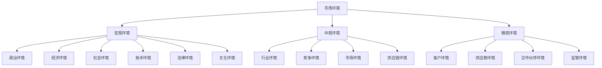
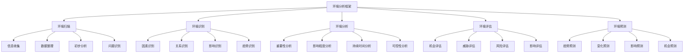

# 市场环境分析

## 🌍 市场环境分析概述

### 基本定义
**市场环境分析**是指对影响企业市场营销活动的各种外部环境因素进行分析，识别机会和威胁，为营销决策提供依据的过程。

### 核心特征
- **全面性**：全面分析环境因素
- **动态性**：动态分析环境变化
- **系统性**：系统分析环境关系
- **前瞻性**：预测环境发展趋势

## 📊 市场环境分析框架

### 1. 环境层次结构

#### 宏观环境

#### 环境关系
- **宏观环境影响中观环境**：宏观环境决定中观环境
- **中观环境影响微观环境**：中观环境影响微观环境
- **微观环境反作用于中观环境**：微观环境反作用中观环境
- **中观环境反作用于宏观环境**：中观环境反作用宏观环境

### 2. 环境分析维度

#### 环境因素
- **可控因素**：企业可以控制的因素
- **不可控因素**：企业无法控制的因素
- **直接因素**：直接影响营销的因素
- **间接因素**：间接影响营销的因素

#### 环境影响
- **机会影响**：环境带来的机会
- **威胁影响**：环境带来的威胁
- **中性影响**：环境的中性影响
- **复合影响**：环境的复合影响

## 🔍 宏观环境分析

### 1. 政治环境分析

#### 政治因素
- **政治制度**：政治制度稳定性
- **政策法规**：政策法规变化
- **政府关系**：与政府关系
- **国际关系**：国际政治关系

#### 政治影响
- **政策支持**：政策支持力度
- **法规约束**：法规约束程度
- **政府干预**：政府干预程度
- **政治风险**：政治风险程度

### 2. 经济环境分析

#### 经济因素
- **经济形势**：宏观经济形势
- **经济增长**：经济增长速度
- **通货膨胀**：通货膨胀水平
- **汇率变化**：汇率变化趋势

#### 经济影响
- **市场需求**：市场需求变化
- **购买力**：购买力变化
- **成本水平**：成本水平变化
- **投资环境**：投资环境变化

### 3. 社会环境分析

#### 社会因素
- **人口结构**：人口结构变化
- **文化传统**：文化传统影响
- **价值观念**：社会价值观念
- **生活方式**：生活方式变化

#### 社会影响
- **消费习惯**：消费习惯变化
- **消费偏好**：消费偏好变化
- **消费能力**：消费能力变化
- **消费趋势**：消费趋势变化

### 4. 技术环境分析

#### 技术因素
- **技术发展**：技术发展水平
- **技术创新**：技术创新能力
- **技术应用**：技术应用程度
- **技术标准**：技术标准要求

#### 技术影响
- **产品创新**：产品创新机会
- **工艺改进**：工艺改进机会
- **效率提升**：效率提升机会
- **成本降低**：成本降低机会

## 🏢 中观环境分析

### 1. 行业环境分析

#### 行业特征
- **行业生命周期**：行业发展阶段
- **行业规模**：行业市场规模
- **行业结构**：行业结构特征
- **行业趋势**：行业发展趋势

#### 行业分析
- **行业吸引力**：行业吸引力分析
- **行业壁垒**：行业壁垒分析
- **行业风险**：行业风险分析
- **行业机会**：行业机会分析

### 2. 竞争环境分析

#### 竞争结构
- **竞争者数量**：竞争者数量分析
- **竞争强度**：竞争激烈程度
- **竞争方式**：竞争方式分析
- **竞争格局**：竞争格局分析

#### 竞争分析
- **竞争对手分析**：竞争对手分析
- **竞争地位分析**：竞争地位分析
- **竞争优势分析**：竞争优势分析
- **竞争策略分析**：竞争策略分析

### 3. 市场环境分析

#### 市场特征
- **市场规模**：市场规模大小
- **市场增长率**：市场增长趋势
- **市场细分**：市场细分情况
- **市场需求**：市场需求特点

#### 市场分析
- **市场机会**：市场机会分析
- **市场威胁**：市场威胁分析
- **市场趋势**：市场趋势分析
- **市场预测**：市场预测分析

## 👥 微观环境分析

### 1. 客户环境分析

#### 客户特征
- **客户结构**：客户结构分析
- **客户需求**：客户需求分析
- **客户行为**：客户行为分析
- **客户价值**：客户价值分析

#### 客户分析
- **客户细分**：客户细分分析
- **客户满意度**：客户满意度分析
- **客户忠诚度**：客户忠诚度分析
- **客户生命周期**：客户生命周期分析

### 2. 供应商环境分析

#### 供应商特征
- **供应商数量**：供应商数量分析
- **供应商能力**：供应商能力分析
- **供应商关系**：供应商关系分析
- **供应商风险**：供应商风险分析

#### 供应商分析
- **供应商评估**：供应商评估分析
- **供应商选择**：供应商选择分析
- **供应商管理**：供应商管理分析
- **供应商发展**：供应商发展分析

### 3. 合作伙伴环境分析

#### 合作伙伴特征
- **合作伙伴类型**：合作伙伴类型分析
- **合作伙伴能力**：合作伙伴能力分析
- **合作伙伴关系**：合作伙伴关系分析
- **合作伙伴价值**：合作伙伴价值分析

#### 合作伙伴分析
- **合作伙伴评估**：合作伙伴评估分析
- **合作伙伴选择**：合作伙伴选择分析
- **合作伙伴管理**：合作伙伴管理分析
- **合作伙伴发展**：合作伙伴发展分析

## 📈 环境分析方法

### 1. 分析方法

#### 定性方法
- **专家判断法**：专家经验判断
- **德尔菲法**：专家预测法
- **头脑风暴法**：集体讨论法
- **情景分析法**：情景分析预测

#### 定量方法
- **统计分析**：统计分析
- **趋势分析**：趋势分析
- **回归分析**：回归分析
- **预测分析**：预测分析

### 2. 分析工具

#### 分析工具
- **PEST分析**：政治、经济、社会、技术分析
- **波特五力模型**：行业竞争分析
- **SWOT分析**：优势、劣势、机会、威胁分析
- **价值链分析**：价值创造分析

#### 分析框架

## 🎯 环境分析应用

### 1. 营销战略制定

#### 战略选择
- **市场进入战略**：市场进入策略
- **市场发展战略**：市场发展策略
- **市场竞争战略**：市场竞争策略
- **市场退出战略**：市场退出策略

#### 战略实施
- **目标市场选择**：目标市场选择
- **市场定位**：市场定位策略
- **营销组合**：营销组合策略
- **营销预算**：营销预算分配

### 2. 营销决策支持

#### 决策支持
- **产品决策**：产品决策支持
- **价格决策**：价格决策支持
- **渠道决策**：渠道决策支持
- **促销决策**：促销决策支持

#### 风险管理
- **风险识别**：风险识别分析
- **风险评估**：风险评估分析
- **风险应对**：风险应对策略
- **风险监控**：风险监控机制

## 📊 环境分析案例

### 1. 行业案例

#### 案例背景
某行业面临转型升级，需要进行环境分析。

#### 分析过程
**宏观环境**：
- 政治环境：政策支持力度大
- 经济环境：经济增长放缓
- 社会环境：消费升级趋势
- 技术环境：技术发展迅速

**中观环境**：
- 行业环境：竞争加剧
- 竞争环境：新进入者增多
- 市场环境：需求结构变化
- 供应链环境：供应链优化

**微观环境**：
- 客户环境：需求个性化
- 供应商环境：供应商集中
- 合作伙伴环境：合作深化
- 监管环境：监管加强

#### 分析结论
- 机会：政策支持、技术发展、消费升级
- 威胁：竞争加剧、成本上升、监管加强
- 建议：技术创新、市场细分、合作发展

### 2. 企业案例

#### 案例背景
某企业面临市场变化，需要进行环境分析。

#### 分析过程
**外部环境**：
- 市场机会：市场需求增长
- 市场威胁：竞争加剧
- 技术机会：技术发展机遇
- 政策机会：政策支持

**内部环境**：
- 优势：技术领先、品牌知名
- 劣势：成本较高、渠道有限
- 能力：研发能力强、管理规范
- 资源：资金充足、人才储备

#### 分析结论
- 战略选择：差异化战略
- 市场定位：高端市场
- 发展重点：技术创新、品牌建设
- 风险控制：成本控制、渠道拓展

## 🔍 环境分析局限性

### 1. 主要局限性

#### 分析局限性
- **信息不完整**：信息收集不完整
- **分析主观性**：分析主观性影响
- **预测困难**：环境预测困难
- **变化快速**：环境变化快速

#### 应用局限性
- **决策滞后**：决策滞后于环境变化
- **实施困难**：实施过程困难
- **效果不确定**：效果不确定
- **成本较高**：分析成本较高

### 2. 改进方法

#### 分析方法改进
- **信息收集**：完善信息收集
- **分析方法**：改进分析方法
- **预测技术**：提高预测技术
- **动态分析**：加强动态分析

#### 应用方法改进
- **快速响应**：提高响应速度
- **灵活实施**：灵活实施策略
- **效果评估**：加强效果评估
- **成本控制**：控制分析成本

## 🎯 学习要点总结

### 核心概念
1. **市场环境分析**：分析影响营销活动的环境因素
2. **环境层次**：宏观环境、中观环境、微观环境
3. **环境因素**：政治、经济、社会、技术等因素
4. **分析方法**：定性方法、定量方法
5. **分析工具**：PEST分析、波特五力模型、SWOT分析
6. **分析应用**：营销战略制定、营销决策支持

### 关键理解
- 市场环境分析是营销决策的重要基础
- 环境分析需要全面、系统、动态
- 分析方法需要科学、客观、准确
- 分析结果需要结合实际情况应用

### 实践应用
- 运用环境分析方法进行市场分析
- 使用分析工具识别机会和威胁
- 结合分析结果制定营销策略
- 建立环境监控机制持续跟踪

## 🔗 相关链接

- [[市场细分]] - 市场细分分析
- [[消费者行为分析]] - 消费者行为分析
- [[目标市场选择]] - 目标市场选择
- [[实践练习-市场分析]] - 市场分析实践

## 📚 延伸阅读

- [[营销策略]] - 营销策略制定
- [[营销组合]] - 营销组合策略
- [[客户关系管理]] - 客户关系管理
- [[竞争分析]] - 竞争分析

---
*更新时间：2024年*
*内容将根据学习反馈持续优化*
