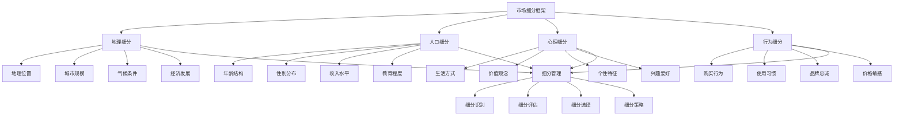

# 市场细分

## 🎯 市场细分概述

### 基本定义
**市场细分**是指企业根据消费者的需求、购买行为、消费习惯等特征，将整体市场划分为若干个具有相似特征的子市场的过程，以便企业能够更精准地制定营销策略和提供差异化服务。

### 核心特征
- **差异性**：不同细分市场间的差异
- **相似性**：同一细分市场内的相似性
- **可识别性**：细分市场的可识别性
- **可进入性**：细分市场的可进入性
- **可盈利性**：细分市场的可盈利性
- **可操作性**：细分市场的可操作性

## 🎯 市场细分框架

### 1. 细分维度

#### 市场细分框架

#### 细分要素
- **地理细分**：地理位置、城市规模、气候条件、经济发展
- **人口细分**：年龄结构、性别分布、收入水平、教育程度
- **心理细分**：生活方式、价值观念、个性特征、兴趣爱好
- **行为细分**：购买行为、使用习惯、品牌忠诚、价格敏感
- **细分管理**：细分识别、评估、选择、策略

### 2. 细分层次

#### 细分层次框架
- **宏观细分**：大市场细分
- **中观细分**：行业市场细分
- **微观细分**：产品市场细分
- **超细分**：个性化细分

## 🌍 地理细分

### 1. 地理位置细分

#### 细分要素
- **区域划分**：东部、中部、西部
- **城市等级**：一线、二线、三线
- **城乡差异**：城市、农村
- **国际差异**：国内、国际

#### 细分方法
- **区域细分**：按区域进行细分
- **城市细分**：按城市等级细分
- **城乡细分**：按城乡差异细分
- **国际细分**：按国际差异细分

### 2. 城市规模细分

#### 细分要素
- **城市规模**：大城市、中等城市、小城市
- **人口规模**：人口数量、人口密度
- **经济规模**：经济总量、人均收入
- **市场规模**：市场规模、消费能力

#### 细分方法
- **规模细分**：按城市规模细分
- **人口细分**：按人口规模细分
- **经济细分**：按经济规模细分
- **市场细分**：按市场规模细分

### 3. 气候条件细分

#### 细分要素
- **气候类型**：温带、热带、寒带
- **季节变化**：四季分明、季节差异
- **湿度条件**：干燥、湿润
- **温度条件**：高温、低温

#### 细分方法
- **气候细分**：按气候类型细分
- **季节细分**：按季节变化细分
- **湿度细分**：按湿度条件细分
- **温度细分**：按温度条件细分

### 4. 经济发展细分

#### 细分要素
- **发展水平**：发达、发展中、欠发达
- **产业结构**：第一、二、三产业
- **消费水平**：高消费、中消费、低消费
- **投资环境**：投资环境、营商环境

#### 细分方法
- **水平细分**：按发展水平细分
- **结构细分**：按产业结构细分
- **消费细分**：按消费水平细分
- **环境细分**：按投资环境细分

## 👥 人口细分

### 1. 年龄结构细分

#### 细分要素
- **年龄阶段**：儿童、青少年、中年、老年
- **代际差异**：Z世代、Y世代、X世代
- **生命周期**：单身、已婚、有子女
- **年龄特征**：年龄特征、年龄需求

#### 细分方法
- **阶段细分**：按年龄阶段细分
- **代际细分**：按代际差异细分
- **周期细分**：按生命周期细分
- **特征细分**：按年龄特征细分

### 2. 性别分布细分

#### 细分要素
- **性别差异**：男性、女性
- **性别特征**：性别特征、性别需求
- **性别偏好**：性别偏好、性别习惯
- **性别影响**：性别对消费的影响

#### 细分方法
- **性别细分**：按性别差异细分
- **特征细分**：按性别特征细分
- **偏好细分**：按性别偏好细分
- **影响细分**：按性别影响细分

### 3. 收入水平细分

#### 细分要素
- **收入等级**：高收入、中收入、低收入
- **收入来源**：工资、投资、经营
- **收入稳定**：稳定收入、不稳定收入
- **收入增长**：收入增长趋势

#### 细分方法
- **等级细分**：按收入等级细分
- **来源细分**：按收入来源细分
- **稳定细分**：按收入稳定细分
- **增长细分**：按收入增长细分

### 4. 教育程度细分

#### 细分要素
- **教育水平**：高等教育、中等教育、初等教育
- **专业背景**：专业背景、学科背景
- **教育影响**：教育对消费的影响
- **教育需求**：教育需求、教育偏好

#### 细分方法
- **水平细分**：按教育水平细分
- **背景细分**：按专业背景细分
- **影响细分**：按教育影响细分
- **需求细分**：按教育需求细分

## 🧠 心理细分

### 1. 生活方式细分

#### 细分要素
- **生活态度**：积极、消极、中性
- **生活节奏**：快节奏、慢节奏
- **生活品质**：高品质、中品质、低品质
- **生活追求**：生活追求、生活目标

#### 细分方法
- **态度细分**：按生活态度细分
- **节奏细分**：按生活节奏细分
- **品质细分**：按生活品质细分
- **追求细分**：按生活追求细分

### 2. 价值观念细分

#### 细分要素
- **价值取向**：个人主义、集体主义
- **价值观念**：传统观念、现代观念
- **价值追求**：价值追求、价值目标
- **价值影响**：价值对消费的影响

#### 细分方法
- **取向细分**：按价值取向细分
- **观念细分**：按价值观念细分
- **追求细分**：按价值追求细分
- **影响细分**：按价值影响细分

### 3. 个性特征细分

#### 细分要素
- **性格特征**：内向、外向、稳定、不稳定
- **个性类型**：个性类型、个性特征
- **个性影响**：个性对消费的影响
- **个性需求**：个性需求、个性偏好

#### 细分方法
- **特征细分**：按性格特征细分
- **类型细分**：按个性类型细分
- **影响细分**：按个性影响细分
- **需求细分**：按个性需求细分

### 4. 兴趣爱好细分

#### 细分要素
- **兴趣领域**：体育、艺术、科技、文化
- **兴趣强度**：高兴趣、中兴趣、低兴趣
- **兴趣变化**：兴趣变化趋势
- **兴趣影响**：兴趣对消费的影响

#### 细分方法
- **领域细分**：按兴趣领域细分
- **强度细分**：按兴趣强度细分
- **变化细分**：按兴趣变化细分
- **影响细分**：按兴趣影响细分

## 🛒 行为细分

### 1. 购买行为细分

#### 细分要素
- **购买频率**：高频、中频、低频
- **购买数量**：大量、中量、少量
- **购买时机**：购买时机、购买季节
- **购买地点**：购买渠道、购买场所

#### 细分方法
- **频率细分**：按购买频率细分
- **数量细分**：按购买数量细分
- **时机细分**：按购买时机细分
- **地点细分**：按购买地点细分

### 2. 使用习惯细分

#### 细分要素
- **使用方式**：使用方式、使用习惯
- **使用频率**：使用频次、使用强度
- **使用场景**：使用场景、使用环境
- **使用效果**：使用效果、使用满意度

#### 细分方法
- **方式细分**：按使用方式细分
- **频率细分**：按使用频率细分
- **场景细分**：按使用场景细分
- **效果细分**：按使用效果细分

### 3. 品牌忠诚细分

#### 细分要素
- **忠诚程度**：高忠诚、中忠诚、低忠诚
- **忠诚类型**：品牌忠诚、产品忠诚
- **忠诚原因**：忠诚原因、忠诚动机
- **忠诚变化**：忠诚变化趋势

#### 细分方法
- **程度细分**：按忠诚程度细分
- **类型细分**：按忠诚类型细分
- **原因细分**：按忠诚原因细分
- **变化细分**：按忠诚变化细分

### 4. 价格敏感细分

#### 细分要素
- **价格敏感度**：高敏感、中敏感、低敏感
- **价格偏好**：价格偏好、价格接受度
- **价格影响**：价格对购买的影响
- **价格策略**：价格策略偏好

#### 细分方法
- **敏感细分**：按价格敏感度细分
- **偏好细分**：按价格偏好细分
- **影响细分**：按价格影响细分
- **策略细分**：按价格策略细分

## 🔍 市场细分方法

### 1. 细分方法

#### 方法类型
- **单变量细分**：单一变量细分
- **多变量细分**：多变量细分
- **聚类分析**：聚类分析方法
- **因子分析**：因子分析方法

#### 方法应用
- **单变量应用**：应用单变量细分
- **多变量应用**：应用多变量细分
- **聚类应用**：应用聚类分析
- **因子应用**：应用因子分析

### 2. 细分工具

#### 工具类型
- **统计工具**：统计分析工具
- **数据挖掘**：数据挖掘工具
- **机器学习**：机器学习工具
- **人工智能**：人工智能工具

#### 工具应用
- **统计应用**：应用统计工具
- **挖掘应用**：应用数据挖掘
- **学习应用**：应用机器学习
- **智能应用**：应用人工智能

### 3. 细分技术

#### 技术类型
- **大数据技术**：大数据分析技术
- **云计算技术**：云计算技术
- **物联网技术**：物联网技术
- **区块链技术**：区块链技术

#### 技术应用
- **数据应用**：应用大数据技术
- **云应用**：应用云计算技术
- **物联应用**：应用物联网技术
- **链应用**：应用区块链技术

### 4. 细分平台

#### 平台类型
- **分析平台**：数据分析平台
- **管理平台**：客户管理平台
- **营销平台**：营销管理平台
- **服务平台**：客户服务平台

#### 平台应用
- **分析应用**：应用分析平台
- **管理应用**：应用管理平台
- **营销应用**：应用营销平台
- **服务应用**：应用服务平台

## 📊 市场细分案例

### 案例1：智能手机市场细分

#### 案例背景
某智能手机企业希望进行市场细分，制定差异化营销策略。

#### 细分过程
- **地理细分**：按地理位置细分
- **人口细分**：按人口特征细分
- **心理细分**：按心理特征细分
- **行为细分**：按行为特征细分

#### 细分结果
- **高端市场**：高收入、高教育、追求品质
- **中端市场**：中收入、中教育、追求性价比
- **低端市场**：低收入、低教育、追求价格

#### 应用效果
- **产品策略**：制定差异化产品策略
- **价格策略**：制定差异化价格策略
- **渠道策略**：制定差异化渠道策略
- **促销策略**：制定差异化促销策略

### 案例2：汽车市场细分

#### 案例背景
某汽车企业希望进行市场细分，优化产品定位。

#### 细分过程
- **需求细分**：按需求特征细分
- **行为细分**：按行为特征细分
- **心理细分**：按心理特征细分
- **地理细分**：按地理特征细分

#### 细分结果
- **商务市场**：商务人士、追求品牌
- **家庭市场**：家庭用户、追求实用
- **年轻市场**：年轻用户、追求时尚
- **豪华市场**：高收入、追求奢华

#### 应用效果
- **产品开发**：优化产品开发
- **市场定位**：优化市场定位
- **营销策略**：优化营销策略
- **销售业绩**：提升销售业绩

## 🎯 市场细分最佳实践

### 1. 细分原则

#### 基本原则
- **差异性原则**：细分市场间有差异
- **相似性原则**：细分市场内有相似
- **可识别性原则**：细分市场可识别
- **可进入性原则**：细分市场可进入

#### 应用原则
- **目标导向**：以目标为导向
- **数据驱动**：以数据为驱动
- **客户导向**：以客户为导向
- **竞争导向**：以竞争为导向

### 2. 细分方法

#### 细分方法
- **系统细分**：系统进行市场细分
- **科学细分**：科学进行市场细分
- **动态细分**：动态进行市场细分
- **精准细分**：精准进行市场细分

#### 方法应用
- **系统应用**：应用系统细分方法
- **科学应用**：应用科学细分方法
- **动态应用**：应用动态细分方法
- **精准应用**：应用精准细分方法

### 3. 实施要点

#### 实施要点
- **数据收集**：收集准确数据
- **分析工具**：使用合适工具
- **结果验证**：验证细分结果
- **持续优化**：持续优化细分

#### 注意事项
- **避免过度细分**：避免过度细分
- **避免细分不足**：避免细分不足
- **避免静态细分**：避免静态细分
- **避免主观细分**：避免主观细分

## 📚 学习要点总结

### 核心概念
1. **市场细分**：市场细分的管理活动
2. **地理细分**：地理位置、城市规模、气候条件、经济发展
3. **人口细分**：年龄结构、性别分布、收入水平、教育程度
4. **心理细分**：生活方式、价值观念、个性特征、兴趣爱好
5. **行为细分**：购买行为、使用习惯、品牌忠诚、价格敏感
6. **细分方法**：单变量、多变量、聚类分析、因子分析
7. **细分工具**：统计工具、数据挖掘、机器学习、人工智能
8. **细分应用**：细分识别、评估、选择、策略

### 关键理解
- 市场细分是营销管理的重要基础
- 市场细分具有差异性和相似性特征
- 市场细分需要可识别性和可进入性
- 市场细分需要可盈利性和可操作性
- 市场细分需要科学性和系统性
- 市场细分需要动态性和精准性
- 市场细分需要工具性和技术性
- 市场细分需要应用性和实用性

### 实践应用
- 运用市场细分制定营销策略
- 运用市场细分优化产品定位
- 运用市场细分改善客户服务
- 运用市场细分提升销售业绩
- 运用市场细分增强市场竞争力
- 运用市场细分实现营销目标
- 运用市场细分促进企业发展
- 运用市场细分优化资源配置

## 🔗 相关链接

- [[消费者行为分析]] - 消费者行为分析
- [[市场环境分析]] - 市场环境分析
- [[实践练习-市场分析]] - 实践练习-市场分析
- [[工具实操指南-营销管理]] - 工具实操指南-营销管理

## 📚 延伸阅读

- [[营销管理学]] - 营销管理学理论
- [[市场研究学]] - 市场研究学理论
- [[消费者行为学]] - 消费者行为学理论
- [[统计学]] - 统计学理论

---
*更新时间：2024年*
*内容将根据学习反馈持续优化*
