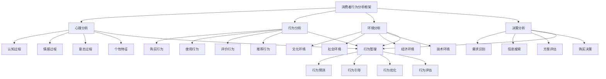

# 消费者行为分析

## 🎯 消费者行为分析概述

### 基本定义
**消费者行为分析**是指通过系统性的研究方法，分析消费者在购买决策过程中的心理活动、行为模式、影响因素和决策机制，为企业制定营销策略提供科学依据的管理活动。

### 核心特征
- **系统性**：系统性的分析方法
- **科学性**：科学性的研究手段
- **动态性**：动态性的行为变化
- **复杂性**：复杂性的影响因素
- **差异性**：差异性的个体特征
- **可预测性**：可预测性的行为规律

## 🎯 消费者行为分析框架

### 1. 分析维度

#### 消费者行为分析框架

#### 分析要素
- **心理分析**：认知过程、情感过程、意志过程、个性特征
- **行为分析**：购买行为、使用行为、评价行为、推荐行为
- **环境分析**：文化环境、社会环境、经济环境、技术环境
- **决策分析**：需求识别、信息搜索、方案评估、购买决策
- **行为管理**：行为预测、引导、优化、评估

### 2. 分析层次

#### 分析层次框架
- **个体分析**：个人消费者行为
- **群体分析**：群体消费者行为
- **市场分析**：市场消费者行为
- **社会分析**：社会消费者行为

## 🧠 心理分析

### 1. 认知过程分析

#### 认知要素
- **感知过程**：感觉、知觉、注意
- **记忆过程**：识记、保持、回忆
- **思维过程**：分析、综合、判断
- **学习过程**：经验、知识、技能

#### 分析方法
- **感知分析**：分析消费者感知过程
- **记忆分析**：分析消费者记忆过程
- **思维分析**：分析消费者思维过程
- **学习分析**：分析消费者学习过程

### 2. 情感过程分析

#### 情感要素
- **情绪状态**：积极情绪、消极情绪
- **情感体验**：愉悦、满意、失望
- **情感表达**：情感表达方式
- **情感影响**：情感对行为的影响

#### 分析方法
- **情绪分析**：分析消费者情绪状态
- **体验分析**：分析消费者情感体验
- **表达分析**：分析消费者情感表达
- **影响分析**：分析情感对行为影响

### 3. 意志过程分析

#### 意志要素
- **动机形成**：内在动机、外在动机
- **目标设定**：目标明确性、目标可达性
- **决策执行**：决策过程、执行过程
- **行为调节**：行为调节机制

#### 分析方法
- **动机分析**：分析消费者动机
- **目标分析**：分析消费者目标
- **决策分析**：分析消费者决策
- **调节分析**：分析行为调节

### 4. 个性特征分析

#### 个性要素
- **性格特征**：内向、外向、稳定、不稳定
- **能力特征**：认知能力、操作能力
- **兴趣特征**：兴趣范围、兴趣强度
- **价值观**：价值观念、价值取向

#### 分析方法
- **性格分析**：分析消费者性格
- **能力分析**：分析消费者能力
- **兴趣分析**：分析消费者兴趣
- **价值分析**：分析消费者价值观

## 🛒 行为分析

### 1. 购买行为分析

#### 行为要素
- **购买频率**：购买频次、购买周期
- **购买数量**：购买数量、购买规模
- **购买时机**：购买时间、购买季节
- **购买地点**：购买渠道、购买场所

#### 分析方法
- **频率分析**：分析购买频率
- **数量分析**：分析购买数量
- **时机分析**：分析购买时机
- **地点分析**：分析购买地点

### 2. 使用行为分析

#### 行为要素
- **使用方式**：使用方法、使用习惯
- **使用频率**：使用频次、使用强度
- **使用效果**：使用满意度、使用效果
- **使用问题**：使用困难、使用问题

#### 分析方法
- **方式分析**：分析使用方式
- **频率分析**：分析使用频率
- **效果分析**：分析使用效果
- **问题分析**：分析使用问题

### 3. 评价行为分析

#### 行为要素
- **评价标准**：评价标准、评价维度
- **评价过程**：评价过程、评价方法
- **评价结果**：评价结果、评价等级
- **评价影响**：评价对行为的影响

#### 分析方法
- **标准分析**：分析评价标准
- **过程分析**：分析评价过程
- **结果分析**：分析评价结果
- **影响分析**：分析评价影响

### 4. 推荐行为分析

#### 行为要素
- **推荐动机**：推荐动机、推荐原因
- **推荐方式**：推荐渠道、推荐方法
- **推荐对象**：推荐对象、推荐范围
- **推荐效果**：推荐效果、推荐影响

#### 分析方法
- **动机分析**：分析推荐动机
- **方式分析**：分析推荐方式
- **对象分析**：分析推荐对象
- **效果分析**：分析推荐效果

## 🌍 环境分析

### 1. 文化环境分析

#### 环境要素
- **文化背景**：文化传统、文化价值
- **文化影响**：文化对行为的影响
- **文化变化**：文化发展趋势
- **文化差异**：文化差异分析

#### 分析方法
- **背景分析**：分析文化背景
- **影响分析**：分析文化影响
- **变化分析**：分析文化变化
- **差异分析**：分析文化差异

### 2. 社会环境分析

#### 环境要素
- **社会结构**：社会阶层、社会群体
- **社会关系**：人际关系、社会网络
- **社会规范**：社会规范、社会期望
- **社会变化**：社会发展趋势

#### 分析方法
- **结构分析**：分析社会结构
- **关系分析**：分析社会关系
- **规范分析**：分析社会规范
- **变化分析**：分析社会变化

### 3. 经济环境分析

#### 环境要素
- **经济水平**：收入水平、消费能力
- **经济结构**：经济结构、产业结构
- **经济政策**：经济政策、消费政策
- **经济趋势**：经济发展趋势

#### 分析方法
- **水平分析**：分析经济水平
- **结构分析**：分析经济结构
- **政策分析**：分析经济政策
- **趋势分析**：分析经济趋势

### 4. 技术环境分析

#### 环境要素
- **技术水平**：技术水平、技术应用
- **技术影响**：技术对消费的影响
- **技术变化**：技术发展趋势
- **技术创新**：技术创新应用

#### 分析方法
- **水平分析**：分析技术水平
- **影响分析**：分析技术影响
- **变化分析**：分析技术变化
- **创新分析**：分析技术创新

## 🎯 决策分析

### 1. 需求识别分析

#### 需求要素
- **需求类型**：基本需求、发展需求
- **需求强度**：需求迫切性、需求重要性
- **需求变化**：需求发展趋势
- **需求满足**：需求满足方式

#### 分析方法
- **类型分析**：分析需求类型
- **强度分析**：分析需求强度
- **变化分析**：分析需求变化
- **满足分析**：分析需求满足

### 2. 信息搜索分析

#### 信息要素
- **信息来源**：信息来源渠道
- **信息内容**：信息内容类型
- **信息处理**：信息处理方式
- **信息影响**：信息对决策的影响

#### 分析方法
- **来源分析**：分析信息来源
- **内容分析**：分析信息内容
- **处理分析**：分析信息处理
- **影响分析**：分析信息影响

### 3. 方案评估分析

#### 评估要素
- **评估标准**：评估标准、评估维度
- **评估方法**：评估方法、评估工具
- **评估过程**：评估过程、评估步骤
- **评估结果**：评估结果、评估结论

#### 分析方法
- **标准分析**：分析评估标准
- **方法分析**：分析评估方法
- **过程分析**：分析评估过程
- **结果分析**：分析评估结果

### 4. 购买决策分析

#### 决策要素
- **决策过程**：决策过程、决策步骤
- **决策因素**：决策影响因素
- **决策结果**：决策结果、决策效果
- **决策影响**：决策对后续行为的影响

#### 分析方法
- **过程分析**：分析决策过程
- **因素分析**：分析决策因素
- **结果分析**：分析决策结果
- **影响分析**：分析决策影响

## 🔍 消费者行为分析方法

### 1. 定量分析方法

#### 方法类型
- **问卷调查**：问卷调查方法
- **实验研究**：实验研究方法
- **统计分析**：统计分析方法
- **数据挖掘**：数据挖掘方法

#### 方法应用
- **问卷应用**：应用问卷调查
- **实验应用**：应用实验研究
- **统计应用**：应用统计分析
- **挖掘应用**：应用数据挖掘

### 2. 定性分析方法

#### 方法类型
- **深度访谈**：深度访谈方法
- **焦点小组**：焦点小组方法
- **观察研究**：观察研究方法
- **案例研究**：案例研究方法

#### 方法应用
- **访谈应用**：应用深度访谈
- **小组应用**：应用焦点小组
- **观察应用**：应用观察研究
- **案例应用**：应用案例研究

### 3. 混合分析方法

#### 方法类型
- **混合研究**：混合研究方法
- **三角验证**：三角验证方法
- **多方法研究**：多方法研究方法
- **综合研究**：综合研究方法

#### 方法应用
- **混合应用**：应用混合研究
- **验证应用**：应用三角验证
- **多方法应用**：应用多方法研究
- **综合应用**：应用综合研究

### 4. 技术分析方法

#### 方法类型
- **大数据分析**：大数据分析方法
- **人工智能**：人工智能方法
- **机器学习**：机器学习方法
- **预测分析**：预测分析方法

#### 方法应用
- **数据应用**：应用大数据分析
- **智能应用**：应用人工智能
- **学习应用**：应用机器学习
- **预测应用**：应用预测分析

## 📊 消费者行为分析案例

### 案例1：电商平台消费者行为分析

#### 案例背景
某电商平台希望分析消费者行为，优化用户体验和提升销售业绩。

#### 分析过程
- **心理分析**：分析消费者心理特征
- **行为分析**：分析消费者购买行为
- **环境分析**：分析消费环境因素
- **决策分析**：分析消费者决策过程

#### 分析结果
- **心理特征**：识别消费者心理特征
- **行为模式**：发现消费者行为模式
- **环境影响**：分析环境影响因素
- **决策机制**：理解消费者决策机制

#### 应用效果
- **用户体验**：用户体验显著改善
- **销售业绩**：销售业绩大幅提升
- **客户满意度**：客户满意度提高
- **市场竞争力**：市场竞争力增强

### 案例2：快消品消费者行为分析

#### 案例背景
某快消品企业希望分析消费者行为，制定精准营销策略。

#### 分析过程
- **需求分析**：分析消费者需求
- **购买分析**：分析购买行为
- **使用分析**：分析使用行为
- **评价分析**：分析评价行为

#### 分析结果
- **需求特征**：识别需求特征
- **购买模式**：发现购买模式
- **使用习惯**：了解使用习惯
- **评价标准**：掌握评价标准

#### 应用效果
- **营销策略**：制定精准营销策略
- **产品开发**：优化产品开发
- **渠道管理**：改善渠道管理
- **品牌建设**：加强品牌建设

## 🎯 消费者行为分析最佳实践

### 1. 分析原则

#### 基本原则
- **系统性原则**：系统分析消费者行为
- **科学性原则**：科学分析消费者行为
- **动态性原则**：动态分析消费者行为
- **差异性原则**：差异分析消费者行为

#### 应用原则
- **目标导向**：以目标为导向
- **数据驱动**：以数据为驱动
- **客户导向**：以客户为导向
- **创新导向**：以创新为导向

### 2. 分析方法

#### 分析方法
- **系统分析**：系统分析消费者行为
- **科学分析**：科学分析消费者行为
- **动态分析**：动态分析消费者行为
- **差异分析**：差异分析消费者行为

#### 方法应用
- **系统应用**：应用系统分析方法
- **科学应用**：应用科学分析方法
- **动态应用**：应用动态分析方法
- **差异应用**：应用差异分析方法

### 3. 实施要点

#### 实施要点
- **数据收集**：收集准确数据
- **分析工具**：使用合适工具
- **结果应用**：应用分析结果
- **持续改进**：持续改进分析

#### 注意事项
- **避免偏见**：避免分析偏见
- **避免片面**：避免片面分析
- **避免静态**：避免静态分析
- **避免主观**：避免主观分析

## 📚 学习要点总结

### 核心概念
1. **消费者行为分析**：消费者行为分析的管理活动
2. **心理分析**：认知过程、情感过程、意志过程、个性特征
3. **行为分析**：购买行为、使用行为、评价行为、推荐行为
4. **环境分析**：文化环境、社会环境、经济环境、技术环境
5. **决策分析**：需求识别、信息搜索、方案评估、购买决策
6. **分析方法**：定量分析、定性分析、混合分析、技术分析
7. **分析工具**：问卷调查、深度访谈、大数据分析、人工智能
8. **分析应用**：行为预测、行为引导、行为优化、行为评估

### 关键理解
- 消费者行为分析是营销管理的重要基础
- 消费者行为具有复杂性和动态性特征
- 消费者行为受多种因素影响
- 消费者行为分析需要科学性和系统性
- 消费者行为分析需要定量和定性结合
- 消费者行为分析需要技术和工具支持
- 消费者行为分析需要持续性和创新性
- 消费者行为分析需要应用性和实用性

### 实践应用
- 运用消费者行为分析制定营销策略
- 运用消费者行为分析优化产品设计
- 运用消费者行为分析改善用户体验
- 运用消费者行为分析提升销售业绩
- 运用消费者行为分析增强客户满意度
- 运用消费者行为分析提高市场竞争力
- 运用消费者行为分析实现营销目标
- 运用消费者行为分析促进企业发展

## 🔗 相关链接

- [[市场细分]] - 市场细分
- [[市场环境分析]] - 市场环境分析
- [[实践练习-市场分析]] - 实践练习-市场分析
- [[工具实操指南-营销管理]] - 工具实操指南-营销管理

## 📚 延伸阅读

- [[营销管理学]] - 营销管理学理论
- [[消费者行为学]] - 消费者行为学理论
- [[市场研究学]] - 市场研究学理论
- [[心理学]] - 心理学理论

---
*更新时间：2024年*
*内容将根据学习反馈持续优化*
