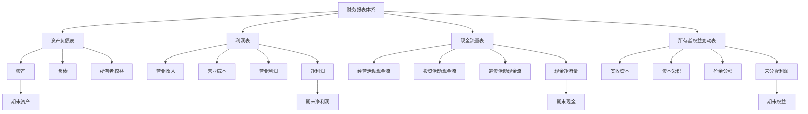
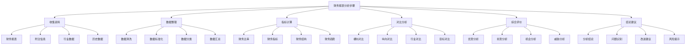
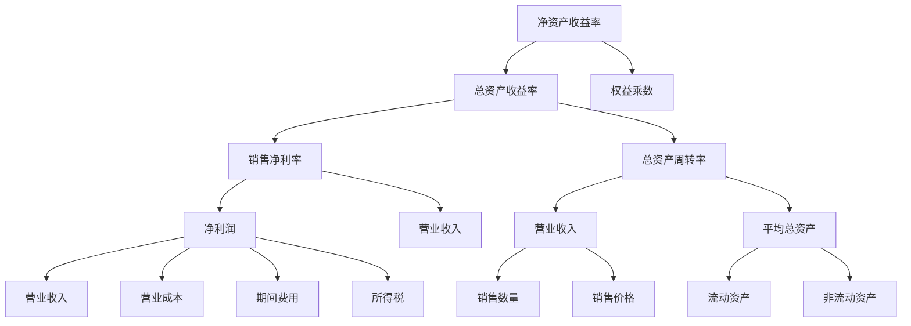

# 财务报表分析

## 📊 财务报表分析概述

### 基本定义
**财务报表分析**是指运用专门的分析方法，对企业的财务报表进行分析，评价企业的财务状况、经营成果和现金流量，为决策提供依据的过程。

### 核心特征
- **客观性**：基于客观数据
- **系统性**：系统分析财务
- **对比性**：对比分析指标
- **预测性**：预测发展趋势

## 📋 财务报表体系

### 1. 财务报表构成

#### 主要报表
- **资产负债表**：反映财务状况
- **利润表**：反映经营成果
- **现金流量表**：反映现金流量
- **所有者权益变动表**：反映权益变化

#### 附注信息
- **会计政策**：会计政策说明
- **重要事项**：重要事项披露
- **关联交易**：关联交易信息
- **或有事项**：或有事项说明

### 2. 财务报表关系

#### 报表关系

## 🔍 财务报表分析方法

### 1. 分析方法分类

#### 按分析对象分类
- **资产负债表分析**：资产、负债、权益分析
- **利润表分析**：收入、成本、利润分析
- **现金流量表分析**：现金流分析
- **综合财务分析**：综合财务分析

#### 按分析内容分类
- **财务比率分析**：财务比率分析
- **财务趋势分析**：财务趋势分析
- **财务结构分析**：财务结构分析
- **财务质量分析**：财务质量分析

#### 按分析目的分类
- **偿债能力分析**：偿债能力分析
- **营运能力分析**：营运能力分析
- **盈利能力分析**：盈利能力分析
- **发展能力分析**：发展能力分析

### 2. 分析步骤

#### 分析步骤

## 📈 财务比率分析

### 1. 偿债能力分析

#### 短期偿债能力
- **流动比率**：流动资产/流动负债
- **速动比率**：(流动资产-存货)/流动负债
- **现金比率**：现金及现金等价物/流动负债
- **现金流量比率**：经营活动现金流量/流动负债

#### 长期偿债能力
- **资产负债率**：总负债/总资产
- **权益乘数**：总资产/所有者权益
- **利息保障倍数**：息税前利润/利息费用
- **现金流量利息保障倍数**：经营活动现金流量/利息费用

### 2. 营运能力分析

#### 资产营运能力
- **总资产周转率**：营业收入/平均总资产
- **流动资产周转率**：营业收入/平均流动资产
- **固定资产周转率**：营业收入/平均固定资产
- **存货周转率**：营业成本/平均存货

#### 资金营运能力
- **应收账款周转率**：营业收入/平均应收账款
- **应付账款周转率**：营业成本/平均应付账款
- **现金周转率**：营业收入/平均现金
- **营运资金周转率**：营业收入/平均营运资金

### 3. 盈利能力分析

#### 销售盈利能力
- **销售毛利率**：(营业收入-营业成本)/营业收入
- **销售净利率**：净利润/营业收入
- **销售利润率**：营业利润/营业收入
- **销售费用率**：销售费用/营业收入

#### 资产盈利能力
- **总资产收益率**：净利润/平均总资产
- **净资产收益率**：净利润/平均净资产
- **投入资本回报率**：息税前利润/投入资本
- **经济增加值**：税后净营业利润-资本成本

### 4. 发展能力分析

#### 增长能力
- **营业收入增长率**：(本期营业收入-上期营业收入)/上期营业收入
- **净利润增长率**：(本期净利润-上期净利润)/上期净利润
- **总资产增长率**：(本期总资产-上期总资产)/上期总资产
- **净资产增长率**：(本期净资产-上期净资产)/上期净资产

#### 发展潜力
- **研发投入强度**：研发费用/营业收入
- **资本积累率**：资本积累额/期初所有者权益
- **技术投入比率**：技术投入/营业收入
- **可持续发展率**：可持续增长率

## 📊 财务趋势分析

### 1. 趋势分析方法

#### 水平分析
- **绝对数分析**：绝对数变化分析
- **相对数分析**：相对数变化分析
- **结构分析**：结构变化分析
- **比率分析**：比率变化分析

#### 垂直分析
- **结构百分比**：结构百分比分析
- **共同比分析**：共同比分析
- **比重分析**：比重变化分析
- **占比分析**：占比变化分析

### 2. 趋势分析内容

#### 资产负债表趋势
- **资产趋势**：资产变化趋势
- **负债趋势**：负债变化趋势
- **权益趋势**：权益变化趋势
- **结构趋势**：结构变化趋势

#### 利润表趋势
- **收入趋势**：收入变化趋势
- **成本趋势**：成本变化趋势
- **利润趋势**：利润变化趋势
- **费用趋势**：费用变化趋势

#### 现金流量表趋势
- **经营现金流趋势**：经营现金流趋势
- **投资现金流趋势**：投资现金流趋势
- **筹资现金流趋势**：筹资现金流趋势
- **净现金流趋势**：净现金流趋势

## 💰 现金流量分析

### 1. 现金流量结构分析

#### 现金流结构
- **经营活动现金流**：经营活动现金流
- **投资活动现金流**：投资活动现金流
- **筹资活动现金流**：筹资活动现金流
- **现金净流量**：现金净流量

#### 现金流质量
- **现金流稳定性**：现金流稳定性
- **现金流充足性**：现金流充足性
- **现金流成长性**：现金流成长性
- **现金流安全性**：现金流安全性

### 2. 现金流量比率分析

#### 现金流比率
- **现金流动负债比率**：经营活动现金流量/流动负债
- **现金债务总额比率**：经营活动现金流量/债务总额
- **现金利息保障倍数**：经营活动现金流量/利息费用
- **现金股利保障倍数**：经营活动现金流量/现金股利

#### 现金流效率
- **销售现金比率**：经营活动现金流量/营业收入
- **资产现金回收率**：经营活动现金流量/平均总资产
- **净资产现金回收率**：经营活动现金流量/平均净资产
- **投入资本现金回收率**：经营活动现金流量/投入资本

## 📈 财务综合分析

### 1. 杜邦分析体系

#### 杜邦分析框架

#### 杜邦分析应用
- **盈利能力分析**：分析盈利能力
- **营运能力分析**：分析营运能力
- **财务杠杆分析**：分析财务杠杆
- **综合绩效分析**：综合绩效分析

### 2. 沃尔评分法

#### 沃尔评分框架
- **财务比率选择**：选择关键财务比率
- **权重确定**：确定各比率权重
- **标准值确定**：确定标准值
- **评分计算**：计算综合评分

#### 沃尔评分应用
- **绩效评价**：绩效评价应用
- **行业对比**：行业对比应用
- **趋势分析**：趋势分析应用
- **改进指导**：改进指导应用

## 🔍 财务分析应用

### 1. 投资决策分析

#### 投资价值分析
- **内在价值分析**：内在价值分析
- **相对价值分析**：相对价值分析
- **成长价值分析**：成长价值分析
- **安全边际分析**：安全边际分析

#### 投资风险分析
- **财务风险分析**：财务风险分析
- **经营风险分析**：经营风险分析
- **市场风险分析**：市场风险分析
- **流动性风险分析**：流动性风险分析

### 2. 信贷决策分析

#### 偿债能力分析
- **短期偿债能力**：短期偿债能力
- **长期偿债能力**：长期偿债能力
- **现金流偿债能力**：现金流偿债能力
- **综合偿债能力**：综合偿债能力

#### 信用风险分析
- **违约风险分析**：违约风险分析
- **信用等级分析**：信用等级分析
- **风险预警分析**：风险预警分析
- **风险控制分析**：风险控制分析

## 🎯 学习要点总结

### 核心概念
1. **财务报表分析**：分析财务报表的过程
2. **财务报表体系**：资产负债表、利润表、现金流量表
3. **分析方法**：比率分析、趋势分析、结构分析
4. **财务比率**：偿债能力、营运能力、盈利能力、发展能力
5. **现金流量分析**：现金流结构、质量、比率分析
6. **综合分析**：杜邦分析、沃尔评分法

### 关键理解
- 财务报表分析是财务决策的重要工具
- 分析需要科学的方法和指标
- 综合分析能够全面评价财务状况
- 分析结果需要结合实际情况

### 实践应用
- 运用分析方法进行财务分析
- 使用财务比率评价企业绩效
- 运用综合分析全面评价企业
- 结合分析结果进行决策

## 🔗 相关链接

- [[财务比率分析]] - 财务比率分析
- [[财务趋势分析]] - 财务趋势分析
- [[财务预测分析]] - 财务预测分析
- [[实践练习-财务分析]] - 财务分析实践

## 📚 延伸阅读

- [[投资决策]] - 投资决策理论
- [[融资决策]] - 融资决策理论
- [[营运资金管理]] - 营运资金管理
- [[财务风险管理]] - 财务风险管理

---
*更新时间：2024年*
*内容将根据学习反馈持续优化*
