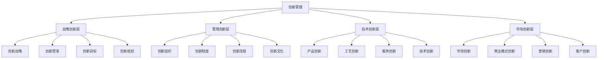
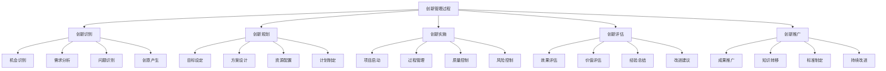

# 创新管理理论

## 💡 创新管理概述

### 基本定义
**创新管理**是指企业通过系统性的管理活动，激发创新潜能，组织创新活动，实现创新目标，提升企业竞争力的管理过程。

### 核心特征
- **系统性**：系统管理创新活动
- **前瞻性**：前瞻性创新规划
- **风险性**：创新具有风险性
- **价值性**：创新创造价值

## 📊 创新管理框架

### 1. 创新管理层次

#### 创新管理结构

#### 层次关系
- **战略创新层**：指导其他层次创新
- **管理创新层**：保障创新活动
- **技术创新层**：核心创新活动
- **市场创新层**：市场价值实现

### 2. 创新管理要素

#### 核心要素
- **创新战略**：创新发展方向
- **创新组织**：创新组织结构
- **创新制度**：创新管理制度
- **创新文化**：创新文化氛围

#### 支撑要素
- **创新资源**：人力资源、财务资源
- **创新技术**：技术平台、技术能力
- **创新市场**：市场需求、市场机会
- **创新环境**：外部环境、内部环境

## 🔄 创新管理过程

### 1. 创新过程模型

#### 创新过程

#### 过程特点
- **循环性**：创新过程循环进行
- **迭代性**：创新过程迭代改进
- **风险性**：创新过程存在风险
- **价值性**：创新过程创造价值

### 2. 创新管理方法

#### 管理方法
- **项目管理**：项目化管理创新
- **流程管理**：流程化管理创新
- **质量管理**：质量管理创新
- **风险管理**：风险管理创新

#### 管理工具
- **创新工具**：创新方法工具
- **分析工具**：分析评估工具
- **决策工具**：决策支持工具
- **监控工具**：监控管理工具

## 🎯 创新类型分析

### 1. 按创新内容分类

#### 产品创新
- **新产品开发**：全新产品开发
- **产品改进**：现有产品改进
- **产品组合**：产品组合创新
- **产品服务**：产品服务创新

#### 工艺创新
- **生产工艺**：生产工艺创新
- **制造工艺**：制造工艺创新
- **服务工艺**：服务工艺创新
- **管理工艺**：管理工艺创新

#### 服务创新
- **服务模式**：服务模式创新
- **服务内容**：服务内容创新
- **服务流程**：服务流程创新
- **服务体验**：服务体验创新

#### 商业模式创新
- **价值主张**：价值主张创新
- **价值创造**：价值创造创新
- **价值传递**：价值传递创新
- **价值获取**：价值获取创新

### 2. 按创新程度分类

#### 渐进式创新
- **特征**：改进现有产品、服务
- **优势**：风险较小、成本较低
- **劣势**：创新程度有限
- **适用**：成熟市场、稳定环境

#### 突破式创新
- **特征**：颠覆性创新、革命性变化
- **优势**：创新程度高、竞争优势强
- **劣势**：风险较大、成本较高
- **适用**：新兴市场、变化环境

#### 颠覆式创新
- **特征**：完全颠覆现有模式
- **优势**：创造新市场、新价值
- **劣势**：风险极大、不确定性高
- **适用**：技术突破、市场变革

### 3. 按创新来源分类

#### 内部创新
- **自主研发**：企业自主研发
- **内部创意**：员工创意产生
- **内部改进**：内部流程改进
- **内部整合**：内部资源整合

#### 外部创新
- **合作创新**：与外部合作
- **并购创新**：并购获取创新
- **引进创新**：引进外部创新
- **开放创新**：开放创新平台

## 📈 创新管理理论

### 1. 创新理论发展

#### 经典理论
- **熊彼特创新理论**：创新驱动经济发展
- **技术创新理论**：技术创新过程理论
- **制度创新理论**：制度创新理论
- **管理创新理论**：管理创新理论

#### 现代理论
- **开放式创新理论**：开放创新模式
- **用户创新理论**：用户参与创新
- **平台创新理论**：平台创新模式
- **生态创新理论**：创新生态系统

### 2. 创新管理理论

#### 创新管理理论
- **创新系统理论**：创新系统管理
- **创新网络理论**：创新网络管理
- **创新生态理论**：创新生态管理
- **创新治理理论**：创新治理管理

#### 理论应用
- **战略应用**：创新战略制定
- **组织应用**：创新组织设计
- **流程应用**：创新流程管理
- **文化应用**：创新文化建设

## 🎯 创新管理实践

### 1. 创新战略管理

#### 战略制定
- **创新愿景**：制定创新愿景
- **创新目标**：设定创新目标
- **创新重点**：确定创新重点
- **创新路径**：选择创新路径

#### 战略实施
- **资源配置**：配置创新资源
- **组织保障**：建立创新组织
- **制度保障**：完善创新制度
- **文化保障**：营造创新文化

### 2. 创新组织管理

#### 组织设计
- **创新团队**：组建创新团队
- **创新部门**：设立创新部门
- **创新平台**：建设创新平台
- **创新网络**：构建创新网络

#### 组织管理
- **团队管理**：管理创新团队
- **部门协调**：协调创新部门
- **平台运营**：运营创新平台
- **网络管理**：管理创新网络

### 3. 创新流程管理

#### 流程设计
- **创新流程**：设计创新流程
- **审批流程**：设计审批流程
- **评估流程**：设计评估流程
- **推广流程**：设计推广流程

#### 流程优化
- **流程改进**：改进创新流程
- **流程标准化**：标准化流程
- **流程自动化**：自动化流程
- **流程监控**：监控流程执行

## 📊 创新绩效评估

### 1. 评估维度

#### 创新投入
- **研发投入**：研发投入强度
- **人才投入**：创新人才投入
- **设备投入**：创新设备投入
- **时间投入**：创新时间投入

#### 创新产出
- **专利产出**：专利申请数量
- **产品产出**：新产品数量
- **技术产出**：技术成果数量
- **服务产出**：新服务数量

#### 创新效果
- **市场效果**：市场表现效果
- **财务效果**：财务绩效效果
- **技术效果**：技术水平效果
- **管理效果**：管理效率效果

### 2. 评估方法

#### 定量评估
- **指标评估**：创新指标评估
- **对比评估**：对比分析评估
- **趋势评估**：趋势分析评估
- **回归评估**：回归分析评估

#### 定性评估
- **专家评估**：专家评估意见
- **用户评估**：用户反馈评估
- **案例评估**：案例分析评估
- **综合评估**：综合评价结果

## 🔍 创新管理挑战

### 1. 主要挑战

#### 内部挑战
- **资源约束**：创新资源不足
- **能力不足**：创新能力不足
- **文化障碍**：创新文化障碍
- **制度缺陷**：创新制度缺陷

#### 外部挑战
- **竞争加剧**：市场竞争加剧
- **技术变化**：技术快速变化
- **需求变化**：市场需求变化
- **政策变化**：政策环境变化

### 2. 应对策略

#### 内部策略
- **资源优化**：优化资源配置
- **能力提升**：提升创新能力
- **文化建设**：建设创新文化
- **制度完善**：完善创新制度

#### 外部策略
- **竞争应对**：应对竞争挑战
- **技术跟踪**：跟踪技术发展
- **需求满足**：满足市场需求
- **政策适应**：适应政策变化

## 🎯 学习要点总结

### 核心概念
1. **创新管理**：系统性管理创新活动的过程
2. **创新框架**：战略、管理、技术、市场创新层
3. **创新过程**：识别、规划、实施、评估、推广
4. **创新类型**：产品、工艺、服务、商业模式创新
5. **创新理论**：经典理论、现代理论
6. **创新实践**：战略管理、组织管理、流程管理

### 关键理解
- 创新管理是企业发展的重要驱动力
- 创新管理需要系统性和前瞻性
- 创新管理面临内部和外部挑战
- 创新管理需要科学评估和改进

### 实践应用
- 运用创新管理理论指导实践
- 建立创新管理体系
- 运用评估方法评价创新绩效
- 持续改进创新管理

## 🔗 相关链接

- [[创新类型与模式]] - 创新类型与模式
- [[创新过程管理]] - 创新过程管理
- [[创新绩效评估]] - 创新绩效评估
- [[记忆口诀-企业创新]] - 企业创新记忆口诀

## 📚 延伸阅读

- [[企业文化]] - 企业文化理论
- [[风险管理]] - 风险管理理论
- [[可持续发展]] - 可持续发展理论
- [[战略管理]] - 战略管理理论

---
*更新时间：2024年*
*内容将根据学习反馈持续优化*
