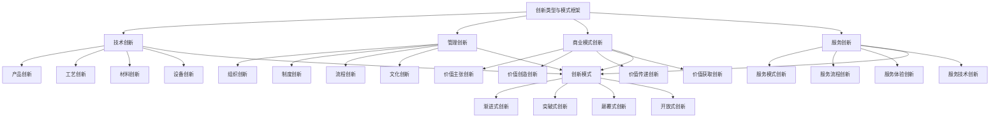

# 创新类型与模式

## 🎯 创新类型与模式概述

### 基本定义
**创新类型与模式**是指企业根据不同的创新目标、创新领域、创新方式等特征，对创新活动进行分类和模式化，形成系统性的创新类型体系和创新模式框架，指导企业创新实践的管理活动。

### 核心特征
- **多样性**：多样性的创新类型
- **系统性**：系统性的创新模式
- **适应性**：适应性的创新选择
- **创新性**：创新性的模式设计
- **实用性**：实用性的模式应用
- **发展性**：发展性的模式演进

## 🎯 创新类型与模式框架

### 1. 创新类型

#### 创新类型与模式框架

#### 创新要素
- **技术创新**：产品创新、工艺创新、材料创新、设备创新
- **管理创新**：组织创新、制度创新、流程创新、文化创新
- **商业模式创新**：价值主张、价值创造、价值传递、价值获取创新
- **服务创新**：服务模式、服务流程、服务体验、服务技术创新
- **创新模式**：渐进式、突破式、颠覆式、开放式创新

### 2. 创新模式

#### 创新模式框架
- **渐进式创新**：改进性创新模式
- **突破式创新**：突破性创新模式
- **颠覆式创新**：颠覆性创新模式
- **开放式创新**：开放性创新模式

## 🔧 技术创新

### 1. 产品创新

#### 创新要素
- **功能创新**：产品功能创新
- **设计创新**：产品设计创新
- **材料创新**：产品材料创新
- **性能创新**：产品性能创新

#### 创新方法
- **功能方法**：功能创新方法
- **设计方法**：设计创新方法
- **材料方法**：材料创新方法
- **性能方法**：性能创新方法

### 2. 工艺创新

#### 创新要素
- **工艺设计**：工艺设计创新
- **工艺优化**：工艺优化创新
- **工艺控制**：工艺控制创新
- **工艺管理**：工艺管理创新

#### 创新方法
- **设计方法**：工艺设计方法
- **优化方法**：工艺优化方法
- **控制方法**：工艺控制方法
- **管理方法**：工艺管理方法

### 3. 材料创新

#### 创新要素
- **新材料开发**：新材料开发创新
- **材料应用**：材料应用创新
- **材料性能**：材料性能创新
- **材料工艺**：材料工艺创新

#### 创新方法
- **开发方法**：材料开发方法
- **应用方法**：材料应用方法
- **性能方法**：材料性能方法
- **工艺方法**：材料工艺方法

### 4. 设备创新

#### 创新要素
- **设备设计**：设备设计创新
- **设备制造**：设备制造创新
- **设备控制**：设备控制创新
- **设备维护**：设备维护创新

#### 创新方法
- **设计方法**：设备设计方法
- **制造方法**：设备制造方法
- **控制方法**：设备控制方法
- **维护方法**：设备维护方法

## 📊 管理创新

### 1. 组织创新

#### 创新要素
- **组织结构**：组织结构创新
- **组织流程**：组织流程创新
- **组织机制**：组织机制创新
- **组织文化**：组织文化创新

#### 创新方法
- **结构方法**：组织结构方法
- **流程方法**：组织流程方法
- **机制方法**：组织机制方法
- **文化方法**：组织文化方法

### 2. 制度创新

#### 创新要素
- **制度设计**：制度设计创新
- **制度实施**：制度实施创新
- **制度完善**：制度完善创新
- **制度优化**：制度优化创新

#### 创新方法
- **设计方法**：制度设计方法
- **实施方法**：制度实施方法
- **完善方法**：制度完善方法
- **优化方法**：制度优化方法

### 3. 流程创新

#### 创新要素
- **流程设计**：流程设计创新
- **流程优化**：流程优化创新
- **流程再造**：流程再造创新
- **流程管理**：流程管理创新

#### 创新方法
- **设计方法**：流程设计方法
- **优化方法**：流程优化方法
- **再造方法**：流程再造方法
- **管理方法**：流程管理方法

### 4. 文化创新

#### 创新要素
- **文化理念**：文化理念创新
- **文化行为**：文化行为创新
- **文化制度**：文化制度创新
- **文化环境**：文化环境创新

#### 创新方法
- **理念方法**：文化理念方法
- **行为方法**：文化行为方法
- **制度方法**：文化制度方法
- **环境方法**：文化环境方法

## 💼 商业模式创新

### 1. 价值主张创新

#### 创新要素
- **价值定位**：价值定位创新
- **价值内容**：价值内容创新
- **价值传递**：价值传递创新
- **价值实现**：价值实现创新

#### 创新方法
- **定位方法**：价值定位方法
- **内容方法**：价值内容方法
- **传递方法**：价值传递方法
- **实现方法**：价值实现方法

### 2. 价值创造创新

#### 创新要素
- **创造方式**：价值创造方式创新
- **创造过程**：价值创造过程创新
- **创造资源**：价值创造资源创新
- **创造能力**：价值创造能力创新

#### 创新方法
- **方式方法**：价值创造方式方法
- **过程方法**：价值创造过程方法
- **资源方法**：价值创造资源方法
- **能力方法**：价值创造能力方法

### 3. 价值传递创新

#### 创新要素
- **传递渠道**：价值传递渠道创新
- **传递方式**：价值传递方式创新
- **传递过程**：价值传递过程创新
- **传递效果**：价值传递效果创新

#### 创新方法
- **渠道方法**：价值传递渠道方法
- **方式方法**：价值传递方式方法
- **过程方法**：价值传递过程方法
- **效果方法**：价值传递效果方法

### 4. 价值获取创新

#### 创新要素
- **获取方式**：价值获取方式创新
- **获取机制**：价值获取机制创新
- **获取过程**：价值获取过程创新
- **获取效果**：价值获取效果创新

#### 创新方法
- **方式方法**：价值获取方式方法
- **机制方法**：价值获取机制方法
- **过程方法**：价值获取过程方法
- **效果方法**：价值获取效果方法

## 🎨 服务创新

### 1. 服务模式创新

#### 创新要素
- **服务理念**：服务理念创新
- **服务方式**：服务方式创新
- **服务内容**：服务内容创新
- **服务标准**：服务标准创新

#### 创新方法
- **理念方法**：服务理念方法
- **方式方法**：服务方式方法
- **内容方法**：服务内容方法
- **标准方法**：服务标准方法

### 2. 服务流程创新

#### 创新要素
- **流程设计**：服务流程设计创新
- **流程优化**：服务流程优化创新
- **流程再造**：服务流程再造创新
- **流程管理**：服务流程管理创新

#### 创新方法
- **设计方法**：服务流程设计方法
- **优化方法**：服务流程优化方法
- **再造方法**：服务流程再造方法
- **管理方法**：服务流程管理方法

### 3. 服务体验创新

#### 创新要素
- **体验设计**：服务体验设计创新
- **体验优化**：服务体验优化创新
- **体验管理**：服务体验管理创新
- **体验评估**：服务体验评估创新

#### 创新方法
- **设计方法**：服务体验设计方法
- **优化方法**：服务体验优化方法
- **管理方法**：服务体验管理方法
- **评估方法**：服务体验评估方法

### 4. 服务技术创新

#### 创新要素
- **技术应用**：服务技术应用创新
- **技术集成**：服务技术集成创新
- **技术优化**：服务技术优化创新
- **技术管理**：服务技术管理创新

#### 创新方法
- **应用方法**：服务技术应用方法
- **集成方法**：服务技术集成方法
- **优化方法**：服务技术优化方法
- **管理方法**：服务技术管理方法

## 🔄 创新模式

### 1. 渐进式创新

#### 模式特征
- **改进性**：改进性创新特征
- **连续性**：连续性创新特征
- **稳定性**：稳定性创新特征
- **风险性**：低风险性创新特征

#### 模式应用
- **产品改进**：产品改进应用
- **工艺优化**：工艺优化应用
- **服务提升**：服务提升应用
- **管理完善**：管理完善应用

### 2. 突破式创新

#### 模式特征
- **突破性**：突破性创新特征
- **跳跃性**：跳跃性创新特征
- **风险性**：中等风险性创新特征
- **收益性**：高收益性创新特征

#### 模式应用
- **技术突破**：技术突破应用
- **产品创新**：产品创新应用
- **市场开拓**：市场开拓应用
- **业务扩展**：业务扩展应用

### 3. 颠覆式创新

#### 模式特征
- **颠覆性**：颠覆性创新特征
- **革命性**：革命性创新特征
- **风险性**：高风险性创新特征
- **收益性**：超高收益性创新特征

#### 模式应用
- **商业模式**：商业模式颠覆应用
- **技术革命**：技术革命应用
- **市场重构**：市场重构应用
- **行业变革**：行业变革应用

### 4. 开放式创新

#### 模式特征
- **开放性**：开放性创新特征
- **协同性**：协同性创新特征
- **网络性**：网络性创新特征
- **生态性**：生态性创新特征

#### 模式应用
- **合作创新**：合作创新应用
- **平台创新**：平台创新应用
- **生态创新**：生态创新应用
- **网络创新**：网络创新应用

## 🔍 创新类型选择

### 1. 选择标准

#### 选择要素
- **企业能力**：企业创新能力
- **市场环境**：市场环境条件
- **竞争态势**：竞争态势分析
- **资源条件**：资源条件评估

#### 选择方法
- **能力评估**：评估企业能力
- **环境分析**：分析市场环境
- **竞争分析**：分析竞争态势
- **资源评估**：评估资源条件

### 2. 选择方法

#### 方法类型
- **SWOT分析**：SWOT分析方法
- **能力分析**：能力分析方法
- **环境分析**：环境分析方法
- **资源分析**：资源分析方法

#### 方法应用
- **SWOT应用**：应用SWOT分析
- **能力应用**：应用能力分析
- **环境应用**：应用环境分析
- **资源应用**：应用资源分析

### 3. 选择策略

#### 策略类型
- **单一策略**：单一创新类型策略
- **组合策略**：组合创新类型策略
- **阶段策略**：阶段创新类型策略
- **动态策略**：动态创新类型策略

#### 策略应用
- **单一应用**：应用单一策略
- **组合应用**：应用组合策略
- **阶段应用**：应用阶段策略
- **动态应用**：应用动态策略

## 📊 创新类型与模式案例

### 案例1：苹果公司产品创新

#### 案例背景
苹果公司通过产品创新，持续推出革命性产品，改变行业格局。

#### 创新类型
- **产品创新**：iPhone、iPad、MacBook
- **技术创新**：iOS系统、A系列芯片
- **设计创新**：简约设计、用户体验
- **商业模式创新**：App Store、iTunes

#### 创新模式
- **突破式创新**：突破性产品创新
- **颠覆式创新**：颠覆性商业模式
- **渐进式创新**：产品持续改进
- **开放式创新**：开发者生态

#### 创新结果
- **市场地位**：成为行业领导者
- **品牌价值**：品牌价值大幅提升
- **盈利能力**：盈利能力显著增强
- **创新能力**：创新能力持续提升

### 案例2：特斯拉汽车创新

#### 案例背景
特斯拉通过技术创新和商业模式创新，颠覆传统汽车行业。

#### 创新类型
- **技术创新**：电动汽车技术
- **产品创新**：智能汽车产品
- **商业模式创新**：直销模式
- **服务创新**：超级充电网络

#### 创新模式
- **颠覆式创新**：颠覆传统汽车
- **突破式创新**：突破技术瓶颈
- **开放式创新**：开放专利技术
- **渐进式创新**：持续产品改进

#### 创新结果
- **市场影响**：改变汽车行业
- **技术领先**：技术领先地位
- **品牌价值**：品牌价值提升
- **市场表现**：市场表现优异

## 🎯 创新类型与模式最佳实践

### 1. 选择原则

#### 基本原则
- **能力匹配原则**：与能力匹配
- **环境适应原则**：与环境适应
- **竞争导向原则**：以竞争为导向
- **资源优化原则**：优化资源配置

#### 应用原则
- **目标导向**：以目标为导向
- **能力导向**：以能力为导向
- **市场导向**：以市场为导向
- **创新导向**：以创新为导向

### 2. 实施方法

#### 实施方法
- **系统实施**：系统实施创新类型
- **组合实施**：组合实施创新类型
- **阶段实施**：阶段实施创新类型
- **动态实施**：动态实施创新类型

#### 方法应用
- **系统应用**：应用系统实施方法
- **组合应用**：应用组合实施方法
- **阶段应用**：应用阶段实施方法
- **动态应用**：应用动态实施方法

### 3. 管理要点

#### 管理要点
- **类型管理**：管理创新类型
- **模式管理**：管理创新模式
- **选择管理**：管理创新选择
- **实施管理**：管理创新实施

#### 注意事项
- **避免单一**：避免单一创新类型
- **避免僵化**：避免创新模式僵化
- **避免盲目**：避免盲目创新选择
- **避免孤立**：避免孤立创新实施

## 📚 学习要点总结

### 核心概念
1. **创新类型**：技术创新、管理创新、商业模式创新、服务创新
2. **技术创新**：产品创新、工艺创新、材料创新、设备创新
3. **管理创新**：组织创新、制度创新、流程创新、文化创新
4. **商业模式创新**：价值主张、价值创造、价值传递、价值获取创新
5. **服务创新**：服务模式、服务流程、服务体验、服务技术创新
6. **创新模式**：渐进式、突破式、颠覆式、开放式创新
7. **选择标准**：企业能力、市场环境、竞争态势、资源条件
8. **实施策略**：单一策略、组合策略、阶段策略、动态策略

### 关键理解
- 创新类型与模式是创新管理的重要基础
- 创新类型具有多样性和系统性特征
- 创新模式具有适应性和创新性特征
- 创新类型选择需要能力匹配和环境适应
- 创新模式应用需要系统性和组合性
- 创新类型与模式需要动态性和灵活性
- 创新类型与模式需要工具性和技术性
- 创新类型与模式需要应用性和实用性

### 实践应用
- 运用创新类型与模式指导创新实践
- 运用创新类型与模式优化创新选择
- 运用创新类型与模式提升创新效率
- 运用创新类型与模式增强创新能力
- 运用创新类型与模式实现创新目标
- 运用创新类型与模式促进企业发展
- 运用创新类型与模式提升竞争优势
- 运用创新类型与模式推动行业变革

## 🔗 相关链接

- [[创新管理理论]] - 创新管理理论
- [[创新过程管理]] - 创新过程管理
- [[工具实操指南-创新管理]] - 工具实操指南-创新管理
- [[实践练习-创新管理]] - 实践练习-创新管理

## 📚 延伸阅读

- [[创新管理学]] - 创新管理学理论
- [[技术管理学]] - 技术管理学理论
- [[商业模式学]] - 商业模式学理论
- [[服务管理学]] - 服务管理学理论

---
*更新时间：2024年*
*内容将根据学习反馈持续优化*
