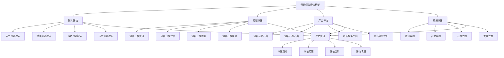

# 创新绩效评估

## 🎯 创新绩效评估概述

### 基本定义
**创新绩效评估**是指企业通过系统性的评估方法和工具，对创新活动的投入、过程、产出和效果进行全面、客观、科学的评估分析，识别创新优势和不足，为创新决策提供依据的管理活动。

### 核心特征
- **系统性**：系统性的评估方法
- **客观性**：客观性的评估标准
- **科学性**：科学性的评估工具
- **全面性**：全面性的评估内容
- **动态性**：动态性的评估过程
- **实用性**：实用性的评估结果

## 🎯 创新绩效评估框架

### 1. 评估维度

#### 创新绩效评估框架

#### 评估要素
- **投入评估**：人力资源、财务资源、技术资源、信息资源投入
- **过程评估**：创新过程管理、效率、质量、风险
- **产出评估**：创新成果、产品、服务、知识产出
- **效果评估**：经济效益、社会效益、技术效益、管理效益
- **评估管理**：评估规划、实施、分析、改进

### 2. 评估层次

#### 评估层次框架
- **战略评估**：创新战略绩效评估
- **管理评估**：创新管理绩效评估
- **项目评估**：创新项目绩效评估
- **个人评估**：创新个人绩效评估

## 💰 投入评估

### 1. 人力资源投入评估

#### 评估要素
- **人员数量**：创新人员数量评估
- **人员质量**：创新人员质量评估
- **人员结构**：创新人员结构评估
- **人员成本**：创新人员成本评估

#### 评估方法
- **数量评估**：评估人员数量
- **质量评估**：评估人员质量
- **结构评估**：评估人员结构
- **成本评估**：评估人员成本

### 2. 财务资源投入评估

#### 评估要素
- **资金投入**：创新资金投入评估
- **资金结构**：创新资金结构评估
- **资金效率**：创新资金效率评估
- **资金风险**：创新资金风险评估

#### 评估方法
- **投入评估**：评估资金投入
- **结构评估**：评估资金结构
- **效率评估**：评估资金效率
- **风险评估**：评估资金风险

### 3. 技术资源投入评估

#### 评估要素
- **技术投入**：创新技术投入评估
- **技术水平**：创新技术水平评估
- **技术结构**：创新技术结构评估
- **技术效果**：创新技术效果评估

#### 评估方法
- **投入评估**：评估技术投入
- **水平评估**：评估技术水平
- **结构评估**：评估技术结构
- **效果评估**：评估技术效果

### 4. 信息资源投入评估

#### 评估要素
- **信息投入**：创新信息投入评估
- **信息质量**：创新信息质量评估
- **信息结构**：创新信息结构评估
- **信息效果**：创新信息效果评估

#### 评估方法
- **投入评估**：评估信息投入
- **质量评估**：评估信息质量
- **结构评估**：评估信息结构
- **效果评估**：评估信息效果

## 🔄 过程评估

### 1. 创新过程管理评估

#### 评估要素
- **过程规划**：创新过程规划评估
- **过程控制**：创新过程控制评估
- **过程协调**：创新过程协调评估
- **过程优化**：创新过程优化评估

#### 评估方法
- **规划评估**：评估过程规划
- **控制评估**：评估过程控制
- **协调评估**：评估过程协调
- **优化评估**：评估过程优化

### 2. 创新过程效率评估

#### 评估要素
- **时间效率**：创新时间效率评估
- **资源效率**：创新资源效率评估
- **成本效率**：创新成本效率评估
- **质量效率**：创新质量效率评估

#### 评估方法
- **时间效率**：评估时间效率
- **资源效率**：评估资源效率
- **成本效率**：评估成本效率
- **质量效率**：评估质量效率

### 3. 创新过程质量评估

#### 评估要素
- **过程质量**：创新过程质量评估
- **管理质量**：创新管理质量评估
- **技术质量**：创新技术质量评估
- **服务质量**：创新服务质量评估

#### 评估方法
- **过程质量**：评估过程质量
- **管理质量**：评估管理质量
- **技术质量**：评估技术质量
- **服务质量**：评估服务质量

### 4. 创新过程风险评估

#### 评估要素
- **技术风险**：创新技术风险评估
- **市场风险**：创新市场风险评估
- **财务风险**：创新财务风险评估
- **管理风险**：创新管理风险评估

#### 评估方法
- **技术风险**：评估技术风险
- **市场风险**：评估市场风险
- **财务风险**：评估财务风险
- **管理风险**：评估管理风险

## 📊 产出评估

### 1. 创新成果产出评估

#### 评估要素
- **成果数量**：创新成果数量评估
- **成果质量**：创新成果质量评估
- **成果类型**：创新成果类型评估
- **成果价值**：创新成果价值评估

#### 评估方法
- **数量评估**：评估成果数量
- **质量评估**：评估成果质量
- **类型评估**：评估成果类型
- **价值评估**：评估成果价值

### 2. 创新产品产出评估

#### 评估要素
- **产品数量**：创新产品数量评估
- **产品质量**：创新产品质量评估
- **产品性能**：创新产品性能评估
- **产品市场**：创新产品市场评估

#### 评估方法
- **数量评估**：评估产品数量
- **质量评估**：评估产品质量
- **性能评估**：评估产品性能
- **市场评估**：评估产品市场

### 3. 创新服务产出评估

#### 评估要素
- **服务数量**：创新服务数量评估
- **服务质量**：创新服务质量评估
- **服务效果**：创新服务效果评估
- **服务满意度**：创新服务满意度评估

#### 评估方法
- **数量评估**：评估服务数量
- **质量评估**：评估服务质量
- **效果评估**：评估服务效果
- **满意度评估**：评估服务满意度

### 4. 创新知识产出评估

#### 评估要素
- **知识数量**：创新知识数量评估
- **知识质量**：创新知识质量评估
- **知识类型**：创新知识类型评估
- **知识应用**：创新知识应用评估

#### 评估方法
- **数量评估**：评估知识数量
- **质量评估**：评估知识质量
- **类型评估**：评估知识类型
- **应用评估**：评估知识应用

## 🎯 效果评估

### 1. 经济效益评估

#### 评估要素
- **收入增长**：创新收入增长评估
- **成本降低**：创新成本降低评估
- **利润提升**：创新利润提升评估
- **投资回报**：创新投资回报评估

#### 评估方法
- **收入增长**：评估收入增长
- **成本降低**：评估成本降低
- **利润提升**：评估利润提升
- **投资回报**：评估投资回报

### 2. 社会效益评估

#### 评估要素
- **就业创造**：创新就业创造评估
- **社会贡献**：创新社会贡献评估
- **环境影响**：创新环境影响评估
- **社会影响**：创新社会影响评估

#### 评估方法
- **就业创造**：评估就业创造
- **社会贡献**：评估社会贡献
- **环境影响**：评估环境影响
- **社会影响**：评估社会影响

### 3. 技术效益评估

#### 评估要素
- **技术水平**：创新技术水平评估
- **技术领先**：创新技术领先评估
- **技术应用**：创新技术应用评估
- **技术影响**：创新技术影响评估

#### 评估方法
- **技术水平**：评估技术水平
- **技术领先**：评估技术领先
- **技术应用**：评估技术应用
- **技术影响**：评估技术影响

### 4. 管理效益评估

#### 评估要素
- **管理效率**：创新管理效率评估
- **管理质量**：创新管理质量评估
- **管理创新**：创新管理创新评估
- **管理影响**：创新管理影响评估

#### 评估方法
- **管理效率**：评估管理效率
- **管理质量**：评估管理质量
- **管理创新**：评估管理创新
- **管理影响**：评估管理影响

## 🎯 评估层次管理

### 1. 战略评估

#### 评估要素
- **战略目标**：创新战略目标评估
- **战略实施**：创新战略实施评估
- **战略效果**：创新战略效果评估
- **战略调整**：创新战略调整评估

#### 评估方法
- **战略目标**：评估战略目标
- **战略实施**：评估战略实施
- **战略效果**：评估战略效果
- **战略调整**：评估战略调整

### 2. 管理评估

#### 评估要素
- **管理目标**：创新管理目标评估
- **管理实施**：创新管理实施评估
- **管理效果**：创新管理效果评估
- **管理改进**：创新管理改进评估

#### 评估方法
- **管理目标**：评估管理目标
- **管理实施**：评估管理实施
- **管理效果**：评估管理效果
- **管理改进**：评估管理改进

### 3. 项目评估

#### 评估要素
- **项目目标**：创新项目目标评估
- **项目实施**：创新项目实施评估
- **项目效果**：创新项目效果评估
- **项目总结**：创新项目总结评估

#### 评估方法
- **项目目标**：评估项目目标
- **项目实施**：评估项目实施
- **项目效果**：评估项目效果
- **项目总结**：评估项目总结

### 4. 个人评估

#### 评估要素
- **个人目标**：创新个人目标评估
- **个人表现**：创新个人表现评估
- **个人贡献**：创新个人贡献评估
- **个人发展**：创新个人发展评估

#### 评估方法
- **个人目标**：评估个人目标
- **个人表现**：评估个人表现
- **个人贡献**：评估个人贡献
- **个人发展**：评估个人发展

## 🔍 创新绩效评估方法

### 1. 评估方法

#### 方法类型
- **定量评估**：定量评估方法
- **定性评估**：定性评估方法
- **混合评估**：混合评估方法
- **综合评估**：综合评估方法

#### 方法应用
- **定量应用**：应用定量评估
- **定性应用**：应用定性评估
- **混合应用**：应用混合评估
- **综合应用**：应用综合评估

### 2. 评估工具

#### 工具类型
- **指标体系**：创新绩效指标体系
- **评估模型**：创新绩效评估模型
- **评估软件**：创新绩效评估软件
- **评估平台**：创新绩效评估平台

#### 工具应用
- **指标应用**：应用指标体系
- **模型应用**：应用评估模型
- **软件应用**：应用评估软件
- **平台应用**：应用评估平台

### 3. 评估技术

#### 技术类型
- **信息技术**：信息技术应用
- **人工智能**：人工智能技术
- **大数据**：大数据技术
- **机器学习**：机器学习技术

#### 技术应用
- **信息应用**：应用信息技术
- **智能应用**：应用人工智能
- **数据应用**：应用大数据技术
- **学习应用**：应用机器学习

### 4. 评估标准

#### 标准类型
- **行业标准**：行业创新绩效标准
- **企业标准**：企业创新绩效标准
- **项目标准**：项目创新绩效标准
- **个人标准**：个人创新绩效标准

#### 标准应用
- **行业应用**：应用行业标准
- **企业应用**：应用企业标准
- **项目应用**：应用项目标准
- **个人应用**：应用个人标准

## 📊 创新绩效评估案例

### 案例1：某科技企业创新绩效评估

#### 案例背景
某科技企业实施创新绩效评估，全面评估企业创新能力和效果。

#### 评估过程
- **投入评估**：评估人力资源、财务资源、技术资源投入
- **过程评估**：评估创新过程管理、效率、质量
- **产出评估**：评估创新成果、产品、服务产出
- **效果评估**：评估经济效益、社会效益、技术效益

#### 评估结果
- **创新能力**：创新能力提升40%
- **创新效率**：创新效率提升35%
- **创新成果**：创新成果数量增长50%
- **创新效益**：创新效益提升30%

#### 改进建议
- **投入优化**：优化创新资源投入
- **过程改进**：改进创新过程管理
- **产出提升**：提升创新产出质量
- **效果增强**：增强创新效果

### 案例2：某制造企业创新绩效评估

#### 案例背景
某制造企业实施创新绩效评估，识别创新优势和不足。

#### 评估过程
- **投入评估**：评估创新资源投入
- **过程评估**：评估创新过程效率
- **产出评估**：评估创新产品产出
- **效果评估**：评估创新经济效益

#### 评估结果
- **创新投入**：创新投入效率提升25%
- **创新过程**：创新过程效率提升30%
- **创新产出**：创新产品竞争力提升35%
- **创新效果**：创新经济效益提升40%

#### 改进建议
- **资源优化**：优化创新资源配置
- **流程优化**：优化创新流程
- **质量提升**：提升创新产品质量
- **效益提升**：提升创新经济效益

## 🎯 创新绩效评估最佳实践

### 1. 评估原则

#### 基本原则
- **系统性原则**：系统进行创新绩效评估
- **客观性原则**：客观进行创新绩效评估
- **科学性原则**：科学进行创新绩效评估
- **全面性原则**：全面进行创新绩效评估

#### 应用原则
- **目标导向**：以目标为导向
- **数据导向**：以数据为导向
- **效果导向**：以效果为导向
- **改进导向**：以改进为导向

### 2. 评估方法

#### 评估方法
- **系统评估**：系统进行创新绩效评估
- **客观评估**：客观进行创新绩效评估
- **科学评估**：科学进行创新绩效评估
- **全面评估**：全面进行创新绩效评估

#### 方法应用
- **系统应用**：应用系统评估方法
- **客观应用**：应用客观评估方法
- **科学应用**：应用科学评估方法
- **全面应用**：应用全面评估方法

### 3. 实施要点

#### 实施要点
- **标准制定**：制定评估标准
- **工具应用**：应用评估工具
- **数据收集**：收集评估数据
- **结果应用**：应用评估结果

#### 注意事项
- **避免主观**：避免主观评估
- **避免片面**：避免片面评估
- **避免静态**：避免静态评估
- **避免形式**：避免形式评估

## 📚 学习要点总结

### 核心概念
1. **创新绩效评估**：创新绩效评估的管理活动
2. **投入评估**：人力资源、财务资源、技术资源、信息资源投入
3. **过程评估**：创新过程管理、效率、质量、风险
4. **产出评估**：创新成果、产品、服务、知识产出
5. **效果评估**：经济效益、社会效益、技术效益、管理效益
6. **评估层次**：战略评估、管理评估、项目评估、个人评估
7. **评估方法**：定量评估、定性评估、混合评估、综合评估
8. **评估工具**：指标体系、评估模型、评估软件、评估平台

### 关键理解
- 创新绩效评估是创新管理的重要工具
- 创新绩效评估具有系统性和客观性特征
- 创新绩效评估需要科学性和全面性
- 创新绩效评估需要动态性和实用性
- 创新绩效评估需要投入性和过程性
- 创新绩效评估需要产出性和效果性
- 创新绩效评估需要工具性和技术性
- 创新绩效评估需要应用性和改进性

### 实践应用
- 运用创新绩效评估识别创新优势
- 运用创新绩效评估发现创新不足
- 运用创新绩效评估指导创新决策
- 运用创新绩效评估提升创新能力
- 运用创新绩效评估优化创新管理
- 运用创新绩效评估增强创新效果
- 运用创新绩效评估实现创新目标
- 运用创新绩效评估促进企业发展

## 🔗 相关链接

- [[创新管理理论]] - 创新管理理论
- [[创新过程管理]] - 创新过程管理
- [[创新类型与模式]] - 创新类型与模式
- [[工具实操指南-创新管理]] - 工具实操指南-创新管理

## 📚 延伸阅读

- [[创新管理学]] - 创新管理学理论
- [[绩效管理学]] - 绩效管理学理论
- [[评估学]] - 评估学理论
- [[数据分析学]] - 数据分析学理论

---
*更新时间：2024年*
*内容将根据学习反馈持续优化*
