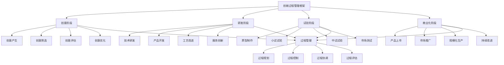

# 创新过程管理

## 🎯 创新过程管理概述

### 基本定义
**创新过程管理**是指企业通过系统性的管理方法，对创新活动从创意产生到商业化应用的全过程进行规划、组织、协调、控制和评估，确保创新活动高效有序进行的管理活动。

### 核心特征
- **系统性**：系统性的过程管理
- **动态性**：动态性的过程调整
- **协同性**：协同性的过程整合
- **创新性**：创新性的过程优化
- **持续性**：持续性的过程改进
- **风险性**：风险性的过程控制

## 🎯 创新过程管理框架

### 1. 过程阶段

#### 创新过程管理框架

#### 过程要素
- **创意阶段**：创意产生、筛选、评估、优化
- **研发阶段**：技术研发、产品开发、工艺改进、服务创新
- **试验阶段**：原型制作、小试试验、中试试验、市场测试
- **商业化阶段**：产品上市、市场推广、规模化生产、持续改进
- **过程管理**：过程规划、控制、协调、评估

### 2. 管理维度

#### 管理维度框架
- **时间维度**：过程时间管理
- **资源维度**：过程资源管理
- **质量维度**：过程质量管理
- **风险维度**：过程风险管理

## 💡 创意阶段管理

### 1. 创意产生管理

#### 产生要素
- **创意来源**：内部创意、外部创意
- **创意类型**：产品创意、工艺创意、服务创意
- **创意质量**：创意新颖性、可行性
- **创意数量**：创意数量、创意密度

#### 管理方法
- **来源管理**：管理创意来源
- **类型管理**：管理创意类型
- **质量管理**：管理创意质量
- **数量管理**：管理创意数量

### 2. 创意筛选管理

#### 筛选要素
- **筛选标准**：筛选标准、筛选维度
- **筛选方法**：筛选方法、筛选工具
- **筛选过程**：筛选过程、筛选步骤
- **筛选结果**：筛选结果、筛选效果

#### 管理方法
- **标准管理**：管理筛选标准
- **方法管理**：管理筛选方法
- **过程管理**：管理筛选过程
- **结果管理**：管理筛选结果

### 3. 创意评估管理

#### 评估要素
- **评估标准**：评估标准、评估维度
- **评估方法**：评估方法、评估工具
- **评估过程**：评估过程、评估步骤
- **评估结果**：评估结果、评估结论

#### 管理方法
- **标准管理**：管理评估标准
- **方法管理**：管理评估方法
- **过程管理**：管理评估过程
- **结果管理**：管理评估结果

### 4. 创意优化管理

#### 优化要素
- **优化目标**：优化目标、优化方向
- **优化方法**：优化方法、优化工具
- **优化过程**：优化过程、优化步骤
- **优化效果**：优化效果、优化结果

#### 管理方法
- **目标管理**：管理优化目标
- **方法管理**：管理优化方法
- **过程管理**：管理优化过程
- **效果管理**：管理优化效果

## 🔬 研发阶段管理

### 1. 技术研发管理

#### 研发要素
- **研发目标**：研发目标、研发方向
- **研发方法**：研发方法、研发工具
- **研发过程**：研发过程、研发步骤
- **研发成果**：研发成果、研发效果

#### 管理方法
- **目标管理**：管理研发目标
- **方法管理**：管理研发方法
- **过程管理**：管理研发过程
- **成果管理**：管理研发成果

### 2. 产品开发管理

#### 开发要素
- **开发目标**：开发目标、开发方向
- **开发方法**：开发方法、开发工具
- **开发过程**：开发过程、开发步骤
- **开发成果**：开发成果、开发效果

#### 管理方法
- **目标管理**：管理开发目标
- **方法管理**：管理开发方法
- **过程管理**：管理开发过程
- **成果管理**：管理开发成果

### 3. 工艺改进管理

#### 改进要素
- **改进目标**：改进目标、改进方向
- **改进方法**：改进方法、改进工具
- **改进过程**：改进过程、改进步骤
- **改进效果**：改进效果、改进结果

#### 管理方法
- **目标管理**：管理改进目标
- **方法管理**：管理改进方法
- **过程管理**：管理改进过程
- **效果管理**：管理改进效果

### 4. 服务创新管理

#### 创新要素
- **创新目标**：创新目标、创新方向
- **创新方法**：创新方法、创新工具
- **创新过程**：创新过程、创新步骤
- **创新成果**：创新成果、创新效果

#### 管理方法
- **目标管理**：管理创新目标
- **方法管理**：管理创新方法
- **过程管理**：管理创新过程
- **成果管理**：管理创新成果

## 🧪 试验阶段管理

### 1. 原型制作管理

#### 制作要素
- **制作目标**：制作目标、制作要求
- **制作方法**：制作方法、制作工具
- **制作过程**：制作过程、制作步骤
- **制作成果**：制作成果、制作效果

#### 管理方法
- **目标管理**：管理制作目标
- **方法管理**：管理制作方法
- **过程管理**：管理制作过程
- **成果管理**：管理制作成果

### 2. 小试试验管理

#### 试验要素
- **试验目标**：试验目标、试验要求
- **试验方法**：试验方法、试验工具
- **试验过程**：试验过程、试验步骤
- **试验结果**：试验结果、试验效果

#### 管理方法
- **目标管理**：管理试验目标
- **方法管理**：管理试验方法
- **过程管理**：管理试验过程
- **结果管理**：管理试验结果

### 3. 中试试验管理

#### 试验要素
- **试验目标**：试验目标、试验要求
- **试验方法**：试验方法、试验工具
- **试验过程**：试验过程、试验步骤
- **试验结果**：试验结果、试验效果

#### 管理方法
- **目标管理**：管理试验目标
- **方法管理**：管理试验方法
- **过程管理**：管理试验过程
- **结果管理**：管理试验结果

### 4. 市场测试管理

#### 测试要素
- **测试目标**：测试目标、测试要求
- **测试方法**：测试方法、测试工具
- **测试过程**：测试过程、测试步骤
- **测试结果**：测试结果、测试效果

#### 管理方法
- **目标管理**：管理测试目标
- **方法管理**：管理测试方法
- **过程管理**：管理测试过程
- **结果管理**：管理测试结果

## 🚀 商业化阶段管理

### 1. 产品上市管理

#### 上市要素
- **上市目标**：上市目标、上市要求
- **上市方法**：上市方法、上市工具
- **上市过程**：上市过程、上市步骤
- **上市效果**：上市效果、上市结果

#### 管理方法
- **目标管理**：管理上市目标
- **方法管理**：管理上市方法
- **过程管理**：管理上市过程
- **效果管理**：管理上市效果

### 2. 市场推广管理

#### 推广要素
- **推广目标**：推广目标、推广要求
- **推广方法**：推广方法、推广工具
- **推广过程**：推广过程、推广步骤
- **推广效果**：推广效果、推广结果

#### 管理方法
- **目标管理**：管理推广目标
- **方法管理**：管理推广方法
- **过程管理**：管理推广过程
- **效果管理**：管理推广效果

### 3. 规模化生产管理

#### 生产要素
- **生产目标**：生产目标、生产要求
- **生产方法**：生产方法、生产工具
- **生产过程**：生产过程、生产步骤
- **生产效果**：生产效果、生产结果

#### 管理方法
- **目标管理**：管理生产目标
- **方法管理**：管理生产方法
- **过程管理**：管理生产过程
- **效果管理**：管理生产效果

### 4. 持续改进管理

#### 改进要素
- **改进目标**：改进目标、改进要求
- **改进方法**：改进方法、改进工具
- **改进过程**：改进过程、改进步骤
- **改进效果**：改进效果、改进结果

#### 管理方法
- **目标管理**：管理改进目标
- **方法管理**：管理改进方法
- **过程管理**：管理改进过程
- **效果管理**：管理改进效果

## ⏰ 时间维度管理

### 1. 过程时间管理

#### 时间要素
- **时间规划**：时间规划、时间安排
- **时间控制**：时间控制、时间监控
- **时间优化**：时间优化、时间改进
- **时间评估**：时间评估、时间分析

#### 管理方法
- **规划管理**：管理时间规划
- **控制管理**：管理时间控制
- **优化管理**：管理时间优化
- **评估管理**：管理时间评估

### 2. 阶段时间管理

#### 时间要素
- **阶段规划**：阶段规划、阶段安排
- **阶段控制**：阶段控制、阶段监控
- **阶段协调**：阶段协调、阶段同步
- **阶段评估**：阶段评估、阶段分析

#### 管理方法
- **规划管理**：管理阶段规划
- **控制管理**：管理阶段控制
- **协调管理**：管理阶段协调
- **评估管理**：管理阶段评估

### 3. 里程碑管理

#### 里程碑要素
- **里程碑设定**：里程碑设定、里程碑要求
- **里程碑监控**：里程碑监控、里程碑跟踪
- **里程碑评估**：里程碑评估、里程碑分析
- **里程碑调整**：里程碑调整、里程碑优化

#### 管理方法
- **设定管理**：管理里程碑设定
- **监控管理**：管理里程碑监控
- **评估管理**：管理里程碑评估
- **调整管理**：管理里程碑调整

## 💰 资源维度管理

### 1. 人力资源管理

#### 资源要素
- **人员配置**：人员配置、人员安排
- **人员培训**：人员培训、人员发展
- **人员激励**：人员激励、人员激励
- **人员评估**：人员评估、人员考核

#### 管理方法
- **配置管理**：管理人员配置
- **培训管理**：管理人员培训
- **激励管理**：管理人员激励
- **评估管理**：管理人员评估

### 2. 财务资源管理

#### 资源要素
- **资金配置**：资金配置、资金安排
- **资金使用**：资金使用、资金控制
- **资金监控**：资金监控、资金跟踪
- **资金评估**：资金评估、资金分析

#### 管理方法
- **配置管理**：管理资金配置
- **使用管理**：管理资金使用
- **监控管理**：管理资金监控
- **评估管理**：管理资金评估

### 3. 技术资源管理

#### 资源要素
- **技术配置**：技术配置、技术安排
- **技术使用**：技术使用、技术应用
- **技术维护**：技术维护、技术更新
- **技术评估**：技术评估、技术分析

#### 管理方法
- **配置管理**：管理技术配置
- **使用管理**：管理技术使用
- **维护管理**：管理技术维护
- **评估管理**：管理技术评估

### 4. 信息资源管理

#### 资源要素
- **信息收集**：信息收集、信息获取
- **信息处理**：信息处理、信息分析
- **信息共享**：信息共享、信息传播
- **信息评估**：信息评估、信息分析

#### 管理方法
- **收集管理**：管理信息收集
- **处理管理**：管理信息处理
- **共享管理**：管理信息共享
- **评估管理**：管理信息评估

## 🎯 质量维度管理

### 1. 过程质量管理

#### 质量要素
- **质量标准**：质量标准、质量要求
- **质量控制**：质量控制、质量监控
- **质量改进**：质量改进、质量优化
- **质量评估**：质量评估、质量分析

#### 管理方法
- **标准管理**：管理质量标准
- **控制管理**：管理质量控制
- **改进管理**：管理质量改进
- **评估管理**：管理质量评估

### 2. 成果质量管理

#### 质量要素
- **成果标准**：成果标准、成果要求
- **成果控制**：成果控制、成果监控
- **成果改进**：成果改进、成果优化
- **成果评估**：成果评估、成果分析

#### 管理方法
- **标准管理**：管理成果标准
- **控制管理**：管理成果控制
- **改进管理**：管理成果改进
- **评估管理**：管理成果评估

### 3. 服务质量管理

#### 质量要素
- **服务标准**：服务标准、服务要求
- **服务控制**：服务控制、服务监控
- **服务改进**：服务改进、服务优化
- **服务评估**：服务评估、服务分析

#### 管理方法
- **标准管理**：管理服务标准
- **控制管理**：管理服务控制
- **改进管理**：管理服务改进
- **评估管理**：管理服务评估

## ⚠️ 风险维度管理

### 1. 技术风险管理

#### 风险要素
- **风险识别**：风险识别、风险发现
- **风险评估**：风险评估、风险分析
- **风险控制**：风险控制、风险防范
- **风险应对**：风险应对、风险处理

#### 管理方法
- **识别管理**：管理风险识别
- **评估管理**：管理风险评估
- **控制管理**：管理风险控制
- **应对管理**：管理风险应对

### 2. 市场风险管理

#### 风险要素
- **风险识别**：风险识别、风险发现
- **风险评估**：风险评估、风险分析
- **风险控制**：风险控制、风险防范
- **风险应对**：风险应对、风险处理

#### 管理方法
- **识别管理**：管理风险识别
- **评估管理**：管理风险评估
- **控制管理**：管理风险控制
- **应对管理**：管理风险应对

### 3. 财务风险管理

#### 风险要素
- **风险识别**：风险识别、风险发现
- **风险评估**：风险评估、风险分析
- **风险控制**：风险控制、风险防范
- **风险应对**：风险应对、风险处理

#### 管理方法
- **识别管理**：管理风险识别
- **评估管理**：管理风险评估
- **控制管理**：管理风险控制
- **应对管理**：管理风险应对

### 4. 运营风险管理

#### 风险要素
- **风险识别**：风险识别、风险发现
- **风险评估**：风险评估、风险分析
- **风险控制**：风险控制、风险防范
- **风险应对**：风险应对、风险处理

#### 管理方法
- **识别管理**：管理风险识别
- **评估管理**：管理风险评估
- **控制管理**：管理风险控制
- **应对管理**：管理风险应对

## 🔍 创新过程管理方法

### 1. 过程管理方法

#### 方法类型
- **阶段管理**：阶段管理方法
- **流程管理**：流程管理方法
- **项目管理**：项目管理方法
- **质量管理**：质量管理方法

#### 方法应用
- **阶段应用**：应用阶段管理
- **流程应用**：应用流程管理
- **项目应用**：应用项目管理
- **质量应用**：应用质量管理

### 2. 管理工具

#### 工具类型
- **规划工具**：规划管理工具
- **控制工具**：控制管理工具
- **协调工具**：协调管理工具
- **评估工具**：评估管理工具

#### 工具应用
- **规划应用**：应用规划工具
- **控制应用**：应用控制工具
- **协调应用**：应用协调工具
- **评估应用**：应用评估工具

### 3. 管理技术

#### 技术类型
- **信息技术**：信息技术应用
- **人工智能**：人工智能技术
- **大数据**：大数据技术
- **云计算**：云计算技术

#### 技术应用
- **信息应用**：应用信息技术
- **智能应用**：应用人工智能
- **数据应用**：应用大数据技术
- **云应用**：应用云计算技术

### 4. 管理平台

#### 平台类型
- **管理平台**：创新管理平台
- **协作平台**：创新协作平台
- **监控平台**：创新监控平台
- **评估平台**：创新评估平台

#### 平台应用
- **管理应用**：应用管理平台
- **协作应用**：应用协作平台
- **监控应用**：应用监控平台
- **评估应用**：应用评估平台

## 📊 创新过程管理案例

### 案例1：科技企业产品创新过程

#### 案例背景
某科技企业实施产品创新过程管理，提升创新效率和成功率。

#### 管理过程
- **创意阶段**：创意产生、筛选、评估、优化
- **研发阶段**：技术研发、产品开发、工艺改进
- **试验阶段**：原型制作、小试试验、中试试验
- **商业化阶段**：产品上市、市场推广、规模化生产

#### 管理结果
- **创新效率**：创新效率提升30%
- **成功率**：创新成功率提升25%
- **时间缩短**：创新周期缩短20%
- **成本降低**：创新成本降低15%

#### 成功因素
- **过程规范**：规范创新过程
- **工具应用**：应用管理工具
- **团队协作**：加强团队协作
- **持续改进**：持续改进过程

### 案例2：制造企业工艺创新过程

#### 案例背景
某制造企业实施工艺创新过程管理，提升生产效率和产品质量。

#### 管理过程
- **创意阶段**：工艺创意产生、筛选、评估
- **研发阶段**：工艺研发、工艺设计、工艺优化
- **试验阶段**：工艺试验、工艺验证、工艺改进
- **商业化阶段**：工艺应用、工艺推广、工艺标准化

#### 管理结果
- **生产效率**：生产效率提升35%
- **产品质量**：产品质量提升20%
- **成本降低**：生产成本降低18%
- **竞争力**：市场竞争力增强

#### 成功因素
- **系统管理**：系统管理创新过程
- **技术支撑**：技术支撑创新过程
- **人员培训**：培训创新人员
- **持续优化**：持续优化创新过程

## 🎯 创新过程管理最佳实践

### 1. 管理原则

#### 基本原则
- **系统性原则**：系统管理创新过程
- **动态性原则**：动态管理创新过程
- **协同性原则**：协同管理创新过程
- **创新性原则**：创新管理创新过程

#### 应用原则
- **目标导向**：以目标为导向
- **过程导向**：以过程为导向
- **质量导向**：以质量为导向
- **效率导向**：以效率为导向

### 2. 管理方法

#### 管理方法
- **系统管理**：系统管理创新过程
- **动态管理**：动态管理创新过程
- **协同管理**：协同管理创新过程
- **创新管理**：创新管理创新过程

#### 方法应用
- **系统应用**：应用系统管理方法
- **动态应用**：应用动态管理方法
- **协同应用**：应用协同管理方法
- **创新应用**：应用创新管理方法

### 3. 实施要点

#### 实施要点
- **过程规范**：规范创新过程
- **工具应用**：应用管理工具
- **团队协作**：加强团队协作
- **持续改进**：持续改进过程

#### 注意事项
- **避免僵化**：避免过程僵化
- **避免孤立**：避免过程孤立
- **避免表面**：避免表面管理
- **避免停滞**：避免过程停滞

## 📚 学习要点总结

### 核心概念
1. **创新过程管理**：创新过程的管理活动
2. **创意阶段**：创意产生、筛选、评估、优化
3. **研发阶段**：技术研发、产品开发、工艺改进、服务创新
4. **试验阶段**：原型制作、小试试验、中试试验、市场测试
5. **商业化阶段**：产品上市、市场推广、规模化生产、持续改进
6. **管理维度**：时间、资源、质量、风险管理
7. **管理方法**：阶段管理、流程管理、项目管理、质量管理
8. **管理工具**：规划工具、控制工具、协调工具、评估工具

### 关键理解
- 创新过程管理是创新管理的重要组成部分
- 创新过程具有阶段性和系统性特征
- 创新过程需要动态性和协同性管理
- 创新过程需要质量性和风险性控制
- 创新过程需要时间性和资源性管理
- 创新过程需要工具性和技术性支持
- 创新过程需要持续性和改进性优化
- 创新过程需要评估性和监控性管理

### 实践应用
- 运用创新过程管理提升创新效率
- 运用创新过程管理提高创新成功率
- 运用创新过程管理缩短创新周期
- 运用创新过程管理降低创新成本
- 运用创新过程管理优化创新质量
- 运用创新过程管理控制创新风险
- 运用创新过程管理实现创新目标
- 运用创新过程管理促进企业发展

## 🔗 相关链接

- [[创新管理理论]] - 创新管理理论
- [[创新类型与模式]] - 创新类型与模式
- [[工具实操指南-创新管理]] - 工具实操指南-创新管理
- [[实践练习-创新管理]] - 实践练习-创新管理

## 📚 延伸阅读

- [[创新管理学]] - 创新管理学理论
- [[项目管理学]] - 项目管理学理论
- [[质量管理学]] - 质量管理学理论
- [[风险管理学]] - 风险管理学理论

---
*更新时间：2024年*
*内容将根据学习反馈持续优化*
