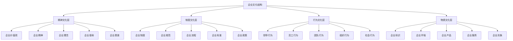
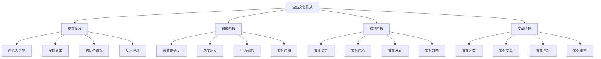

# 企业文化内涵

## 🏢 企业文化概述

### 基本定义
**企业文化**是指企业在长期发展过程中形成的，为全体员工共同遵循的价值观念、行为准则、道德规范、传统习惯等的总和。

### 核心特征
- **历史性**：历史发展形成
- **共同性**：全体员工共同遵循
- **稳定性**：相对稳定持久
- **独特性**：具有企业特色

## 📊 企业文化结构

### 1. 企业文化层次

#### 企业文化结构

#### 层次关系
- **精神文化层**：核心层，指导其他层次
- **制度文化层**：保障层，规范行为
- **行为文化层**：表现层，体现文化
- **物质文化层**：载体层，承载文化

### 2. 企业文化要素

#### 核心要素
- **企业价值观**：价值判断标准
- **企业精神**：企业精神风貌
- **企业理念**：企业经营理念
- **企业使命**：企业存在意义
- **企业愿景**：企业未来目标

#### 支撑要素
- **企业制度**：制度保障
- **企业规范**：行为规范
- **企业流程**：工作流程
- **企业标准**：质量标准
- **企业政策**：管理政策

## 🎯 企业文化功能

### 1. 导向功能

#### 价值导向
- **价值观念**：引导价值观念
- **价值判断**：指导价值判断
- **价值选择**：影响价值选择
- **价值实现**：促进价值实现

#### 行为导向
- **行为准则**：规范行为准则
- **行为标准**：制定行为标准
- **行为激励**：激励正确行为
- **行为约束**：约束错误行为

### 2. 凝聚功能

#### 内部凝聚
- **目标凝聚**：共同目标凝聚
- **价值凝聚**：共同价值凝聚
- **情感凝聚**：共同情感凝聚
- **利益凝聚**：共同利益凝聚

#### 外部凝聚
- **客户凝聚**：客户关系凝聚
- **合作伙伴凝聚**：合作伙伴凝聚
- **社会凝聚**：社会关系凝聚
- **品牌凝聚**：品牌价值凝聚

### 3. 激励功能

#### 精神激励
- **荣誉激励**：荣誉感激励
- **成就感激励**：成就感激励
- **责任感激励**：责任感激励
- **使命感激励**：使命感激励

#### 物质激励
- **薪酬激励**：薪酬体系激励
- **福利激励**：福利待遇激励
- **股权激励**：股权激励
- **奖励激励**：奖励机制激励

### 4. 约束功能

#### 软约束
- **道德约束**：道德规范约束
- **舆论约束**：舆论压力约束
- **传统约束**：传统习惯约束
- **文化约束**：文化氛围约束

#### 硬约束
- **制度约束**：制度规范约束
- **纪律约束**：纪律要求约束
- **法律约束**：法律法规约束
- **合同约束**：合同条款约束

## 🌟 企业文化类型

### 1. 按文化特征分类

#### 创新型文化
- **特征**：鼓励创新、容忍失败
- **价值观**：创新、冒险、学习
- **行为**：勇于尝试、持续改进
- **适用**：高科技企业、创业公司

#### 质量型文化
- **特征**：追求卓越、精益求精
- **价值观**：质量、完美、持续改进
- **行为**：严格标准、精细管理
- **适用**：制造业、服务业

#### 服务型文化
- **特征**：客户至上、服务第一
- **价值观**：服务、客户、满意
- **行为**：主动服务、贴心关怀
- **适用**：服务业、零售业

#### 团队型文化
- **特征**：团队合作、共同发展
- **价值观**：合作、信任、共享
- **行为**：团队协作、相互支持
- **适用**：项目型企业、咨询公司

### 2. 按文化强度分类

#### 强文化
- **特征**：文化影响强烈
- **表现**：价值观明确、行为一致
- **优势**：凝聚力强、执行力强
- **劣势**：灵活性差、适应性弱

#### 弱文化
- **特征**：文化影响较弱
- **表现**：价值观模糊、行为多样
- **优势**：灵活性强、适应性强
- **劣势**：凝聚力弱、执行力弱

### 3. 按文化导向分类

#### 市场导向文化
- **特征**：市场导向、客户中心
- **价值观**：市场、客户、竞争
- **行为**：市场敏感、客户导向
- **适用**：竞争激烈行业

#### 技术导向文化
- **特征**：技术导向、产品中心
- **价值观**：技术、创新、质量
- **行为**：技术领先、产品卓越
- **适用**：技术密集型行业

#### 人本导向文化
- **特征**：人本导向、员工中心
- **价值观**：人本、尊重、发展
- **行为**：关心员工、促进发展
- **适用**：知识密集型行业

## 🔄 企业文化形成

### 1. 形成过程

#### 形成阶段

#### 形成因素
- **创始人影响**：创始人价值观影响
- **历史事件**：重大历史事件影响
- **社会环境**：社会环境变化影响
- **行业特征**：行业特征影响

### 2. 形成机制

#### 内化机制
- **价值观内化**：价值观内化过程
- **行为内化**：行为模式内化
- **习惯内化**：工作习惯内化
- **传统内化**：传统习惯内化

#### 外化机制
- **制度外化**：制度体现文化
- **行为外化**：行为体现文化
- **物质外化**：物质体现文化
- **形象外化**：形象体现文化

## 📈 企业文化发展

### 1. 发展阶段

#### 发展阶段
- **初创期**：文化初创形成
- **成长期**：文化成长发展
- **成熟期**：文化成熟稳定
- **变革期**：文化变革创新

#### 发展特点
- **初创期**：文化不成熟、变化快
- **成长期**：文化快速发展、逐步稳定
- **成熟期**：文化稳定、影响深远
- **变革期**：文化冲突、变革创新

### 2. 发展动力

#### 内部动力
- **领导推动**：领导层推动
- **员工需求**：员工发展需求
- **组织发展**：组织发展需要
- **文化冲突**：文化冲突推动

#### 外部动力
- **环境变化**：外部环境变化
- **竞争压力**：市场竞争压力
- **社会期望**：社会期望变化
- **技术进步**：技术进步推动

## 🎯 企业文化管理

### 1. 管理原则

#### 管理原则
- **系统性原则**：系统管理文化
- **动态性原则**：动态调整文化
- **个性化原则**：保持文化特色
- **发展性原则**：促进文化发展

#### 管理方法
- **文化建设**：主动建设文化
- **文化传播**：有效传播文化
- **文化维护**：持续维护文化
- **文化创新**：不断创新文化

### 2. 管理策略

#### 建设策略
- **顶层设计**：文化顶层设计
- **系统规划**：文化系统规划
- **分步实施**：分步实施建设
- **持续改进**：持续改进完善

#### 传播策略
- **内部传播**：内部文化传播
- **外部传播**：外部文化传播
- **多渠道传播**：多渠道传播
- **互动传播**：互动式传播

## 📊 企业文化评估

### 1. 评估维度

#### 评估维度
- **文化强度**：文化影响强度
- **文化一致性**：文化一致性程度
- **文化适应性**：文化适应能力
- **文化有效性**：文化有效性

#### 评估指标
- **价值观认同度**：价值观认同程度
- **行为一致性**：行为一致性程度
- **文化满意度**：文化满意程度
- **文化影响力**：文化影响程度

### 2. 评估方法

#### 定量评估
- **问卷调查**：问卷调查评估
- **统计分析**：统计分析评估
- **指标对比**：指标对比评估
- **趋势分析**：趋势分析评估

#### 定性评估
- **访谈调研**：访谈调研评估
- **观察分析**：观察分析评估
- **案例分析**：案例分析评估
- **专家评估**：专家评估意见

## 🔍 企业文化问题与对策

### 1. 常见问题

#### 文化建设问题
- **文化不明确**：文化内涵不明确
- **文化不一致**：文化表现不一致
- **文化冲突**：文化内部冲突
- **文化滞后**：文化发展滞后

#### 文化管理问题
- **管理不力**：文化管理不力
- **传播不畅**：文化传播不畅
- **维护不足**：文化维护不足
- **创新不够**：文化创新不够

### 2. 解决对策

#### 建设对策
- **明确文化**：明确文化内涵
- **统一文化**：统一文化表现
- **协调文化**：协调文化冲突
- **发展文化**：促进文化发展

#### 管理对策
- **强化管理**：强化文化管理
- **畅通传播**：畅通文化传播
- **加强维护**：加强文化维护
- **促进创新**：促进文化创新

## 🎯 学习要点总结

### 核心概念
1. **企业文化**：企业价值观念、行为准则等的总和
2. **文化结构**：精神文化、制度文化、行为文化、物质文化
3. **文化功能**：导向、凝聚、激励、约束功能
4. **文化类型**：创新型、质量型、服务型、团队型
5. **文化形成**：萌芽、形成、成熟、变革阶段
6. **文化管理**：建设、传播、维护、创新

### 关键理解
- 企业文化是企业的灵魂和核心竞争力
- 企业文化具有层次性和系统性
- 企业文化需要主动建设和管理
- 企业文化需要适应环境变化

### 实践应用
- 运用企业文化理论指导文化建设
- 建立企业文化管理体系
- 运用评估方法评价企业文化
- 持续改进企业文化

## 🔗 相关链接

- [[企业文化类型]] - 企业文化类型
- [[企业文化建设]] - 企业文化建设
- [[企业文化管理]] - 企业文化管理
- [[思维导图-企业文化]] - 企业文化思维导图

## 📚 延伸阅读

- [[企业创新]] - 企业创新理论
- [[风险管理]] - 风险管理理论
- [[可持续发展]] - 可持续发展理论
- [[组织行为]] - 组织行为理论

---
*更新时间：2024年*
*内容将根据学习反馈持续优化*
