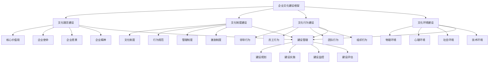

# 企业文化建设

## 🎯 企业文化建设概述

### 基本定义
**企业文化建设**是指企业通过系统性的建设活动，包括文化理念设计、文化制度建立、文化行为塑造、文化环境营造等，形成具有企业特色、符合企业战略、促进企业发展的企业文化的管理活动。

### 核心特征
- **系统性**：系统性的建设活动
- **特色性**：特色性的文化建设
- **战略性**：战略性的文化目标
- **发展性**：发展性的文化功能
- **创新性**：创新性的建设方式
- **持续性**：持续性的建设过程

## 🎯 企业文化建设框架

### 1. 建设要素

#### 企业文化建设框架

#### 建设要素
- **文化理念建设**：核心价值观、企业使命、企业愿景、企业精神
- **文化制度建设**：文化制度、行为规范、管理制度、激励制度
- **文化行为建设**：领导行为、员工行为、团队行为、组织行为
- **文化环境建设**：物理环境、心理环境、社会环境、技术环境
- **建设管理**：建设规划、实施、监控、评估

### 2. 建设层次

#### 建设层次框架
- **战略层面**：企业文化战略建设
- **管理层面**：企业文化管理建设
- **运营层面**：企业文化运营建设
- **操作层面**：企业文化操作建设

## 💡 文化理念建设

### 1. 核心价值观建设

#### 建设要素
- **价值识别**：核心价值观识别
- **价值设计**：核心价值观设计
- **价值传播**：核心价值观传播
- **价值实践**：核心价值观实践

#### 建设方法
- **价值识别**：识别核心价值观
- **价值设计**：设计核心价值观
- **价值传播**：传播核心价值观
- **价值实践**：实践核心价值观

### 2. 企业使命建设

#### 建设要素
- **使命识别**：企业使命识别
- **使命设计**：企业使命设计
- **使命传播**：企业使命传播
- **使命实践**：企业使命实践

#### 建设方法
- **使命识别**：识别企业使命
- **使命设计**：设计企业使命
- **使命传播**：传播企业使命
- **使命实践**：实践企业使命

### 3. 企业愿景建设

#### 建设要素
- **愿景识别**：企业愿景识别
- **愿景设计**：企业愿景设计
- **愿景传播**：企业愿景传播
- **愿景实践**：企业愿景实践

#### 建设方法
- **愿景识别**：识别企业愿景
- **愿景设计**：设计企业愿景
- **愿景传播**：传播企业愿景
- **愿景实践**：实践企业愿景

### 4. 企业精神建设

#### 建设要素
- **精神识别**：企业精神识别
- **精神设计**：企业精神设计
- **精神传播**：企业精神传播
- **精神实践**：企业精神实践

#### 建设方法
- **精神识别**：识别企业精神
- **精神设计**：设计企业精神
- **精神传播**：传播企业精神
- **精神实践**：实践企业精神

## 📋 文化制度建设

### 1. 文化制度建设

#### 建设要素
- **制度设计**：文化制度设计
- **制度制定**：文化制度制定
- **制度实施**：文化制度实施
- **制度完善**：文化制度完善

#### 建设方法
- **制度设计**：设计文化制度
- **制度制定**：制定文化制度
- **制度实施**：实施文化制度
- **制度完善**：完善文化制度

### 2. 行为规范建设

#### 建设要素
- **规范设计**：行为规范设计
- **规范制定**：行为规范制定
- **规范实施**：行为规范实施
- **规范完善**：行为规范完善

#### 建设方法
- **规范设计**：设计行为规范
- **规范制定**：制定行为规范
- **规范实施**：实施行为规范
- **规范完善**：完善行为规范

### 3. 管理制度建设

#### 建设要素
- **制度设计**：管理制度设计
- **制度制定**：管理制度制定
- **制度实施**：管理制度实施
- **制度完善**：管理制度完善

#### 建设方法
- **制度设计**：设计管理制度
- **制度制定**：制定管理制度
- **制度实施**：实施管理制度
- **制度完善**：完善管理制度

### 4. 激励制度建设

#### 建设要素
- **制度设计**：激励制度设计
- **制度制定**：激励制度制定
- **制度实施**：激励制度实施
- **制度完善**：激励制度完善

#### 建设方法
- **制度设计**：设计激励制度
- **制度制定**：制定激励制度
- **制度实施**：实施激励制度
- **制度完善**：完善激励制度

## 👥 文化行为建设

### 1. 领导行为建设

#### 建设要素
- **行为设计**：领导行为设计
- **行为塑造**：领导行为塑造
- **行为示范**：领导行为示范
- **行为评估**：领导行为评估

#### 建设方法
- **行为设计**：设计领导行为
- **行为塑造**：塑造领导行为
- **行为示范**：示范领导行为
- **行为评估**：评估领导行为

### 2. 员工行为建设

#### 建设要素
- **行为设计**：员工行为设计
- **行为塑造**：员工行为塑造
- **行为引导**：员工行为引导
- **行为评估**：员工行为评估

#### 建设方法
- **行为设计**：设计员工行为
- **行为塑造**：塑造员工行为
- **行为引导**：引导员工行为
- **行为评估**：评估员工行为

### 3. 团队行为建设

#### 建设要素
- **行为设计**：团队行为设计
- **行为塑造**：团队行为塑造
- **行为协调**：团队行为协调
- **行为评估**：团队行为评估

#### 建设方法
- **行为设计**：设计团队行为
- **行为塑造**：塑造团队行为
- **行为协调**：协调团队行为
- **行为评估**：评估团队行为

### 4. 组织行为建设

#### 建设要素
- **行为设计**：组织行为设计
- **行为塑造**：组织行为塑造
- **行为整合**：组织行为整合
- **行为评估**：组织行为评估

#### 建设方法
- **行为设计**：设计组织行为
- **行为塑造**：塑造组织行为
- **行为整合**：整合组织行为
- **行为评估**：评估组织行为

## 🌍 文化环境建设

### 1. 物理环境建设

#### 建设要素
- **环境设计**：物理环境设计
- **环境营造**：物理环境营造
- **环境维护**：物理环境维护
- **环境优化**：物理环境优化

#### 建设方法
- **环境设计**：设计物理环境
- **环境营造**：营造物理环境
- **环境维护**：维护物理环境
- **环境优化**：优化物理环境

### 2. 心理环境建设

#### 建设要素
- **环境设计**：心理环境设计
- **环境营造**：心理环境营造
- **环境维护**：心理环境维护
- **环境优化**：心理环境优化

#### 建设方法
- **环境设计**：设计心理环境
- **环境营造**：营造心理环境
- **环境维护**：维护心理环境
- **环境优化**：优化心理环境

### 3. 社会环境建设

#### 建设要素
- **环境设计**：社会环境设计
- **环境营造**：社会环境营造
- **环境维护**：社会环境维护
- **环境优化**：社会环境优化

#### 建设方法
- **环境设计**：设计社会环境
- **环境营造**：营造社会环境
- **环境维护**：维护社会环境
- **环境优化**：优化社会环境

### 4. 技术环境建设

#### 建设要素
- **环境设计**：技术环境设计
- **环境营造**：技术环境营造
- **环境维护**：技术环境维护
- **环境优化**：技术环境优化

#### 建设方法
- **环境设计**：设计技术环境
- **环境营造**：营造技术环境
- **环境维护**：维护技术环境
- **环境优化**：优化技术环境

## 🎯 建设层次管理

### 1. 战略层面建设

#### 建设要素
- **战略规划**：文化战略规划
- **战略实施**：文化战略实施
- **战略监控**：文化战略监控
- **战略调整**：文化战略调整

#### 建设方法
- **战略规划**：规划文化战略
- **战略实施**：实施文化战略
- **战略监控**：监控文化战略
- **战略调整**：调整文化战略

### 2. 管理层面建设

#### 建设要素
- **管理规划**：文化管理规划
- **管理实施**：文化管理实施
- **管理监控**：文化管理监控
- **管理调整**：文化管理调整

#### 建设方法
- **管理规划**：规划文化管理
- **管理实施**：实施文化管理
- **管理监控**：监控文化管理
- **管理调整**：调整文化管理

### 3. 运营层面建设

#### 建设要素
- **运营规划**：文化运营规划
- **运营实施**：文化运营实施
- **运营监控**：文化运营监控
- **运营调整**：文化运营调整

#### 建设方法
- **运营规划**：规划文化运营
- **运营实施**：实施文化运营
- **运营监控**：监控文化运营
- **运营调整**：调整文化运营

### 4. 操作层面建设

#### 建设要素
- **操作规划**：文化操作规划
- **操作实施**：文化操作实施
- **操作监控**：文化操作监控
- **操作调整**：文化操作调整

#### 建设方法
- **操作规划**：规划文化操作
- **操作实施**：实施文化操作
- **操作监控**：监控文化操作
- **操作调整**：调整文化操作

## 🔍 企业文化建设方法

### 1. 建设方法

#### 方法类型
- **系统方法**：系统性文化建设方法
- **特色方法**：特色性文化建设方法
- **战略方法**：战略性文化建设方法
- **创新方法**：创新性文化建设方法

#### 方法应用
- **系统应用**：应用系统方法
- **特色应用**：应用特色方法
- **战略应用**：应用战略方法
- **创新应用**：应用创新方法

### 2. 建设工具

#### 工具类型
- **设计工具**：文化设计工具
- **建设工具**：文化建设工具
- **传播工具**：文化传播工具
- **评估工具**：文化评估工具

#### 工具应用
- **设计应用**：应用设计工具
- **建设应用**：应用建设工具
- **传播应用**：应用传播工具
- **评估应用**：应用评估工具

### 3. 建设技术

#### 技术类型
- **信息技术**：信息技术应用
- **人工智能**：人工智能技术
- **大数据**：大数据技术
- **云计算**：云计算技术

#### 技术应用
- **信息应用**：应用信息技术
- **智能应用**：应用人工智能
- **数据应用**：应用大数据技术
- **云应用**：应用云计算技术

### 4. 建设平台

#### 平台类型
- **建设平台**：文化建设平台
- **传播平台**：文化传播平台
- **管理平台**：文化管理平台
- **评估平台**：文化评估平台

#### 平台应用
- **建设应用**：应用建设平台
- **传播应用**：应用传播平台
- **管理应用**：应用管理平台
- **评估应用**：应用评估平台

## 📊 企业文化建设案例

### 案例1：某科技企业文化建设

#### 案例背景
某科技企业实施企业文化建设，提升企业凝聚力和创新能力。

#### 建设过程
- **文化理念建设**：建设核心价值观和企业精神
- **文化制度建设**：建立文化制度和行为规范
- **文化行为建设**：塑造领导行为和员工行为
- **文化环境建设**：营造创新文化环境

#### 建设结果
- **文化认同**：员工文化认同度提升50%
- **创新能力**：企业创新能力提升40%
- **团队协作**：团队协作能力提升35%
- **企业绩效**：企业绩效提升30%

#### 成功因素
- **高层支持**：高层强力支持
- **系统建设**：系统建设文化
- **全员参与**：全员参与建设
- **持续改进**：持续改进文化

### 案例2：某制造企业文化建设

#### 案例背景
某制造企业实施企业文化建设，提升企业形象和员工素质。

#### 建设过程
- **文化理念建设**：建设企业使命和愿景
- **文化制度建设**：建立管理制度和激励制度
- **文化行为建设**：塑造员工行为和团队行为
- **文化环境建设**：营造和谐文化环境

#### 建设结果
- **文化氛围**：文化氛围显著改善
- **员工素质**：员工素质大幅提升
- **企业形象**：企业形象显著提升
- **经营绩效**：经营绩效持续改善

#### 成功因素
- **战略引领**：战略引领文化建设
- **制度保障**：制度保障文化建设
- **活动支撑**：活动支撑文化建设
- **效果评估**：效果评估文化建设

## 🎯 企业文化建设最佳实践

### 1. 建设原则

#### 基本原则
- **系统性原则**：系统建设企业文化
- **特色性原则**：特色建设企业文化
- **战略性原则**：战略建设企业文化
- **发展性原则**：发展建设企业文化

#### 应用原则
- **目标导向**：以目标为导向
- **战略导向**：以战略为导向
- **文化导向**：以文化为导向
- **效果导向**：以效果为导向

### 2. 建设方法

#### 建设方法
- **系统建设**：系统建设企业文化
- **特色建设**：特色建设企业文化
- **战略建设**：战略建设企业文化
- **创新建设**：创新建设企业文化

#### 方法应用
- **系统应用**：应用系统建设方法
- **特色应用**：应用特色建设方法
- **战略应用**：应用战略建设方法
- **创新应用**：应用创新建设方法

### 3. 实施要点

#### 实施要点
- **高层支持**：获得高层支持
- **系统建设**：系统建设文化
- **全员参与**：全员参与建设
- **持续改进**：持续改进文化

#### 注意事项
- **避免表面**：避免表面文化建设
- **避免孤立**：避免孤立文化建设
- **避免僵化**：避免僵化文化建设
- **避免滞后**：避免滞后文化建设

## 📚 学习要点总结

### 核心概念
1. **企业文化建设**：企业文化建设的管理活动
2. **文化理念建设**：核心价值观、企业使命、企业愿景、企业精神
3. **文化制度建设**：文化制度、行为规范、管理制度、激励制度
4. **文化行为建设**：领导行为、员工行为、团队行为、组织行为
5. **文化环境建设**：物理环境、心理环境、社会环境、技术环境
6. **建设层次**：战略层面、管理层面、运营层面、操作层面
7. **建设方法**：系统方法、特色方法、战略方法、创新方法
8. **建设工具**：设计工具、建设工具、传播工具、评估工具

### 关键理解
- 企业文化建设是企业文化发展的重要途径
- 企业文化建设具有系统性和特色性特征
- 企业文化建设需要战略性和发展性
- 企业文化建设需要创新性和持续性
- 企业文化建设需要理念性和制度性
- 企业文化建设需要行为性和环境性
- 企业文化建设需要工具性和技术性
- 企业文化建设需要应用性和实用性

### 实践应用
- 运用企业文化建设提升文化效果
- 运用企业文化建设增强企业凝聚力
- 运用企业文化建设提升企业竞争力
- 运用企业文化建设改善企业形象
- 运用企业文化建设优化员工行为
- 运用企业文化建设实现文化目标
- 运用企业文化建设促进企业发展
- 运用企业文化建设推动文化创新

## 🔗 相关链接

- [[企业文化内涵]] - 企业文化内涵
- [[企业文化类型]] - 企业文化类型
- [[企业文化管理]] - 企业文化管理
- [[工具实操指南-企业文化]] - 工具实操指南-企业文化

## 📚 延伸阅读

- [[企业文化学]] - 企业文化学理论
- [[管理学]] - 管理学理论
- [[组织行为学]] - 组织行为学理论
- [[心理学]] - 心理学理论

---
*更新时间：2024年*
*内容将根据学习反馈持续优化*
