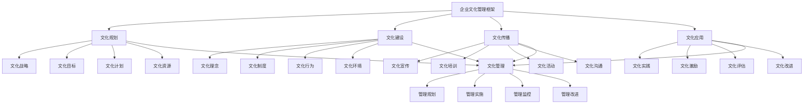

# 企业文化管理

## 🎯 企业文化管理概述

### 基本定义
**企业文化管理**是指企业通过系统性的管理方法和手段，对企业文化的形成、发展、传播、应用和变革进行全过程管理，确保企业文化与企业战略、组织发展、员工行为协调一致的管理活动。

### 核心特征
- **系统性**：系统性的管理方法
- **全过程性**：全过程性的管理活动
- **协调性**：协调性的管理目标
- **动态性**：动态性的管理过程
- **创新性**：创新性的管理方式
- **有效性**：有效性的管理效果

## 🎯 企业文化管理框架

### 1. 管理要素

#### 企业文化管理框架

#### 管理要素
- **文化规划**：文化战略、目标、计划、资源
- **文化建设**：文化理念、制度、行为、环境
- **文化传播**：文化宣传、培训、活动、沟通
- **文化应用**：文化实践、激励、评估、改进
- **文化管理**：管理规划、实施、监控、改进

### 2. 管理层次

#### 管理层次框架
- **战略层面**：企业文化战略管理
- **管理层面**：企业文化管理管理
- **运营层面**：企业文化运营管理
- **操作层面**：企业文化操作管理

## 📋 文化规划

### 1. 文化战略

#### 战略要素
- **战略定位**：企业文化战略定位
- **战略目标**：企业文化战略目标
- **战略路径**：企业文化战略路径
- **战略措施**：企业文化战略措施

#### 战略管理
- **战略定位**：确定文化战略定位
- **战略目标**：设定文化战略目标
- **战略路径**：设计文化战略路径
- **战略措施**：制定文化战略措施

### 2. 文化目标

#### 目标要素
- **总体目标**：企业文化总体目标
- **分项目标**：企业文化分项目标
- **阶段目标**：企业文化阶段目标
- **具体目标**：企业文化具体目标

#### 目标管理
- **总体目标**：设定总体目标
- **分项目标**：设定分项目标
- **阶段目标**：设定阶段目标
- **具体目标**：设定具体目标

### 3. 文化计划

#### 计划要素
- **计划制定**：企业文化计划制定
- **计划实施**：企业文化计划实施
- **计划监控**：企业文化计划监控
- **计划调整**：企业文化计划调整

#### 计划管理
- **计划制定**：制定文化计划
- **计划实施**：实施文化计划
- **计划监控**：监控文化计划
- **计划调整**：调整文化计划

### 4. 文化资源

#### 资源要素
- **人力资源**：企业文化人力资源
- **财务资源**：企业文化财务资源
- **技术资源**：企业文化技术资源
- **信息资源**：企业文化信息资源

#### 资源管理
- **人力资源**：配置文化人力资源
- **财务资源**：配置文化财务资源
- **技术资源**：配置文化技术资源
- **信息资源**：配置文化信息资源

## 🏗️ 文化建设

### 1. 文化理念

#### 理念要素
- **核心价值观**：企业核心价值观
- **企业使命**：企业使命理念
- **企业愿景**：企业愿景理念
- **企业精神**：企业精神理念

#### 理念管理
- **核心价值观**：建设核心价值观
- **企业使命**：建设企业使命
- **企业愿景**：建设企业愿景
- **企业精神**：建设企业精神

### 2. 文化制度

#### 制度要素
- **文化制度**：企业文化制度
- **行为规范**：企业文化行为规范
- **管理制度**：企业文化管理制度
- **激励制度**：企业文化激励制度

#### 制度管理
- **文化制度**：建立文化制度
- **行为规范**：建立行为规范
- **管理制度**：建立管理制度
- **激励制度**：建立激励制度

### 3. 文化行为

#### 行为要素
- **领导行为**：企业文化领导行为
- **员工行为**：企业文化员工行为
- **团队行为**：企业文化团队行为
- **组织行为**：企业文化组织行为

#### 行为管理
- **领导行为**：管理领导行为
- **员工行为**：管理员工行为
- **团队行为**：管理团队行为
- **组织行为**：管理组织行为

### 4. 文化环境

#### 环境要素
- **物理环境**：企业文化物理环境
- **心理环境**：企业文化心理环境
- **社会环境**：企业文化社会环境
- **技术环境**：企业文化技术环境

#### 环境管理
- **物理环境**：营造物理环境
- **心理环境**：营造心理环境
- **社会环境**：营造社会环境
- **技术环境**：营造技术环境

## 📢 文化传播

### 1. 文化宣传

#### 宣传要素
- **宣传内容**：企业文化宣传内容
- **宣传方式**：企业文化宣传方式
- **宣传渠道**：企业文化宣传渠道
- **宣传效果**：企业文化宣传效果

#### 宣传管理
- **宣传内容**：管理宣传内容
- **宣传方式**：管理宣传方式
- **宣传渠道**：管理宣传渠道
- **宣传效果**：管理宣传效果

### 2. 文化培训

#### 培训要素
- **培训内容**：企业文化培训内容
- **培训方式**：企业文化培训方式
- **培训对象**：企业文化培训对象
- **培训效果**：企业文化培训效果

#### 培训管理
- **培训内容**：管理培训内容
- **培训方式**：管理培训方式
- **培训对象**：管理培训对象
- **培训效果**：管理培训效果

### 3. 文化活动

#### 活动要素
- **活动策划**：企业文化活动策划
- **活动实施**：企业文化活动实施
- **活动效果**：企业文化活动效果
- **活动改进**：企业文化活动改进

#### 活动管理
- **活动策划**：策划文化活动
- **活动实施**：实施文化活动
- **活动效果**：评估活动效果
- **活动改进**：改进文化活动

### 4. 文化沟通

#### 沟通要素
- **沟通内容**：企业文化沟通内容
- **沟通方式**：企业文化沟通方式
- **沟通渠道**：企业文化沟通渠道
- **沟通效果**：企业文化沟通效果

#### 沟通管理
- **沟通内容**：管理沟通内容
- **沟通方式**：管理沟通方式
- **沟通渠道**：管理沟通渠道
- **沟通效果**：管理沟通效果

## 🎯 文化应用

### 1. 文化实践

#### 实践要素
- **实践内容**：企业文化实践内容
- **实践方式**：企业文化实践方式
- **实践对象**：企业文化实践对象
- **实践效果**：企业文化实践效果

#### 实践管理
- **实践内容**：管理实践内容
- **实践方式**：管理实践方式
- **实践对象**：管理实践对象
- **实践效果**：管理实践效果

### 2. 文化激励

#### 激励要素
- **激励内容**：企业文化激励内容
- **激励方式**：企业文化激励方式
- **激励对象**：企业文化激励对象
- **激励效果**：企业文化激励效果

#### 激励管理
- **激励内容**：管理激励内容
- **激励方式**：管理激励方式
- **激励对象**：管理激励对象
- **激励效果**：管理激励效果

### 3. 文化评估

#### 评估要素
- **评估内容**：企业文化评估内容
- **评估方式**：企业文化评估方式
- **评估标准**：企业文化评估标准
- **评估效果**：企业文化评估效果

#### 评估管理
- **评估内容**：管理评估内容
- **评估方式**：管理评估方式
- **评估标准**：管理评估标准
- **评估效果**：管理评估效果

### 4. 文化改进

#### 改进要素
- **改进内容**：企业文化改进内容
- **改进方式**：企业文化改进方式
- **改进措施**：企业文化改进措施
- **改进效果**：企业文化改进效果

#### 改进管理
- **改进内容**：管理改进内容
- **改进方式**：管理改进方式
- **改进措施**：管理改进措施
- **改进效果**：管理改进效果

## 🎯 管理层次

### 1. 战略层面

#### 管理要素
- **战略规划**：企业文化战略规划
- **战略实施**：企业文化战略实施
- **战略监控**：企业文化战略监控
- **战略调整**：企业文化战略调整

#### 管理方法
- **战略规划**：规划文化战略
- **战略实施**：实施文化战略
- **战略监控**：监控文化战略
- **战略调整**：调整文化战略

### 2. 管理层面

#### 管理要素
- **管理规划**：企业文化管理规划
- **管理实施**：企业文化管理实施
- **管理监控**：企业文化管理监控
- **管理调整**：企业文化管理调整

#### 管理方法
- **管理规划**：规划文化管理
- **管理实施**：实施文化管理
- **管理监控**：监控文化管理
- **管理调整**：调整文化管理

### 3. 运营层面

#### 管理要素
- **运营规划**：企业文化运营规划
- **运营实施**：企业文化运营实施
- **运营监控**：企业文化运营监控
- **运营调整**：企业文化运营调整

#### 管理方法
- **运营规划**：规划文化运营
- **运营实施**：实施文化运营
- **运营监控**：监控文化运营
- **运营调整**：调整文化运营

### 4. 操作层面

#### 管理要素
- **操作规划**：企业文化操作规划
- **操作实施**：企业文化操作实施
- **操作监控**：企业文化操作监控
- **操作调整**：企业文化操作调整

#### 管理方法
- **操作规划**：规划文化操作
- **操作实施**：实施文化操作
- **操作监控**：监控文化操作
- **操作调整**：调整文化操作

## 🔍 企业文化管理方法

### 1. 管理方法

#### 方法类型
- **系统方法**：系统性文化管理方法
- **全过程方法**：全过程文化管理方法
- **协调方法**：协调性文化管理方法
- **动态方法**：动态性文化管理方法

#### 方法应用
- **系统应用**：应用系统方法
- **全过程应用**：应用全过程方法
- **协调应用**：应用协调方法
- **动态应用**：应用动态方法

### 2. 管理工具

#### 工具类型
- **规划工具**：文化规划工具
- **建设工具**：文化建设工具
- **传播工具**：文化传播工具
- **应用工具**：文化应用工具

#### 工具应用
- **规划应用**：应用规划工具
- **建设应用**：应用建设工具
- **传播应用**：应用传播工具
- **应用应用**：应用应用工具

### 3. 管理技术

#### 技术类型
- **信息技术**：信息技术应用
- **人工智能**：人工智能技术
- **大数据**：大数据技术
- **云计算**：云计算技术

#### 技术应用
- **信息应用**：应用信息技术
- **智能应用**：应用人工智能
- **数据应用**：应用大数据技术
- **云应用**：应用云计算技术

### 4. 管理平台

#### 平台类型
- **管理平台**：文化管理平台
- **传播平台**：文化传播平台
- **应用平台**：文化应用平台
- **评估平台**：文化评估平台

#### 平台应用
- **管理应用**：应用管理平台
- **传播应用**：应用传播平台
- **应用应用**：应用应用平台
- **评估应用**：应用评估平台

## 📊 企业文化管理案例

### 案例1：某科技企业企业文化管理

#### 案例背景
某科技企业实施企业文化管理，提升企业凝聚力和竞争力。

#### 管理过程
- **文化规划**：制定文化战略和目标
- **文化建设**：建设文化理念和制度
- **文化传播**：传播文化理念和行为
- **文化应用**：应用文化理念和实践

#### 管理结果
- **文化认同**：员工文化认同度提升40%
- **文化实践**：文化实践效果提升35%
- **企业凝聚力**：企业凝聚力提升30%
- **企业竞争力**：企业竞争力提升25%

#### 成功因素
- **高层支持**：高层强力支持
- **系统管理**：系统管理文化
- **全员参与**：全员参与文化
- **持续改进**：持续改进文化

### 案例2：某制造企业企业文化管理

#### 案例背景
某制造企业实施企业文化管理，提升企业形象和绩效。

#### 管理过程
- **文化规划**：规划文化战略和计划
- **文化建设**：建设文化理念和环境
- **文化传播**：传播文化理念和规范
- **文化应用**：应用文化理念和激励

#### 管理结果
- **文化氛围**：文化氛围显著改善
- **员工行为**：员工行为规范提升
- **企业形象**：企业形象大幅提升
- **经营绩效**：经营绩效持续改善

#### 成功因素
- **战略引领**：战略引领文化管理
- **制度保障**：制度保障文化管理
- **活动支撑**：活动支撑文化管理
- **效果评估**：效果评估文化管理

## 🎯 企业文化管理最佳实践

### 1. 管理原则

#### 基本原则
- **系统性原则**：系统管理企业文化
- **全过程原则**：全过程管理企业文化
- **协调性原则**：协调管理企业文化
- **动态性原则**：动态管理企业文化

#### 应用原则
- **目标导向**：以目标为导向
- **战略导向**：以战略为导向
- **文化导向**：以文化为导向
- **效果导向**：以效果为导向

### 2. 管理方法

#### 管理方法
- **系统管理**：系统管理企业文化
- **全过程管理**：全过程管理企业文化
- **协调管理**：协调管理企业文化
- **动态管理**：动态管理企业文化

#### 方法应用
- **系统应用**：应用系统管理方法
- **全过程应用**：应用全过程管理方法
- **协调应用**：应用协调管理方法
- **动态应用**：应用动态管理方法

### 3. 实施要点

#### 实施要点
- **高层支持**：获得高层支持
- **系统管理**：系统管理文化
- **全员参与**：全员参与文化
- **持续改进**：持续改进文化

#### 注意事项
- **避免表面**：避免表面文化管理
- **避免孤立**：避免孤立文化管理
- **避免僵化**：避免僵化文化管理
- **避免滞后**：避免滞后文化管理

## 📚 学习要点总结

### 核心概念
1. **企业文化管理**：企业文化管理的管理活动
2. **文化规划**：文化战略、目标、计划、资源
3. **文化建设**：文化理念、制度、行为、环境
4. **文化传播**：文化宣传、培训、活动、沟通
5. **文化应用**：文化实践、激励、评估、改进
6. **管理层次**：战略层面、管理层面、运营层面、操作层面
7. **管理方法**：系统方法、全过程方法、协调方法、动态方法
8. **管理工具**：规划工具、建设工具、传播工具、应用工具

### 关键理解
- 企业文化管理是企业文化发展的重要保障
- 企业文化管理具有系统性和全过程性特征
- 企业文化管理需要协调性和动态性
- 企业文化管理需要创新性和有效性
- 企业文化管理需要规划性和建设性
- 企业文化管理需要传播性和应用性
- 企业文化管理需要工具性和技术性
- 企业文化管理需要应用性和实用性

### 实践应用
- 运用企业文化管理提升文化效果
- 运用企业文化管理增强企业凝聚力
- 运用企业文化管理提升企业竞争力
- 运用企业文化管理改善企业形象
- 运用企业文化管理优化员工行为
- 运用企业文化管理实现文化目标
- 运用企业文化管理促进企业发展
- 运用企业文化管理推动文化创新

## 🔗 相关链接

- [[企业文化内涵]] - 企业文化内涵
- [[企业文化类型]] - 企业文化类型
- [[企业文化建设]] - 企业文化建设
- [[工具实操指南-企业文化]] - 工具实操指南-企业文化

## 📚 延伸阅读

- [[企业文化学]] - 企业文化学理论
- [[管理学]] - 管理学理论
- [[组织行为学]] - 组织行为学理论
- [[传播学]] - 传播学理论

---
*更新时间：2024年*
*内容将根据学习反馈持续优化*
