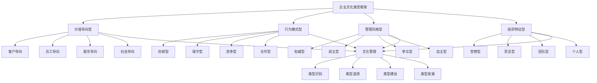

# 企业文化类型

## 🎯 企业文化类型概述

### 基本定义
**企业文化类型**是指企业根据不同的价值观念、行为模式、管理风格和组织特征，将企业文化进行分类和模式化，形成系统性的企业文化类型体系，指导企业文化建设和管理的管理活动。

### 核心特征
- **多样性**：多样性的文化类型
- **系统性**：系统性的类型体系
- **差异性**：差异性的文化特征
- **适应性**：适应性的文化选择
- **发展性**：发展性的文化演进
- **实用性**：实用性的文化应用

## 🎯 企业文化类型框架

### 1. 分类维度

#### 企业文化类型框架

#### 类型要素
- **价值导向型**：客户导向、员工导向、股东导向、社会导向
- **行为模式型**：创新型、保守型、竞争型、合作型
- **管理风格型**：权威型、民主型、参与型、自主型
- **组织特征型**：官僚型、灵活型、团队型、个人型
- **文化管理**：类型识别、选择、建设、发展

### 2. 类型层次

#### 类型层次框架
- **主导类型**：企业主导文化类型
- **支撑类型**：企业支撑文化类型
- **辅助类型**：企业辅助文化类型
- **混合类型**：企业混合文化类型

## 🎯 价值导向型文化

### 1. 客户导向文化

#### 文化特征
- **客户至上**：客户至上的价值观念
- **服务理念**：优质服务的服务理念
- **客户满意**：客户满意的目标追求
- **客户关系**：良好的客户关系

#### 文化表现
- **价值观念**：客户价值优先
- **行为模式**：以客户为中心
- **管理风格**：服务导向管理
- **组织特征**：客户服务组织

### 2. 员工导向文化

#### 文化特征
- **员工关怀**：员工关怀的价值观念
- **人才理念**：人才第一的人才理念
- **员工发展**：员工发展的目标追求
- **员工关系**：和谐的员工关系

#### 文化表现
- **价值观念**：员工价值优先
- **行为模式**：以员工为中心
- **管理风格**：人本管理风格
- **组织特征**：员工发展组织

### 3. 股东导向文化

#### 文化特征
- **股东价值**：股东价值的价值观念
- **盈利理念**：利润最大化的盈利理念
- **股东回报**：股东回报的目标追求
- **股东关系**：良好的股东关系

#### 文化表现
- **价值观念**：股东价值优先
- **行为模式**：以股东为中心
- **管理风格**：绩效管理风格
- **组织特征**：股东价值组织

### 4. 社会导向文化

#### 文化特征
- **社会责任**：社会责任的价值观念
- **公益理念**：社会公益的公益理念
- **社会贡献**：社会贡献的目标追求
- **社会关系**：良好的社会关系

#### 文化表现
- **价值观念**：社会价值优先
- **行为模式**：以社会为中心
- **管理风格**：责任管理风格
- **组织特征**：社会责任组织

## 🔄 行为模式型文化

### 1. 创新型文化

#### 文化特征
- **创新理念**：创新驱动的创新理念
- **变革精神**：勇于变革的变革精神
- **创新氛围**：鼓励创新的创新氛围
- **创新机制**：完善的创新机制

#### 文化表现
- **价值观念**：创新价值优先
- **行为模式**：创新行为模式
- **管理风格**：创新管理风格
- **组织特征**：创新组织特征

### 2. 保守型文化

#### 文化特征
- **稳定理念**：稳定发展的稳定理念
- **谨慎精神**：谨慎经营的谨慎精神
- **稳定氛围**：追求稳定的稳定氛围
- **稳定机制**：完善的稳定机制

#### 文化表现
- **价值观念**：稳定价值优先
- **行为模式**：保守行为模式
- **管理风格**：保守管理风格
- **组织特征**：稳定组织特征

### 3. 竞争型文化

#### 文化特征
- **竞争理念**：竞争驱动的竞争理念
- **竞争精神**：勇于竞争的竞争精神
- **竞争氛围**：激烈竞争的竞争氛围
- **竞争机制**：完善的竞争机制

#### 文化表现
- **价值观念**：竞争价值优先
- **行为模式**：竞争行为模式
- **管理风格**：竞争管理风格
- **组织特征**：竞争组织特征

### 4. 合作型文化

#### 文化特征
- **合作理念**：合作共赢的合作理念
- **协作精神**：团队协作的协作精神
- **合作氛围**：和谐合作的合作氛围
- **合作机制**：完善的合作机制

#### 文化表现
- **价值观念**：合作价值优先
- **行为模式**：合作行为模式
- **管理风格**：合作管理风格
- **组织特征**：合作组织特征

## 👑 管理风格型文化

### 1. 权威型文化

#### 文化特征
- **权威理念**：权威管理的权威理念
- **等级观念**：等级分明的等级观念
- **权威氛围**：尊重权威的权威氛围
- **权威机制**：完善的权威机制

#### 文化表现
- **价值观念**：权威价值优先
- **行为模式**：权威行为模式
- **管理风格**：权威管理风格
- **组织特征**：权威组织特征

### 2. 民主型文化

#### 文化特征
- **民主理念**：民主管理的民主理念
- **平等观念**：平等参与的平等观念
- **民主氛围**：民主决策的民主氛围
- **民主机制**：完善的民主机制

#### 文化表现
- **价值观念**：民主价值优先
- **行为模式**：民主行为模式
- **管理风格**：民主管理风格
- **组织特征**：民主组织特征

### 3. 参与型文化

#### 文化特征
- **参与理念**：参与管理的参与理念
- **参与观念**：积极参与的参与观念
- **参与氛围**：鼓励参与的参与氛围
- **参与机制**：完善的参与机制

#### 文化表现
- **价值观念**：参与价值优先
- **行为模式**：参与行为模式
- **管理风格**：参与管理风格
- **组织特征**：参与组织特征

### 4. 自主型文化

#### 文化特征
- **自主理念**：自主管理的自主理念
- **自主观念**：自主决策的自主观念
- **自主氛围**：鼓励自主的自主氛围
- **自主机制**：完善的自主机制

#### 文化表现
- **价值观念**：自主价值优先
- **行为模式**：自主行为模式
- **管理风格**：自主管理风格
- **组织特征**：自主组织特征

## 🏢 组织特征型文化

### 1. 官僚型文化

#### 文化特征
- **官僚理念**：官僚管理的官僚理念
- **程序观念**：程序至上的程序观念
- **官僚氛围**：等级森严的官僚氛围
- **官僚机制**：完善的官僚机制

#### 文化表现
- **价值观念**：程序价值优先
- **行为模式**：官僚行为模式
- **管理风格**：官僚管理风格
- **组织特征**：官僚组织特征

### 2. 灵活型文化

#### 文化特征
- **灵活理念**：灵活管理的灵活理念
- **适应观念**：快速适应的适应观念
- **灵活氛围**：灵活应变的灵活氛围
- **灵活机制**：完善的灵活机制

#### 文化表现
- **价值观念**：灵活价值优先
- **行为模式**：灵活行为模式
- **管理风格**：灵活管理风格
- **组织特征**：灵活组织特征

### 3. 团队型文化

#### 文化特征
- **团队理念**：团队协作的团队理念
- **团队观念**：团队至上的团队观念
- **团队氛围**：团队合作的团队氛围
- **团队机制**：完善的团队机制

#### 文化表现
- **价值观念**：团队价值优先
- **行为模式**：团队行为模式
- **管理风格**：团队管理风格
- **组织特征**：团队组织特征

### 4. 个人型文化

#### 文化特征
- **个人理念**：个人发展的个人理念
- **个人观念**：个人至上的个人观念
- **个人氛围**：个人成就的个人氛围
- **个人机制**：完善的个人机制

#### 文化表现
- **价值观念**：个人价值优先
- **行为模式**：个人行为模式
- **管理风格**：个人管理风格
- **组织特征**：个人组织特征

## 🔍 企业文化类型识别

### 1. 识别方法

#### 方法类型
- **问卷调查**：企业文化问卷调查
- **访谈调研**：企业文化访谈调研
- **观察分析**：企业文化观察分析
- **文档分析**：企业文化文档分析

#### 方法应用
- **问卷应用**：应用问卷调查
- **访谈应用**：应用访谈调研
- **观察应用**：应用观察分析
- **文档应用**：应用文档分析

### 2. 识别工具

#### 工具类型
- **评估工具**：企业文化评估工具
- **分析工具**：企业文化分析工具
- **诊断工具**：企业文化诊断工具
- **测量工具**：企业文化测量工具

#### 工具应用
- **评估应用**：应用评估工具
- **分析应用**：应用分析工具
- **诊断应用**：应用诊断工具
- **测量应用**：应用测量工具

### 3. 识别标准

#### 标准类型
- **价值标准**：企业文化价值标准
- **行为标准**：企业文化行为标准
- **管理标准**：企业文化管理标准
- **组织标准**：企业文化组织标准

#### 标准应用
- **价值应用**：应用价值标准
- **行为应用**：应用行为标准
- **管理应用**：应用管理标准
- **组织应用**：应用组织标准

## 🎯 企业文化类型选择

### 1. 选择标准

#### 选择要素
- **企业战略**：企业战略匹配
- **行业特征**：行业特征匹配
- **发展阶段**：发展阶段匹配
- **外部环境**：外部环境匹配

#### 选择方法
- **战略匹配**：匹配企业战略
- **行业匹配**：匹配行业特征
- **阶段匹配**：匹配发展阶段
- **环境匹配**：匹配外部环境

### 2. 选择方法

#### 方法类型
- **匹配分析**：文化类型匹配分析
- **对比分析**：文化类型对比分析
- **优劣势分析**：文化类型优劣势分析
- **适应性分析**：文化类型适应性分析

#### 方法应用
- **匹配应用**：应用匹配分析
- **对比应用**：应用对比分析
- **优劣势应用**：应用优劣势分析
- **适应性应用**：应用适应性分析

### 3. 选择策略

#### 策略类型
- **单一策略**：单一文化类型策略
- **组合策略**：组合文化类型策略
- **阶段策略**：阶段文化类型策略
- **动态策略**：动态文化类型策略

#### 策略应用
- **单一应用**：应用单一策略
- **组合应用**：应用组合策略
- **阶段应用**：应用阶段策略
- **动态应用**：应用动态策略

## 📊 企业文化类型案例

### 案例1：苹果公司创新型文化

#### 案例背景
苹果公司以创新型文化著称，通过创新驱动企业发展。

#### 文化特征
- **创新理念**：创新驱动的创新理念
- **变革精神**：勇于变革的变革精神
- **创新氛围**：鼓励创新的创新氛围
- **创新机制**：完善的创新机制

#### 文化表现
- **产品创新**：持续的产品创新
- **技术创新**：领先的技术创新
- **商业模式创新**：创新的商业模式
- **用户体验创新**：卓越的用户体验

#### 文化效果
- **创新能力**：创新能力显著提升
- **市场地位**：市场地位持续领先
- **品牌价值**：品牌价值大幅提升
- **企业价值**：企业价值持续增长

### 案例2：沃尔玛客户导向文化

#### 案例背景
沃尔玛以客户导向文化著称，通过客户服务驱动企业发展。

#### 文化特征
- **客户至上**：客户至上的价值观念
- **服务理念**：优质服务的服务理念
- **客户满意**：客户满意的目标追求
- **客户关系**：良好的客户关系

#### 文化表现
- **客户服务**：优质的客户服务
- **价格优势**：具有竞争力的价格
- **便利性**：便利的购物体验
- **客户关系**：良好的客户关系

#### 文化效果
- **客户满意度**：客户满意度持续提升
- **市场份额**：市场份额持续扩大
- **品牌忠诚度**：品牌忠诚度显著提升
- **经营业绩**：经营业绩持续增长

## 🎯 企业文化类型最佳实践

### 1. 类型原则

#### 基本原则
- **匹配性原则**：匹配企业特征
- **适应性原则**：适应环境变化
- **发展性原则**：促进企业发展
- **实用性原则**：实用文化类型

#### 应用原则
- **目标导向**：以目标为导向
- **战略导向**：以战略为导向
- **环境导向**：以环境为导向
- **发展导向**：以发展为导向

### 2. 类型方法

#### 类型方法
- **类型识别**：识别企业文化类型
- **类型选择**：选择合适文化类型
- **类型建设**：建设企业文化类型
- **类型发展**：发展企业文化类型

#### 方法应用
- **识别应用**：应用类型识别方法
- **选择应用**：应用类型选择方法
- **建设应用**：应用类型建设方法
- **发展应用**：应用类型发展方法

### 3. 实施要点

#### 实施要点
- **类型识别**：准确识别文化类型
- **类型选择**：合理选择文化类型
- **类型建设**：有效建设文化类型
- **类型发展**：持续发展文化类型

#### 注意事项
- **避免单一**：避免单一文化类型
- **避免僵化**：避免文化类型僵化
- **避免表面**：避免表面文化类型
- **避免孤立**：避免孤立文化类型

## 📚 学习要点总结

### 核心概念
1. **企业文化类型**：企业文化类型的管理活动
2. **价值导向型**：客户导向、员工导向、股东导向、社会导向
3. **行为模式型**：创新型、保守型、竞争型、合作型
4. **管理风格型**：权威型、民主型、参与型、自主型
5. **组织特征型**：官僚型、灵活型、团队型、个人型
6. **类型识别**：识别方法、工具、标准
7. **类型选择**：选择标准、方法、策略
8. **类型管理**：类型识别、选择、建设、发展

### 关键理解
- 企业文化类型是企业文化管理的重要基础
- 企业文化类型具有多样性和系统性特征
- 企业文化类型具有差异性和适应性特征
- 企业文化类型具有发展性和实用性特征
- 企业文化类型需要识别性和选择性
- 企业文化类型需要建设性和发展性
- 企业文化类型需要工具性和方法性
- 企业文化类型需要应用性和实用性

### 实践应用
- 运用企业文化类型指导文化建设
- 运用企业文化类型优化文化管理
- 运用企业文化类型提升文化效果
- 运用企业文化类型增强文化竞争力
- 运用企业文化类型实现文化目标
- 运用企业文化类型促进企业发展
- 运用企业文化类型推动文化创新
- 运用企业文化类型提升文化价值

## 🔗 相关链接

- [[企业文化内涵]] - 企业文化内涵
- [[企业文化管理]] - 企业文化管理
- [[企业文化建设]] - 企业文化建设
- [[工具实操指南-企业文化]] - 工具实操指南-企业文化

## 📚 延伸阅读

- [[企业文化学]] - 企业文化学理论
- [[组织行为学]] - 组织行为学理论
- [[管理学]] - 管理学理论
- [[心理学]] - 心理学理论

---
*更新时间：2024年*
*内容将根据学习反馈持续优化*
