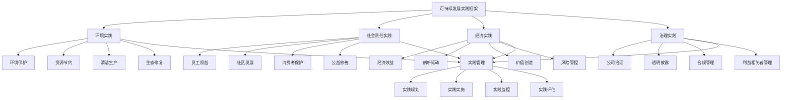

# 可持续发展实践

## 🎯 可持续发展实践概述

### 基本定义
**可持续发展实践**是指企业在经营活动中，通过系统性的管理方法和实践措施，将可持续发展理念融入企业战略、运营、管理各个环节，实现经济、社会、环境三重效益协调发展的管理活动。

### 核心特征
- **系统性**：系统性的实践方法
- **综合性**：综合性的效益追求
- **持续性**：持续性的发展目标
- **责任性**：责任性的企业行为
- **创新性**：创新性的实践方式
- **协同性**：协同性的利益相关者

## 🎯 可持续发展实践框架

### 1. 实践维度

#### 可持续发展实践框架

#### 实践要素
- **环境实践**：环境保护、资源节约、清洁生产、生态修复
- **社会责任实践**：员工权益、社区发展、消费者保护、公益慈善
- **经济实践**：经济效益、创新驱动、价值创造、风险管控
- **治理实践**：公司治理、透明披露、合规管理、利益相关者管理
- **实践管理**：实践规划、实施、监控、评估

### 2. 实践层次

#### 实践层次框架
- **战略层面**：可持续发展战略实践
- **管理层面**：可持续发展管理实践
- **运营层面**：可持续发展运营实践
- **文化层面**：可持续发展文化实践

## 🌱 环境实践

### 1. 环境保护实践

#### 实践要素
- **污染防治**：污染防治措施
- **环境监测**：环境监测管理
- **环境修复**：环境修复行动
- **环境教育**：环境教育培训

#### 实践方法
- **污染防治**：实施污染防治
- **环境监测**：开展环境监测
- **环境修复**：进行环境修复
- **环境教育**：开展环境教育

### 2. 资源节约实践

#### 实践要素
- **能源节约**：能源节约措施
- **水资源节约**：水资源节约措施
- **原材料节约**：原材料节约措施
- **循环利用**：循环利用措施

#### 实践方法
- **能源节约**：实施能源节约
- **水资源节约**：实施水资源节约
- **原材料节约**：实施原材料节约
- **循环利用**：实施循环利用

### 3. 清洁生产实践

#### 实践要素
- **清洁技术**：清洁技术应用
- **清洁工艺**：清洁工艺实施
- **清洁产品**：清洁产品开发
- **清洁管理**：清洁管理措施

#### 实践方法
- **清洁技术**：应用清洁技术
- **清洁工艺**：实施清洁工艺
- **清洁产品**：开发清洁产品
- **清洁管理**：实施清洁管理

### 4. 生态修复实践

#### 实践要素
- **生态保护**：生态保护措施
- **生态修复**：生态修复行动
- **生态建设**：生态建设活动
- **生态监测**：生态监测管理

#### 实践方法
- **生态保护**：实施生态保护
- **生态修复**：进行生态修复
- **生态建设**：开展生态建设
- **生态监测**：开展生态监测

## 👥 社会责任实践

### 1. 员工权益实践

#### 实践要素
- **劳动权益**：劳动权益保护
- **职业发展**：职业发展支持
- **工作环境**：工作环境改善
- **员工福利**：员工福利保障

#### 实践方法
- **劳动权益**：保护劳动权益
- **职业发展**：支持职业发展
- **工作环境**：改善工作环境
- **员工福利**：保障员工福利

### 2. 社区发展实践

#### 实践要素
- **社区投资**：社区投资活动
- **社区服务**：社区服务提供
- **社区教育**：社区教育培训
- **社区就业**：社区就业促进

#### 实践方法
- **社区投资**：进行社区投资
- **社区服务**：提供社区服务
- **社区教育**：开展社区教育
- **社区就业**：促进社区就业

### 3. 消费者保护实践

#### 实践要素
- **产品质量**：产品质量保障
- **服务安全**：服务安全保障
- **信息透明**：信息透明披露
- **权益保护**：消费者权益保护

#### 实践方法
- **产品质量**：保障产品质量
- **服务安全**：保障服务安全
- **信息透明**：进行信息透明
- **权益保护**：保护消费者权益

### 4. 公益慈善实践

#### 实践要素
- **慈善捐赠**：慈善捐赠活动
- **志愿服务**：志愿服务参与
- **公益项目**：公益项目实施
- **社会影响**：社会影响创造

#### 实践方法
- **慈善捐赠**：进行慈善捐赠
- **志愿服务**：参与志愿服务
- **公益项目**：实施公益项目
- **社会影响**：创造社会影响

## 💰 经济实践

### 1. 经济效益实践

#### 实践要素
- **财务绩效**：财务绩效提升
- **成本控制**：成本控制管理
- **收益增长**：收益增长实现
- **价值创造**：价值创造活动

#### 实践方法
- **财务绩效**：提升财务绩效
- **成本控制**：进行成本控制
- **收益增长**：实现收益增长
- **价值创造**：进行价值创造

### 2. 创新驱动实践

#### 实践要素
- **技术创新**：技术创新活动
- **管理创新**：管理创新实践
- **商业模式创新**：商业模式创新
- **服务创新**：服务创新实践

#### 实践方法
- **技术创新**：进行技术创新
- **管理创新**：实施管理创新
- **商业模式创新**：进行商业模式创新
- **服务创新**：实施服务创新

### 3. 价值创造实践

#### 实践要素
- **客户价值**：客户价值创造
- **股东价值**：股东价值创造
- **员工价值**：员工价值创造
- **社会价值**：社会价值创造

#### 实践方法
- **客户价值**：创造客户价值
- **股东价值**：创造股东价值
- **员工价值**：创造员工价值
- **社会价值**：创造社会价值

### 4. 风险管控实践

#### 实践要素
- **风险识别**：风险识别管理
- **风险评估**：风险评估分析
- **风险控制**：风险控制措施
- **风险应对**：风险应对策略

#### 实践方法
- **风险识别**：进行风险识别
- **风险评估**：进行风险评估
- **风险控制**：实施风险控制
- **风险应对**：制定风险应对

## 🏛️ 治理实践

### 1. 公司治理实践

#### 实践要素
- **治理结构**：治理结构完善
- **治理机制**：治理机制建立
- **治理文化**：治理文化建设
- **治理效果**：治理效果评估

#### 实践方法
- **治理结构**：完善治理结构
- **治理机制**：建立治理机制
- **治理文化**：建设治理文化
- **治理效果**：评估治理效果

### 2. 透明披露实践

#### 实践要素
- **信息披露**：信息披露管理
- **透明度**：透明度提升
- **沟通机制**：沟通机制建立
- **反馈机制**：反馈机制完善

#### 实践方法
- **信息披露**：进行信息披露
- **透明度**：提升透明度
- **沟通机制**：建立沟通机制
- **反馈机制**：完善反馈机制

### 3. 合规管理实践

#### 实践要素
- **合规体系**：合规体系建设
- **合规培训**：合规培训实施
- **合规监控**：合规监控管理
- **合规改进**：合规改进措施

#### 实践方法
- **合规体系**：建设合规体系
- **合规培训**：实施合规培训
- **合规监控**：进行合规监控
- **合规改进**：实施合规改进

### 4. 利益相关者管理实践

#### 实践要素
- **利益相关者识别**：利益相关者识别
- **利益相关者沟通**：利益相关者沟通
- **利益相关者参与**：利益相关者参与
- **利益相关者价值**：利益相关者价值创造

#### 实践方法
- **利益相关者识别**：进行利益相关者识别
- **利益相关者沟通**：进行利益相关者沟通
- **利益相关者参与**：促进利益相关者参与
- **利益相关者价值**：创造利益相关者价值

## 🎯 实践层次管理

### 1. 战略层面实践

#### 实践要素
- **战略制定**：可持续发展战略制定
- **战略实施**：可持续发展战略实施
- **战略监控**：可持续发展战略监控
- **战略评估**：可持续发展战略评估

#### 实践方法
- **战略制定**：制定可持续发展战略
- **战略实施**：实施可持续发展战略
- **战略监控**：监控可持续发展战略
- **战略评估**：评估可持续发展战略

### 2. 管理层面实践

#### 实践要素
- **管理体系**：可持续发展管理体系
- **管理制度**：可持续发展管理制度
- **管理流程**：可持续发展管理流程
- **管理工具**：可持续发展管理工具

#### 实践方法
- **管理体系**：建立可持续发展管理体系
- **管理制度**：制定可持续发展管理制度
- **管理流程**：优化可持续发展管理流程
- **管理工具**：应用可持续发展管理工具

### 3. 运营层面实践

#### 实践要素
- **运营管理**：可持续发展运营管理
- **运营优化**：可持续发展运营优化
- **运营监控**：可持续发展运营监控
- **运营改进**：可持续发展运营改进

#### 实践方法
- **运营管理**：进行可持续发展运营管理
- **运营优化**：优化可持续发展运营
- **运营监控**：监控可持续发展运营
- **运营改进**：改进可持续发展运营

### 4. 文化层面实践

#### 实践要素
- **文化建设**：可持续发展文化建设
- **文化传播**：可持续发展文化传播
- **文化实践**：可持续发展文化实践
- **文化发展**：可持续发展文化发展

#### 实践方法
- **文化建设**：建设可持续发展文化
- **文化传播**：传播可持续发展文化
- **文化实践**：实践可持续发展文化
- **文化发展**：发展可持续发展文化

## 🔍 可持续发展实践方法

### 1. 实践方法

#### 方法类型
- **系统方法**：系统性实践方法
- **综合方法**：综合性实践方法
- **持续方法**：持续性实践方法
- **创新方法**：创新性实践方法

#### 方法应用
- **系统应用**：应用系统方法
- **综合应用**：应用综合方法
- **持续应用**：应用持续方法
- **创新应用**：应用创新方法

### 2. 实践工具

#### 工具类型
- **评估工具**：可持续发展评估工具
- **管理工具**：可持续发展管理工具
- **监控工具**：可持续发展监控工具
- **报告工具**：可持续发展报告工具

#### 工具应用
- **评估应用**：应用评估工具
- **管理应用**：应用管理工具
- **监控应用**：应用监控工具
- **报告应用**：应用报告工具

### 3. 实践技术

#### 技术类型
- **信息技术**：信息技术应用
- **人工智能**：人工智能技术
- **大数据**：大数据技术
- **物联网**：物联网技术

#### 技术应用
- **信息应用**：应用信息技术
- **智能应用**：应用人工智能
- **数据应用**：应用大数据技术
- **物联应用**：应用物联网技术

### 4. 实践平台

#### 平台类型
- **管理平台**：可持续发展管理平台
- **监控平台**：可持续发展监控平台
- **报告平台**：可持续发展报告平台
- **交流平台**：可持续发展交流平台

#### 平台应用
- **管理应用**：应用管理平台
- **监控应用**：应用监控平台
- **报告应用**：应用报告平台
- **交流应用**：应用交流平台

## 📊 可持续发展实践案例

### 案例1：某制造企业绿色制造实践

#### 案例背景
某制造企业实施绿色制造实践，实现经济效益与环境效益协调发展。

#### 实践过程
- **环境实践**：清洁生产、资源节约、污染防治
- **社会责任实践**：员工权益、社区发展、消费者保护
- **经济实践**：成本控制、价值创造、风险管控
- **治理实践**：公司治理、透明披露、合规管理

#### 实践结果
- **环境效益**：污染物排放减少30%，资源利用率提升25%
- **社会效益**：员工满意度提升20%，社区关系改善
- **经济效益**：运营成本降低15%，盈利能力提升
- **治理效益**：治理水平提升，合规风险降低

#### 成功因素
- **战略引领**：可持续发展战略引领
- **系统管理**：系统管理可持续发展
- **全员参与**：全员参与可持续发展
- **持续改进**：持续改进可持续发展

### 案例2：某科技企业社会责任实践

#### 案例背景
某科技企业实施社会责任实践，提升企业形象和社会影响力。

#### 实践过程
- **员工权益**：劳动权益保护、职业发展支持
- **社区发展**：社区投资、社区服务、社区教育
- **消费者保护**：产品质量保障、服务安全保障
- **公益慈善**：慈善捐赠、志愿服务、公益项目

#### 实践结果
- **员工满意度**：员工满意度大幅提升
- **社区关系**：社区关系显著改善
- **消费者信任**：消费者信任度提升
- **社会影响**：社会影响力增强

#### 成功因素
- **责任意识**：强烈的社会责任意识
- **系统规划**：系统规划社会责任
- **资源投入**：充足的资源投入
- **效果评估**：有效的效果评估

## 🎯 可持续发展实践最佳实践

### 1. 实践原则

#### 基本原则
- **系统性原则**：系统实施可持续发展
- **综合性原则**：综合实施可持续发展
- **持续性原则**：持续实施可持续发展
- **责任性原则**：责任实施可持续发展

#### 应用原则
- **目标导向**：以目标为导向
- **效益导向**：以效益为导向
- **责任导向**：以责任为导向
- **创新导向**：以创新为导向

### 2. 实践方法

#### 实践方法
- **系统实践**：系统实施可持续发展
- **综合实践**：综合实施可持续发展
- **持续实践**：持续实施可持续发展
- **创新实践**：创新实施可持续发展

#### 方法应用
- **系统应用**：应用系统实践方法
- **综合应用**：应用综合实践方法
- **持续应用**：应用持续实践方法
- **创新应用**：应用创新实践方法

### 3. 实施要点

#### 实施要点
- **战略引领**：战略引领可持续发展
- **系统管理**：系统管理可持续发展
- **全员参与**：全员参与可持续发展
- **持续改进**：持续改进可持续发展

#### 注意事项
- **避免表面**：避免表面化实践
- **避免孤立**：避免孤立化实践
- **避免短期**：避免短期化实践
- **避免形式**：避免形式化实践

## 📚 学习要点总结

### 核心概念
1. **可持续发展实践**：可持续发展实践的管理活动
2. **环境实践**：环境保护、资源节约、清洁生产、生态修复
3. **社会责任实践**：员工权益、社区发展、消费者保护、公益慈善
4. **经济实践**：经济效益、创新驱动、价值创造、风险管控
5. **治理实践**：公司治理、透明披露、合规管理、利益相关者管理
6. **实践层次**：战略层面、管理层面、运营层面、文化层面
7. **实践方法**：系统方法、综合方法、持续方法、创新方法
8. **实践工具**：评估工具、管理工具、监控工具、报告工具

### 关键理解
- 可持续发展实践是企业可持续发展的重要途径
- 可持续发展实践具有系统性和综合性特征
- 可持续发展实践需要持续性和责任性
- 可持续发展实践需要创新性和协同性
- 可持续发展实践需要战略性和管理性
- 可持续发展实践需要工具性和技术性
- 可持续发展实践需要评估性和改进性
- 可持续发展实践需要应用性和实用性

### 实践应用
- 运用可持续发展实践实现三重效益
- 运用可持续发展实践提升企业形象
- 运用可持续发展实践增强竞争优势
- 运用可持续发展实践促进企业发展
- 运用可持续发展实践履行社会责任
- 运用可持续发展实践创造社会价值
- 运用可持续发展实践实现可持续发展
- 运用可持续发展实践推动行业变革

## 🔗 相关链接

- [[可持续发展理念]] - 可持续发展理念
- [[可持续发展战略]] - 可持续发展战略
- [[可持续发展评估]] - 可持续发展评估
- [[工具实操指南-可持续发展]] - 工具实操指南-可持续发展

## 📚 延伸阅读

- [[可持续发展学]] - 可持续发展学理论
- [[企业社会责任学]] - 企业社会责任学理论
- [[环境管理学]] - 环境管理学理论
- [[公司治理学]] - 公司治理学理论

---
*更新时间：2024年*
*内容将根据学习反馈持续优化*
