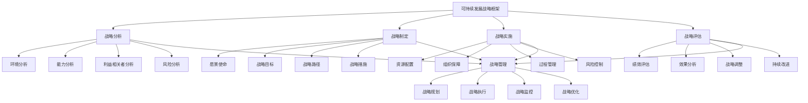

# 可持续发展战略

## 🎯 可持续发展战略概述

### 基本定义
**可持续发展战略**是指企业基于可持续发展理念，制定和实施长期性的战略规划，通过系统性的战略管理，实现经济、社会、环境三重效益协调发展，确保企业长期可持续发展的管理活动。

### 核心特征
- **战略性**：战略性的规划管理
- **长期性**：长期性的发展目标
- **系统性**：系统性的战略体系
- **综合性**：综合性的效益追求
- **可持续性**：可持续性的发展模式
- **责任性**：责任性的企业行为

## 🎯 可持续发展战略框架

### 1. 战略要素

#### 可持续发展战略框架

#### 战略要素
- **战略分析**：环境分析、能力分析、利益相关者分析、风险分析
- **战略制定**：愿景使命、战略目标、战略路径、战略措施
- **战略实施**：资源配置、组织保障、过程管理、风险控制
- **战略评估**：绩效评估、效果分析、战略调整、持续改进
- **战略管理**：战略规划、执行、监控、优化

### 2. 战略层次

#### 战略层次框架
- **公司战略**：公司层面可持续发展战略
- **业务战略**：业务层面可持续发展战略
- **职能战略**：职能层面可持续发展战略
- **项目战略**：项目层面可持续发展战略

## 🔍 战略分析

### 1. 环境分析

#### 分析要素
- **宏观环境**：政治、经济、社会、技术环境
- **行业环境**：行业结构、竞争态势、发展趋势
- **市场环境**：市场需求、市场变化、市场机会
- **政策环境**：政策法规、政策导向、政策支持

#### 分析方法
- **PEST分析**：宏观环境分析
- **五力模型**：行业环境分析
- **市场分析**：市场环境分析
- **政策分析**：政策环境分析

### 2. 能力分析

#### 分析要素
- **核心能力**：核心能力识别
- **资源能力**：资源能力评估
- **技术能力**：技术能力分析
- **管理能力**：管理能力评估

#### 分析方法
- **能力识别**：识别核心能力
- **资源评估**：评估资源能力
- **技术分析**：分析技术能力
- **管理评估**：评估管理能力

### 3. 利益相关者分析

#### 分析要素
- **利益相关者识别**：利益相关者识别
- **利益相关者需求**：利益相关者需求分析
- **利益相关者影响**：利益相关者影响分析
- **利益相关者关系**：利益相关者关系管理

#### 分析方法
- **识别方法**：识别利益相关者
- **需求分析**：分析利益相关者需求
- **影响分析**：分析利益相关者影响
- **关系管理**：管理利益相关者关系

### 4. 风险分析

#### 分析要素
- **风险识别**：风险识别管理
- **风险评估**：风险评估分析
- **风险影响**：风险影响分析
- **风险应对**：风险应对策略

#### 分析方法
- **识别方法**：识别风险因素
- **评估方法**：评估风险程度
- **影响分析**：分析风险影响
- **应对策略**：制定风险应对

## 📋 战略制定

### 1. 愿景使命制定

#### 制定要素
- **愿景制定**：可持续发展愿景
- **使命制定**：可持续发展使命
- **价值观制定**：可持续发展价值观
- **理念制定**：可持续发展理念

#### 制定方法
- **愿景方法**：制定可持续发展愿景
- **使命方法**：制定可持续发展使命
- **价值观方法**：制定可持续发展价值观
- **理念方法**：制定可持续发展理念

### 2. 战略目标制定

#### 制定要素
- **经济目标**：经济目标设定
- **社会目标**：社会目标设定
- **环境目标**：环境目标设定
- **治理目标**：治理目标设定

#### 制定方法
- **经济目标**：设定经济目标
- **社会目标**：设定社会目标
- **环境目标**：设定环境目标
- **治理目标**：设定治理目标

### 3. 战略路径制定

#### 制定要素
- **发展路径**：发展路径设计
- **实施路径**：实施路径规划
- **转型路径**：转型路径设计
- **创新路径**：创新路径规划

#### 制定方法
- **发展路径**：设计发展路径
- **实施路径**：规划实施路径
- **转型路径**：设计转型路径
- **创新路径**：规划创新路径

### 4. 战略措施制定

#### 制定要素
- **环境措施**：环境措施制定
- **社会措施**：社会措施制定
- **经济措施**：经济措施制定
- **治理措施**：治理措施制定

#### 制定方法
- **环境措施**：制定环境措施
- **社会措施**：制定社会措施
- **经济措施**：制定经济措施
- **治理措施**：制定治理措施

## 🚀 战略实施

### 1. 资源配置

#### 配置要素
- **人力资源**：人力资源配置
- **财务资源**：财务资源配置
- **技术资源**：技术资源配置
- **信息资源**：信息资源配置

#### 配置方法
- **人力资源**：配置人力资源
- **财务资源**：配置财务资源
- **技术资源**：配置技术资源
- **信息资源**：配置信息资源

### 2. 组织保障

#### 保障要素
- **组织架构**：组织架构设计
- **组织机制**：组织机制建立
- **组织文化**：组织文化建设
- **组织能力**：组织能力提升

#### 保障方法
- **组织架构**：设计组织架构
- **组织机制**：建立组织机制
- **组织文化**：建设组织文化
- **组织能力**：提升组织能力

### 3. 过程管理

#### 管理要素
- **过程规划**：过程规划管理
- **过程控制**：过程控制管理
- **过程协调**：过程协调管理
- **过程优化**：过程优化管理

#### 管理方法
- **过程规划**：管理过程规划
- **过程控制**：管理过程控制
- **过程协调**：管理过程协调
- **过程优化**：管理过程优化

### 4. 风险控制

#### 控制要素
- **风险识别**：风险识别管理
- **风险监控**：风险监控管理
- **风险应对**：风险应对管理
- **风险预防**：风险预防管理

#### 控制方法
- **风险识别**：管理风险识别
- **风险监控**：管理风险监控
- **风险应对**：管理风险应对
- **风险预防**：管理风险预防

## 📊 战略评估

### 1. 绩效评估

#### 评估要素
- **经济绩效**：经济绩效评估
- **社会绩效**：社会绩效评估
- **环境绩效**：环境绩效评估
- **治理绩效**：治理绩效评估

#### 评估方法
- **经济绩效**：评估经济绩效
- **社会绩效**：评估社会绩效
- **环境绩效**：评估环境绩效
- **治理绩效**：评估治理绩效

### 2. 效果分析

#### 分析要素
- **效果识别**：效果识别分析
- **效果测量**：效果测量分析
- **效果比较**：效果比较分析
- **效果评价**：效果评价分析

#### 分析方法
- **效果识别**：分析效果识别
- **效果测量**：分析效果测量
- **效果比较**：分析效果比较
- **效果评价**：分析效果评价

### 3. 战略调整

#### 调整要素
- **调整识别**：调整需求识别
- **调整方案**：调整方案制定
- **调整实施**：调整方案实施
- **调整效果**：调整效果评估

#### 调整方法
- **调整识别**：识别调整需求
- **调整方案**：制定调整方案
- **调整实施**：实施调整方案
- **调整效果**：评估调整效果

### 4. 持续改进

#### 改进要素
- **改进识别**：改进机会识别
- **改进方案**：改进方案制定
- **改进实施**：改进方案实施
- **改进效果**：改进效果评估

#### 改进方法
- **改进识别**：识别改进机会
- **改进方案**：制定改进方案
- **改进实施**：实施改进方案
- **改进效果**：评估改进效果

## 🏢 战略层次管理

### 1. 公司战略

#### 战略要素
- **公司愿景**：公司可持续发展愿景
- **公司使命**：公司可持续发展使命
- **公司目标**：公司可持续发展目标
- **公司战略**：公司可持续发展战略

#### 战略管理
- **愿景管理**：管理公司愿景
- **使命管理**：管理公司使命
- **目标管理**：管理公司目标
- **战略管理**：管理公司战略

### 2. 业务战略

#### 战略要素
- **业务定位**：业务可持续发展定位
- **业务目标**：业务可持续发展目标
- **业务策略**：业务可持续发展策略
- **业务措施**：业务可持续发展措施

#### 战略管理
- **定位管理**：管理业务定位
- **目标管理**：管理业务目标
- **策略管理**：管理业务策略
- **措施管理**：管理业务措施

### 3. 职能战略

#### 战略要素
- **职能目标**：职能可持续发展目标
- **职能策略**：职能可持续发展策略
- **职能措施**：职能可持续发展措施
- **职能评估**：职能可持续发展评估

#### 战略管理
- **目标管理**：管理职能目标
- **策略管理**：管理职能策略
- **措施管理**：管理职能措施
- **评估管理**：管理职能评估

### 4. 项目战略

#### 战略要素
- **项目目标**：项目可持续发展目标
- **项目策略**：项目可持续发展策略
- **项目措施**：项目可持续发展措施
- **项目评估**：项目可持续发展评估

#### 战略管理
- **目标管理**：管理项目目标
- **策略管理**：管理项目策略
- **措施管理**：管理项目措施
- **评估管理**：管理项目评估

## 🔍 可持续发展战略方法

### 1. 战略方法

#### 方法类型
- **系统方法**：系统性战略方法
- **综合方法**：综合性战略方法
- **持续方法**：持续性战略方法
- **创新方法**：创新性战略方法

#### 方法应用
- **系统应用**：应用系统方法
- **综合应用**：应用综合方法
- **持续应用**：应用持续方法
- **创新应用**：应用创新方法

### 2. 战略工具

#### 工具类型
- **分析工具**：战略分析工具
- **规划工具**：战略规划工具
- **实施工具**：战略实施工具
- **评估工具**：战略评估工具

#### 工具应用
- **分析应用**：应用分析工具
- **规划应用**：应用规划工具
- **实施应用**：应用实施工具
- **评估应用**：应用评估工具

### 3. 战略技术

#### 技术类型
- **信息技术**：信息技术应用
- **人工智能**：人工智能技术
- **大数据**：大数据技术
- **云计算**：云计算技术

#### 技术应用
- **信息应用**：应用信息技术
- **智能应用**：应用人工智能
- **数据应用**：应用大数据技术
- **云应用**：应用云计算技术

### 4. 战略平台

#### 平台类型
- **规划平台**：战略规划平台
- **实施平台**：战略实施平台
- **监控平台**：战略监控平台
- **评估平台**：战略评估平台

#### 平台应用
- **规划应用**：应用规划平台
- **实施应用**：应用实施平台
- **监控应用**：应用监控平台
- **评估应用**：应用评估平台

## 📊 可持续发展战略案例

### 案例1：某能源企业绿色转型战略

#### 案例背景
某能源企业制定绿色转型战略，实现从传统能源向清洁能源的转型。

#### 战略过程
- **战略分析**：环境分析、能力分析、风险分析
- **战略制定**：愿景使命、战略目标、战略路径
- **战略实施**：资源配置、组织保障、过程管理
- **战略评估**：绩效评估、效果分析、战略调整

#### 战略结果
- **环境效益**：碳排放减少40%，清洁能源占比提升60%
- **社会效益**：就业岗位增加，社区关系改善
- **经济效益**：盈利能力提升，市场竞争力增强
- **治理效益**：治理水平提升，风险管控改善

#### 成功因素
- **战略清晰**：清晰的可持续发展战略
- **领导支持**：领导层强力支持
- **资源投入**：充足的资源投入
- **持续改进**：持续改进战略实施

### 案例2：某制造企业可持续发展战略

#### 案例背景
某制造企业制定可持续发展战略，实现经济效益与环境效益协调发展。

#### 战略过程
- **战略分析**：行业分析、市场分析、能力分析
- **战略制定**：战略目标、战略路径、战略措施
- **战略实施**：资源配置、组织保障、过程管理
- **战略评估**：绩效评估、效果分析、持续改进

#### 战略结果
- **环境效益**：资源利用率提升30%，污染物排放减少25%
- **社会效益**：员工满意度提升，社区关系改善
- **经济效益**：运营成本降低，盈利能力提升
- **治理效益**：治理水平提升，合规风险降低

#### 成功因素
- **战略系统**：系统性的可持续发展战略
- **全员参与**：全员参与战略实施
- **工具应用**：应用战略管理工具
- **效果评估**：有效的效果评估

## 🎯 可持续发展战略最佳实践

### 1. 战略原则

#### 基本原则
- **系统性原则**：系统制定可持续发展战略
- **长期性原则**：长期性可持续发展战略
- **综合性原则**：综合性可持续发展战略
- **可持续性原则**：可持续性可持续发展战略

#### 应用原则
- **目标导向**：以目标为导向
- **效益导向**：以效益为导向
- **责任导向**：以责任为导向
- **创新导向**：以创新为导向

### 2. 战略方法

#### 战略方法
- **系统战略**：系统制定可持续发展战略
- **长期战略**：长期制定可持续发展战略
- **综合战略**：综合制定可持续发展战略
- **可持续战略**：可持续制定可持续发展战略

#### 方法应用
- **系统应用**：应用系统战略方法
- **长期应用**：应用长期战略方法
- **综合应用**：应用综合战略方法
- **可持续应用**：应用可持续战略方法

### 3. 实施要点

#### 实施要点
- **战略引领**：战略引领可持续发展
- **系统管理**：系统管理可持续发展
- **全员参与**：全员参与可持续发展
- **持续改进**：持续改进可持续发展

#### 注意事项
- **避免短期**：避免短期化战略
- **避免表面**：避免表面化战略
- **避免孤立**：避免孤立化战略
- **避免僵化**：避免僵化战略

## 📚 学习要点总结

### 核心概念
1. **可持续发展战略**：可持续发展战略的管理活动
2. **战略分析**：环境分析、能力分析、利益相关者分析、风险分析
3. **战略制定**：愿景使命、战略目标、战略路径、战略措施
4. **战略实施**：资源配置、组织保障、过程管理、风险控制
5. **战略评估**：绩效评估、效果分析、战略调整、持续改进
6. **战略层次**：公司战略、业务战略、职能战略、项目战略
7. **战略方法**：系统方法、综合方法、持续方法、创新方法
8. **战略工具**：分析工具、规划工具、实施工具、评估工具

### 关键理解
- 可持续发展战略是企业可持续发展的重要基础
- 可持续发展战略具有战略性和长期性特征
- 可持续发展战略需要系统性和综合性
- 可持续发展战略需要可持续性和责任性
- 可持续发展战略需要分析性和制定性
- 可持续发展战略需要实施性和评估性
- 可持续发展战略需要工具性和技术性
- 可持续发展战略需要应用性和实用性

### 实践应用
- 运用可持续发展战略指导企业发展
- 运用可持续发展战略实现三重效益
- 运用可持续发展战略提升企业竞争力
- 运用可持续发展战略履行社会责任
- 运用可持续发展战略创造社会价值
- 运用可持续发展战略实现可持续发展
- 运用可持续发展战略推动行业变革
- 运用可持续发展战略促进社会进步

## 🔗 相关链接

- [[可持续发展理念]] - 可持续发展理念
- [[可持续发展实践]] - 可持续发展实践
- [[可持续发展评估]] - 可持续发展评估
- [[工具实操指南-可持续发展]] - 工具实操指南-可持续发展

## 📚 延伸阅读

- [[可持续发展学]] - 可持续发展学理论
- [[战略管理学]] - 战略管理学理论
- [[企业社会责任学]] - 企业社会责任学理论
- [[环境管理学]] - 环境管理学理论

---
*更新时间：2024年*
*内容将根据学习反馈持续优化*
