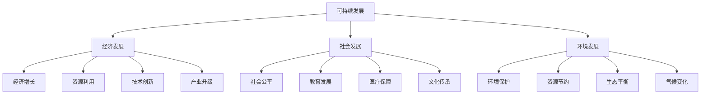
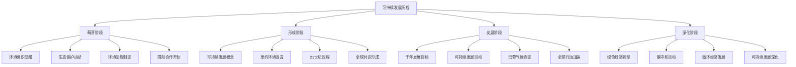

# 可持续发展理念

## 🌱 可持续发展概述

### 基本定义
**可持续发展**是指既满足当代人的需求，又不损害后代人满足需求能力的发展模式，强调经济、社会、环境的协调发展。

### 核心特征
- **协调性**：经济、社会、环境协调
- **持续性**：长期持续发展
- **公平性**：代际公平、代内公平
- **共同性**：全球共同责任

## 📊 可持续发展框架

### 1. 三大支柱

#### 可持续发展结构

#### 支柱关系
- **经济发展**：提供物质基础
- **社会发展**：提供社会基础
- **环境发展**：提供环境基础
- **三大支柱**：相互支撑、协调发展

### 2. 可持续发展要素

#### 核心要素
- **经济发展**：可持续经济增长
- **社会进步**：社会公平发展
- **环境保护**：生态环境保护
- **资源节约**：资源高效利用

#### 支撑要素
- **技术创新**：技术创新支撑
- **制度保障**：制度保障支撑
- **文化支撑**：文化支撑
- **国际合作**：国际合作支撑

## 🎯 可持续发展原则

### 1. 基本原则

#### 公平性原则
- **代际公平**：当代与后代公平
- **代内公平**：当代人之间公平
- **区域公平**：不同区域公平
- **性别公平**：男女平等

#### 持续性原则
- **资源持续**：资源可持续利用
- **环境持续**：环境可持续承载
- **经济持续**：经济可持续发展
- **社会持续**：社会可持续发展

#### 共同性原则
- **全球责任**：全球共同责任
- **国际合作**：国际合作机制
- **共同行动**：共同行动方案
- **共享成果**：共享发展成果

### 2. 实施原则

#### 预防原则
- **预防为主**：预防环境问题
- **源头控制**：源头控制污染
- **风险预防**：预防环境风险
- **早期预警**：早期预警机制

#### 污染者付费原则
- **污染责任**：污染者承担责任
- **治理费用**：承担治理费用
- **损害赔偿**：承担损害赔偿责任
- **环境修复**：承担修复责任

#### 公众参与原则
- **信息公开**：环境信息公开
- **公众参与**：公众参与决策
- **社会监督**：社会监督机制
- **民主决策**：民主决策过程

## 🔄 可持续发展历程

### 1. 发展历程

#### 历史阶段

#### 重要事件
- **1972年**：联合国人类环境会议
- **1987年**：布伦特兰报告
- **1992年**：里约环境与发展大会
- **2000年**：千年发展目标
- **2015年**：可持续发展目标
- **2020年**：碳中和承诺

### 2. 国际共识

#### 全球共识
- **环境共识**：环境保护共识
- **发展共识**：可持续发展共识
- **合作共识**：国际合作共识
- **行动共识**：共同行动共识

#### 国际机制
- **联合国机制**：联合国框架
- **多边机制**：多边合作机制
- **区域机制**：区域合作机制
- **双边机制**：双边合作机制

## 📈 可持续发展目标

### 1. 联合国可持续发展目标

#### 17个目标
- **目标1**：消除贫困
- **目标2**：消除饥饿
- **目标3**：良好健康与福祉
- **目标4**：优质教育
- **目标5**：性别平等
- **目标6**：清洁饮水和卫生设施
- **目标7**：经济适用的清洁能源
- **目标8**：体面工作和经济增长
- **目标9**：产业、创新和基础设施
- **目标10**：减少不平等
- **目标11**：可持续城市和社区
- **目标12**：负责任的消费和生产
- **目标13**：气候行动
- **目标14**：水下生物
- **目标15**：陆地生物
- **目标16**：和平、正义与强大机构
- **目标17**：促进目标实现的伙伴关系

### 2. 中国可持续发展目标

#### 国家目标
- **绿色发展**：绿色发展目标
- **生态文明**：生态文明建设
- **美丽中国**：美丽中国建设
- **碳中和**：碳达峰碳中和

#### 实施路径
- **政策引导**：政策引导实施
- **技术创新**：技术创新支撑
- **产业转型**：产业转型升级
- **社会参与**：社会广泛参与

## 🏢 企业可持续发展

### 1. 企业责任

#### 经济责任
- **创造价值**：创造经济价值
- **提供就业**：提供就业机会
- **缴纳税收**：缴纳税收
- **促进发展**：促进经济发展

#### 社会责任
- **员工权益**：保障员工权益
- **社区发展**：促进社区发展
- **公益事业**：参与公益事业
- **文化传承**：传承优秀文化

#### 环境责任
- **环境保护**：保护环境
- **资源节约**：节约资源
- **污染治理**：治理污染
- **生态修复**：修复生态

### 2. 企业实践

#### 绿色经营
- **绿色生产**：绿色生产方式
- **绿色产品**：绿色产品开发
- **绿色服务**：绿色服务提供
- **绿色供应链**：绿色供应链管理

#### 循环经济
- **资源循环**：资源循环利用
- **废物利用**：废物资源化
- **清洁生产**：清洁生产
- **生态设计**：生态设计

#### 社会责任
- **员工关怀**：员工关怀
- **社区参与**：社区参与
- **公益捐赠**：公益捐赠
- **志愿服务**：志愿服务

## 📊 可持续发展评估

### 1. 评估维度

#### 经济维度
- **经济增长**：经济增长指标
- **资源效率**：资源利用效率
- **创新能力**：创新能力指标
- **就业质量**：就业质量指标

#### 社会维度
- **社会公平**：社会公平指标
- **教育水平**：教育发展水平
- **健康水平**：健康保障水平
- **文化传承**：文化传承指标

#### 环境维度
- **环境质量**：环境质量指标
- **资源保护**：资源保护指标
- **生态平衡**：生态平衡指标
- **气候变化**：气候变化指标

### 2. 评估方法

#### 定量评估
- **指标评估**：可持续发展指标
- **对比评估**：对比分析评估
- **趋势评估**：趋势分析评估
- **综合评估**：综合评价评估

#### 定性评估
- **专家评估**：专家评估意见
- **公众评估**：公众评估意见
- **案例评估**：案例分析评估
- **经验评估**：经验总结评估

## 🔍 可持续发展挑战

### 1. 主要挑战

#### 全球挑战
- **气候变化**：气候变化挑战
- **资源短缺**：资源短缺挑战
- **环境污染**：环境污染挑战
- **生物多样性**：生物多样性挑战

#### 发展挑战
- **贫困问题**：贫困问题挑战
- **不平等问题**：不平等问题挑战
- **教育问题**：教育问题挑战
- **健康问题**：健康问题挑战

### 2. 应对策略

#### 全球策略
- **国际合作**：加强国际合作
- **技术合作**：技术合作交流
- **资金支持**：资金支持机制
- **能力建设**：能力建设支持

#### 国家策略
- **政策制定**：制定相关政策
- **制度完善**：完善相关制度
- **技术创新**：推动技术创新
- **社会参与**：促进社会参与

## 🎯 学习要点总结

### 核心概念
1. **可持续发展**：既满足当代需求又不损害后代的发展模式
2. **三大支柱**：经济发展、社会发展、环境发展
3. **基本原则**：公平性、持续性、共同性原则
4. **发展历程**：萌芽、形成、发展、深化阶段
5. **发展目标**：联合国17个可持续发展目标
6. **企业责任**：经济责任、社会责任、环境责任

### 关键理解
- 可持续发展是人类的共同目标
- 三大支柱需要协调发展
- 企业承担重要责任
- 需要全球合作共同行动

### 实践应用
- 运用可持续发展理念指导实践
- 制定可持续发展战略
- 实施可持续发展措施
- 评估可持续发展效果

## 🔗 相关链接

- [[可持续发展战略]] - 可持续发展战略
- [[可持续发展实践]] - 可持续发展实践
- [[可持续发展评估]] - 可持续发展评估
- [[思维导图-可持续发展]] - 可持续发展思维导图

## 📚 延伸阅读

- [[企业文化]] - 企业文化理论
- [[企业创新]] - 企业创新理论
- [[风险管理]] - 风险管理理论
- [[战略管理]] - 战略管理理论

---
*更新时间：2024年*
*内容将根据学习反馈持续优化*
