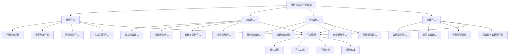

# 可持续发展评估

## 🎯 可持续发展评估概述

### 基本定义
**可持续发展评估**是指企业通过系统性的评估方法和工具，对可持续发展战略、实践、绩效进行全面、客观、科学的评估分析，识别优势与不足，为可持续发展决策提供依据的管理活动。

### 核心特征
- **系统性**：系统性的评估方法
- **客观性**：客观性的评估标准
- **科学性**：科学性的评估工具
- **全面性**：全面性的评估内容
- **动态性**：动态性的评估过程
- **实用性**：实用性的评估结果

## 🎯 可持续发展评估框架

### 1. 评估维度

#### 可持续发展评估框架

#### 评估要素
- **环境评估**：环境影响、资源利用、污染防治、生态保护评估
- **社会评估**：员工权益、社区影响、消费者保护、社会贡献评估
- **经济评估**：财务绩效、价值创造、创新驱动、风险管控评估
- **治理评估**：公司治理、透明披露、合规管理、利益相关者管理评估
- **评估管理**：评估规划、实施、分析、改进

### 2. 评估层次

#### 评估层次框架
- **战略评估**：可持续发展战略评估
- **管理评估**：可持续发展管理评估
- **绩效评估**：可持续发展绩效评估
- **影响评估**：可持续发展影响评估

## 🌱 环境评估

### 1. 环境影响评估

#### 评估要素
- **环境影响识别**：环境影响识别分析
- **环境影响测量**：环境影响测量分析
- **环境影响评价**：环境影响评价分析
- **环境影响管理**：环境影响管理分析

#### 评估方法
- **识别方法**：环境影响识别方法
- **测量方法**：环境影响测量方法
- **评价方法**：环境影响评价方法
- **管理方法**：环境影响管理方法

### 2. 资源利用评估

#### 评估要素
- **资源消耗**：资源消耗评估
- **资源效率**：资源效率评估
- **资源循环**：资源循环评估
- **资源节约**：资源节约评估

#### 评估方法
- **消耗评估**：资源消耗评估方法
- **效率评估**：资源效率评估方法
- **循环评估**：资源循环评估方法
- **节约评估**：资源节约评估方法

### 3. 污染防治评估

#### 评估要素
- **污染源识别**：污染源识别评估
- **污染控制**：污染控制评估
- **污染监测**：污染监测评估
- **污染治理**：污染治理评估

#### 评估方法
- **识别方法**：污染源识别方法
- **控制方法**：污染控制评估方法
- **监测方法**：污染监测评估方法
- **治理方法**：污染治理评估方法

### 4. 生态保护评估

#### 评估要素
- **生态影响**：生态影响评估
- **生态保护**：生态保护评估
- **生态修复**：生态修复评估
- **生态监测**：生态监测评估

#### 评估方法
- **影响方法**：生态影响评估方法
- **保护方法**：生态保护评估方法
- **修复方法**：生态修复评估方法
- **监测方法**：生态监测评估方法

## 👥 社会评估

### 1. 员工权益评估

#### 评估要素
- **劳动权益**：劳动权益评估
- **职业发展**：职业发展评估
- **工作环境**：工作环境评估
- **员工福利**：员工福利评估

#### 评估方法
- **权益方法**：劳动权益评估方法
- **发展方法**：职业发展评估方法
- **环境方法**：工作环境评估方法
- **福利方法**：员工福利评估方法

### 2. 社区影响评估

#### 评估要素
- **社区投资**：社区投资评估
- **社区服务**：社区服务评估
- **社区就业**：社区就业评估
- **社区关系**：社区关系评估

#### 评估方法
- **投资方法**：社区投资评估方法
- **服务方法**：社区服务评估方法
- **就业方法**：社区就业评估方法
- **关系方法**：社区关系评估方法

### 3. 消费者保护评估

#### 评估要素
- **产品质量**：产品质量评估
- **服务安全**：服务安全评估
- **信息透明**：信息透明评估
- **权益保护**：权益保护评估

#### 评估方法
- **质量方法**：产品质量评估方法
- **安全方法**：服务安全评估方法
- **透明方法**：信息透明评估方法
- **保护方法**：权益保护评估方法

### 4. 社会贡献评估

#### 评估要素
- **公益慈善**：公益慈善评估
- **志愿服务**：志愿服务评估
- **社会影响**：社会影响评估
- **社会价值**：社会价值评估

#### 评估方法
- **慈善方法**：公益慈善评估方法
- **志愿方法**：志愿服务评估方法
- **影响方法**：社会影响评估方法
- **价值方法**：社会价值评估方法

## 💰 经济评估

### 1. 财务绩效评估

#### 评估要素
- **盈利能力**：盈利能力评估
- **偿债能力**：偿债能力评估
- **运营能力**：运营能力评估
- **发展能力**：发展能力评估

#### 评估方法
- **盈利方法**：盈利能力评估方法
- **偿债方法**：偿债能力评估方法
- **运营方法**：运营能力评估方法
- **发展方法**：发展能力评估方法

### 2. 价值创造评估

#### 评估要素
- **股东价值**：股东价值评估
- **客户价值**：客户价值评估
- **员工价值**：员工价值评估
- **社会价值**：社会价值评估

#### 评估方法
- **股东方法**：股东价值评估方法
- **客户方法**：客户价值评估方法
- **员工方法**：员工价值评估方法
- **社会方法**：社会价值评估方法

### 3. 创新驱动评估

#### 评估要素
- **技术创新**：技术创新评估
- **管理创新**：管理创新评估
- **商业模式创新**：商业模式创新评估
- **服务创新**：服务创新评估

#### 评估方法
- **技术方法**：技术创新评估方法
- **管理方法**：管理创新评估方法
- **商业模式方法**：商业模式创新评估方法
- **服务方法**：服务创新评估方法

### 4. 风险管控评估

#### 评估要素
- **风险识别**：风险识别评估
- **风险评估**：风险评估分析
- **风险控制**：风险控制评估
- **风险应对**：风险应对评估

#### 评估方法
- **识别方法**：风险识别评估方法
- **评估方法**：风险评估分析方法
- **控制方法**：风险控制评估方法
- **应对方法**：风险应对评估方法

## 🏛️ 治理评估

### 1. 公司治理评估

#### 评估要素
- **治理结构**：治理结构评估
- **治理机制**：治理机制评估
- **治理文化**：治理文化评估
- **治理效果**：治理效果评估

#### 评估方法
- **结构方法**：治理结构评估方法
- **机制方法**：治理机制评估方法
- **文化方法**：治理文化评估方法
- **效果方法**：治理效果评估方法

### 2. 透明披露评估

#### 评估要素
- **信息披露**：信息披露评估
- **透明度**：透明度评估
- **沟通机制**：沟通机制评估
- **反馈机制**：反馈机制评估

#### 评估方法
- **披露方法**：信息披露评估方法
- **透明方法**：透明度评估方法
- **沟通方法**：沟通机制评估方法
- **反馈方法**：反馈机制评估方法

### 3. 合规管理评估

#### 评估要素
- **合规体系**：合规体系评估
- **合规培训**：合规培训评估
- **合规监控**：合规监控评估
- **合规改进**：合规改进评估

#### 评估方法
- **体系方法**：合规体系评估方法
- **培训方法**：合规培训评估方法
- **监控方法**：合规监控评估方法
- **改进方法**：合规改进评估方法

### 4. 利益相关者管理评估

#### 评估要素
- **利益相关者识别**：利益相关者识别评估
- **利益相关者沟通**：利益相关者沟通评估
- **利益相关者参与**：利益相关者参与评估
- **利益相关者价值**：利益相关者价值评估

#### 评估方法
- **识别方法**：利益相关者识别评估方法
- **沟通方法**：利益相关者沟通评估方法
- **参与方法**：利益相关者参与评估方法
- **价值方法**：利益相关者价值评估方法

## 📊 评估层次管理

### 1. 战略评估

#### 评估要素
- **战略制定**：战略制定评估
- **战略实施**：战略实施评估
- **战略效果**：战略效果评估
- **战略调整**：战略调整评估

#### 评估方法
- **制定方法**：战略制定评估方法
- **实施方法**：战略实施评估方法
- **效果方法**：战略效果评估方法
- **调整方法**：战略调整评估方法

### 2. 管理评估

#### 评估要素
- **管理体系**：管理体系评估
- **管理制度**：管理制度评估
- **管理流程**：管理流程评估
- **管理工具**：管理工具评估

#### 评估方法
- **体系方法**：管理体系评估方法
- **制度方法**：管理制度评估方法
- **流程方法**：管理流程评估方法
- **工具方法**：管理工具评估方法

### 3. 绩效评估

#### 评估要素
- **绩效指标**：绩效指标评估
- **绩效测量**：绩效测量评估
- **绩效分析**：绩效分析评估
- **绩效改进**：绩效改进评估

#### 评估方法
- **指标方法**：绩效指标评估方法
- **测量方法**：绩效测量评估方法
- **分析方法**：绩效分析评估方法
- **改进方法**：绩效改进评估方法

### 4. 影响评估

#### 评估要素
- **影响识别**：影响识别评估
- **影响测量**：影响测量评估
- **影响分析**：影响分析评估
- **影响管理**：影响管理评估

#### 评估方法
- **识别方法**：影响识别评估方法
- **测量方法**：影响测量评估方法
- **分析方法**：影响分析评估方法
- **管理方法**：影响管理评估方法

## 🔍 可持续发展评估方法

### 1. 评估方法

#### 方法类型
- **定量评估**：定量评估方法
- **定性评估**：定性评估方法
- **混合评估**：混合评估方法
- **综合评估**：综合评估方法

#### 方法应用
- **定量应用**：应用定量评估
- **定性应用**：应用定性评估
- **混合应用**：应用混合评估
- **综合应用**：应用综合评估

### 2. 评估工具

#### 工具类型
- **指标体系**：可持续发展指标体系
- **评估模型**：可持续发展评估模型
- **评估软件**：可持续发展评估软件
- **评估平台**：可持续发展评估平台

#### 工具应用
- **指标应用**：应用指标体系
- **模型应用**：应用评估模型
- **软件应用**：应用评估软件
- **平台应用**：应用评估平台

### 3. 评估技术

#### 技术类型
- **信息技术**：信息技术应用
- **人工智能**：人工智能技术
- **大数据**：大数据技术
- **云计算**：云计算技术

#### 技术应用
- **信息应用**：应用信息技术
- **智能应用**：应用人工智能
- **数据应用**：应用大数据技术
- **云应用**：应用云计算技术

### 4. 评估标准

#### 标准类型
- **国际标准**：国际可持续发展标准
- **国家标准**：国家可持续发展标准
- **行业标准**：行业可持续发展标准
- **企业标准**：企业可持续发展标准

#### 标准应用
- **国际应用**：应用国际标准
- **国家应用**：应用国家标准
- **行业应用**：应用行业标准
- **企业应用**：应用企业标准

## 📊 可持续发展评估案例

### 案例1：某制造企业可持续发展评估

#### 案例背景
某制造企业实施可持续发展评估，全面评估企业可持续发展水平。

#### 评估过程
- **环境评估**：环境影响、资源利用、污染防治、生态保护
- **社会评估**：员工权益、社区影响、消费者保护、社会贡献
- **经济评估**：财务绩效、价值创造、创新驱动、风险管控
- **治理评估**：公司治理、透明披露、合规管理、利益相关者管理

#### 评估结果
- **环境绩效**：环境绩效良好，资源利用率提升25%
- **社会绩效**：社会绩效优秀，员工满意度提升20%
- **经济绩效**：经济绩效良好，盈利能力提升15%
- **治理绩效**：治理绩效优秀，合规风险降低

#### 改进建议
- **环境改进**：进一步提升资源利用效率
- **社会改进**：加强社区关系建设
- **经济改进**：优化成本结构
- **治理改进**：完善治理机制

### 案例2：某科技企业可持续发展评估

#### 案例背景
某科技企业实施可持续发展评估，识别可持续发展优势和不足。

#### 评估过程
- **战略评估**：可持续发展战略评估
- **管理评估**：可持续发展管理评估
- **绩效评估**：可持续发展绩效评估
- **影响评估**：可持续发展影响评估

#### 评估结果
- **战略水平**：战略水平良好，战略清晰度提升
- **管理水平**：管理水平优秀，管理体系完善
- **绩效水平**：绩效水平良好，绩效指标达成
- **影响水平**：影响水平优秀，社会影响显著

#### 改进建议
- **战略改进**：进一步明确战略目标
- **管理改进**：优化管理流程
- **绩效改进**：提升绩效指标
- **影响改进**：扩大社会影响

## 🎯 可持续发展评估最佳实践

### 1. 评估原则

#### 基本原则
- **系统性原则**：系统进行可持续发展评估
- **客观性原则**：客观进行可持续发展评估
- **科学性原则**：科学进行可持续发展评估
- **全面性原则**：全面进行可持续发展评估

#### 应用原则
- **目标导向**：以目标为导向
- **标准导向**：以标准为导向
- **数据导向**：以数据为导向
- **改进导向**：以改进为导向

### 2. 评估方法

#### 评估方法
- **系统评估**：系统进行可持续发展评估
- **客观评估**：客观进行可持续发展评估
- **科学评估**：科学进行可持续发展评估
- **全面评估**：全面进行可持续发展评估

#### 方法应用
- **系统应用**：应用系统评估方法
- **客观应用**：应用客观评估方法
- **科学应用**：应用科学评估方法
- **全面应用**：应用全面评估方法

### 3. 实施要点

#### 实施要点
- **标准制定**：制定评估标准
- **工具应用**：应用评估工具
- **数据收集**：收集评估数据
- **结果应用**：应用评估结果

#### 注意事项
- **避免主观**：避免主观评估
- **避免片面**：避免片面评估
- **避免静态**：避免静态评估
- **避免形式**：避免形式评估

## 📚 学习要点总结

### 核心概念
1. **可持续发展评估**：可持续发展评估的管理活动
2. **环境评估**：环境影响、资源利用、污染防治、生态保护评估
3. **社会评估**：员工权益、社区影响、消费者保护、社会贡献评估
4. **经济评估**：财务绩效、价值创造、创新驱动、风险管控评估
5. **治理评估**：公司治理、透明披露、合规管理、利益相关者管理评估
6. **评估层次**：战略评估、管理评估、绩效评估、影响评估
7. **评估方法**：定量评估、定性评估、混合评估、综合评估
8. **评估工具**：指标体系、评估模型、评估软件、评估平台

### 关键理解
- 可持续发展评估是可持续发展管理的重要工具
- 可持续发展评估具有系统性和客观性特征
- 可持续发展评估需要科学性和全面性
- 可持续发展评估需要动态性和实用性
- 可持续发展评估需要标准性和工具性
- 可持续发展评估需要技术性和平台性
- 可持续发展评估需要应用性和改进性
- 可持续发展评估需要结果性和指导性

### 实践应用
- 运用可持续发展评估识别优势与不足
- 运用可持续发展评估指导决策制定
- 运用可持续发展评估提升管理水平
- 运用可持续发展评估改善绩效表现
- 运用可持续发展评估增强竞争优势
- 运用可持续发展评估履行社会责任
- 运用可持续发展评估实现可持续发展
- 运用可持续发展评估推动行业进步

## 🔗 相关链接

- [[可持续发展理念]] - 可持续发展理念
- [[可持续发展战略]] - 可持续发展战略
- [[可持续发展实践]] - 可持续发展实践
- [[工具实操指南-可持续发展]] - 工具实操指南-可持续发展

## 📚 延伸阅读

- [[可持续发展学]] - 可持续发展学理论
- [[评估学]] - 评估学理论
- [[绩效管理学]] - 绩效管理学理论
- [[质量管理学]] - 质量管理学理论

---
*更新时间：2024年*
*内容将根据学习反馈持续优化*
