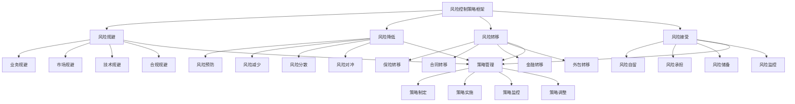

# 风险控制策略

## 🎯 风险控制策略概述

### 基本定义
**风险控制策略**是指企业根据风险识别和评估结果，制定和实施系统性的风险控制措施和方法，通过预防、减少、转移、接受等策略，有效控制和管理各类风险的管理活动。

### 核心特征
- **策略性**：策略性的控制方法
- **系统性**：系统性的控制措施
- **针对性**：针对性的控制策略
- **有效性**：有效性的控制效果
- **动态性**：动态性的控制调整
- **协同性**：协同性的控制机制

## 🎯 风险控制策略框架

### 1. 控制策略

#### 风险控制策略框架

#### 控制要素
- **风险规避**：业务规避、市场规避、技术规避、合规规避
- **风险降低**：风险预防、减少、分散、对冲
- **风险转移**：保险转移、合同转移、金融转移、外包转移
- **风险接受**：风险自留、承担、储备、监控
- **策略管理**：策略制定、实施、监控、调整

### 2. 控制层次

#### 控制层次框架
- **战略控制**：战略层面风险控制
- **管理控制**：管理层面风险控制
- **运营控制**：运营层面风险控制
- **操作控制**：操作层面风险控制

## 🚫 风险规避

### 1. 业务规避

#### 规避要素
- **业务选择**：业务选择规避
- **业务退出**：业务退出规避
- **业务调整**：业务调整规避
- **业务限制**：业务限制规避

#### 规避方法
- **业务选择**：选择低风险业务
- **业务退出**：退出高风险业务
- **业务调整**：调整业务结构
- **业务限制**：限制业务范围

### 2. 市场规避

#### 规避要素
- **市场选择**：市场选择规避
- **市场退出**：市场退出规避
- **市场调整**：市场调整规避
- **市场限制**：市场限制规避

#### 规避方法
- **市场选择**：选择低风险市场
- **市场退出**：退出高风险市场
- **市场调整**：调整市场结构
- **市场限制**：限制市场范围

### 3. 技术规避

#### 规避要素
- **技术选择**：技术选择规避
- **技术退出**：技术退出规避
- **技术调整**：技术调整规避
- **技术限制**：技术限制规避

#### 规避方法
- **技术选择**：选择成熟技术
- **技术退出**：退出高风险技术
- **技术调整**：调整技术结构
- **技术限制**：限制技术范围

### 4. 合规规避

#### 规避要素
- **合规选择**：合规选择规避
- **合规退出**：合规退出规避
- **合规调整**：合规调整规避
- **合规限制**：合规限制规避

#### 规避方法
- **合规选择**：选择合规业务
- **合规退出**：退出不合规业务
- **合规调整**：调整合规结构
- **合规限制**：限制合规范围

## 📉 风险降低

### 1. 风险预防

#### 预防要素
- **预防措施**：风险预防措施
- **预防机制**：风险预防机制
- **预防流程**：风险预防流程
- **预防工具**：风险预防工具

#### 预防方法
- **预防措施**：制定预防措施
- **预防机制**：建立预防机制
- **预防流程**：设计预防流程
- **预防工具**：应用预防工具

### 2. 风险减少

#### 减少要素
- **减少措施**：风险减少措施
- **减少方法**：风险减少方法
- **减少工具**：风险减少工具
- **减少效果**：风险减少效果

#### 减少方法
- **减少措施**：实施减少措施
- **减少方法**：应用减少方法
- **减少工具**：使用减少工具
- **减少效果**：评估减少效果

### 3. 风险分散

#### 分散要素
- **分散策略**：风险分散策略
- **分散方法**：风险分散方法
- **分散工具**：风险分散工具
- **分散效果**：风险分散效果

#### 分散方法
- **分散策略**：制定分散策略
- **分散方法**：应用分散方法
- **分散工具**：使用分散工具
- **分散效果**：评估分散效果

### 4. 风险对冲

#### 对冲要素
- **对冲策略**：风险对冲策略
- **对冲工具**：风险对冲工具
- **对冲方法**：风险对冲方法
- **对冲效果**：风险对冲效果

#### 对冲方法
- **对冲策略**：制定对冲策略
- **对冲工具**：使用对冲工具
- **对冲方法**：应用对冲方法
- **对冲效果**：评估对冲效果

## 🔄 风险转移

### 1. 保险转移

#### 转移要素
- **保险选择**：保险产品选择
- **保险购买**：保险产品购买
- **保险管理**：保险产品管理
- **保险理赔**：保险产品理赔

#### 转移方法
- **保险选择**：选择合适保险
- **保险购买**：购买保险产品
- **保险管理**：管理保险产品
- **保险理赔**：处理保险理赔

### 2. 合同转移

#### 转移要素
- **合同设计**：风险转移合同设计
- **合同签订**：风险转移合同签订
- **合同执行**：风险转移合同执行
- **合同管理**：风险转移合同管理

#### 转移方法
- **合同设计**：设计转移合同
- **合同签订**：签订转移合同
- **合同执行**：执行转移合同
- **合同管理**：管理转移合同

### 3. 金融转移

#### 转移要素
- **金融工具**：金融转移工具
- **金融产品**：金融转移产品
- **金融交易**：金融转移交易
- **金融管理**：金融转移管理

#### 转移方法
- **金融工具**：使用金融工具
- **金融产品**：使用金融产品
- **金融交易**：进行金融交易
- **金融管理**：管理金融转移

### 4. 外包转移

#### 转移要素
- **外包选择**：外包服务选择
- **外包合同**：外包合同签订
- **外包管理**：外包服务管理
- **外包监控**：外包服务监控

#### 转移方法
- **外包选择**：选择外包服务
- **外包合同**：签订外包合同
- **外包管理**：管理外包服务
- **外包监控**：监控外包服务

## ✅ 风险接受

### 1. 风险自留

#### 自留要素
- **自留决策**：风险自留决策
- **自留范围**：风险自留范围
- **自留条件**：风险自留条件
- **自留管理**：风险自留管理

#### 自留方法
- **自留决策**：做出自留决策
- **自留范围**：确定自留范围
- **自留条件**：设定自留条件
- **自留管理**：管理风险自留

### 2. 风险承担

#### 承担要素
- **承担能力**：风险承担能力
- **承担范围**：风险承担范围
- **承担条件**：风险承担条件
- **承担管理**：风险承担管理

#### 承担方法
- **承担能力**：评估承担能力
- **承担范围**：确定承担范围
- **承担条件**：设定承担条件
- **承担管理**：管理风险承担

### 3. 风险储备

#### 储备要素
- **储备资金**：风险储备资金
- **储备管理**：风险储备管理
- **储备使用**：风险储备使用
- **储备补充**：风险储备补充

#### 储备方法
- **储备资金**：建立储备资金
- **储备管理**：管理风险储备
- **储备使用**：使用风险储备
- **储备补充**：补充风险储备

### 4. 风险监控

#### 监控要素
- **监控指标**：风险监控指标
- **监控频率**：风险监控频率
- **监控方法**：风险监控方法
- **监控效果**：风险监控效果

#### 监控方法
- **监控指标**：设定监控指标
- **监控频率**：设定监控频率
- **监控方法**：选择监控方法
- **监控效果**：评估监控效果

## 🎯 控制层次管理

### 1. 战略控制

#### 控制要素
- **战略风险控制**：战略风险控制实施
- **战略风险规避**：战略风险规避实施
- **战略风险降低**：战略风险降低实施
- **战略风险转移**：战略风险转移实施

#### 控制方法
- **战略风险控制**：实施战略风险控制
- **战略风险规避**：实施战略风险规避
- **战略风险降低**：实施战略风险降低
- **战略风险转移**：实施战略风险转移

### 2. 管理控制

#### 控制要素
- **管理风险控制**：管理风险控制实施
- **管理风险规避**：管理风险规避实施
- **管理风险降低**：管理风险降低实施
- **管理风险转移**：管理风险转移实施

#### 控制方法
- **管理风险控制**：实施管理风险控制
- **管理风险规避**：实施管理风险规避
- **管理风险降低**：实施管理风险降低
- **管理风险转移**：实施管理风险转移

### 3. 运营控制

#### 控制要素
- **运营风险控制**：运营风险控制实施
- **运营风险规避**：运营风险规避实施
- **运营风险降低**：运营风险降低实施
- **运营风险转移**：运营风险转移实施

#### 控制方法
- **运营风险控制**：实施运营风险控制
- **运营风险规避**：实施运营风险规避
- **运营风险降低**：实施运营风险降低
- **运营风险转移**：实施运营风险转移

### 4. 操作控制

#### 控制要素
- **操作风险控制**：操作风险控制实施
- **操作风险规避**：操作风险规避实施
- **操作风险降低**：操作风险降低实施
- **操作风险转移**：操作风险转移实施

#### 控制方法
- **操作风险控制**：实施操作风险控制
- **操作风险规避**：实施操作风险规避
- **操作风险降低**：实施操作风险降低
- **操作风险转移**：实施操作风险转移

## 🔍 风险控制策略方法

### 1. 策略方法

#### 方法类型
- **规避方法**：风险规避方法
- **降低方法**：风险降低方法
- **转移方法**：风险转移方法
- **接受方法**：风险接受方法

#### 方法应用
- **规避应用**：应用规避方法
- **降低应用**：应用降低方法
- **转移应用**：应用转移方法
- **接受应用**：应用接受方法

### 2. 策略工具

#### 工具类型
- **控制工具**：风险控制工具
- **监测工具**：风险监测工具
- **分析工具**：风险分析工具
- **管理工具**：风险管理工具

#### 工具应用
- **控制应用**：应用控制工具
- **监测应用**：应用监测工具
- **分析应用**：应用分析工具
- **管理应用**：应用管理工具

### 3. 策略技术

#### 技术类型
- **信息技术**：信息技术应用
- **人工智能**：人工智能技术
- **大数据**：大数据技术
- **机器学习**：机器学习技术

#### 技术应用
- **信息应用**：应用信息技术
- **智能应用**：应用人工智能
- **数据应用**：应用大数据技术
- **学习应用**：应用机器学习

### 4. 策略平台

#### 平台类型
- **控制平台**：风险控制平台
- **监测平台**：风险监测平台
- **分析平台**：风险分析平台
- **管理平台**：风险管理平台

#### 平台应用
- **控制应用**：应用控制平台
- **监测应用**：应用监测平台
- **分析应用**：应用分析平台
- **管理应用**：应用管理平台

## 📊 风险控制策略案例

### 案例1：某银行风险控制策略

#### 案例背景
某银行实施风险控制策略，有效控制各类金融风险。

#### 控制策略
- **风险规避**：规避高风险业务和市场
- **风险降低**：降低信用风险和操作风险
- **风险转移**：转移市场风险和流动性风险
- **风险接受**：接受可承受的风险

#### 控制效果
- **风险损失**：风险损失减少60%
- **风险控制**：风险控制效果提升45%
- **业务稳定**：业务稳定性提升35%
- **盈利能力**：盈利能力提升25%

#### 成功因素
- **策略清晰**：清晰的风险控制策略
- **工具应用**：有效的控制工具应用
- **人员培训**：专业的人员培训
- **持续改进**：持续的策略改进

### 案例2：某制造企业风险控制策略

#### 案例背景
某制造企业实施风险控制策略，防范生产运营风险。

#### 控制策略
- **风险规避**：规避高风险技术和市场
- **风险降低**：降低生产风险和供应链风险
- **风险转移**：转移质量风险和物流风险
- **风险接受**：接受可承受的经营风险

#### 控制效果
- **生产稳定**：生产稳定性提升40%
- **质量改善**：产品质量改善30%
- **成本控制**：运营成本降低25%
- **风险减少**：风险事件减少80%

#### 成功因素
- **系统策略**：系统性的风险控制策略
- **技术支撑**：先进的技术支撑
- **流程优化**：优化的控制流程
- **效果评估**：有效的效果评估

## 🎯 风险控制策略最佳实践

### 1. 策略原则

#### 基本原则
- **策略性原则**：策略性制定风险控制
- **系统性原则**：系统性实施风险控制
- **针对性原则**：针对性实施风险控制
- **有效性原则**：有效性实施风险控制

#### 应用原则
- **目标导向**：以目标为导向
- **风险导向**：以风险为导向
- **策略导向**：以策略为导向
- **效果导向**：以效果为导向

### 2. 策略方法

#### 策略方法
- **策略制定**：制定风险控制策略
- **策略实施**：实施风险控制策略
- **策略监控**：监控风险控制策略
- **策略调整**：调整风险控制策略

#### 方法应用
- **制定应用**：应用策略制定方法
- **实施应用**：应用策略实施方法
- **监控应用**：应用策略监控方法
- **调整应用**：应用策略调整方法

### 3. 实施要点

#### 实施要点
- **策略制定**：制定清晰的控制策略
- **工具应用**：应用有效的控制工具
- **人员培训**：培训控制人员
- **持续改进**：持续改进策略

#### 注意事项
- **避免单一**：避免单一控制策略
- **避免僵化**：避免僵化控制策略
- **避免过度**：避免过度控制策略
- **避免不足**：避免不足控制策略

## 📚 学习要点总结

### 核心概念
1. **风险控制策略**：风险控制策略的管理活动
2. **风险规避**：业务规避、市场规避、技术规避、合规规避
3. **风险降低**：风险预防、减少、分散、对冲
4. **风险转移**：保险转移、合同转移、金融转移、外包转移
5. **风险接受**：风险自留、承担、储备、监控
6. **控制层次**：战略控制、管理控制、运营控制、操作控制
7. **策略方法**：规避方法、降低方法、转移方法、接受方法
8. **策略工具**：控制工具、监测工具、分析工具、管理工具

### 关键理解
- 风险控制策略是风险管理的重要组成部分
- 风险控制策略具有策略性和系统性特征
- 风险控制策略需要针对性和有效性
- 风险控制策略需要动态性和协同性
- 风险控制策略需要规避性和降低性
- 风险控制策略需要转移性和接受性
- 风险控制策略需要工具性和技术性
- 风险控制策略需要应用性和实用性

### 实践应用
- 运用风险控制策略有效控制风险
- 运用风险控制策略减少风险损失
- 运用风险控制策略提升风险管理水平
- 运用风险控制策略增强风险防范能力
- 运用风险控制策略优化风险管控
- 运用风险控制策略实现风险管理目标
- 运用风险控制策略促进企业稳定发展
- 运用风险控制策略推动行业风险管理

## 🔗 相关链接

- [[风险识别与评估]] - 风险识别与评估
- [[风险预警机制]] - 风险预警机制
- [[风险管理体系]] - 风险管理体系
- [[工具实操指南-风险管理]] - 工具实操指南-风险管理

## 📚 延伸阅读

- [[风险管理学]] - 风险管理学理论
- [[策略管理学]] - 策略管理学理论
- [[控制管理学]] - 控制管理学理论
- [[金融管理学]] - 金融管理学理论

---
*更新时间：2024年*
*内容将根据学习反馈持续优化*
