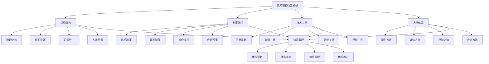

# 风险管理体系

## 🎯 风险管理体系概述

### 基本定义
**风险管理体系**是指企业建立的一套完整、系统、科学的风险管理组织架构、制度流程、技术工具和方法体系，通过系统性的风险管理活动，有效识别、评估、控制和应对各类风险的管理体系。

### 核心特征
- **系统性**：系统性的管理体系
- **完整性**：完整性的管理要素
- **科学性**：科学性的管理方法
- **动态性**：动态性的管理过程
- **协同性**：协同性的管理机制
- **有效性**：有效性的管理效果

## 🎯 风险管理体系框架

### 1. 体系要素

#### 风险管理体系框架

#### 体系要素
- **组织架构**：治理结构、组织设置、职责分工、人员配置
- **制度流程**：风险政策、管理制度、操作流程、应急预案
- **技术工具**：信息系统、监测工具、分析工具、控制工具
- **方法体系**：识别方法、评估方法、控制方法、应对方法
- **体系管理**：体系规划、实施、监控、改进

### 2. 体系层次

#### 体系层次框架
- **战略层面**：战略风险管理体系
- **管理层面**：管理风险管理体系
- **运营层面**：运营风险管理体系
- **操作层面**：操作风险管理体系

## 🏢 组织架构

### 1. 治理结构

#### 结构要素
- **董事会**：董事会风险管理职责
- **风险管理委员会**：风险管理委员会设置
- **审计委员会**：审计委员会职责
- **监事会**：监事会监督职责

#### 结构管理
- **董事会**：管理董事会职责
- **风险管理委员会**：管理风险管理委员会
- **审计委员会**：管理审计委员会
- **监事会**：管理监事会职责

### 2. 组织设置

#### 设置要素
- **风险管理部门**：风险管理部门设置
- **业务部门**：业务部门风险管理
- **支持部门**：支持部门风险管理
- **监督部门**：监督部门风险管理

#### 设置管理
- **风险管理部门**：设置风险管理部门
- **业务部门**：管理业务部门风险管理
- **支持部门**：管理支持部门风险管理
- **监督部门**：管理监督部门风险管理

### 3. 职责分工

#### 分工要素
- **高层职责**：高层风险管理职责
- **中层职责**：中层风险管理职责
- **基层职责**：基层风险管理职责
- **专业职责**：专业风险管理职责

#### 分工管理
- **高层职责**：明确高层职责
- **中层职责**：明确中层职责
- **基层职责**：明确基层职责
- **专业职责**：明确专业职责

### 4. 人员配置

#### 配置要素
- **人员结构**：人员结构配置
- **人员能力**：人员能力要求
- **人员培训**：人员培训管理
- **人员激励**：人员激励机制

#### 配置管理
- **人员结构**：配置人员结构
- **人员能力**：要求人员能力
- **人员培训**：管理人员培训
- **人员激励**：建立激励机制

## 📋 制度流程

### 1. 风险政策

#### 政策要素
- **风险偏好**：风险偏好设定
- **风险容忍度**：风险容忍度设定
- **风险限额**：风险限额设定
- **风险策略**：风险策略制定

#### 政策管理
- **风险偏好**：设定风险偏好
- **风险容忍度**：设定风险容忍度
- **风险限额**：设定风险限额
- **风险策略**：制定风险策略

### 2. 管理制度

#### 制度要素
- **风险管理制度**：风险管理制度制定
- **风险控制制度**：风险控制制度制定
- **风险报告制度**：风险报告制度制定
- **风险考核制度**：风险考核制度制定

#### 制度管理
- **风险管理制度**：制定风险管理制度
- **风险控制制度**：制定风险控制制度
- **风险报告制度**：制定风险报告制度
- **风险考核制度**：制定风险考核制度

### 3. 操作流程

#### 流程要素
- **风险识别流程**：风险识别流程设计
- **风险评估流程**：风险评估流程设计
- **风险控制流程**：风险控制流程设计
- **风险应对流程**：风险应对流程设计

#### 流程管理
- **风险识别流程**：设计风险识别流程
- **风险评估流程**：设计风险评估流程
- **风险控制流程**：设计风险控制流程
- **风险应对流程**：设计风险应对流程

### 4. 应急预案

#### 预案要素
- **应急组织**：应急组织设置
- **应急流程**：应急流程设计
- **应急措施**：应急措施制定
- **应急资源**：应急资源配置

#### 预案管理
- **应急组织**：设置应急组织
- **应急流程**：设计应急流程
- **应急措施**：制定应急措施
- **应急资源**：配置应急资源

## 🔧 技术工具

### 1. 信息系统

#### 系统要素
- **风险信息系统**：风险信息系统建设
- **数据管理系统**：数据管理系统建设
- **监测预警系统**：监测预警系统建设
- **决策支持系统**：决策支持系统建设

#### 系统管理
- **风险信息系统**：建设风险信息系统
- **数据管理系统**：建设数据管理系统
- **监测预警系统**：建设监测预警系统
- **决策支持系统**：建设决策支持系统

### 2. 监测工具

#### 工具要素
- **风险监测工具**：风险监测工具应用
- **指标监控工具**：指标监控工具应用
- **预警工具**：预警工具应用
- **报告工具**：报告工具应用

#### 工具管理
- **风险监测工具**：应用风险监测工具
- **指标监控工具**：应用指标监控工具
- **预警工具**：应用预警工具
- **报告工具**：应用报告工具

### 3. 分析工具

#### 工具要素
- **风险分析工具**：风险分析工具应用
- **统计分析工具**：统计分析工具应用
- **模型分析工具**：模型分析工具应用
- **情景分析工具**：情景分析工具应用

#### 工具管理
- **风险分析工具**：应用风险分析工具
- **统计分析工具**：应用统计分析工具
- **模型分析工具**：应用模型分析工具
- **情景分析工具**：应用情景分析工具

### 4. 控制工具

#### 工具要素
- **风险控制工具**：风险控制工具应用
- **限额管理工具**：限额管理工具应用
- **对冲工具**：对冲工具应用
- **保险工具**：保险工具应用

#### 工具管理
- **风险控制工具**：应用风险控制工具
- **限额管理工具**：应用限额管理工具
- **对冲工具**：应用对冲工具
- **保险工具**：应用保险工具

## 🔍 方法体系

### 1. 识别方法

#### 方法要素
- **风险识别方法**：风险识别方法应用
- **风险分类方法**：风险分类方法应用
- **风险来源识别**：风险来源识别方法
- **风险信号识别**：风险信号识别方法

#### 方法管理
- **风险识别方法**：应用风险识别方法
- **风险分类方法**：应用风险分类方法
- **风险来源识别**：应用风险来源识别
- **风险信号识别**：应用风险信号识别

### 2. 评估方法

#### 方法要素
- **风险概率评估**：风险概率评估方法
- **风险影响评估**：风险影响评估方法
- **风险等级评估**：风险等级评估方法
- **风险趋势评估**：风险趋势评估方法

#### 方法管理
- **风险概率评估**：应用风险概率评估
- **风险影响评估**：应用风险影响评估
- **风险等级评估**：应用风险等级评估
- **风险趋势评估**：应用风险趋势评估

### 3. 控制方法

#### 方法要素
- **风险规避**：风险规避方法
- **风险降低**：风险降低方法
- **风险转移**：风险转移方法
- **风险接受**：风险接受方法

#### 方法管理
- **风险规避**：应用风险规避
- **风险降低**：应用风险降低
- **风险转移**：应用风险转移
- **风险接受**：应用风险接受

### 4. 应对方法

#### 方法要素
- **风险应对策略**：风险应对策略制定
- **风险应对措施**：风险应对措施制定
- **风险应对流程**：风险应对流程设计
- **风险应对效果**：风险应对效果评估

#### 方法管理
- **风险应对策略**：制定风险应对策略
- **风险应对措施**：制定风险应对措施
- **风险应对流程**：设计风险应对流程
- **风险应对效果**：评估风险应对效果

## 🎯 体系层次管理

### 1. 战略层面

#### 管理要素
- **战略风险管理**：战略风险管理实施
- **战略风险识别**：战略风险识别管理
- **战略风险评估**：战略风险评估管理
- **战略风险控制**：战略风险控制管理

#### 管理方法
- **战略风险管理**：实施战略风险管理
- **战略风险识别**：管理战略风险识别
- **战略风险评估**：管理战略风险评估
- **战略风险控制**：管理战略风险控制

### 2. 管理层面

#### 管理要素
- **管理风险管理**：管理风险管理实施
- **管理风险识别**：管理风险识别管理
- **管理风险评估**：管理风险评估管理
- **管理风险控制**：管理风险控制管理

#### 管理方法
- **管理风险管理**：实施管理风险管理
- **管理风险识别**：管理管理风险识别
- **管理风险评估**：管理管理风险评估
- **管理风险控制**：管理管理风险控制

### 3. 运营层面

#### 管理要素
- **运营风险管理**：运营风险管理实施
- **运营风险识别**：运营风险识别管理
- **运营风险评估**：运营风险评估管理
- **运营风险控制**：运营风险控制管理

#### 管理方法
- **运营风险管理**：实施运营风险管理
- **运营风险识别**：管理运营风险识别
- **运营风险评估**：管理运营风险评估
- **运营风险控制**：管理运营风险控制

### 4. 操作层面

#### 管理要素
- **操作风险管理**：操作风险管理实施
- **操作风险识别**：操作风险识别管理
- **操作风险评估**：操作风险评估管理
- **操作风险控制**：操作风险控制管理

#### 管理方法
- **操作风险管理**：实施操作风险管理
- **操作风险识别**：管理操作风险识别
- **操作风险评估**：管理操作风险评估
- **操作风险控制**：管理操作风险控制

## 🔍 风险管理体系方法

### 1. 体系方法

#### 方法类型
- **系统方法**：系统性风险管理方法
- **综合方法**：综合性风险管理方法
- **动态方法**：动态性风险管理方法
- **协同方法**：协同性风险管理方法

#### 方法应用
- **系统应用**：应用系统方法
- **综合应用**：应用综合方法
- **动态应用**：应用动态方法
- **协同应用**：应用协同方法

### 2. 体系工具

#### 工具类型
- **管理工具**：风险管理工具
- **技术工具**：风险管理技术工具
- **分析工具**：风险管理分析工具
- **控制工具**：风险管理控制工具

#### 工具应用
- **管理应用**：应用管理工具
- **技术应用**：应用技术工具
- **分析应用**：应用分析工具
- **控制应用**：应用控制工具

### 3. 体系技术

#### 技术类型
- **信息技术**：信息技术应用
- **人工智能**：人工智能技术
- **大数据**：大数据技术
- **云计算**：云计算技术

#### 技术应用
- **信息应用**：应用信息技术
- **智能应用**：应用人工智能
- **数据应用**：应用大数据技术
- **云应用**：应用云计算技术

### 4. 体系平台

#### 平台类型
- **管理平台**：风险管理平台
- **监测平台**：风险监测平台
- **分析平台**：风险分析平台
- **控制平台**：风险控制平台

#### 平台应用
- **管理应用**：应用管理平台
- **监测应用**：应用监测平台
- **分析应用**：应用分析平台
- **控制应用**：应用控制平台

## 📊 风险管理体系案例

### 案例1：某银行风险管理体系

#### 案例背景
某银行建立完善的风险管理体系，有效管理各类金融风险。

#### 体系建设
- **组织架构**：建立风险管理组织架构
- **制度流程**：制定风险管理制度流程
- **技术工具**：应用风险管理技术工具
- **方法体系**：建立风险管理方法体系

#### 体系效果
- **风险识别**：风险识别能力提升40%
- **风险控制**：风险控制效果提升35%
- **风险损失**：风险损失减少50%
- **体系稳定**：体系稳定性显著提升

#### 成功因素
- **高层支持**：高层强力支持
- **系统建设**：系统建设完善
- **人员配置**：人员配置合理
- **持续改进**：持续改进体系

### 案例2：某制造企业风险管理体系

#### 案例背景
某制造企业建立风险管理体系，防范生产运营风险。

#### 体系建设
- **组织架构**：建立风险管理组织架构
- **制度流程**：制定风险管理制度流程
- **技术工具**：应用风险管理技术工具
- **方法体系**：建立风险管理方法体系

#### 体系效果
- **生产稳定**：生产稳定性提升30%
- **质量改善**：产品质量改善25%
- **成本控制**：运营成本降低20%
- **风险减少**：风险事件减少70%

#### 成功因素
- **战略引领**：战略引领体系建设
- **技术支撑**：技术支撑体系建设
- **流程优化**：流程优化体系建设
- **效果评估**：效果评估体系建设

## 🎯 风险管理体系最佳实践

### 1. 体系原则

#### 基本原则
- **系统性原则**：系统建立风险管理体系
- **完整性原则**：完整建立风险管理体系
- **科学性原则**：科学建立风险管理体系
- **动态性原则**：动态建立风险管理体系

#### 应用原则
- **目标导向**：以目标为导向
- **风险导向**：以风险为导向
- **系统导向**：以系统为导向
- **效果导向**：以效果为导向

### 2. 体系方法

#### 体系方法
- **系统建设**：系统建设风险管理体系
- **完整建设**：完整建设风险管理体系
- **科学建设**：科学建设风险管理体系
- **动态建设**：动态建设风险管理体系

#### 方法应用
- **系统应用**：应用系统建设方法
- **完整应用**：应用完整建设方法
- **科学应用**：应用科学建设方法
- **动态应用**：应用动态建设方法

### 3. 实施要点

#### 实施要点
- **高层支持**：获得高层支持
- **系统建设**：建设风险管理体系
- **人员配置**：配置风险管理人员
- **持续改进**：持续改进体系

#### 注意事项
- **避免孤立**：避免孤立建设
- **避免表面**：避免表面建设
- **避免僵化**：避免僵化建设
- **避免滞后**：避免滞后建设

## 📚 学习要点总结

### 核心概念
1. **风险管理体系**：风险管理体系的管理活动
2. **组织架构**：治理结构、组织设置、职责分工、人员配置
3. **制度流程**：风险政策、管理制度、操作流程、应急预案
4. **技术工具**：信息系统、监测工具、分析工具、控制工具
5. **方法体系**：识别方法、评估方法、控制方法、应对方法
6. **体系层次**：战略层面、管理层面、运营层面、操作层面
7. **体系方法**：系统方法、综合方法、动态方法、协同方法
8. **体系工具**：管理工具、技术工具、分析工具、控制工具

### 关键理解
- 风险管理体系是风险管理的重要基础
- 风险管理体系具有系统性和完整性特征
- 风险管理体系需要科学性和动态性
- 风险管理体系需要协同性和有效性
- 风险管理体系需要组织性和制度性
- 风险管理体系需要技术性和工具性
- 风险管理体系需要方法性和应用性
- 风险管理体系需要层次性和管理性

### 实践应用
- 运用风险管理体系有效管理风险
- 运用风险管理体系提升风险管理水平
- 运用风险管理体系减少风险损失
- 运用风险管理体系增强风险防范能力
- 运用风险管理体系优化风险管控
- 运用风险管理体系实现风险管理目标
- 运用风险管理体系促进企业稳定发展
- 运用风险管理体系推动行业风险管理

## 🔗 相关链接

- [[风险识别与评估]] - 风险识别与评估
- [[风险预警机制]] - 风险预警机制
- [[风险控制策略]] - 风险控制策略
- [[工具实操指南-风险管理]] - 工具实操指南-风险管理

## 📚 延伸阅读

- [[风险管理学]] - 风险管理学理论
- [[系统管理学]] - 系统管理学理论
- [[组织管理学]] - 组织管理学理论
- [[制度管理学]] - 制度管理学理论

---
*更新时间：2024年*
*内容将根据学习反馈持续优化*
